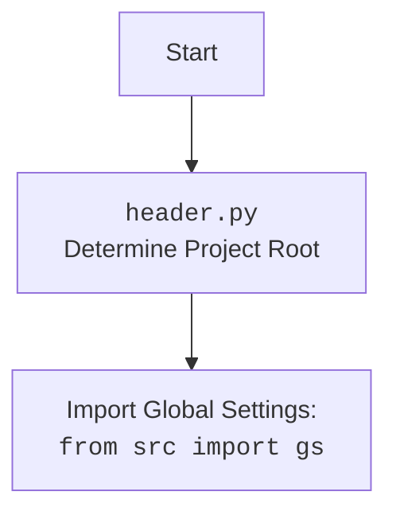

## Проект `hypotez`
## Роль `code explainer`

Анализ кода `hypotez/src/suppliers/aliexpress/campaign/html_generators.py`.

### 1. <алгоритм>

#### ProductHTMLGenerator
1.  **Вход**: `product` (SimpleNamespace с деталями продукта), `category_path` (путь к каталогу категории).
2.  Извлекается имя категории из `category_path`.
3.  Формируется путь к HTML-файлу продукта: `category_path/html/{product.product_id}.html`.
4.  Формируется HTML-контент, используя данные продукта (название, изображение, цена, категория, ссылка для покупки).  
    Например, если `product.product_title` - "Cool Gadget", `product.target_sale_price` - 25.99, `product.promotion_link` - "example.com/gadget", то сгенерируется HTML, включающий эти данные.
5.  Сохраняется HTML-контент в файл по указанному пути.

#### CategoryHTMLGenerator
1.  **Вход**: `products_list` (список SimpleNamespace с деталями продуктов), `category_path` (путь к каталогу категории).
2.  Преобразуется `products_list` в список, если это не список.
3.  Извлекается имя категории из `category_path`.
4.  Формируется путь к HTML-файлу категории: `category_path/html/index.html`.
5.  Формируется HTML-контент, включающий заголовок категории и список продуктов. Для каждого продукта генерируется карточка с изображением, названием, ценой, категорией и ссылкой для покупки.  
    Например, для каждого продукта в `products_list` генерируется HTML-код, включающий `product.product_title`, `product.target_sale_price` и другие детали.
6.  Сохраняется HTML-контент в файл по указанному пути.

#### CampaignHTMLGenerator
1.  **Вход**: `categories` (список названий категорий), `campaign_path` (путь к каталогу кампании).
2.  Формируется путь к HTML-файлу кампании: `campaign_path/index.html`.
3.  Формируется HTML-контент, включающий заголовок кампании и список категорий в виде ссылок.  
    Например, если `categories` содержит "Electronics" и "Clothing", то сгенерируется HTML, включающий ссылки на `Electronics/index.html` и `Clothing/index.html`.
4.  Сохраняется HTML-контент в файл по указанному пути.

```mermaid
graph TD
    subgraph ProductHTMLGenerator
        A[Начало: set_product_html] --> B{Извлечь имя категории из category_path}
        B --> C{Формирование пути к HTML файлу продукта}
        C --> D{Формирование HTML контента}
        D --> E{Сохранение HTML контента в файл}
        E --> F[Конец]
    end

    subgraph CategoryHTMLGenerator
        G[Начало: set_category_html] --> H{Преобразование в список products_list}
        H --> I{Извлечь имя категории из category_path}
        I --> J{Формирование пути к HTML файлу категории}
        J --> K{Генерация HTML контента}
        K --> L{Сохранение HTML контента в файл}
        L --> M[Конец]
    end

    subgraph CampaignHTMLGenerator
        N[Начало: set_campaign_html] --> O{Формирование пути к HTML файлу кампании}
        O --> P{Генерация HTML контента}
        P --> Q{Сохранение HTML контента в файл}
        Q --> R[Конец]
    end
```



### 2. <mermaid>

```mermaid
flowchart TD
    ProductHTMLGenerator --> SaveFile(save_text_file)
    CategoryHTMLGenerator --> SaveFile
    CampaignHTMLGenerator --> SaveFile
    
    subgraph ProductHTMLGenerator
        A[set_product_html(product, category_path)] --> B{Извлечь имя категории}
        B --> C{Формирование HTML-пути}
        C --> D{Формирование HTML-контента}
        D --> E[Сохранение HTML]
    end
    
    subgraph CategoryHTMLGenerator
        F[set_category_html(products_list, category_path)] --> G{Преобразование products_list в список}
        G --> H{Извлечь имя категории}
        H --> I{Формирование HTML-пути}
        I --> J{Генерация HTML-контента}
        J --> K[Сохранение HTML]
    end
    
    subgraph CampaignHTMLGenerator
        L[set_campaign_html(categories, campaign_path)] --> M{Формирование HTML-пути}
        M --> N{Генерация HTML-контента}
        N --> O[Сохранение HTML]
    end
    
    SaveFile[save_text_file(html_content, html_path)]
```

В этой диаграмме `mermaid` показаны зависимости между тремя классами (`ProductHTMLGenerator`, `CategoryHTMLGenerator`, `CampaignHTMLGenerator`) и функцией `save_text_file`. Каждый класс использует функцию `save_text_file` для сохранения сгенерированного HTML-контента.



### 3. <объяснение>

#### Импорты:
*   `header`: Предположительно, определяет корень проекта.
*   `pathlib.Path`: Используется для работы с путями к файлам и каталогам.
*   `types.SimpleNamespace`: Используется для создания объектов, к атрибутам которых можно обращаться как к обычным атрибутам объекта.
*   `src.utils.file.save_text_file`: Функция для сохранения текстового контента в файл.
*   `html`: Используется для экранирования HTML-специальных символов.

#### Классы:
*   `ProductHTMLGenerator`: Генерирует HTML для отдельного продукта.
    *   `set_product_html(product: SimpleNamespace, category_path: str | Path)`: Статический метод, который создает HTML-файл для продукта, используя предоставленные данные о продукте и пути к категории.
*   `CategoryHTMLGenerator`: Генерирует HTML для категории продуктов.
    *   `set_category_html(products_list: list[SimpleNamespace] | SimpleNamespace, category_path: str | Path)`: Статический метод, который создает HTML-файл для категории, перечисляя все продукты в этой категории.
*   `CampaignHTMLGenerator`: Генерирует HTML для кампании, перечисляя все категории.
    *   `set_campaign_html(categories: list[str], campaign_path: str | Path)`: Статический метод, который создает HTML-файл для кампании, перечисляя все категории, связанные с кампанией.

#### Функции:

*   `set_product_html(product: SimpleNamespace, category_path: str | Path)`:
    *   Аргументы:
        *   `product`: Объект SimpleNamespace, содержащий детали продукта (например, `product.product_title`, `product.target_sale_price`).
        *   `category_path`: Путь к каталогу категории.
    *   Возвращаемое значение: Отсутствует (None).
    *   Назначение: Создает HTML-файл для отдельного продукта.
    *   Пример: Если `product` содержит информацию о продукте, а `category_path` - путь к каталогу, функция создаст HTML-файл для этого продукта в указанном каталоге.
*   `set_category_html(products_list: list[SimpleNamespace] | SimpleNamespace, category_path: str | Path)`:
    *   Аргументы:
        *   `products_list`: Список объектов SimpleNamespace, содержащих детали продуктов.
        *   `category_path`: Путь к каталогу категории.
    *   Возвращаемое значение: Отсутствует (None).
    *   Назначение: Создает HTML-файл для категории, перечисляя все продукты в этой категории.
    *   Пример: Если `products_list` содержит список продуктов, а `category_path` - путь к каталогу, функция создаст HTML-файл для этой категории с перечислением всех продуктов.
*   `set_campaign_html(categories: list[str], campaign_path: str | Path)`:
    *   Аргументы:
        *   `categories`: Список названий категорий.
        *   `campaign_path`: Путь к каталогу кампании.
    *   Возвращаемое значение: Отсутствует (None).
    *   Назначение: Создает HTML-файл для кампании, перечисляя все категории, связанные с кампанией.
    *   Пример: Если `categories` содержит список категорий, а `campaign_path` - путь к каталогу кампании, функция создаст HTML-файл для этой кампании с перечислением всех категорий.

#### Переменные:
*   `category_name`: Имя категории, извлеченное из пути к категории.
*   `html_path`: Путь к HTML-файлу, который будет создан.
*   `html_content`: Строка, содержащая HTML-контент, который будет записан в файл.

#### Потенциальные ошибки и области для улучшения:
*   Отсутствует обработка исключений при записи файлов.
*   Жестко заданные URL для Bootstrap и custom CSS.
*   Нет возможности настройки HTML-шаблонов.
*   Не хватает логирования для отслеживания ошибок и хода выполнения.

#### Взаимосвязи с другими частями проекта:
*   Использует `src.utils.file.save_text_file` для сохранения HTML-контента в файлы.
*   Предположительно, `header` используется для определения корневого каталога проекта или для других глобальных настроек.
*   Данные о продуктах, вероятно, поступают из других модулей, отвечающих за извлечение и обработку данных с AliExpress.