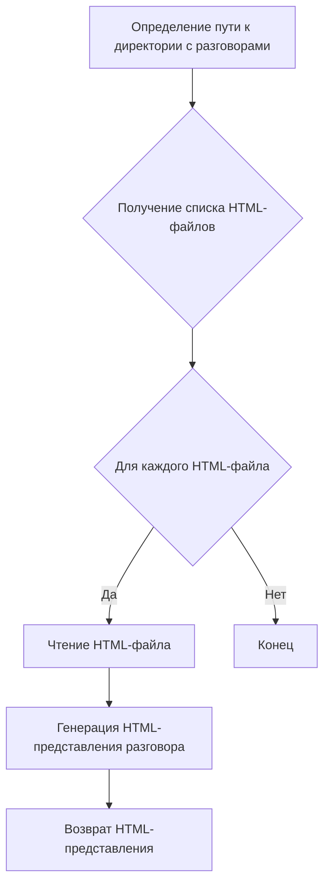
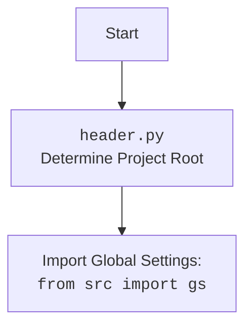

## Анализ кода `hypotez/src/suppliers/chat_gpt/chat_gpt.py`

### 1. <алгоритм>

1.  **Определение пути к директории с разговорами**:
    *   Определяется путь к директории, где хранятся HTML-файлы с разговорами. Путь формируется на основе глобальных настроек (`gs.path.data`) и поддиректорий `'chat_gpt'` и `'conversations'`.
    *   Пример: Если `gs.path.data` указывает на `/path/to/data`, то путь к директории с разговорами будет `/path/to/data/chat_gpt/conversations`.

2.  **Получение списка HTML-файлов**:
    *   Используется метод `glob("*.html")` для получения списка всех HTML-файлов в указанной директории.

3.  **Генерация HTML-представлений разговоров**:
    *   Функция `yeld_conversations_htmls` использует `yield` для возврата HTML-представлений разговоров по одному.  Этот шаг не реализован (`...`).

### 2. <mermaid>

**Объяснение зависимостей:**

*   `pathlib.Path`: Используется для определения и управления путями к файлам и директориям.
*   `src.gs`: Используется для доступа к глобальным настройкам проекта, включая путь к директории с данными.
*   `src.utils.file.recursively_read_text_files`: Не используется в предоставленном коде, но импортируется.

**Дополнительный блок `mermaid` для `header.py`:**

### 3. <объяснение>

**Импорты:**

*   `header`: Подключает заголовочный файл. Предположительно, содержит общие определения или настройки.
*   `pathlib.Path`: Предоставляет способ работы с путями файловой системы в объектно-ориентированном стиле.
*   `src.gs`: Импортирует глобальные настройки проекта.
*   `src.utils.file.recursively_read_text_files`: Импортирует функцию для рекурсивного чтения текстовых файлов.

**Классы:**

*   `ChatGpt`:
    *   Роль: Предоставляет функциональность для работы с разговорами, сгенерированными ChatGpt.
    *   Атрибуты: Отсутствуют в предоставленном коде.
    *   Методы:
        *   `yeld_conversations_htmls`:
            *   Аргументы: Отсутствуют.
            *   Возвращаемое значение: `str` (предположительно, HTML-представление разговора).
            *   Назначение: Генерирует HTML-представления разговоров из файлов в указанной директории.
            *   Пример: Невозможно привести пример из-за отсутствия реализации.

**Переменные:**

*   `conversation_directory`:
    *   Тип: `pathlib.Path`.
    *   Использование: Хранит путь к директории, содержащей HTML-файлы с разговорами.
*   `html_files`:
    *   Тип: `generator`.
    *   Использование: Содержит список HTML-файлов в директории с разговорами.

**Потенциальные ошибки и области для улучшения:**

*   Метод `yeld_conversations_htmls` не реализован (`...`). Необходимо реализовать логику чтения HTML-файлов и генерации HTML-представлений разговоров.
*   Отсутствует обработка ошибок при чтении файлов.
*   Отсутствует документация для класса `ChatGpt`.

**Взаимосвязи с другими частями проекта:**

*   Использует `src.gs` для доступа к глобальным настройкам проекта, что обеспечивает централизованное управление конфигурацией.
*   Может использовать `src.utils.file.recursively_read_text_files` для чтения содержимого HTML-файлов.