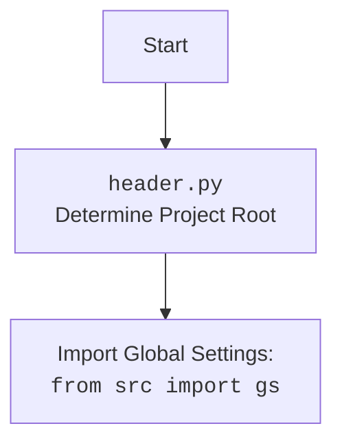

# Анализ кода `hypotez/src/suppliers/chat_gpt/converstions_parser.py`

## 1. <алгоритм>

### Общий алгоритм:
1. **Функция `extract_conversations_from_html`**:
   - Принимает путь к HTML-файлу в качестве аргумента.
   - Открывает HTML-файл для чтения, используя кодировку UTF-8.
   - Использует `BeautifulSoup` для парсинга HTML-содержимого.
   - Находит все элементы `<div class="conversation">`.
   - Возвращает генератор, который выдает каждый найденный элемент `<div class="conversation">`.
2. **Основной блок кода**:
   - Определяет путь к файлу `chat.html` с использованием настроек проекта (`gs.path.data / 'chat_gpt' / 'chat.html'`).
   - Вызывает функцию `extract_conversations_from_html` для получения генератора бесед.
   - Итерируется по каждой беседе, полученной от генератора, и выводит её содержимое в консоль с помощью `prettify()`.

### Блок-схема:

```mermaid
graph TD
    A[Начало] --> B{Определение пути к файлу};
    B --> C{Функция extract_conversations_from_html(file_path)};
    C --> D{Открыть файл file_path};
    D --> E{Парсинг HTML с BeautifulSoup};
    E --> F{Поиск всех <div class="conversation">};
    F --> G{Генератор: yield conversation};
    G --> H{Итерация по conversation из генератора};
    H --> I{Вывод conversation.prettify()};
    I --> H;
    H --> J[Конец];
```

## 2. <mermaid>

```mermaid
flowchart TD
    A[Начало] --> B(extract_conversations_from_html);
    B --> C{file_path.open('r', encoding='utf-8')};
    C --> D{soup = BeautifulSoup(file, 'html.parser')};
    D --> E{conversations = soup.find_all('div', class_='conversation')};
    E --> F{for conversation in conversations: yield conversation};
    F --> G[Конец];
```

### Объяснение зависимостей:

- **`header`**: Импортируется для определения общих настроек.
- **`from src import gs`**: Импортирует глобальные настройки проекта.
- **`from pathlib import Path`**: Используется для работы с путями к файлам.
- **`from bs4 import BeautifulSoup`**: Используется для парсинга HTML-содержимого.

### Header.py


## 3. <объяснение>

### Импорты:
- **`header`**: Предназначен для общих настроек.
- **`from src import gs`**: Импортирует глобальные настройки проекта, такие как пути к данным. `gs` используется для определения пути к файлу `chat.html`.
- **`from pathlib import Path`**: Позволяет удобно работать с путями к файлам, создавая объекты `Path`.
- **`from bs4 import BeautifulSoup`**: Используется для парсинга HTML-документов. Предоставляет удобные методы для навигации и поиска элементов в HTML.

### Функция `extract_conversations_from_html`
- **Аргументы**:
  - `file_path` (`Path`): Путь к HTML-файлу, из которого нужно извлечь беседы.
- **Возвращаемое значение**:
  - Генератор, выдающий элементы `<div class="conversation">`.
- **Назначение**:
  - Открывает HTML-файл, парсит его содержимое с помощью `BeautifulSoup`, находит все элементы `<div class="conversation">` и возвращает их по одному через генератор.
- **Пример**:
  ```python
  file_path = Path(gs.path.data / 'chat_gpt' / 'chat.html')
  for conversation in extract_conversations_from_html(file_path):
      print(conversation.prettify())
  ```

### Переменные:
- **`file_path`**: Объект `Path`, представляющий путь к файлу `chat.html`.
- **`soup`**: Объект `BeautifulSoup`, представляющий распарсенное HTML-содержимое файла.
- **`conversations`**: Список всех найденных элементов `<div class="conversation">`.
- **`conversation`**: Переменная итерации, представляющая отдельный элемент `<div class="conversation">` в цикле.

### Потенциальные ошибки и области для улучшения:
- **Обработка ошибок**: В коде отсутствует обработка исключений. Если файл не существует или имеет неправильный формат, программа завершится с ошибкой.
- **Размер файла**: Для больших файлов чтение всего содержимого в память может быть неэффективным. Следует рассмотреть возможность чтения файла чанками.
- **Кодировка**: Явно указана кодировка `utf-8`, что хорошо, но стоит добавить проверку на случай, если файл имеет другую кодировку.

### Взаимосвязи с другими частями проекта:
- Файл использует глобальные настройки проекта (`gs`) для определения пути к данным, что позволяет легко конфигурировать местоположение файлов.
- Функция `extract_conversations_from_html` может быть использована в других модулях для обработки и анализа извлеченных бесед.