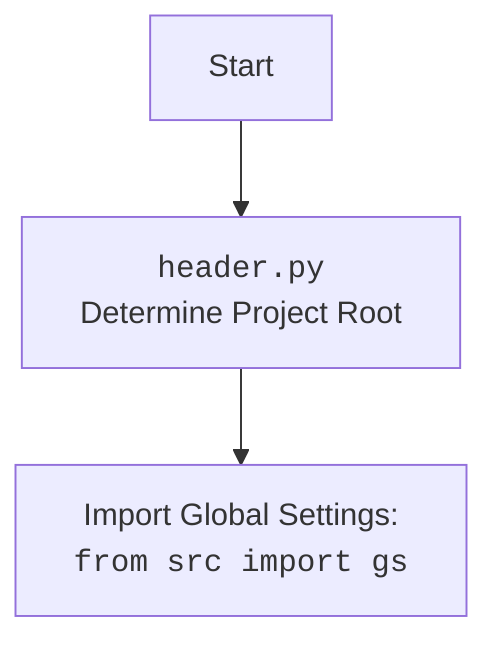

### **Анализ кода `grab_lilnks_to_chats.py`**

#### **1. <алгоритм>**:
1.  **Инициализация**:
    *   Импортируются необходимые модули: `header`, `src.gs`, `src.webdriver.driver.Driver`, `src.webdriver.chrome.Chrome`, `src.webdriver.firefox.Firefox`, `src.utils.jjson.j_loads_ns`.
    *   Загружаются локаторы из JSON файла `chats_list.json` с использованием `j_loads_ns`. Путь к файлу формируется динамически на основе настроек проекта.
2.  **Получение ссылок на чаты (`get_links`)**:
    *   Функция `get_links` принимает объект `Driver` в качестве аргумента.
    *   Использует метод `execute_locator` объекта `Driver` для извлечения ссылок на чаты, используя локаторы, загруженные из `chats_list.json`.
    *   Возвращает список ссылок.
3.  **Основная часть (`if __name__ == '__main__'`)**:
    *   Создается экземпляр класса `Driver` с использованием `Firefox`.
    *   Выполняется переход по URL `https://chatgpt.com/`.
    *   Вызывается функция `get_links` для получения ссылок на чаты.
    *   Дальнейшая обработка ссылок (обозначена как `...`).

Пример для `j_loads_ns`:
Предположим, что `gs.path.src` указывает на `/path/to/project/src`, тогда `gs.path.src / 'suppliers' / 'chat_gpt' / 'locators' / 'chats_list.json'` будет `/path/to/project/src/suppliers/chat_gpt/locators/chats_list.json`.  Функция `j_loads_ns` прочитает JSON файл по этому пути и вернет его содержимое в виде словаря.

#### **2. <mermaid>**:

```mermaid
flowchart TD
    Start --> ImportModules[Импорт модулей: header, src.gs, Driver, Chrome, Firefox, j_loads_ns]
    ImportModules --> LoadLocators[Загрузка локаторов из chats_list.json с использованием j_loads_ns]
    LoadLocators --> GetLinks[Определение функции get_links(d: Driver)]
    GetLinks --> ExecuteLocator[Выполнение локатора d.execute_locator(locator.link)]
    ExecuteLocator --> ReturnLinks[Возврат списка ссылок]
    ReturnLinks --> Main[if __name__ == '__main__':]
    Main --> CreateDriver[Создание экземпляра Driver(Firefox)]
    CreateDriver --> GetURL[Переход по URL d.get_url('https://chatgpt.com/')]
    GetURL --> CallGetLinks[Вызов get_links(d)]
    CallGetLinks --> ProcessLinks[Дальнейшая обработка ссылок ...]
    ProcessLinks --> End
```



**Объяснение зависимостей:**

*   `header`: Этот модуль, вероятно, содержит общие функции или настройки, используемые в проекте. Из flowchart видно, что он используется для определения корня проекта и импорта глобальных настроек.
*   `src.gs`: Глобальные настройки проекта, такие как пути к файлам, параметры конфигурации и т.д.
*   `src.webdriver.driver.Driver`: Абстрактный класс для управления веб-драйвером.
*   `src.webdriver.chrome.Chrome`: Реализация `Driver` для браузера Chrome.
*   `src.webdriver.firefox.Firefox`: Реализация `Driver` для браузера Firefox.
*   `src.utils.jjson.j_loads_ns`: Функция для загрузки JSON файлов с поддержкой namespace (возможность использования переменных из `gs` в JSON файлах).

#### **3. <объяснение>**:

*   **Импорты**:
    *   `header`: (Предположительно) содержит общие функции или настройки, используемые в проекте.
    *   `src.gs`: Глобальные настройки проекта, такие как пути к файлам, параметры конфигурации и т.д. Используется для определения пути к файлу `chats_list.json`.
    *   `src.webdriver.driver.Driver`: Абстрактный класс для управления веб-драйвером. Предоставляет интерфейс для взаимодействия с браузером.
    *   `src.webdriver.chrome.Chrome`: Реализация `Driver` для браузера Chrome. Используется для создания экземпляра драйвера Chrome.
    *   `src.webdriver.firefox.Firefox`: Реализация `Driver` для браузера Firefox. Используется для создания экземпляра драйвера Firefox.
    *   `src.utils.jjson.j_loads_ns`: Функция для загрузки JSON файлов с поддержкой namespace (возможность использования переменных из `gs` в JSON файлах). Позволяет использовать переменные из `gs` в файле `chats_list.json`.

*   **Классы**:
    *   `Driver`: Абстрактный класс, предоставляющий интерфейс для управления веб-драйвером. Имеет методы для открытия URL, выполнения локаторов и т.д.
    *   `Chrome`: Класс, реализующий `Driver` для браузера Chrome.
    *   `Firefox`: Класс, реализующий `Driver` для браузера Firefox.

*   **Функции**:
    *   `get_links(d: Driver)`:
        *   Аргументы:
            *   `d`: Объект класса `Driver`, представляющий веб-драйвер.
        *   Возвращаемое значение:
            *   Список ссылок на чаты, извлеченных с использованием локаторов.
        *   Назначение:
            *   Извлекает ссылки на чаты со страницы, используя предоставленный веб-драйвер и локаторы, загруженные из `chats_list.json`.
        *   Пример:
            ```python
            d = Driver(Firefox)
            d.get_url('https://chatgpt.com/')
            links = get_links(d)
            print(links) # Вывод списка ссылок
            ```

*   **Переменные**:
    *   `locator`: Словарь, содержащий локаторы элементов на странице, загруженные из `chats_list.json`.
    *   `d`: Объект класса `Driver`, представляющий веб-драйвер.
    *   `links`: Список ссылок на чаты, извлеченных со страницы.

**Потенциальные ошибки и области для улучшения**:

*   Обработка исключений: В коде отсутствует обработка исключений. Следует добавить блоки `try...except` для обработки возможных ошибок при загрузке локаторов, открытии URL и извлечении ссылок.
*   Логирование:  Отсутствует логирование действий.  Необходимо добавить логирование для отслеживания процесса выполнения и отладки.
*   Обработка пустых результатов:  Необходимо проверить, что возвращает `d.execute_locator(locator.link)`, и обработать случай, когда ссылки не найдены.
*   `...`: Код содержит многоточия (`...`), что означает, что некоторые части кода не реализованы.  Необходимо реализовать недостающие части.

**Взаимосвязь с другими частями проекта**:

*   Этот скрипт является частью модуля `suppliers` проекта `hypotez`, который отвечает за взаимодействие с внешними поставщиками данных (в данном случае, с ChatGPT).
*   Он использует модуль `webdriver` для управления браузером и извлечения данных со страницы ChatGPT.
*   Он использует модуль `utils.jjson` для загрузки локаторов из JSON файла.
*   Скрипт использует глобальные настройки проекта из `src.gs` для определения пути к файлу с локаторами.