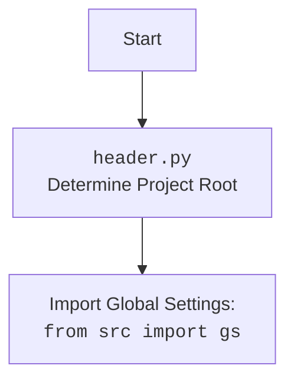

# Проект `hypotez`
# Роль `code explainer`
## ИНСТРУКЦИЯ  :

Анализируй предоставленный код подробно и объясни его функциональность. Ответ должен включать три раздела:  

1. **<алгоритм>**: Опиши рабочий процесс в виде пошаговой блок-схемы, включая примеры для каждого логического блока, и проиллюстрируй поток данных между функциями, классами или методами.  
2. **<mermaid>**: Напиши код для диаграммы в формате `mermaid`, проанализируй и объясни все зависимости, 
    которые импортируются при создании диаграммы. 
    **ВАЖНО!** Убедитесь, что все имена переменных, используемые в диаграмме `mermaid`, 
    имеют осмысленные и описательные имена. Имена переменных вроде `A`, `B`, `C`, и т.д., не допускаются!  
    
    **Дополнительно**: Если в коде есть импорт `import header`, добавьте блок `mermaid` flowchart, объясняющий `header.py`:\
    ```mermaid
    flowchart TD
        Start --> Header[<code>header.py</code><br> Determine Project Root]
    
        Header --> import[Import Global Settings: <br><code>from src import gs</code>] 
    ```

3. **<объяснение>**: Предоставь подробные объяснения:  
   - **Импорты**: Их назначение и взаимосвязь с другими пакетами `src.`.  
   - **Классы**: Их роль, атрибуты, методы и взаимодействие с другими компонентами проекта.  
   - **Функции**: Их аргументы, возвращаемые значения, назначение и примеры.  
   - **Переменные**: Их типы и использование.  
   - Выдели потенциальные ошибки или области для улучшения.  

Дополнительно, постройте цепочку взаимосвязей с другими частями проекта (если применимо).  

Это обеспечивает всесторонний и структурированный анализ кода.
## Формат ответа: `.md` (markdown)


## Твое поведение при анализе кода:
- всегда смотри системную инструкцию для обработки кода проекта `hypotez`;
- анализируй расположение файла в проекте. Это поможет понять его назначение и взаимосвязь с другими файлами. Расположение файла ты найдешь в самой превой строке кода, начинающейся с `## \\file /...`;
- запоминай предоставленный код и анализируй его связь с другими частями проекта `hypotez`;


**КОНЕЦ ИНСТРУКЦИИ**
```

## \\file /src/suppliers/grandadvance/header.py

### <алгоритм>

1.  **Определение корневой директории проекта (`set_project_root`)**:
    *   Начинает поиск с директории, где расположен текущий файл.
    *   Проверяет наличие файлов-маркеров (`__root__`, `.git`) в текущей и родительских директориях.
    *   Если маркер найден, устанавливает родительскую директорию в качестве корневой.
    *   Добавляет корневую директорию в `sys.path`, если её там нет.
    *   Возвращает путь к корневой директории.

2.  **Чтение настроек из файла (`settings.json`)**:
    *   Формирует путь к файлу `settings.json` относительно корневой директории.
    *   Пытается открыть и загрузить JSON-контент из файла.
    *   Обрабатывает исключения `FileNotFoundError` и `json.JSONDecodeError`, если файл не найден или имеет неверный формат.

3.  **Чтение документации из файла (`README.MD`)**:
    *   Формирует путь к файлу `README.MD` относительно корневой директории.
    *   Пытается открыть и прочитать содержимое файла.
    *   Обрабатывает исключения `FileNotFoundError` и `json.JSONDecodeError`, если файл не найден или имеет неверный формат.

4.  **Определение переменных проекта**:
    *   Извлекает значения переменных проекта (`project_name`, `version`, `author`, `copyrihgnt`, `cofee`) из загруженных настроек (`settings`).
    *   Устанавливает значения по умолчанию, если соответствующие ключи отсутствуют в настройках.

### <mermaid>

```mermaid
flowchart TD
    Start --> FindRoot[Find Project Root using set_project_root()]
    FindRoot --> CheckMarkers{Check for marker files (__root__, .git) in parent directories}
    CheckMarkers -- Marker Found --> SetRoot[Set project root]
    CheckMarkers -- No Marker --> UseCurrentDir[Use current directory as root]
    SetRoot --> AddToSysPath[Add root to sys.path]
    UseCurrentDir --> AddToSysPath
    AddToSysPath --> LoadSettings[Load settings from settings.json]
    LoadSettings --> HandleSettingsError{Handle FileNotFoundError or JSONDecodeError}
    HandleSettingsError -- Error --> SettingsDefault[Use default settings]
    HandleSettingsError -- No Error --> SettingsParsed[Settings parsed successfully]
    SettingsDefault --> LoadReadme[Load documentation from README.MD]
    SettingsParsed --> LoadReadme
    LoadReadme --> HandleReadmeError{Handle FileNotFoundError or JSONDecodeError}
    HandleReadmeError -- Error --> ReadmeDefault[Use default documentation]
    HandleReadmeError -- No Error --> ReadmeParsed[Readme parsed successfully]
    ReadmeDefault --> DefineVariables[Define project variables]
    ReadmeParsed --> DefineVariables
    DefineVariables --> End

```



### <объяснение>

**Импорты**:

*   `sys`: Используется для работы с системными параметрами и функциями, такими как добавление пути к корневой директории проекта в `sys.path`.
*   `json`: Используется для чтения данных в формате JSON из файла настроек.
*   `packaging.version.Version`: Используется для работы с версиями пакетов. В данном коде не используется, но импортируется.
*   `pathlib.Path`: Используется для работы с путями к файлам и директориям.
*   `src`: Используется для импорта глобальных настроек проекта.

**Функции**:

*   `set_project_root(marker_files=('__root__', '.git')) -> Path`:
    *   **Аргументы**:
        *   `marker_files` (tuple): Кортеж с именами файлов или директорий, которые используются для определения корневой директории проекта. По умолчанию `('__root__', '.git')`.
    *   **Возвращает**:
        *   `Path`: Путь к корневой директории проекта.
    *   **Назначение**:
        *   Функция определяет корневую директорию проекта, начиная с директории, в которой находится текущий файл. Она ищет вверх по дереву директорий, пока не найдет директорию, содержащую один из файлов-маркеров. Если маркер не найден, возвращает директорию, в которой находится скрипт.

        *   Добавляет корневую директорию в `sys.path`, если её там нет. Это необходимо для того, чтобы можно было импортировать модули из корневой директории проекта.
    *   **Пример**:

        ```python
        from pathlib import Path
        root_path:Path = set_project_root()
        print(root_path)
        # Вывод: /path/to/project
        ```

**Переменные**:

*   `__root__`: Путь к корневой директории проекта.
*   `settings`: Словарь с настройками проекта, загруженный из файла `settings.json`.
*   `doc_str`: Строка с содержимым файла `README.MD`.
*   `__project_name__`: Название проекта, по умолчанию `'hypotez'`.
*   `__version__`: Версия проекта, по умолчанию `''`.
*   `__doc__`: Документация проекта, по умолчанию `''`.
*   `__details__`: Дополнительная информация о проекте, по умолчанию `''`.
*   `__author__`: Автор проекта, по умолчанию `''`.
*   `__copyright__`: Информация об авторских правах, по умолчанию `''`.
*   `__cofee__`: Сообщение о поддержке разработчика, по умолчанию `"Treat the developer to a cup of coffee for boosting enthusiasm in development: https://boosty.to/hypo69"`.

**Потенциальные ошибки и области для улучшения**:

*   Обработка исключений `FileNotFoundError` и `json.JSONDecodeError` в блоках `try...except` реализована с использованием `...`, что не является хорошей практикой. Необходимо добавить логирование ошибок или другую обработку, чтобы понимать, что пошло не так.
*   Использование `with open(...)` для чтения файлов настроек и документации является хорошей практикой, так как гарантирует закрытие файлов после использования.
*   Можно добавить проверку существования файла `settings.json` и `README.MD` перед попыткой их открытия, чтобы избежать исключений `FileNotFoundError`.

**Взаимосвязь с другими частями проекта**:

*   Файл `header.py` используется для определения корневой директории проекта и загрузки основных настроек и документации. Эти данные используются другими модулями проекта для получения информации о проекте и его настройках.
*   Импорт `from src import gs` указывает на использование глобальных настроек проекта, которые могут быть определены в модуле `gs` в директории `src`.

```python
import sys
import json
from packaging.version import Version

from pathlib import Path
def set_project_root(marker_files=('__root__','.git')) -> Path:
    """
    Finds the root directory of the project starting from the current file's directory,
    searching upwards and stopping at the first directory containing any of the marker files.

    Args:
        marker_files (tuple): Filenames or directory names to identify the project root.
    
    Returns:
        Path: Path to the root directory if found, otherwise the directory where the script is located.
    """
    __root__:Path
    current_path:Path = Path(__file__).resolve().parent
    __root__ = current_path
    for parent in [current_path] + list(current_path.parents):
        if any((parent / marker).exists() for marker in marker_files):
            __root__ = parent
            break
    if __root__ not in sys.path:
        sys.path.insert(0, str(__root__))
    return __root__


# Get the root directory of the project
__root__: Path = set_project_root()
"""__root__ (Path): Path to the root directory of the project"""

from src import gs

settings:dict = None
try:
    with open(gs.path.root / 'src' /  'settings.json', 'r') as settings_file:
        settings = json.load(settings_file)
except (FileNotFoundError, json.JSONDecodeError):
    ...


doc_str:str = None
try:
    with open(gs.path.root / 'src' /  'README.MD', 'r') as settings_file:
        doc_str = settings_file.read()
except (FileNotFoundError, json.JSONDecodeError):
    ...

 

__project_name__ = settings.get("project_name", 'hypotez') if settings  else 'hypotez'
__version__: str = settings.get("version", '')  if settings  else ''
__doc__: str = doc_str if doc_str else ''
__details__: str = ''
__author__: str = settings.get("author", '')  if settings  else ''
__copyright__: str = settings.get("copyrihgnt", '')  if settings  else ''
__cofee__: str = settings.get("cofee", "Treat the developer to a cup of coffee for boosting enthusiasm in development: https://boosty.to/hypo69")  if settings  else "Treat the developer to a cup of coffee for boosting enthusiasm in development: https://boosty.to/hypo69"