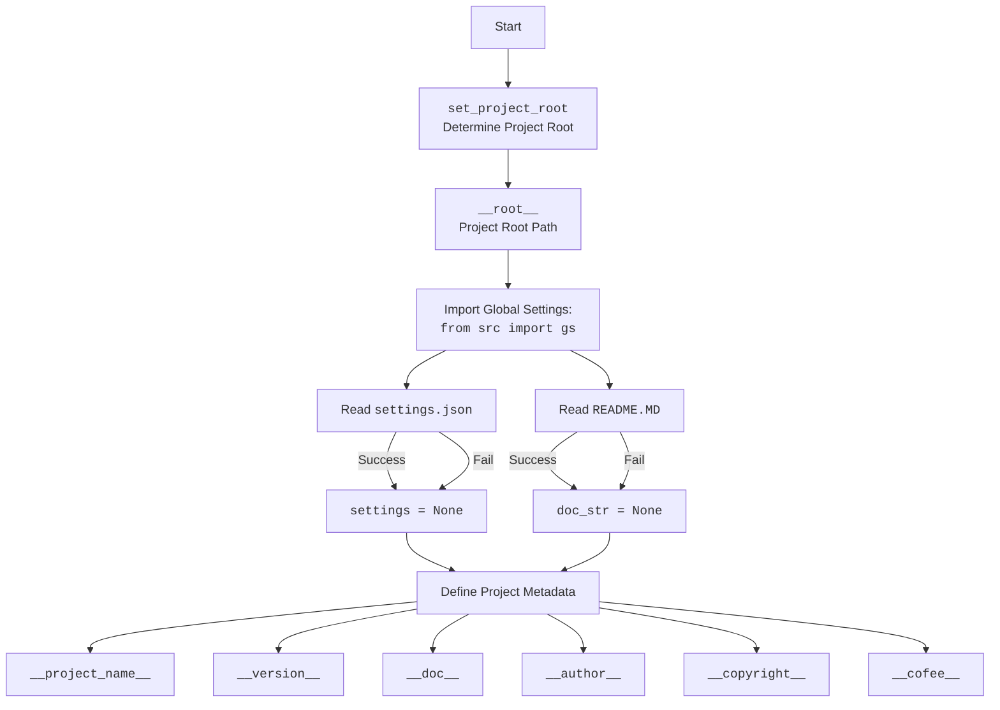

### **Анализ кода проекта `hypotez`**

=========================================================================================

#### **1. <алгоритм>**:

1.  **`set_project_root(marker_files)`**:
    *   Функция начинается с определения пути к текущему файлу (`__file__`) и его родительской директории.
    *   Затем она итерируется по родительским директориям, начиная с текущей.
    *   Для каждой директории проверяется наличие хотя бы одного из `marker_files` (по умолчанию `__root__` или `.git`).
    *   Если маркерный файл найден, директория считается корневой, и цикл прерывается.
    *   Если корневая директория не найдена, используется директория, где расположен скрипт.
    *   Корневая директория добавляется в `sys.path`, если её там ещё нет.
    *   Функция возвращает путь к корневой директории.

    ```python
    # Пример использования set_project_root()
    from pathlib import Path
    import sys

    # Создадим временные файлы и структуру директорий для теста
    temp_dir = Path('./temp_test_root')
    temp_dir.mkdir(exist_ok=True)
    (temp_dir / '__root__').touch()  # Создаем маркерный файл

    # Вызываем функцию, чтобы определить корневую директорию
    project_root = set_project_root()

    # Проверяем, что возвращаемое значение соответствует ожидаемому результату
    assert project_root == Path('.').resolve()

    # Очистка: удаляем временные файлы и директории
    (temp_dir / '__root__').unlink()
    temp_dir.rmdir()

    print(f'Project root: {project_root}')
    print(f'sys.path: {sys.path}')
    ```

2.  **Получение корневой директории**:
    *   Вызывается функция `set_project_root()` для определения корневой директории проекта и присваивается переменной `__root__`.

3.  **Чтение `settings.json`**:
    *   Пытается открыть файл `settings.json`, расположенный в `src/settings.json` относительно корневой директории.
    *   Если файл существует и содержит корректный JSON, его содержимое загружается в словарь `settings`.
    *   Если файл не найден или содержит некорректный JSON, переменной `settings` присваивается `None`.

    ```python
    # Пример чтения settings.json
    import json
    from pathlib import Path

    # Создадим временный файл settings.json для теста
    temp_settings_path = Path('./temp_settings.json')
    temp_settings_path.write_text('{"project_name": "test_project", "version": "1.0.0"}')

    # Читаем файл
    try:
        with open(temp_settings_path, 'r') as settings_file:
            settings = json.load(settings_file)
    except (FileNotFoundError, json.JSONDecodeError) as e:
        settings = None
        print(f'Error reading settings: {e}')

    # Проверяем, что настройки были успешно загружены
    if settings:
        print(f'Project name: {settings.get("project_name")}')
        print(f'Version: {settings.get("version")}')
    else:
        print('Settings not loaded')

    # Очистка: удаляем временный файл
    temp_settings_path.unlink()
    ```

4.  **Чтение `README.MD`**:
    *   Аналогично `settings.json`, пытается открыть и прочитать содержимое файла `README.MD`, расположенного в `src/README.MD` относительно корневой директории.
    *   Содержимое файла сохраняется в строке `doc_str`. Если файл не найден, `doc_str` присваивается `None`.

    ```python
    # Пример чтения README.MD
    from pathlib import Path

    # Создадим временный файл README.MD для теста
    temp_readme_path = Path('./temp_readme.md')
    temp_readme_path.write_text('This is a test README file.')

    # Читаем файл
    try:
        with open(temp_readme_path, 'r') as readme_file:
            doc_str = readme_file.read()
    except FileNotFoundError as e:
        doc_str = None
        print(f'Error reading README: {e}')

    # Проверяем, что содержимое было успешно загружено
    if doc_str:
        print(f'README content: {doc_str}')
    else:
        print('README not loaded')

    # Очистка: удаляем временный файл
    temp_readme_path.unlink()
    ```

5.  **Определение метаданных проекта**:
    *   Использует значения из словаря `settings` (если он был успешно загружен) для определения метаданных проекта, таких как имя, версия, авторские права и т.д.
    *   Если `settings` равен `None`, используются значения по умолчанию.

    ```python
    # Пример определения метаданных проекта
    settings = {'project_name': 'example', 'version': '1.2.3', 'author': 'John Doe', 'copyrihgnt': '2024'}

    __project_name__ = settings.get("project_name", 'hypotez') if settings else 'hypotez'
    __version__ = settings.get("version", '') if settings else ''
    __author__ = settings.get("author", '') if settings else ''
    __copyright__ = settings.get("copyrihgnt", '') if settings else ''

    print(f'Project name: {__project_name__}')
    print(f'Version: {__version__}')
    print(f'Author: {__author__}')
    print(f'Copyright: {__copyright__}')
    ```

#### **2. <mermaid>**:



**Объяснение диаграммы `mermaid`**:

*   `Start`: Начало выполнения скрипта.
*   `set_project_root`: Функция, определяющая корневую директорию проекта.
*   `__root__`: Переменная, хранящая путь к корневой директории.
*   `Import_gs`: Импорт глобальных настроек из `src.gs`.
*   `Read_settings`: Чтение файла `settings.json`.
*   `settings`: Переменная, хранящая словарь с настройками из файла `settings.json` или `None`, если файл не удалось прочитать.
*   `Read_README`: Чтение файла `README.MD`.
*   `doc_str`: Переменная, хранящая содержимое файла `README.MD` или `None`, если файл не удалось прочитать.
*   `Define_metadata`: Определение метаданных проекта на основе `settings` и `doc_str`.
*   `__project_name__`, `__version__`, `__doc__`, `__author__`, `__copyright__`, `__cofee__`: Переменные, хранящие метаданные проекта.

#### **3. <объяснение>**:

**Импорты**:

*   `sys`: Используется для работы с системными параметрами и функциями, такими как `sys.path` для добавления путей к модулям.
*   `json`: Используется для чтения данных из JSON-файла (`settings.json`).
*   `packaging.version.Version`: Используется для работы с версиями пакетов.
*   `pathlib.Path`: Используется для работы с путями к файлам и директориям.
*   `src.gs`: Предположительно, содержит глобальные настройки и константы проекта.

**Функции**:

*   `set_project_root(marker_files: tuple) -> Path`:
    *   Аргументы:
        *   `marker_files`: Кортеж имен файлов или директорий, которые используются для определения корневой директории проекта.
    *   Возвращает: `Path` к корневой директории проекта.
    *   Назначение: Находит корневую директорию проекта, начиная с текущей директории и поднимаясь вверх по дереву директорий, пока не будет найден один из маркерных файлов. Добавляет корневую директорию в `sys.path`.

**Переменные**:

*   `__root__`: Путь к корневой директории проекта.
*   `settings`: Словарь с настройками проекта, загруженными из `settings.json`.
*   `doc_str`: Строка с содержимым файла `README.MD`.
*   `__project_name__`: Имя проекта.
*   `__version__`: Версия проекта.
*   `__doc__`: Описание проекта (содержимое `README.MD`).
*   `__author__`: Автор проекта.
*   `__copyright__`: Информация об авторских правах.
*   `__cofee__`: Сообщение с призывом угостить разработчика кофе.

**Потенциальные ошибки и области для улучшения**:

*   Обработка исключений при чтении файлов `settings.json` и `README.MD` просто присваивает `None` переменным `settings` и `doc_str`.  Было бы полезно добавить логирование ошибок с использованием модуля `logger` из `src.logger.logger`.
*   Использование `try-except` с пустым блоком `...` не является хорошей практикой.  Вместо этого следует явно обрабатывать исключения или логировать их.
*   Название переменной `copyrihgnt` в `settings.json` имеет опечатку.  Следует исправить на `copyright`.
*   Не хватает документации для переменных `__details__`.

**Взаимосвязи с другими частями проекта**:

*   Этот файл является частью системы сборки и конфигурации проекта. Он определяет корневую директорию, загружает настройки из `settings.json` и определяет метаданные проекта.
*   Он зависит от `src.gs` для получения глобальных настроек.
*   Метаданные, определенные в этом файле, могут использоваться другими частями проекта, например, для отображения информации о проекте в пользовательском интерфейсе или в документации.