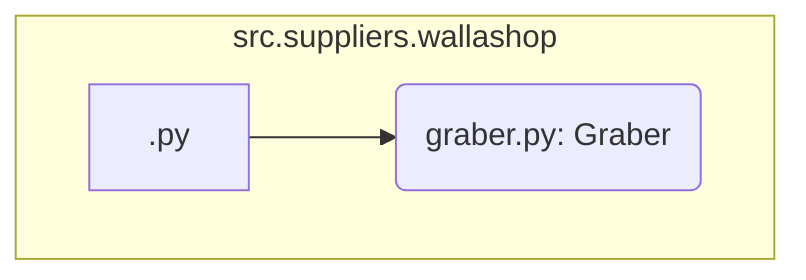

### **Анализ кода `hypotez/src/suppliers/wallashop/__init__.py`**

#### **1. <алгоритм>**:
1.  **Импорт класса `Graber`**: Импортируется класс `Graber` из модуля `.graber`. Этот класс, вероятно, содержит логику для сбора данных с сайта Wallashop.

    ```python
    from .graber import Graber
    ```

2.  **Использование класса `Graber` (пример)**: Предположим, что класс `Graber` используется для извлечения информации о товарах.

    ```python
    # Пример использования (не из файла, а для иллюстрации)
    graber = Graber(url='https://wallashop.example.com')
    products = graber.get_products()
    for product in products:
        print(product.name, product.price)
    ```

#### **2. <mermaid>**:



**Объяснение зависимостей:**

*   `A[<init>.py]`: Инициализирует модуль `wallashop`.
*   `B(graber.py: Graber)`: Импортирует класс `Graber` из модуля `graber.py`.

#### **3. <объяснение>**:

**Импорты:**

*   `.graber`: Импортируется модуль `graber`, который, вероятно, содержит класс `Graber` для сбора данных с сайта Wallashop.

**Классы:**

*   `Graber`: Класс, отвечающий за парсинг и извлечение данных с сайта Wallashop. Он может содержать методы для отправки запросов, обработки ответов и извлечения информации о товарах.

**Функции:**

*   В предоставленном коде нет функций, но подразумевается, что класс `Graber` содержит методы для выполнения задач, связанных с парсингом данных.

**Переменные:**

*   В явном виде переменные не указаны, но класс `Graber` может содержать переменные, такие как URL сайта, параметры запросов и т.д.

**Потенциальные ошибки и области для улучшения:**

*   Необходимо убедиться, что класс `Graber` корректно обрабатывает возможные ошибки при запросах к сайту Wallashop (например, ошибки сети, неверные ответы сервера).
*   Реализовать логирование для отслеживания работы парсера и выявления возможных проблем.
*   Добавить обработку исключений для повышения устойчивости кода.

**Взаимосвязи с другими частями проекта:**

*   Этот модуль является частью подсистемы для работы с поставщиками (`suppliers`). Он предоставляет функциональность для сбора данных с конкретного поставщика (Wallashop).
*   Данные, собранные с помощью `Graber`, могут использоваться другими модулями проекта для анализа, сравнения цен и других задач.