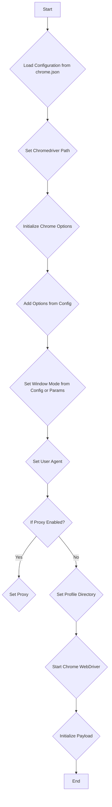
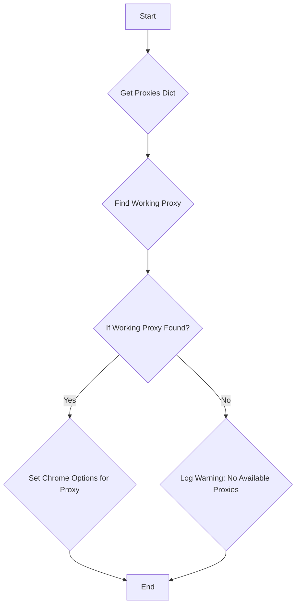
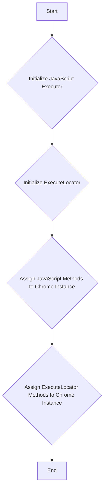

# Проект `hypotez`
# Роль `code explainer`

## АНАЛИЗ КОДА: `hypotez/src/webdriver/chrome/chrome.py`

### 1. <алгоритм>

**Общий алгоритм работы класса `Chrome`:**

1.  **Инициализация:**
    *   Загрузка конфигурации из `chrome.json`.
    *   Определение пути к `chromedriver`.
    *   Инициализация объекта `Options` для настройки Chrome.
    *   Установка опций Chrome из файла конфигурации.
    *   Установка режима окна (kiosk, windowless, full_window) из конфигурации или параметров.
    *   Установка пользовательского агента.
    *   Настройка прокси, если включены в конфигурации.
    *   Настройка директории профиля.
    *   Запуск Chrome WebDriver с заданными опциями и сервисом.
    *   Инициализация полезных нагрузок (_payload).

2.  **`set_proxy`:**
    *   Получение словаря прокси из `get_proxies_dict`.
    *   Поиск рабочего прокси среди доступных.
    *   Настройка опций Chrome для использования найденного прокси.

3.  **`_payload`:**
    *   Инициализация объекта `JavaScript` для выполнения JS-скриптов в браузере.
    *   Инициализация объекта `ExecuteLocator` для выполнения локаторов.
    *   Назначение методов `JavaScript` и `ExecuteLocator` как атрибутов экземпляра `Chrome`.

**Блок-схема инициализации класса `Chrome`:**



**Блок-схема метода `set_proxy`:**



**Блок-схема метода `_payload`:**



### 2. <mermaid>

**Диаграмма зависимостей:**

```mermaid
flowchart TD
    A[Chrome Class] --> B(src.webdriver.executor.ExecuteLocator)
    A --> C(src.webdriver.js.JavaScript)
    A --> D(selenium.webdriver.chrome.options.Options)
    A --> E(selenium.webdriver.chrome.service.Service)
    A --> F(src.utils.jjson.j_loads_ns)
    A --> G(src.logger.logger.logger)
    A --> H(fake_useragent.UserAgent)
    A --> I(src.webdriver.proxy.get_proxies_dict)
    A --> J(src.webdriver.proxy.check_proxy)
    A --> K(src.gs.gs)

    B --> A
    C --> A

    subgraph selenium.webdriver
        D
        E
    end

    subgraph src.webdriver
        B
        C
        I
        J
    end

    subgraph src.utils
        F
    end

    subgraph src.logger
        G
    end

    subgraph src
        K
    end

    style A fill:#f9f,stroke:#333,stroke-width:2px
```



**Объяснение зависимостей:**

*   `Chrome Class`: Основной класс, расширяющий `selenium.webdriver.Chrome`.
*   `src.webdriver.executor.ExecuteLocator`: Класс для выполнения локаторов элементов на странице.
*   `src.webdriver.js.JavaScript`: Класс для выполнения JavaScript-кода в браузере.
*   `selenium.webdriver.chrome.options.Options`: Класс для настройки опций Chrome при запуске.
*   `selenium.webdriver.chrome.service.Service`: Класс для управления ChromeDriver.
*   `src.utils.jjson.j_loads_ns`: Функция для загрузки JSON-файлов с поддержкой namespace.
*   `src.logger.logger.logger`: Объект логгера для записи информации о работе драйвера.
*   `fake_useragent.UserAgent`: Класс для генерации случайных User-Agent.
*   `src.webdriver.proxy.get_proxies_dict`: Функция для получения словаря прокси из файла.
*   `src.webdriver.proxy.check_proxy`: Функция для проверки доступности прокси.
*   `src.gs.gs`: Объект глобальных настроек проекта.

**`mermaid` flowchart, объясняющий `src.webdriver.proxy`:**

```mermaid
flowchart TD
    Start --> A[<code>src.webdriver.proxy.py</code><br> Functions for handling proxies]

    A --> B[<code>get_proxies_dict()</code><br> Load proxies from file]
    A --> C[<code>check_proxy()</code><br> Check if proxy is working]
    B --> D[Returns: dict with proxy settings]
    C --> E[Returns: bool (True if working)]
```

### 3. <объяснение>

**Импорты:**

*   `os`: Для работы с операционной системой, например, для получения переменных окружения.
*   `pathlib.Path`: Для работы с путями к файлам и директориям.
*   `typing.Optional, typing.List`: Для аннотации типов, указывают, что переменная может быть `None` или списком.
*   `selenium.webdriver.Chrome`: Основной класс WebDriver для управления Chrome.
*   `selenium.webdriver.chrome.options.Options`: Класс для настройки опций Chrome.
*   `selenium.webdriver.chrome.service.Service`: Класс для запуска и управления ChromeDriver.
*   `selenium.common.exceptions.WebDriverException`: Класс исключений WebDriver.
*   `src.gs`: Глобальные настройки проекта, содержащие пути и другие параметры.
*   `src.webdriver.executor.ExecuteLocator`: Класс для выполнения поиска элементов на странице.
*   `src.webdriver.js.JavaScript`: Класс для выполнения JavaScript-кода в браузере.
*   `src.webdriver.proxy`: Функции для работы с прокси.
*   `src.utils.jjson.j_loads_ns`: Функция для загрузки JSON-файлов с поддержкой namespace.
*   `src.logger.logger.logger`: Объект логгера для записи информации о работе драйвера.
*    `fake_useragent.UserAgent`: Для генерации случайных user-agent.
*   `random`: Для случайного выбора прокси из списка.

**Класс `Chrome`:**

*   **Назначение:** Расширение класса `selenium.webdriver.Chrome` с добавлением функциональности для управления профилем, прокси и другими опциями.
*   **Атрибуты:**
    *   `driver_name: str = 'chrome'`: Имя драйвера.
*   **Методы:**
    *   `__init__`: Конструктор класса. Инициализирует драйвер Chrome с заданными параметрами.
    *   `set_proxy`: Настраивает прокси для Chrome.
    *   `_payload`: Загружает исполнителей для локаторов и JavaScript-сценариев.

**Функции:**

*   `__init__(self, profile_name: Optional[str] = None, chromedriver_version: Optional[str] = None, user_agent: Optional[str] = None, proxy_file_path: Optional[str] = None, options: Optional[List[str]] = None, window_mode: Optional[str] = None, *args, **kwargs) -> None`:
    *   **Аргументы:**
        *   `profile_name`: Имя пользовательского профиля Chrome.
        *   `chromedriver_version`: Версия ChromeDriver.
        *   `user_agent`: User-Agent.
        *   `proxy_file_path`: Путь к файлу с прокси.
        *   `options`: Список опций для Chrome.
        *   `window_mode`: Режим окна браузера.
    *   **Возвращаемое значение:** `None`.
    *   **Назначение:** Инициализация экземпляра класса `Chrome` с заданными параметрами.
*   `set_proxy(self, options: Options) -> None`:
    *   **Аргументы:**
        *   `options`: Объект `Options` для настройки Chrome.
    *   **Возвращаемое значение:** `None`.
    *   **Назначение:** Настройка прокси для Chrome из словаря, полученного из `get_proxies_dict`.
*   `_payload(self) -> None`:
    *   **Аргументы:** Отсутствуют.
    *   **Возвращаемое значение:** `None`.
    *   **Назначение:** Инициализация объектов `JavaScript` и `ExecuteLocator` и присваивание их методов экземпляру класса `Chrome`.

**Переменные:**

*   `config`: Словарь с конфигурацией Chrome, загруженный из `chrome.json`.
*   `chromedriver_path`: Путь к исполняемому файлу ChromeDriver.
*   `options_obj`: Объект `Options` для настройки Chrome.
*   `profile_directory`: Путь к директории профиля Chrome.

**Потенциальные ошибки и области для улучшения:**

*   Обработка исключений `WebDriverException` и `Exception` в `__init__` может быть улучшена путем более детальной обработки различных типов исключений.
*   Логика выбора и проверки прокси может быть вынесена в отдельный класс или функцию для улучшения читаемости и повторного использования.
*   Добавить обработку ошибок при загрузке конфигурационного файла `chrome.json`.
*   Улучшить документацию, добавив примеры использования класса `Chrome` и его методов.

**Взаимосвязи с другими частями проекта:**

*   Использует `src.gs` для получения глобальных настроек проекта, таких как пути к файлам.
*   Использует `src.webdriver.executor.ExecuteLocator` для выполнения локаторов элементов на странице.
*   Использует `src.webdriver.js.JavaScript` для выполнения JavaScript-кода в браузере.
*   Использует `src.utils.jjson.j_loads_ns` для загрузки конфигурационных файлов.
*   Использует `src.logger.logger.logger` для логирования событий.
*   Использует `src.webdriver.proxy` для работы с прокси.