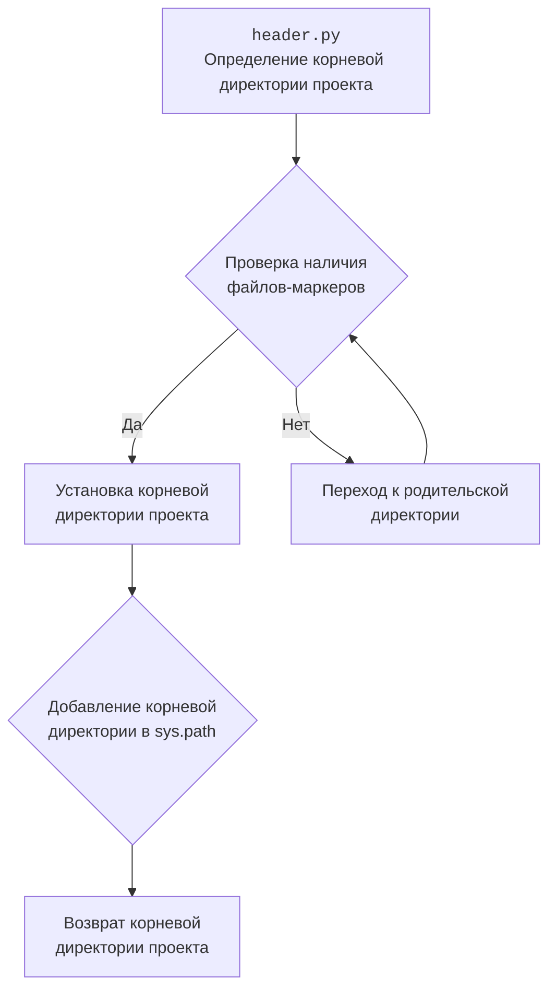

### **алгоритм**

1.  **`set_project_root(marker_files)`**:

    *   Начинает с определения пути к текущему файлу (`__file__`).
    *   Устанавливает начальное значение `__root__` равным директории, содержащей файл.
    *   Проходит поочередно по текущей директории и всем её родительским директориям.
    *   Для каждой директории проверяет, содержит ли она хотя бы один из файлов-маркеров (по умолчанию `__root__` или `.git`).
        *   Если маркер найден, устанавливает эту директорию в качестве `__root__` и прекращает поиск.
    *   Добавляет `__root__` в `sys.path`, если его там нет.
    *   Возвращает `__root__`.

    ```python
    # Пример использования set_project_root()
    root_path = set_project_root()
    print(f"Root directory: {root_path}")
    ```

2.  **Присвоение значения переменной `__root__`**:

    *   Вызывает функцию `set_project_root()` для определения корневой директории проекта.
    *   Присваивает возвращенное значение переменной `__root__`.

    ```python
    # Пример использования __root__
    print(f"Project root: {__root__}")
    ```

### **mermaid**



**Объяснение:**

*   **`header.py`**: Этот шаг указывает на начало процесса в файле `header.py`, где определяется корневая директория проекта.
*   **`Проверка наличия файлов-маркеров`**: На этом этапе происходит проверка наличия файлов-маркеров (например, `.git` или `__root__`) в текущей директории.
*   **`Установка корневой директории проекта`**: Если файлы-маркеры найдены, текущая директория устанавливается в качестве корневой директории проекта.
*   **`Переход к родительской директории`**: Если файлы-маркеры не найдены, происходит переход к родительской директории для продолжения поиска.
*   **`Добавление корневой директории в sys.path`**: После определения корневой директории, она добавляется в `sys.path`, чтобы обеспечить возможность импорта модулей из этой директории.
*   **`Возврат корневой директории проекта`**: В завершение процесса возвращается корневая директория проекта.

### **объяснение**

**Импорты:**

*   `sys`: Используется для работы с системными параметрами и функциями, такими как добавление пути к корневой директории проекта в `sys.path`.
*   `json`: Не используется в предоставленном коде.
*   `packaging.version.Version`: Не используется в предоставленном коде.
*   `pathlib.Path`: Используется для работы с путями к файлам и директориям.

**Функции:**

*   `set_project_root(marker_files: tuple[str, ...]=('__root__', '.git')) -> Path:`
    *   **Аргументы**:
        *   `marker_files` (tuple): Кортеж с именами файлов или директорий, которые используются для определения корневой директории проекта. По умолчанию `('__root__', '.git')`.
    *   **Возвращаемое значение**:
        *   `Path`: Путь к корневой директории проекта.
    *   **Назначение**:
        *   Функция определяет корневую директорию проекта, начиная поиск от директории текущего файла и двигаясь вверх по дереву директорий. Поиск прекращается, когда найдена директория, содержащая один из файлов-маркеров.
    *   **Пример**:

    ```python
    root_path = set_project_root(marker_files=('.git',))
    print(root_path)  # Вывод: /путь/к/корневой/директории
    ```

**Переменные:**

*   `__root__` (Path): Путь к корневой директории проекта. Определяется путем вызова функции `set_project_root()`.

**Взаимосвязи с другими частями проекта:**

*   Этот модуль отвечает за определение корневой директории проекта, что важно для правильной работы импортов и доступа к файлам проекта из любого места.
*   Функция `set_project_root()` используется для установки переменной `__root__`, которая может быть использована другими модулями проекта для определения путей к файлам и директориям.

**Потенциальные ошибки и области для улучшения:**

*   В коде отсутствует обработка возможных ошибок, например, если ни один из файлов-маркеров не найден. В этом случае функция вернет директорию, в которой находится скрипт, что может быть нежелательным поведением.
*   Импорты `json` и `packaging.version.Version` не используются в предоставленном коде.

**Дополнительные замечания:**

*   Добавление корневой директории проекта в `sys.path` позволяет импортировать модули из этой директории, что упрощает организацию и повторное использование кода в проекте.
*   Использование файлов-маркеров для определения корневой директории проекта позволяет избежать жесткой привязки к определенному пути и делает проект более переносимым.