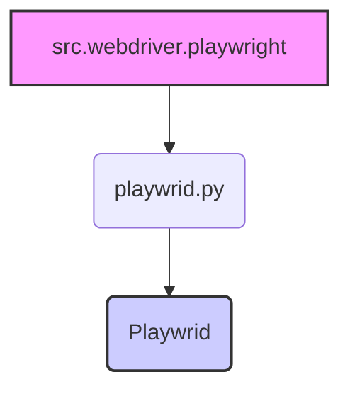

### **Анализ кода `hypotez/src/webdriver/playwright/__init__.py`**

#### **1. Алгоритм**

1.  **Импорт класса `Playwrid`**: Импортируется класс `Playwrid` из модуля `playwrid.py`.
2.  **Инициализация модуля**: При импорте модуля `src.webdriver.playwright`, класс `Playwrid` становится доступным для использования в других частях проекта.

#### **2. Mermaid**



**Объяснение:**

*   `src.webdriver.playwright`: представляет модуль `__init__.py`, который импортирует класс `Playwrid`.
*   `playwrid.py`: представляет файл, из которого импортируется класс `Playwrid`.
*   `Playwrid`: представляет класс, который импортируется в модуль `__init__.py`, чтобы сделать его доступным для других модулей.

#### **3. Объяснение**

**Импорты:**

*   `from .playwrid import Playwrid`: Импортирует класс `Playwrid` из модуля `playwrid.py`, находящегося в той же директории. Это позволяет использовать класс `Playwrid` в других частях проекта через модуль `src.webdriver.playwright`.

**Классы:**

*   `Playwrid`: Этот класс, вероятно, содержит логику для управления браузером Playwright. Поскольку код класса не предоставлен, детали его атрибутов и методов неизвестны, но можно предположить, что он предоставляет методы для навигации, взаимодействия с элементами страницы и выполнения других действий, связанных с автоматизацией браузера.

**Общее:**

Файл `__init__.py` в пакете `src.webdriver.playwright` служит для упрощения импорта класса `Playwrid`. Вместо того чтобы импортировать `Playwrid` напрямую из `playwrid.py`, другие модули могут импортировать его через пакет `src.webdriver.playwright`.

**Пример использования:**

```python
from src.webdriver.playwright import Playwrid

# Создание экземпляра класса Playwrid
browser = Playwrid()