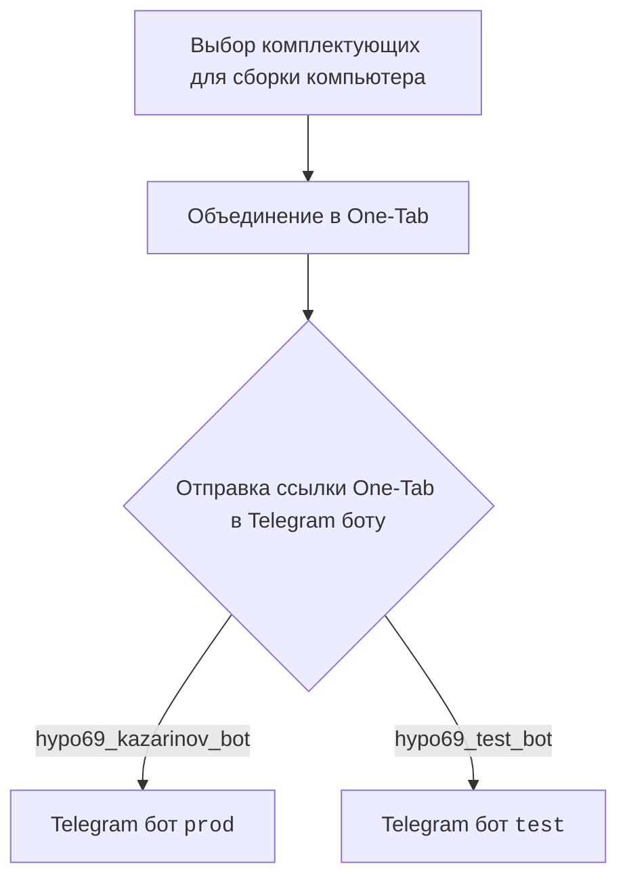
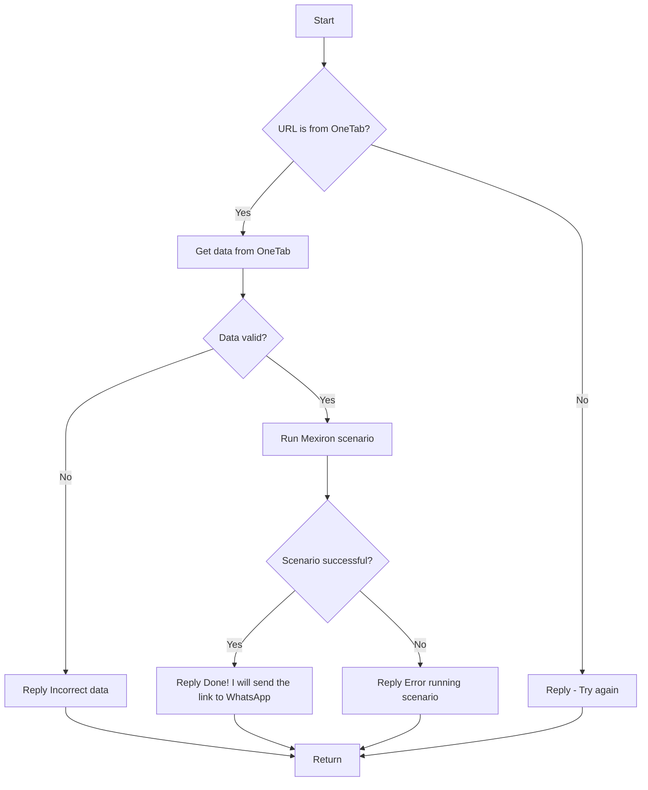

# Документация для модуля `src.endpoints.kazarinov`

## Обзор

Документация описывает функциональность, связанную с созданием прайс-листа для Казаринова и взаимодействие с Telegram-ботами. Она включает в себя диаграммы и описания сценариев работы бота, а также ссылки на другие связанные документы.

## Подробней

Этот модуль предназначен для автоматизации процесса создания прайс-листов для компании Казаринова на основе данных, полученных из различных онлайн-источников. Основной функциональностью является обработка ссылок One-Tab, содержащих информацию о комплектующих компьютера, и запуск сценариев для формирования прайс-листа.

## Оглавление

- [KazarinovTelegramBot](#kazarinovtelegrambot)
- [BotHandler](#bothandler)
- [Сценарии работы](#сценарии-работы)
- [Далее](#далее)

## KazarinovTelegramBot

### Описание

`KazarinovTelegramBot` - это упоминание Telegram-бота, используемого для взаимодействия с пользователем. Бот обрабатывает запросы пользователя на создание прайс-листов, взаимодействуя с внешними ресурсами и сценариями для формирования необходимого результата.

### Как работает

Бот получает ссылки One-Tab от пользователя, извлекает данные о комплектующих и запускает сценарий формирования прайс-листа. В зависимости от результатов сценария, бот отправляет пользователю либо готовый прайс-лист, либо сообщение об ошибке.
Для работы с ботом используются следующие ссылки:
- [https://one-tab.co.il](https://one-tab.co.il)
- [https://morlevi.co.il](https://morlevi.co.il)
- [https://grandavance.co.il](https://grandavance.co.il)
- [https://ivory.co.il](https://ivory.co.il)
- [https://ksp.co.il](https://ksp.co.il)

## BotHandler

### Описание

`BotHandler` - класс, который отвечает за обработку сообщений, поступающих от пользователя в Telegram-боте.

### Как работает

`BotHandler` принимает сообщения от пользователя, проверяет их формат и содержание, и передает их на дальнейшую обработку в соответствующие сценарии. В случае некорректных данных или ошибок при выполнении сценариев, `BotHandler` формирует и отправляет пользователю сообщения об ошибках.

## Сценарии работы

### На стороне клиента:

Блок-схема описывает процесс взаимодействия пользователя с системой для создания прайс-листа:

### На стороне кода:

Блок-схема описывает логику работы Telegram-бота `kazarinov_bot` при получении сообщения от пользователя:

1.  **Start**: Начало обработки сообщения.
2.  **URL is from OneTab?**: Проверка, является ли URL ссылкой OneTab.
    -   **Yes**: Если да, то извлекаются данные из OneTab.
    -   **No**: Если нет, то отправляется сообщение с просьбой повторить попытку.
3.  **Get data from OneTab**: Извлечение данных из OneTab.
4.  **Data valid?**: Проверка валидности полученных данных.
    -   **No**: Если данные не валидны, отправляется сообщение об ошибке.
    -   **Yes**: Если данные валидны, запускается сценарий Mexiron.
5.  **Run Mexiron scenario**: Запуск сценария Mexiron.
6.  **Scenario successful?**: Проверка успешности выполнения сценария.
    -   **Yes**: Если сценарий выполнен успешно, отправляется сообщение об успешном завершении и ссылка для WhatsApp.
    -   **No**: Если сценарий завершился с ошибкой, отправляется сообщение об ошибке.
7.  **Reply - Try again**: Ответ с просьбой повторить попытку.
8.  **Reply Incorrect data**: Ответ о некорректных данных.
9.  **Reply Error running scenario**: Ответ об ошибке выполнения сценария.
10. **Reply Done! I will send the link to WhatsApp**: Ответ об успешном завершении и отправке ссылки в WhatsApp.
11. **Return**: Завершение обработки сообщения.

## Далее

### Описание

Ссылки на связанные документы для получения дополнительной информации.

-   [Казаринов бот](https://github.com/hypo69/hypo/blob/master/src/endpoints/kazarinov/kazarinov_bot.ru.md)
-   [Испоолнение сценария](https://github.com/hypo69/hypo/blob/master/src/endpoints/kazarinov/scenarios/readme.ru.md)