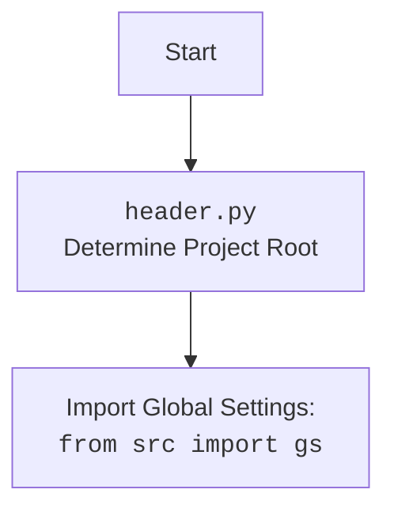

## <алгоритм>

1.  **`set_project_root(marker_files)`**:
    *   На вход принимается кортеж `marker_files` (по умолчанию `('__root__', '.git')`), содержащий имена файлов или директорий, которые используются для определения корня проекта.
    *   Определяется абсолютный путь к директории, в которой находится текущий файл (`__file__`).
    *   Инициализируется переменная `__root__` текущим путем.
    *   Происходит итерация по родительским директориям от текущей директории до корневой.
    *   В каждой родительской директории проверяется наличие хотя бы одного из файлов или директорий из `marker_files`.
        *   Если маркер найден, то текущая родительская директория становится `__root__`, и цикл прекращается.
    *   Если `__root__` отсутствует в `sys.path`, добавляем ее в начало.
    *   Возвращается путь `__root__`.
    
    **Пример:**
    
        1.  Пусть `__file__` указывает на `/path/to/project/src/utils/_examples/header.py`.
        2.  `current_path` становится `/path/to/project/src/utils/_examples`.
        3.  Цикл начинает поиск:
            *   `/path/to/project/src/utils/_examples`: маркеры не найдены.
            *   `/path/to/project/src/utils`: маркеры не найдены.
            *   `/path/to/project/src`: маркеры не найдены.
            *   `/path/to/project`: найдет маркер `.git`, так `__root__` = `/path/to/project`
        4.  `/path/to/project` добавляется в `sys.path`
        5.  Возвращается `/path/to/project`.

2.  **`__root__: Path = set_project_root()`**:
    *   Вызывается функция `set_project_root()` для определения и сохранения пути корня проекта в переменную `__root__`.

3.  **Импорт `from src import gs`**:
    *   Импортируется модуль `gs` из пакета `src`.

4.  **Чтение `settings.json`**:
    *   Инициализируется `settings` как `None`.
    *   Блок `try`:
        *   Открывается файл `settings.json`, расположенный в `gs.path.root / 'src' / 'settings.json'`.
        *   Содержимое файла загружается в переменную `settings` с помощью `json.load()`.
    *   Блок `except`:
        *   Если происходит `FileNotFoundError` или `json.JSONDecodeError`, переменная `settings` остается `None`.

5.  **Чтение `README.MD`**:
    *   Инициализируется `doc_str` как `None`.
    *   Блок `try`:
        *   Открывается файл `README.MD`, расположенный в `gs.path.root / 'src' / 'README.MD'`.
        *   Содержимое файла читается в переменную `doc_str` с помощью `settings_file.read()`.
    *   Блок `except`:
        *   Если происходит `FileNotFoundError` или `json.JSONDecodeError`, переменная `doc_str` остается `None`.

6.  **Определение глобальных переменных**:
    *   `__project_name__` устанавливается в `settings.get("project_name", 'hypotez')`, если `settings` существует, иначе устанавливается `'hypotez'`.
    *   `__version__` устанавливается в `settings.get("version", '')`, если `settings` существует, иначе устанавливается `''`.
    *   `__doc__` устанавливается в `doc_str`, если `doc_str` существует, иначе устанавливается `''`.
    *   `__details__` устанавливается в `''`.
    *   `__author__` устанавливается в `settings.get("author", '')`, если `settings` существует, иначе устанавливается `''`.
    *   `__copyright__` устанавливается в `settings.get("copyrihgnt", '')`, если `settings` существует, иначе устанавливается `''`.
    *   `__cofee__` устанавливается в `settings.get("cofee", "Treat the developer to a cup of coffee for boosting enthusiasm in development: https://boosty.to/hypo69")`, если `settings` существует, иначе устанавливается "Treat the developer to a cup of coffee for boosting enthusiasm in development: https://boosty.to/hypo69".

## <mermaid>

```mermaid
flowchart TD
    Start(Начало) --> FindRoot[Определение корня проекта <br> `set_project_root()`]
    FindRoot --> AddToSysPath{Добавить в `sys.path`?}
    AddToSysPath -- Yes --> RootPath(Путь к корню проекта: <br> `__root__`)
    AddToSysPath -- No --> RootPath
    RootPath --> ImportGS[Импорт глобальных настроек: <br> `from src import gs`]
    ImportGS --> ReadSettings{Чтение `settings.json`}
    ReadSettings -- Success --> ParseSettings[Разбор `settings.json`]
    ReadSettings -- Failure --> ReadDocstring{Чтение `README.MD`}
    ParseSettings --> ReadDocstring
    ReadDocstring -- Success --> ParseDocstring[Разбор `README.MD`]
    ReadDocstring -- Failure --> DefineGlobals{Определение глобальных переменных}
    ParseDocstring --> DefineGlobals
    DefineGlobals --> End(Конец)
    
     style Start fill:#f9f,stroke:#333,stroke-width:2px
     style End fill:#f9f,stroke:#333,stroke-width:2px
     style FindRoot fill:#ccf,stroke:#333,stroke-width:2px
     style RootPath fill:#ccf,stroke:#333,stroke-width:2px
     style AddToSysPath fill:#ccf,stroke:#333,stroke-width:2px
     style ImportGS fill:#aaf,stroke:#333,stroke-width:2px
     style ReadSettings fill:#aaf,stroke:#333,stroke-width:2px
     style ParseSettings fill:#aaf,stroke:#333,stroke-width:2px
     style ReadDocstring fill:#aaf,stroke:#333,stroke-width:2px
     style ParseDocstring fill:#aaf,stroke:#333,stroke-width:2px
     style DefineGlobals fill:#aaf,stroke:#333,stroke-width:2px
```



### Анализ `mermaid`:

*   Диаграмма начинается с узла `Start` и заканчивается узлом `End`.
*   **`FindRoot`**: Функция `set_project_root()` определяет корень проекта путем поиска маркерных файлов в родительских директориях.
*   **`AddToSysPath`**: Проверяет, добавлен ли корень проекта в системный путь, и добавляет его, если нет.
*   **`RootPath`**: Представляет путь к корню проекта (`__root__`).
*    **`ImportGS`**: Импортирует модуль `gs` из пакета `src`, содержащий глобальные настройки проекта, включая пути к файлам.
*    **`ReadSettings`**: Пытается прочитать и загрузить данные из файла `settings.json`.
*    **`ParseSettings`**: Обрабатывает данные из `settings.json` в случае успешного чтения.
*    **`ReadDocstring`**: Пытается прочитать содержимое файла `README.MD`.
*    **`ParseDocstring`**: Обрабатывает содержимое `README.MD` в случае успешного чтения.
*   **`DefineGlobals`**: На основе прочитанных настроек и документации определяются глобальные переменные: `__project_name__`, `__version__`, `__doc__`, `__details__`, `__author__`, `__copyright__` и `__cofee__`.
*   Все импорты и зависимости отражены в диаграмме в виде направленных стрелок.

## <объяснение>

### Импорты:
*   `sys`: Используется для доступа к системным переменным, включая `sys.path`, который определяет пути поиска модулей. В данном случае используется для добавления корня проекта в путь поиска модулей.
*   `json`: Используется для работы с файлами в формате JSON, в данном случае для чтения файла настроек (`settings.json`).
*   `packaging.version`: Используется для работы с версиями пакетов.
*   `pathlib.Path`: Используется для работы с путями файловой системы, обеспечивая более удобный и платформонезависимый способ работы с путями.
*   `from src import gs`: Импортирует глобальные настройки проекта из модуля `gs`, которые включают пути к файлам проекта. Это зависимость от внутреннего пакета `src` и его подмодуля `gs`.

### Функции:
*   **`set_project_root(marker_files)`**:
    *   **Аргументы**:
        *   `marker_files` (tuple, optional): Кортеж строк, представляющих файлы или директории, которые указывают на корень проекта (по умолчанию `('__root__', '.git')`).
    *   **Возвращает**:
        *   `pathlib.Path`: Абсолютный путь к корневой директории проекта. Если ни один из маркерных файлов не найден, возвращает директорию, где расположен текущий файл.
    *   **Назначение**:
        *   Функция ищет корень проекта, начиная с директории текущего файла и поднимаясь по родительским директориям. Она останавливается, когда находит один из маркерных файлов/директорий. Это позволяет автоматически определять корень проекта, даже если файл `header.py` перемещен.
        *   После нахождения корня проекта, его путь добавляется в `sys.path`, что позволяет импортировать модули из этого проекта.
    *   **Примеры**:
        *   При запуске скрипта из директории `/path/to/project/src/utils/_examples`, если в `/path/to/project` существует файл `.git`, функция вернет `Path('/path/to/project')`.
        *   Если маркеры не найдены, то будет возвращён путь к директории с файлом `header.py`.

### Переменные:
*   `__root__` (`pathlib.Path`): Путь к корневой директории проекта. Определяется при первом запуске скрипта и используется для определения путей к файлам `settings.json` и `README.MD`.
*   `settings` (`dict` or `None`): Словарь с настройками, загруженными из `settings.json`. Если файл не найден или имеет неверный формат, то переменная остается `None`.
*   `doc_str` (`str` or `None`): Строка, содержащая текст из файла `README.MD`. Если файл не найден, или его не удается прочитать, то переменная остается `None`.
*    `__project_name__` (`str`): Имя проекта, извлекается из файла `settings.json` или устанавливается значение `'hypotez'` по умолчанию.
*    `__version__` (`str`): Версия проекта, извлекается из файла `settings.json` или устанавливается пустая строка по умолчанию.
*   `__doc__` (`str`): Документация проекта, загруженная из файла `README.MD`.
*   `__details__` (`str`): Детальная информация о проекте, в данном примере всегда устанавливается в пустую строку.
*   `__author__` (`str`): Автор проекта, извлекается из файла `settings.json` или устанавливается пустая строка по умолчанию.
*   `__copyright__` (`str`): Информация о копирайте, извлекается из файла `settings.json` или устанавливается пустая строка по умолчанию.
*   `__cofee__` (`str`): Сообщение для поддержки разработчика, извлекается из файла `settings.json` или устанавливается значение по умолчанию.

### Потенциальные ошибки и области для улучшения:
*   **Обработка исключений**: В блоках `try-except` для чтения `settings.json` и `README.MD` обработка исключений (`FileNotFoundError`, `json.JSONDecodeError`) происходит замалчиванием через `...`. Было бы целесообразно логировать ошибки или предоставлять более информативные сообщения.
*   **Зависимость от `gs`**: Код зависит от модуля `gs` для путей к файлам, что создает сильную зависимость. Если структура `gs` изменится, код может не работать. Возможно, стоило бы пересмотреть подход и использовать относительные пути.
*   **Отсутствие валидации данных из settings.json**: Код не проверяет типы и наличие ключей в словаре `settings`. Если `settings.json` будет некорректным, это может привести к ошибкам.
*   **Hardcoded default message:** Дефолтное сообщение о кофе в `__cofee__` может быть вынесено в константу или  настройки проекта.
*   **Отсутствие типов**: В коде отсутсвуют типы, для большей читаемости можно добавить типы переменных.
    
### Взаимосвязи с другими частями проекта:
*   **`src/gs`**: `header.py` напрямую зависит от модуля `gs`, который, предположительно, является частью внутреннего пакета `src`.  `gs` содержит пути к файлам проекта, которые `header.py` использует для поиска `settings.json` и `README.MD`.
*   **`settings.json`**: Файл содержит настройки проекта, которые используются для определения глобальных переменных (`__project_name__`, `__version__`, и т.д.).
*   **`README.MD`**: Файл используется для получения документации проекта, которая сохраняется в `__doc__`.
*  **`sys.path`**: `header.py` влияет на `sys.path`, добавляя корень проекта в список путей поиска модулей. Это позволяет другим модулям в проекте импортировать друг друга, используя относительные пути.