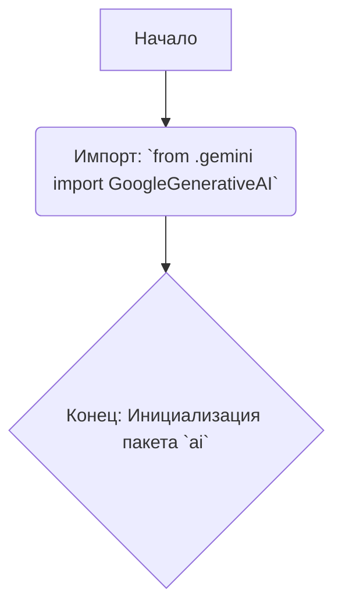
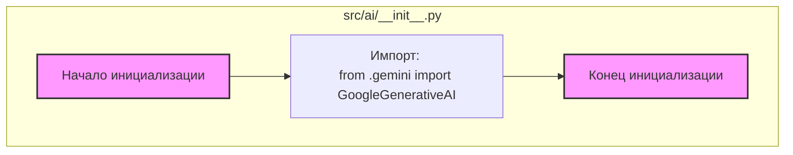

## АНАЛИЗ КОДА: `hypotez/src/ai/__init__.py`

### 1. <алгоритм>

**Блок-схема:**

**Описание:**

1. **Начало:**  Процесс начинается с момента загрузки пакета `ai`.
2. **Импорт:** Выполняется импорт класса `GoogleGenerativeAI` из подмодуля `gemini` внутри пакета `ai`.
3. **Конец:**  Процесс завершается, пакет `ai` инициализирован и готов к использованию.

### 2. <mermaid>

**Объяснение зависимостей `mermaid`:**

Диаграмма показывает простой процесс импорта внутри файла `__init__.py` в пакете `ai`.

*   `start_init`: Блок представляет начало процесса инициализации пакета.
*   `import_gemini`: Блок представляет импорт класса `GoogleGenerativeAI` из файла `gemini.py`, который расположен в том же каталоге.
*   `end_init`: Блок представляет окончание процесса инициализации пакета.

### 3. <объяснение>

**Импорты:**

*   `from .gemini import GoogleGenerativeAI`:
    *   Импортирует класс `GoogleGenerativeAI` из модуля `gemini.py`, расположенного в том же каталоге, что и файл `__init__.py`.
    *   Это позволяет использовать класс `GoogleGenerativeAI` как часть пакета `ai`.  Используется для интеграции с Google Generative AI API.  Использование `.` (относительный импорт) означает, что модуль ищется в пределах текущего пакета.

**Файл:**
    
   Файл `__init__.py` используется для обозначения директории `ai` как пакета Python. Он может содержать код инициализации или импорта для пакета, позволяя обращаться к модулям пакета через краткий путь.

**Взаимосвязи с другими частями проекта:**

*   Этот код устанавливает основу для использования `GoogleGenerativeAI`, вероятно, для выполнения генеративных задач с использованием AI моделей.

**Потенциальные ошибки и области для улучшения:**

*   **Отсутствие других компонентов**: На данный момент, файл содержит только импорт `GoogleGenerativeAI`. В будущем могут потребоваться другие компоненты, которые могут быть также импортированы или добавлены в `__init__.py` для расширения функциональности пакета.
*   **Зависимость от `gemini.py`**: При изменении содержимого файла `gemini.py`, этот код может потребовать корректировки.
*   **Нет документации**: Отсутствует какая-либо документация или описание для данного файла.