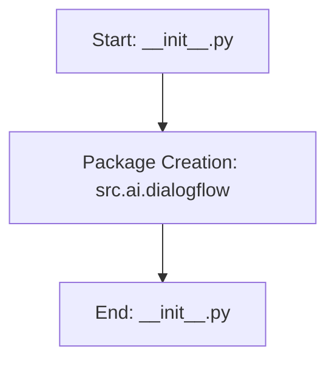

## Анализ кода `src/ai/dialogflow/__init__.py`

### <алгоритм>

1.  **Начало**: Файл `__init__.py` является точкой входа в пакет `src.ai.dialogflow`.  Импорт каких-либо модулей не происходит.
2.  **Завершение**: Файл `__init__.py` заканчивается, не выполняя каких-либо дополнительных действий, но выполняя роль объявления пакета.

**Примеры:**
-   Файл `__init__.py`  без кода - пакет создан и может использоваться.
-   Добавление в файл кода (классов, функций, переменных) - они будут доступны при импорте пакета.

### <mermaid>

**Описание зависимостей:**

-   `Start`: Начало выполнения файла `__init__.py`.
-  `PackageCreation`: Объявление пакета `src.ai.dialogflow`
-   `End`: Завершение выполнения файла `__init__.py`.

### <объяснение>

**Импорты:**

-   В данном коде отсутствуют какие-либо импорты. Это характерно для файла `__init__.py`, чья основная задача - определение пакета.

**Классы:**

-   В данном файле не определены классы.

**Функции:**

-   В данном файле не определены функции.

**Переменные:**

-   В данном файле не используются переменные.

**Объяснение:**

Файл `__init__.py` в Python служит для обозначения директории как пакета. Когда этот файл присутствует в директории, Python распознает эту директорию как пакет, и модули в ней можно импортировать.
В данном случае, пустой `__init__.py` файл определяет `src.ai.dialogflow` как Python пакет.

**Цепочка взаимосвязей:**
1. Файл `__init__.py` является частью структуры пакетов Python, в частности, пакета `src.ai.dialogflow`.
2. Другие модули в проекте, такие как `src.ai.dialogflow.some_module` будут использовать этот файл как часть импорта. Например, при использовании `from src.ai.dialogflow import some_module`, Python будет искать пакет `src.ai.dialogflow` и использовать `__init__.py` для определения местоположения пакета.

**Потенциальные ошибки и области для улучшения:**

1.  **Отсутствие описания**: Отсутствует описание функциональности пакета в комментариях, что может затруднить понимание его назначения в проекте.
2.  **Отсутствие кода**: В настоящий момент пакет пуст, его нужно наполнить кодом.

**Улучшения:**

1.  **Добавление документации:**  Следует добавить docstring в файл `__init__.py`, чтобы дать общее представление о назначении пакета.
2. **Добавление модулей**: Наполнить пакет полезным кодом.