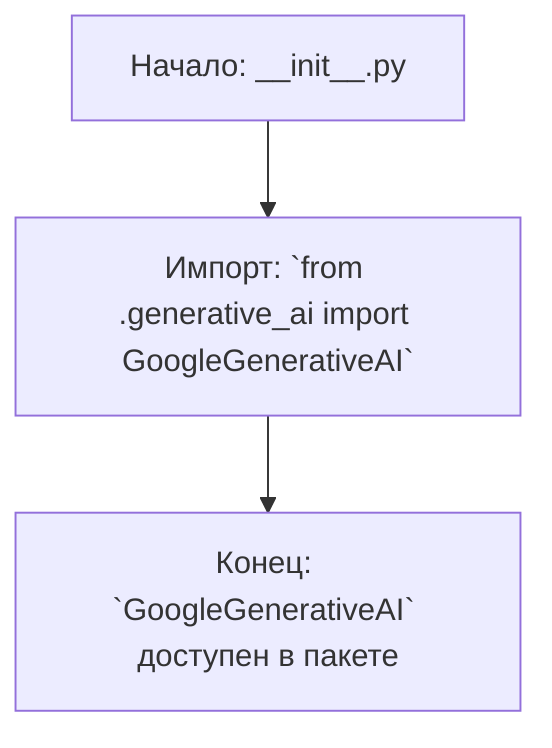

## Анализ кода `src/ai/gemini/__init__.py`

### <алгоритм>

1.  **Импорт модуля `GoogleGenerativeAI`**:
    *   Начало: Загрузка файла `__init__.py`.
    *   Импорт: Из модуля `.generative_ai` (который находится в той же директории) импортируется класс `GoogleGenerativeAI`.
    *   Конец: Класс `GoogleGenerativeAI` становится доступным для использования в пакете `src.ai.gemini`.
    
    Пример:
        ```python
        from .generative_ai import GoogleGenerativeAI
        # Теперь можно использовать класс GoogleGenerativeAI через src.ai.gemini.GoogleGenerativeAI
        ```

### <mermaid>



### <объяснение>

**Импорты:**

*   `from .generative_ai import GoogleGenerativeAI`:
    *   `from .generative_ai`: Импортирует модуль `generative_ai`, который находится в той же директории, что и `__init__.py` (т.е., в директории `src/ai/gemini`). Символ `.` означает "текущая директория" при импорте.
    *   `import GoogleGenerativeAI`: Из модуля `generative_ai` импортируется класс `GoogleGenerativeAI`. Это означает, что класс `GoogleGenerativeAI` будет доступен для использования внутри пакета `src.ai.gemini`.

**Назначение:**

*   Файл `__init__.py` используется для того, чтобы сделать директорию `src/ai/gemini` пакетом Python. Он также используется для импорта и экспорта классов и функций, которые будут использоваться за пределами пакета.
*   В данном случае, файл `__init__.py` импортирует класс `GoogleGenerativeAI` из модуля `generative_ai`, делая его доступным при обращении к пакету `src.ai.gemini`.

**Взаимосвязь с другими частями проекта:**

*   Этот файл является частью структуры пакета `src.ai`, который, вероятно, содержит другие модули, связанные с искусственным интеллектом.
*   `GoogleGenerativeAI` скорее всего представляет собой класс, инкапсулирующий логику взаимодействия с Gemini API от Google.
*   Этот пакет предназначен для использования в остальной части проекта для интеграции функций Gemini AI.
    
**Потенциальные ошибки и области для улучшения:**

*   В текущем виде `__init__.py`  импортирует только один класс, если в будущем появятся другие классы или функции, связанные с `gemini`, то необходимо будет добавить их импорт сюда.
*   Не предусмотрена обработка исключений при импорте, хотя для `__init__.py` это обычно не является проблемой.
*   В целом, код выглядит корректно, но может быть расширен по мере роста функциональности пакета.

**Пример использования:**

```python
from src.ai.gemini import GoogleGenerativeAI

# Теперь можно создать экземпляр класса GoogleGenerativeAI
gemini_ai = GoogleGenerativeAI()

# И использовать его методы
# response = gemini_ai.generate_text("...")