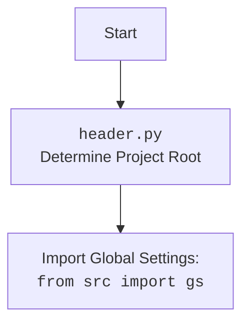

## АНАЛИЗ КОДА: `src/ai/gradio/header.py`

### 1. <алгоритм>

**Назначение**: Модуль `header.py` предназначен для определения корневой директории проекта, загрузки конфигурации из файла `config.json`, чтения документации из `README.MD` и определения глобальных переменных проекта.

**Блок-схема**:

```mermaid
flowchart TD
    Start[Start] --> FindRoot[<code>set_project_root()</code>: Найти корневую директорию проекта]
    FindRoot --> CheckMarkers[Проверка наличия маркерных файлов в текущей или родительских директориях]
    CheckMarkers -- Найдено --> SetRoot[Установить корневую директорию]
    CheckMarkers -- Не найдено --> SetCurrentRoot[Установить текущую директорию как корневую]
    SetRoot --> AddToSysPath[Добавить корневую директорию в sys.path]
    SetCurrentRoot --> AddToSysPath
    AddToSysPath --> LoadConfig[Загрузить конфигурацию из <code>config.json</code>]
    LoadConfig -- Успешно --> LoadDoc[Загрузить документацию из <code>README.MD</code>]
    LoadConfig -- Ошибка --> LoadDoc
    LoadDoc --> SetGlobalVars[Установить глобальные переменные: <br><code>__project_name__</code>, <code>__version__</code>, <code>__doc__</code>, <code>__details__</code>, <br><code>__author__</code>, <code>__copyright__</code>, <code>__cofee__</code>]
    LoadDoc -- Ошибка --> SetGlobalVars
    SetGlobalVars --> End[End]
```

**Примеры**:

1.  **`set_project_root()`**:
    *   При запуске скрипта из `/home/user/project/src/ai/gradio/header.py`, если маркерный файл `__root__` находится в `/home/user/project`, то `set_project_root()` вернет `Path('/home/user/project')`.
    *   Если маркерный файл не найден, то `set_project_root()` вернет `Path('/home/user/project/src/ai/gradio')`.
2.  **Загрузка `config.json`**:
    *   Если `config.json` существует в `/home/user/project/src/config.json` и содержит `{"project_name": "test_project", "version": "1.0"}`, то переменные `__project_name__` и `__version__` будут установлены соответственно.
    *   Если `config.json` не существует, то переменные примут значения по умолчанию `hypotez` и `''`.
3.  **Загрузка `README.MD`**:
    *   Если `README.MD` существует в `/home/user/project/src/README.MD` и содержит текст, то переменная `__doc__` будет содержать этот текст.
    *   Если `README.MD` не существует, то `__doc__` будет пустой строкой.
4.  **Инициализация глобальных переменных**:
    *   `__project_name__` - имя проекта из `config.json` или `'hypotez'` по умолчанию.
    *   `__version__` - версия проекта из `config.json` или `''` по умолчанию.
    *   `__doc__` - содержимое файла `README.MD` или `''` по умолчанию.
    *   `__author__` - имя автора из `config.json` или `''` по умолчанию.
    *   `__copyright__` - информация об авторских правах из `config.json` или `''` по умолчанию.
    *    `__cofee__` - сообщение с ссылкой на страницу для пожертвований.

### 2. <mermaid>

```mermaid
flowchart TD
    Start[Start] --> setProjectRootCall[<code>set_project_root()</code>]
    setProjectRootCall --> FindRootLoop[Поиск маркерных файлов в родительских директориях]
    FindRootLoop -- "Маркер найден" --> SetRootPath[Установить корневой путь]
    FindRootLoop -- "Маркер не найден" --> SetCurrentPathAsRoot[Установить текущий путь как корневой]
    SetRootPath --> AddRootToSysPath[Добавить корневой путь в sys.path]
    SetCurrentPathAsRoot --> AddRootToSysPath
    AddRootToSysPath --> ImportGS[Импорт <code>from src import gs</code>]
    ImportGS --> LoadConfigFromFile[Загрузить <code>config.json</code>]
    LoadConfigFromFile -- "Успешно" --> LoadReadmeFromFile[Загрузить <code>README.MD</code>]
    LoadConfigFromFile -- "Ошибка" --> LoadReadmeFromFile
    LoadReadmeFromFile -- "Успешно" --> SetGlobalVariables[Инициализировать глобальные переменные]
    LoadReadmeFromFile -- "Ошибка" --> SetGlobalVariables
    SetGlobalVariables --> End[End]

    style Start fill:#f9f,stroke:#333,stroke-width:2px
    style End fill:#f9f,stroke:#333,stroke-width:2px

```



**Объяснение зависимостей `mermaid`**:

*   `Start`, `End`: Начало и конец процесса.
*   `setProjectRootCall`: Вызов функции `set_project_root()` для определения корня проекта.
*   `FindRootLoop`: Цикл поиска маркерных файлов в родительских директориях.
*   `SetRootPath`: Установка корневого пути, если маркер найден.
*   `SetCurrentPathAsRoot`: Установка текущего пути как корневого, если маркер не найден.
*    `AddRootToSysPath`: Добавление корневого пути в `sys.path`.
*    `ImportGS`: Импорт модуля глобальных настроек `gs` из `src`.
*    `LoadConfigFromFile`: Загрузка данных из файла `config.json`.
*    `LoadReadmeFromFile`: Загрузка данных из файла `README.MD`.
*   `SetGlobalVariables`: Инициализация глобальных переменных проекта.

    Импорт `from src import gs` является важной зависимостью, поскольку он обеспечивает доступ к глобальным настройкам и константам проекта, в том числе к путям.

### 3. <объяснение>

**Импорты**:

*   `sys`:  Используется для добавления корневой директории проекта в `sys.path`, что позволяет импортировать модули из этой директории.
*   `json`: Используется для работы с файлом конфигурации `config.json` (загрузка данных из JSON).
*   `packaging.version.Version`: Импортируется для работы с версиями пакетов (не используется в данном коде, может быть оставлен для будущего использования)
*   `pathlib.Path`: Используется для удобной работы с путями файловой системы.
*   `from src import gs`:  Импортирует модуль глобальных настроек `gs` из директории `src`. Это позволяет обращаться к настройкам проекта, таким как пути до файлов и директорий, константам.

**Функции**:

*   `set_project_root(marker_files: tuple = ('__root__', '.git')) -> Path`:
    *   **Аргументы**:
        *   `marker_files` (tuple, опционально): Кортеж с именами файлов или директорий, которые являются маркерами корневой директории проекта. По умолчанию `('__root__', '.git')`.
    *   **Возвращаемое значение**:
        *   `Path`: Абсолютный путь к корневой директории проекта.
    *   **Назначение**: Поиск корневой директории проекта путем проверки наличия маркерных файлов в текущей и родительских директориях. Если маркерный файл не найден, возвращается директория, где находится скрипт.

**Переменные**:

*   `__root__` (Path):  Путь к корневой директории проекта, определяется функцией `set_project_root()`.
*   `config` (dict): Словарь, загруженный из `config.json`. Может быть `None`, если файл не найден или имеет неверный формат JSON.
*   `doc_str` (str): Содержимое файла `README.MD`. Может быть `None`, если файл не найден.
*   `__project_name__` (str): Имя проекта, берется из `config.json` или `'hypotez'` по умолчанию.
*   `__version__` (str): Версия проекта, берется из `config.json` или `''` по умолчанию.
*   `__doc__` (str): Содержимое документации, берется из `README.MD` или `''` по умолчанию.
*   `__details__` (str): Дополнительные сведения о проекте (в текущей версии кода  всегда `''`).
*    `__author__` (str): Имя автора проекта, берется из `config.json` или `''` по умолчанию.
*    `__copyright__` (str): Информация об авторских правах, берется из `config.json` или `''` по умолчанию.
*    `__cofee__` (str): Сообщение с ссылкой на страницу для пожертвований.

**Объяснение работы**:

1.  **Определение корневой директории**: Функция `set_project_root` находит корневую директорию проекта, и добавляет ее в `sys.path`. Это нужно для корректной работы импорта модулей в проекте.
2.  **Загрузка конфигурации**: Код пытается загрузить настройки из `config.json`. Если файл не найден или имеет неверный формат, перехватывается исключение и переменной `config` присваивается `None`.
3.  **Загрузка документации**: Код пытается прочитать `README.MD`. Если файл не найден или возникает ошибка, перехватывается исключение и переменной `doc_str` присваивается `None`.
4.  **Установка глобальных переменных**: На основе загруженной конфигурации и документации устанавливаются глобальные переменные проекта (`__project_name__`, `__version__`, `__doc__` и др.), которые затем могут использоваться в других частях проекта.

**Возможные улучшения**:

*   Добавить обработку случаев, когда `config.json` или `README.MD` не найдены, предоставляя более информативные сообщения об ошибках.
*  Использовать более универсальный механизм для загрузки конфигурации (например, с помощью библиотеки `configparser`).
*  `__details__` в текущей реализации пустая строка, можно добавить логику для её определения из внешнего файла или переменных окружения.
*  Можно добавить логику проверок на значения, извлеченные из json, а также на корректность получаемого пути.

**Связь с другими частями проекта**:

*   `header.py` является центральной частью проекта, поскольку определяет глобальные настройки и путь до корневой директории.
*   Модуль `gs`, импортируемый из `src`, скорее всего, содержит другие настройки и пути. `header.py` использует `gs.path.root` для доступа к путям файлов.
*   Значения глобальных переменных, таких как `__project_name__`, `__version__`, `__doc__`, могут использоваться в различных частях проекта для отображения информации о проекте, например, в интерфейсах или логах.

Этот анализ предоставляет полное понимание работы модуля `header.py`, включая его функциональность, внутренние механизмы и связи с другими частями проекта.