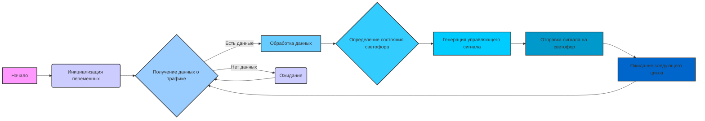
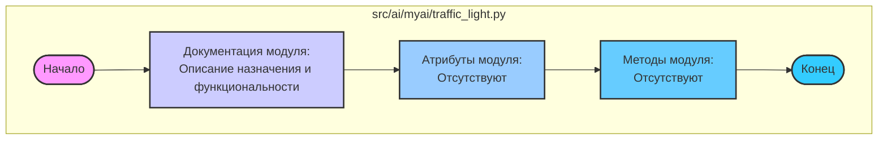

# Анализ кода `traffic_light.py`

## <алгоритм>

Код `traffic_light.py` не содержит исполняемого кода. Он состоит в основном из комментариев и строк документации, предназначенных для описания модуля `src.ai.myai`. 
Следовательно, пошаговой блок-схемы для алгоритма нет, поскольку в файле нет логики.

Примерная блок-схема для модуля `src.ai.myai` (когда он будет реализован) может выглядеть следующим образом:

**Пример работы:**

1.  **Инициализация переменных**: Задается начальное состояние светофора (например, `зеленый`).
2.  **Получение данных о трафике**: Модуль собирает данные с сенсоров (например, количество машин на перекрестке).
3.  **Обработка данных**: Анализируются полученные данные о трафике (например, если на одной полосе много машин).
4.  **Определение состояния светофора**: Принимается решение об изменении состояния светофора (например, переключиться на `желтый`).
5.  **Генерация управляющего сигнала**: Генерируется сигнал для управления светофором (например, `переключить на желтый`).
6.  **Отправка сигнала на светофор**: Сигнал отправляется на контроллер светофора, вызывая переключение.
7.  **Ожидание следующего цикла**: Модуль ожидает заданный промежуток времени для начала следующего цикла управления.

## <mermaid>

**Объяснение диаграммы `mermaid`:**

*   `subgraph src/ai/myai/traffic_light.py`: Обозначает область, представляющую файл `traffic_light.py`.
*   `Start([Начало])`: Обозначает начало выполнения скрипта (в данном случае, это фиктивное начало, так как нет исполняемого кода).
*   `ModuleDescription[Документация модуля:...]`: Блок, содержащий описание модуля из строк документации. Описывает назначение и функциональность, но не содержит логики.
*   `ModuleAttributes[Атрибуты модуля: ...]`: Блок, указывающий, что у модуля нет атрибутов.
*   `ModuleMethods[Методы модуля: ...]`: Блок, указывающий, что у модуля нет методов.
*   `End([Конец])`: Обозначает конец блока, что указывает на завершение обработки модуля.

## <объяснение>

### Импорты
В коде нет импортов. Это означает, что данный модуль на текущий момент не зависит от других частей проекта.

### Классы
В данном файле нет классов.

### Функции
В данном файле нет функций.

### Переменные
В данном файле нет переменных.

**Детальное объяснение:**

*   **Файл `traffic_light.py`:**
    *   **Назначение:** Файл предназначен для размещения логики управления светофором в рамках проекта.
    *   **Текущее состояние:** В текущем состоянии файл содержит только комментарии и документационные строки.
    *   **Отсутствие кода:** Нет ни классов, ни функций, ни переменных.
    *   **Ожидаемое развитие:** Файл является заготовкой для будущей реализации управления светофором.

**Потенциальные ошибки и области для улучшения:**

1.  **Отсутствие реализации:** Файл в текущем виде не выполняет никакой полезной функции. Его необходимо дополнить кодом для реализации логики управления светофором.
2.  **Нет зависимостей:** Отсутствие импортов может быть как плюсом (изоляция), так и минусом (необходимость ручной интеграции). В будущем может потребоваться импорт модулей для работы с сенсорами, таймерами и т.д.
3.  **Документация:** Несмотря на наличие строк документации, они показывают, что описание нужно будет дополнить.

**Цепочка взаимосвязей с другими частями проекта (в будущем):**

*   **Сенсоры:** Модуль будет взаимодействовать с модулями, собирающими данные о трафике.
*   **Контроллер:** Модуль будет отправлять сигналы на контроллер светофора.
*   **Логика принятия решений:** Модуль будет использовать логику (возможно, AI), для принятия решений о переключении светофора.
*   **Настройки:** Модуль может использовать глобальные настройки для различных параметров.

**Заключение:**
Файл `traffic_light.py` является заготовкой для будущего модуля управления светофором. На текущий момент в нем отсутствует какой-либо исполняемый код. Требуется добавить реализацию с учетом вышеуказанных аспектов, а также продумать взаимодействие с другими частями проекта.