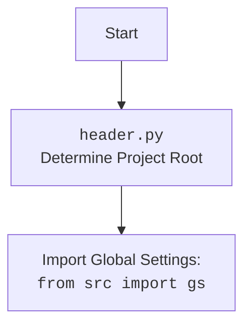

## АНАЛИЗ КОДА: `hypotez/src/ai/openai/model/training.py`

### 1. <алгоритм>

**Блок-схема работы класса `OpenAIModel`:**

1.  **Инициализация (`__init__`)**:
    *   Принимает `system_instruction` (инструкцию для модели) и `assistant_id` (ID ассистента).
    *   Инициализирует клиент OpenAI API (`OpenAI`).
    *   Загружает ассистента и создаёт поток (thread) для диалога.
    *   Пример:
        ```python
        model = OpenAIModel(system_instruction="You are a helpful assistant.", assistant_id="asst_dr5AgQnhhhnef5OSMzQ9zdk9")
        ```

2.  **Получение списка моделей (`list_models`)**:
    *   Запрашивает у OpenAI API список доступных моделей.
    *   Возвращает список ID моделей.
    *   Пример:
        ```python
        models = model.list_models  # возвращает ['gpt-4o', 'gpt-3.5-turbo', ...]
        ```

3.  **Получение списка ассистентов (`list_assistants`)**:
    *   Загружает список доступных ассистентов из JSON-файла.
    *   Возвращает список имен ассистентов.
    *   Пример:
        ```python
        assistants = model.list_assistants # возвращает ['Code Assistant', 'General Assistant', ...]
        ```

4.  **Установка ассистента (`set_assistant`)**:
    *   Принимает `assistant_id` (ID ассистента).
    *   Устанавливает нового ассистента, загружая его данные из OpenAI API.
    *   Пример:
        ```python
        model.set_assistant("asst_1234567890")
        ```

5.  **Сохранение диалога (`_save_dialogue`)**:
    *   Сохраняет текущий диалог в JSON-файл.
    *   Пример:
        ```python
        model._save_dialogue()
        ```

6.  **Определение тональности (`determine_sentiment`)**:
    *   Принимает `message` (сообщение) в качестве аргумента.
    *   Определяет тональность сообщения (позитивная, негативная или нейтральная).
    *   Пример:
        ```python
        sentiment = model.determine_sentiment("This is great!")  # возвращает "positive"
        ```

7.  **Запрос к модели (`ask`)**:
    *   Принимает `message` (сообщение) и опциональный `system_instruction`.
    *   Отправляет сообщение в OpenAI API.
    *   Анализирует тональность ответа.
    *   Сохраняет диалог.
    *   Возвращает ответ модели.
    *   Пример:
        ```python
        response = model.ask("Tell me a joke")
        ```

8.  **Описание изображения (`describe_image`)**:
    *   Принимает путь к изображению `image_path` и опциональный `prompt` и `system_instruction`.
    *   Кодирует изображение в base64.
    *   Отправляет запрос в OpenAI API с изображением и текстом.
    *   Возвращает описание изображения или `None` в случае ошибки.
    *   Пример:
        ```python
        image_description = model.describe_image(image_path, prompt = "Describe this image in detail.")
        ```

9.   **Описание изображения через `requests` (`describe_image_by_requests`)**:
    *   Аналогично `describe_image`, но использует библиотеку `requests` для отправки запроса.
    *   Принимает путь к изображению `image_path` и опциональный `prompt`.
    *   Возвращает описание изображения или `None` в случае ошибки.
    *   Пример:
        ```python
        image_description = model.describe_image_by_requests(image_path, prompt = "Analyze the contents of the image.")
        ```

10. **Динамическое обучение (`dynamic_train`)**:
    *   Загружает предыдущий диалог из файла.
    *   Отправляет диалог в OpenAI API для обучения.
    *   Пример:
        ```python
        model.dynamic_train()
        ```

11. **Обучение модели (`train`)**:
    *   Принимает `data` (путь к файлу или данные), `data_dir` (директорию), `data_file` (путь к файлу), и `positive` (флаг положительной тональности).
    *   Загружает обучающие данные.
    *   Отправляет данные в OpenAI API для обучения.
    *   Возвращает `job_id` или `None` в случае ошибки.
    *   Пример:
        ```python
        job_id = model.train(data_file="training_data.csv", positive=True)
        ```

12. **Сохранение ID обучения (`save_job_id`)**:
    *   Принимает `job_id` (ID задачи обучения), `description` (описание) и `filename` (имя файла).
    *   Сохраняет ID обучения и описание в JSON-файл.
    *   Пример:
        ```python
        model.save_job_id("job_12345", "Training model with new data")
        ```

### 2. <mermaid>

```mermaid
flowchart TD
    Start[Start] --> Init[<code>__init__</code><br>Initialize OpenAI Client, Assistant, Thread]
    Init --> ListModels[<code>list_models</code><br>Get Available Models from OpenAI API]
    Init --> ListAssistants[<code>list_assistants</code><br>Load Available Assistants from JSON]
    Init --> SetAssistant[<code>set_assistant</code><br>Set the current Assistant by ID]
    Init --> SaveDialogue[<code>_save_dialogue</code><br>Save the current Dialogue to JSON]
    Init --> DetermineSentiment[<code>determine_sentiment</code><br>Determine sentiment (positive, negative, neutral)]
    Init --> AskModel[<code>ask</code><br>Send Message to Model and Get Response]
    Init --> DescribeImage[<code>describe_image</code><br>Describe an Image with Prompt]
    Init --> DescribeImageRequests[<code>describe_image_by_requests</code><br>Send image to OpenAI API via requests]
    Init --> DynamicTrain[<code>dynamic_train</code><br>Load Dialogue and Fine-Tune Model]
    Init --> TrainModel[<code>train</code><br>Train Model with data]
    Init --> SaveJobId[<code>save_job_id</code><br>Save the Job Id to file]

    ListModels --> End
    ListAssistants --> End
    SetAssistant --> End
    SaveDialogue --> End
    DetermineSentiment --> End
    AskModel --> End
    DescribeImage --> End
    DescribeImageRequests --> End
    DynamicTrain --> End
    TrainModel --> End
    SaveJobId --> End
    End[End]
```



**Разбор зависимостей `mermaid`:**

*   `flowchart TD`: Объявляет диаграмму как блок-схему (flowchart) с направлением сверху вниз (TD).
*   `Start[Start]`: Начальный узел блок-схемы.
*   `Init[__init__<br>...]`: Узел, представляющий метод `__init__`, включающий описание.
*   `ListModels[list_models<br>...]`, `ListAssistants[...]`, `SetAssistant[...]`, `SaveDialogue[...]`, `DetermineSentiment[...]`, `AskModel[...]`, `DescribeImage[...]`, `DescribeImageRequests[...]`, `DynamicTrain[...]`, `TrainModel[...]`, `SaveJobId[...]`: Узлы, представляющие соответствующие методы класса `OpenAIModel`.
*   `End[End]`: Конечный узел блок-схемы.
*   `-->`:  Обозначает направление потока управления.

### 3. <объяснение>

**Импорты:**

*   `from __future__ import annotations`: Обеспечивает возможность использовать аннотации типов (type hints) без необходимости импортировать `typing` в Python 3.10+.
*   `import time`:  Используется для задержек (например, при повторных попытках в `ask`).
*   `from pathlib import Path`:  Используется для работы с путями к файлам и директориям.
*   `from types import SimpleNamespace`:  Используется для создания простых объектов с атрибутами.
*   `from typing import List, Dict, Optional`:  Используется для аннотации типов (type hints).
*   `import pandas as pd`: Используется для работы с данными в формате DataFrame (хотя в этом коде напрямую не используется).
*   `from openai import OpenAI`: Используется для взаимодействия с OpenAI API.
*   `import requests`: Используется для отправки HTTP-запросов, в частности, для запросов к OpenAI API через `describe_image_by_requests`.
*  `from PIL import Image`: Используется для работы с изображениями (не используется в этом коде).
*   `from io import BytesIO`:  Используется для работы с потоками байтов (в этом коде не используется).
*   `from src import gs`: Импортирует глобальные настройки (`gs`) из пакета `src`.
*   `from src.utils.jjson import j_loads, j_loads_ns, j_dumps`:  Используется для загрузки и сохранения JSON данных.
*   `from src.utils.csv import save_csv_file`:  Используется для сохранения CSV файлов (хотя напрямую не используется в данном коде).
*   `from src.utils.printer import pprint`:  Используется для форматированного вывода данных.
*   `from src.utils.convertors.base64 import base64encode`:  Используется для кодирования изображений в base64.
*   `from src.utils.convertors.md import md2dict`:  Используется для преобразования markdown в словарь (не используется).
*   `from src.logger.logger import logger`:  Используется для логирования событий.

**Класс `OpenAIModel`:**

*   **Роль**: Управляет взаимодействием с OpenAI API, включая запросы к моделям, обучение и управление ассистентами.
*   **Атрибуты**:
    *   `model`: Имя используемой модели (например, `gpt-4o-mini`).
    *   `client`: Экземпляр клиента OpenAI API (`OpenAI`).
    *   `current_job_id`: ID текущего задания обучения.
    *   `assistant_id`: ID используемого ассистента.
    *   `assistant`: Экземпляр ассистента, полученный из OpenAI API.
    *  `thread`: Экземпляр треда для диалога с моделью.
    *   `system_instruction`: Инструкции для модели.
    *  `dialogue_log_path`: Путь к файлу сохранения диалогов.
    *  `dialogue`: Список словарей, содержащий записи диалога с моделью.
    *   `assistants`: Список доступных ассистентов.
    *   `models_list`: Список доступных моделей.
*   **Методы**:
    *   `__init__(self, system_instruction: str = None, model_name:str = 'gpt-4o-mini', assistant_id: str = None)`: Инициализирует объект модели.
    *   `list_models(self) -> List[str]`: Получает список доступных моделей из OpenAI API.
    *   `list_assistants(self) -> List[str]`: Получает список доступных ассистентов из JSON файла.
    *   `set_assistant(self, assistant_id: str)`: Устанавливает ассистента.
    *   `_save_dialogue(self)`: Сохраняет диалог в файл.
    *   `determine_sentiment(self, message: str) -> str`: Определяет тональность сообщения.
    *   `ask(self, message: str, system_instruction: str = None, attempts: int = 3) -> str`: Отправляет сообщение модели и возвращает ответ.
    *  `describe_image(self, image_path: str | Path, prompt:Optional[str] = None, system_instruction:Optional[str] = None ) -> str`: Отправляет изображение в OpenAI API и возвращает его описание.
    *   `describe_image_by_requests(self, image_path: str | Path, prompt:str = None) -> str`:  Аналогично `describe_image`, но использует `requests`.
    *   `dynamic_train(self)`: Динамическое обучение модели на основе прошлых диалогов.
    *   `train(self, data: str = None, data_dir: Path | str = None, data_file: Path | str = None, positive: bool = True) -> str | None`: Обучает модель на предоставленных данных.
    *   `save_job_id(self, job_id: str, description: str, filename: str = "job_ids.json")`: Сохраняет ID обучения.

**Функции:**

*   `main()`: Главная функция для демонстрации работы класса `OpenAIModel`. Инициализирует модель, показывает список доступных моделей, ассистентов, отправляет запрос, запускает обучение и сохраняет ID.

**Переменные:**

*   Переменные класса, такие как `model`, `client`, `current_job_id`, `assistant_id`, `assistant`, `thread`, `system_instruction`, `dialogue_log_path`, `dialogue`, `assistants`, `models_list`, являются атрибутами экземпляров `OpenAIModel`.
*   Локальные переменные внутри методов используются для хранения промежуточных значений.

**Потенциальные ошибки и области для улучшения:**

*   **Обработка ошибок**: В коде есть блоки `try...except`, но обработка ошибок может быть более детальной, например, с логированием стектрейса и повторными попытками при сбоях API.
*   **Управление токенами**: В методе `ask`  установлен `max_tokens=8000`, что может привести к ошибкам, если диалог превысит это ограничение.
*   **Обработка `None`**: В функции `describe_image` в обработке ответа возможно появление `None`, но это не обрабатывается.
*   **Асинхронность**: При больших объемах данных можно рассмотреть использование асинхронных запросов к API, чтобы ускорить выполнение.
*   **Модульность**: Некоторые методы, такие как `determine_sentiment`, могут быть вынесены в отдельные модули.
*   **Конфигурация**: Пути к файлам, ключи API и другие параметры можно вынести в конфигурационный файл.

**Взаимосвязи с другими частями проекта:**

*   **`src.gs`**: Глобальные настройки (`gs`) используются для доступа к путям, API-ключам и другой конфигурационной информации.
*   **`src.utils.jjson`**: Используются для загрузки и сохранения JSON данных, что важно для хранения диалогов, обучения и других данных.
*   **`src.utils.printer`**: Используется для форматированного вывода, что упрощает отладку и чтение логов.
*   **`src.utils.convertors.base64`**: Используется для кодирования изображений в base64 перед отправкой в OpenAI API.
*   **`src.logger.logger`**: Используется для логирования событий, ошибок и другой информации, что помогает в отладке.
*   **`header.py`**:  Определяет корневую директорию проекта, что позволяет правильно формировать пути к ресурсам.

**Цепочка вызовов:**

1.  `main()`: Запускает основной процесс, инициализирует `OpenAIModel`.
2.  `OpenAIModel`: Создает клиент OpenAI, загружает список моделей и ассистентов.
3.  `ask()`: Отправляет сообщение в OpenAI API.
4.  `dynamic_train()`: Загружает прошлый диалог и запускает дообучение.
5.  `train()`: Запускает обучение на новых данных.
6.  `save_job_id()`: Сохраняет ID обучения.
7. `describe_image()`: Запрашивает у модели описание картинки
8. `describe_image_by_requests()`: Запрашивает у модели описание картинки через `requests`

Этот анализ обеспечивает полное понимание функциональности кода, его зависимостей и возможных улучшений.