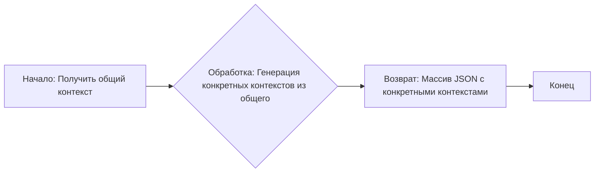

## Анализ кода: `generate_person_factory.md`

### <алгоритм>

1.  **Ввод:** Получаем на вход текстовое описание общего контекста для генерации персонажей. Этот контекст может включать демографические данные (регион, возраст), социально-экономические параметры (бедность, богатство), верования (религиозный, атеист), семейное положение (женат, холост), наличие детей, род занятий (профессионал, рабочий) и т.д.
2.  **Обработка:**
    *   На основе входного контекста генерируем множество более конкретных контекстов. Каждый из этих конкретных контекстов предназначен для генерации описания одного персонажа.
    *   Конкретные контексты формируются путем выбора и конкретизации параметров из общего контекста. Например, если общий контекст "Латиноамериканец, возраст 20-40 лет, статус от бедного до богатого", то конкретные контексты могут включать "Мексиканец, юрист, холост, любит спорт" или "Бразилец, врач, любит природу, женат".
    *   Обратите внимание, что эта логика не реализована в предоставленном коде, а представляет собой описание задачи.

3.  **Вывод:** Возвращаем массив JSON, где каждый элемент массива - это строка, представляющая собой один конкретный контекст для генерации персонажа.

**Пример:**
*   **Вход:** `Please, generate 3 person(s) description(s) based on the following broad context: Latin American, age between 20 and 40 years old, economic status can vary between poor and rich, it can be religious or not, it can be married or not, it can have children or not, it can be a professional or not, it can be a worker or not`
*   **Промежуточные контексты:**
    *   `"Mexican person that has formed as lawyer but now works in other are, is single, like sports and movies"`
    *   `"Create a Brazilian person that is a doctor, like pets and the nature and love heavy metal."`
    *   `"Create a Colombian person that is a lawyer, like to read and drink coffee and is married with 2 children."`
*   **Выход:** `["Mexican person that has formed as lawyer but now works in other are, is single, like sports and movies", "Create a Brazilian person that is a doctor, like pets and the nature and love heavy metal.", "Create a Colombian person that is a lawyer, like to read and drink coffee and is married with 2 children."]`

### <mermaid>

**Объяснение:**

*   `A[Начало: Получить общий контекст]` - начало процесса, где на вход поступает общий контекст для генерации персонажей.
*   `B{Обработка: Генерация конкретных контекстов из общего}` - блок обработки, который отвечает за создание конкретных контекстов для каждого персонажа на основе общего контекста.
*   `C[Возврат: Массив JSON с конкретными контекстами]` -  результатом является JSON массив строк, каждая из которых представляет контекст для генерации описания персонажа.
*  `D[Конец]` - Конец процесса.

### <объяснение>

**Импорты**:
В предоставленном коде нет явных импортов, так как это описание задачи, а не исполняемый код.

**Классы:**
Классов в предоставленном коде также нет, так как это описание задачи, а не исполняемый код.

**Функции:**
Функции в предоставленном коде также нет, так как это описание задачи, а не исполняемый код.

**Переменные:**
*   `INPUT` (неявная): Текстовое описание общего контекста для генерации персонажей.
*   `OUTPUT` (неявная): Массив JSON, где каждый элемент - это строка, представляющая конкретный контекст для генерации персонажа.

**Объяснение**:

Представленный код — это, скорее, *задание*, чем исполняемый код. Он описывает логику, согласно которой из некоторого общего контекста (например, "Латиноамериканец") генерируются более конкретные контексты (например, "Мексиканец, врач, холост").

1.  **Цель:** Задача состоит в создании фабрики контекстов для генерации персонажей.
2.  **Вход:** На вход поступает текстовое описание общего контекста с набором параметров, которые могут быть конкретизированы (демография, социальный статус, верования и т.д.).
3.  **Обработка:** На основе общего контекста необходимо сгенерировать массив более конкретных контекстов. В каждом из них конкретизированы параметры персонажа.
4.  **Выход:** Результатом работы является JSON-массив, где каждый элемент представляет собой строковый контекст, готовый для использования при генерации описания конкретного персонажа.

**Потенциальные ошибки и области для улучшения:**

*   **Отсутствие реализации:** Код не предоставляет реализацию генерации конкретных контекстов, а лишь описывает задачу. Необходимо создать функцию или класс, который будет преобразовывать общий контекст в множество конкретных.
*   **Неточность в генерации:** Не определены правила и логика создания конкретных контекстов. Можно добавить такие элементы, как случайный выбор параметров из общего контекста, использование шаблонов и другие механизмы генерации.

**Взаимосвязи с другими частями проекта:**

Эта фабрика контекстов является частью более общей системы генерации персонажей. Она предоставляет данные для последующего этапа, где эти контексты будут использоваться для создания полных текстовых описаний персонажей. Можно представить такую цепочку:

1.  **Пользовательский ввод:** Пользователь вводит запрос на генерацию персонажей с общим контекстом.
2.  **Фабрика контекстов (здесь):** Модуль на основе общего контекста генерирует массив более конкретных контекстов.
3.  **Генерация описаний персонажей:** Другой модуль, принимая конкретные контексты, создаёт описания персонажей.
4.  **Вывод:** Готовые описания персонажей предоставляются пользователю или используются в других частях системы.