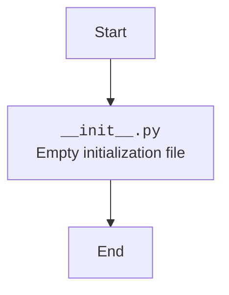

## Анализ кода `hypotez/src/ai/tiny_troupe/__init__.py`

### <алгоритм>

1.  **Начало**: Код начинается с комментариев, указывающих на внешние ресурсы, которые могли вдохновить или лечь в основу данного проекта. Это ссылки на статью на Хабре и репозиторий на GitHub.
2.  **Конец**: Поскольку предоставленный файл `__init__.py` пуст, не выполняется никаких действий.

### <mermaid>

### <объяснение>

**Импорты**:

-   В данном файле нет импортов. Файл `__init__.py` часто используется для указания того, что каталог должен считаться пакетом Python. В данном случае он пуст, следовательно, каталог `tiny_troupe` считается пакетом, но не содержит никакого кода.

**Классы**:

-   В данном файле нет классов.

**Функции**:

-   В данном файле нет функций.

**Переменные**:

-   В данном файле нет переменных.

**Объяснение**:

Файл `__init__.py` в Python служит для инициализации пакета. При его наличии Python рассматривает каталог как пакет, что позволяет импортировать модули из этого каталога. В данном случае файл пустой. Это означает, что пакет `tiny_troupe` присутствует, но его инициализация не требует никаких действий.

**Потенциальные ошибки или области для улучшения**:

-   В данном конкретном случае файл `__init__.py` пуст, что не является ошибкой, но может потребовать добавления кода, если в будущем пакету потребуется выполнить какую-либо инициализацию при импорте.
-   В будущем в этом файле можно было бы определить, например, какие символы экспортировать из пакета при использовании конструкции `from tiny_troupe import *`, через переменную `__all__`.

**Цепочка взаимосвязей с другими частями проекта**:

-   Пакет `tiny_troupe` может быть частью большего проекта `hypotez/src/ai`. Пустой файл `__init__.py` означает, что импорт `from src.ai.tiny_troupe import ...` будет работать, но не будет импортировать никакого конкретного кода, если не определены другие модули (файлы `.py` ) внутри этого пакета.