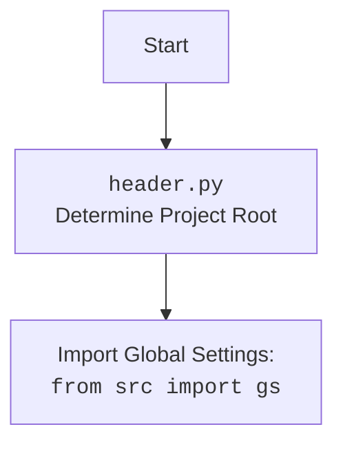

## АНАЛИЗ КОДА: `src/category/category.py`

### 1. <алгоритм>

**Блок-схема `crawl_categories_async` (Асинхронный обход категорий):**

```mermaid
flowchart TD
    StartA[Start crawl_categories_async] --> CheckCategoryA{category is None?};
    CheckCategoryA -- Yes --> InitCategoryA[Initialize category dictionary];
    CheckCategoryA -- No --> UseExistingCategoryA[Use existing category];
    InitCategoryA --> CheckDepthA{depth <= 0?};
    UseExistingCategoryA --> CheckDepthA;
    CheckDepthA -- Yes --> ReturnCategoryA[Return category];
    CheckDepthA -- No --> GetPageA[driver.get(url)];
    GetPageA --> WaitA[asyncio.sleep(1)];
    WaitA --> LocateLinksA[category_links = driver.execute_locator(locator)];
     LocateLinksA --> CheckLinksA{category_links?};
    CheckLinksA -- No --> ErrorLogA[Log error];
    ErrorLogA --> ReturnCategoryA;
     CheckLinksA -- Yes --> CreateTasksA[Create crawling tasks];
    CreateTasksA --> GatherTasksA[await asyncio.gather(*tasks)];
     GatherTasksA --> ReturnCategoryA;
    ReturnCategoryA --> EndA[End crawl_categories_async];
    GetPageA --> ErrorCatchA[Catch Exception];
    ErrorCatchA --> LogErrorA[Log error];
    LogErrorA --> ReturnCategoryA;
```
**Примеры:**
1.  **Начало (`StartA`):** `crawl_categories_async` вызывается с `url`, `depth=2`, `driver` (экземпляр Selenium WebDriver), `locator` (XPath), `dump_file`, `default_category_id`, и `category=None`.
2.  **Инициализация (`InitCategoryA`):** Поскольку `category=None`, создаётся начальный словарь категории.
3.  **Глубина (`CheckDepthA`):** `depth` равно 2, условие не выполняется.
4.  **Загрузка страницы (`GetPageA`):** Страница загружается через `driver.get(url)`.
5. **Поиск ссылок (`LocateLinksA`):**  На странице выполняется `driver.execute_locator(locator)` для поиска ссылок на категории.
6.  **Обработка ссылок (`CreateTasksA`):** Для каждой ссылки рекурсивно создаётся задача `crawl_categories_async` для следующего уровня.
7.  **Ожидание задач (`GatherTasksA`):** Задачи выполняются асинхронно через `asyncio.gather`.
8. **Возврат результата (`ReturnCategoryA`):**  Обновлённый словарь `category` возвращается.
9. **Исключение (`ErrorCatchA`):**  Если возникает ошибка, она логируется, и возвращается текущее состояние `category`.

**Блок-схема `crawl_categories` (Синхронный обход категорий):**

```mermaid
flowchart TD
    Start[Start crawl_categories] --> CheckDepth{depth <= 0?};
    CheckDepth -- Yes --> ReturnCategory[Return category];
    CheckDepth -- No --> GetPage[driver.get(url)];
    GetPage --> Wait[driver.wait(1)];
    Wait --> LocateLinks[category_links = driver.execute_locator(locator)];
    LocateLinks --> CheckLinks{category_links?};
     CheckLinks -- No --> LogError[Log error];
    LogError --> ReturnCategory;
     CheckLinks -- Yes --> LoopLinks[for name, link_url in category_links];
     LoopLinks --> CheckDuplicate{_is_duplicate_url?};
     CheckDuplicate -- Yes --> LoopLinks;
     CheckDuplicate -- No --> CreateCategory[Create new_category];
     CreateCategory --> AddCategory[category[name] = new_category];
     AddCategory --> Recurse[crawl_categories(link_url, depth-1, ...)];
     Recurse --> LoopLinks;
     LoopLinks -- End of Links --> LoadData[loaded_data = j_loads(dump_file)];
     LoadData --> MergeData[category = {**loaded_data, **category}];
    MergeData --> DumpData[j_dumps(category, dump_file)];
    DumpData --> ReturnCategory;
    GetPage --> CatchException[Catch Exception];
    CatchException --> LogErrorEx[Log error];
    LogErrorEx --> ReturnCategory;

    ReturnCategory --> End[End crawl_categories];
```
**Примеры:**
1.  **Начало (`Start`):** `crawl_categories` вызывается с `url`, `depth=2`, `driver`, `locator`, `dump_file`, `default_category_id`, и `category` (пустой словарь).
2.  **Глубина (`CheckDepth`):** `depth` равно 2, условие не выполняется.
3.  **Загрузка страницы (`GetPage`):** Страница загружается через `driver.get(url)`.
4. **Поиск ссылок (`LocateLinks`):**  На странице выполняется `driver.execute_locator(locator)` для поиска ссылок на категории.
5. **Обработка ссылок (`LoopLinks`):** Для каждой ссылки вызывается метод `_is_duplicate_url`. Если ссылка не дубликат, создаётся новый словарь `new_category`, который добавляется в `category`, после чего рекурсивно вызывается `crawl_categories` для следующего уровня.
6. **Загрузка данных (`LoadData`):** Данные из `dump_file` загружаются через `j_loads`.
7. **Объединение данных (`MergeData`):** Загруженные данные объединяются с текущим `category`.
8. **Сохранение данных (`DumpData`):** Обновлённые данные `category` сохраняются в `dump_file` через `j_dumps`.
9. **Возврат результата (`ReturnCategory`):**  Обновлённый словарь `category` возвращается.
10. **Исключение (`CatchException`):** Если возникает ошибка, она логируется, и возвращается текущее состояние `category`.

**Блок-схема `_is_duplicate_url` (Проверка дубликата URL):**

```mermaid
flowchart TD
    StartDuplicate[_is_duplicate_url Start] --> ExtractUrls[Extract URLs from category.values()];
    ExtractUrls --> CheckUrl{url in URLs?};
    CheckUrl -- Yes --> ReturnTrue[Return True];
    CheckUrl -- No --> ReturnFalse[Return False];
    ReturnTrue --> EndDuplicate[_is_duplicate_url End];
    ReturnFalse --> EndDuplicate;
```

**Примеры:**
1. **Начало (`StartDuplicate`):** Вызывается с `category` и `url`.
2. **Извлечение URL (`ExtractUrls`):** Извлекаются все URL из словаря `category`.
3. **Проверка URL (`CheckUrl`):** Проверяется, есть ли `url` среди извлечённых URL.
4. **Возврат (`ReturnTrue`/`ReturnFalse`):** Возвращается `True`, если URL дубликат, иначе `False`.

**Блок-схема `compare_and_print_missing_keys` (Сравнение и вывод отсутствующих ключей):**

```mermaid
flowchart TD
    StartCompare[compare_and_print_missing_keys Start] --> LoadFile[Load data from file: j_loads(file_path)];
    LoadFile --> CheckLoadSuccess{Data loaded successfully?};
    CheckLoadSuccess -- Yes --> LoopKeys[for key in data_from_file];
    CheckLoadSuccess -- No --> LogErrorC[Log error];
    LogErrorC --> EndCompare[compare_and_print_missing_keys End];
    LoopKeys --> CheckKey{key not in current_dict?};
    CheckKey -- Yes --> PrintKey[print(key)];
    CheckKey -- No --> LoopKeys;
    LoopKeys -- End of Loop --> EndCompare;
```

**Примеры:**
1. **Начало (`StartCompare`):** Вызывается с `current_dict` и `file_path`.
2. **Загрузка файла (`LoadFile`):** Загружаются данные из файла по `file_path` через `j_loads`.
3. **Проверка загрузки (`CheckLoadSuccess`):** Проверяется успешность загрузки. Если ошибка, она логируется, и выполнение прекращается.
4. **Цикл по ключам (`LoopKeys`):** Цикл по ключам из загруженных данных.
5. **Проверка ключа (`CheckKey`):** Проверяется, отсутствует ли текущий ключ в `current_dict`.
6. **Вывод ключа (`PrintKey`):** Если ключ отсутствует, он выводится на экран.
7. **Конец (`EndCompare`):** Завершение функции.

### 2. <mermaid>
```mermaid
flowchart TD
    Start(Start) --> CategoryInit[Category.__init__]
    CategoryInit --> PrestaCategoryAsyncInit[PrestaCategoryAsync.__init__]
    PrestaCategoryAsyncInit --> HeaderImport[import header]
    HeaderImport --> GSImport[from src import gs]
    GSImport --> LoggerImport[from src.logger.logger import logger]
    LoggerImport --> jjsonImport[from src.utils.jjson import j_loads, j_dumps]
    jjsonImport --> PrestaCategoryImport[from src.endpoints.prestashop.category import PrestaCategory, PrestaCategoryAsync]
     PrestaCategoryImport --> CategoryClass[class Category(PrestaCategoryAsync)]
    CategoryClass --> crawl_categories_async_call[Category.crawl_categories_async]
    CategoryClass --> crawl_categories_call[Category.crawl_categories]
    crawl_categories_async_call --> DriverGetA[driver.get]
    DriverGetA --> DriverExecuteLocatorA[driver.execute_locator]
     DriverExecuteLocatorA --> DuplicateCheckA[Category._is_duplicate_url]
    DriverExecuteLocatorA --> AsyncGather[asyncio.gather]
    crawl_categories_call --> DriverGet[driver.get]
    DriverGet --> DriverExecuteLocator[driver.execute_locator]
     DriverExecuteLocator --> DuplicateCheck[Category._is_duplicate_url]
     DriverExecuteLocator --> j_loads_call[j_loads]
     j_loads_call --> j_dumps_call[j_dumps]
     CategoryClass --> compare_and_print_missing_keys_call[compare_and_print_missing_keys]
    compare_and_print_missing_keys_call --> j_loads_compare_call[j_loads]
    
    
```

**Объяснение зависимостей `mermaid`:**

-   **`CategoryInit`:**  Метод `__init__` класса `Category` вызывает конструктор родительского класса `PrestaCategoryAsync`
-   **`PrestaCategoryAsyncInit`:** Метод `__init__` класса `PrestaCategoryAsync` инициализирует api credentials.
-   **`HeaderImport`**: Импортируется модуль `header`, который определяет корень проекта и настраивает пути.
-   **`GSImport`**: Импортируются глобальные настройки из модуля `src.gs`.
-   **`LoggerImport`**: Импортируется логгер из модуля `src.logger.logger`.
-   **`jjsonImport`**: Импортируются функции `j_loads` и `j_dumps` из модуля `src.utils.jjson` для безопасной работы с JSON.
-   **`PrestaCategoryImport`**: Импортируются классы `PrestaCategory` и `PrestaCategoryAsync` из модуля `src.endpoints.prestashop.category`.
-   **`CategoryClass`**: Объявление класса `Category`, наследующего от `PrestaCategoryAsync`.
-   **`crawl_categories_async_call`:** Метод `crawl_categories_async` класса `Category`, асинхронно обходит категории.
-    **`DriverGetA`**: Метод `driver.get` загружает URL.
-    **`DriverExecuteLocatorA`**: Метод `driver.execute_locator` извлекает ссылки по заданному локатору.
-   **`DuplicateCheckA`**: Вызывает метод `_is_duplicate_url` для проверки дубликатов.
 - **`AsyncGather`**: Выполняет асинхронные задачи, созданные методом `crawl_categories_async`.
-  **`crawl_categories_call`:** Метод `crawl_categories` класса `Category`, синхронно обходит категории.
-    **`DriverGet`**: Метод `driver.get` загружает URL.
-    **`DriverExecuteLocator`**: Метод `driver.execute_locator` извлекает ссылки по заданному локатору.
-   **`DuplicateCheck`**: Вызывает метод `_is_duplicate_url` для проверки дубликатов.
- **`j_loads_call`**: Вызывает метод `j_loads` для загрузки данных из JSON.
-  **`j_dumps_call`**: Вызывает метод `j_dumps` для сохранения данных в JSON.
- **`compare_and_print_missing_keys_call`**: Вызывает функцию `compare_and_print_missing_keys` для сравнения данных и вывода отсутствующих ключей.
- **`j_loads_compare_call`**: Вызывает метод `j_loads` для загрузки данных для сравнения.
-   Все зависимости отражают поток данных и вызовы методов внутри модуля, а также взаимодействие с другими модулями проекта.

### 3. <объяснение>
**Импорты:**

-   `from __future__ import annotations`:  Используется для отложенного вычисления типов, позволяет использовать аннотации типов, в том числе для классов, которые ещё не определены.
-   `import asyncio`: Обеспечивает поддержку асинхронного программирования, используется в `crawl_categories_async`.
-   `from pathlib import Path`: Предоставляет удобный способ работы с путями файлов и директорий.
-   `import os`: Предоставляет функции для взаимодействия с операционной системой.
-   `from typing import Dict`: Используется для аннотации типов, в данном случае `Dict` для словарей.
-   `from lxml import html`:  Используется для парсинга HTML, здесь не используется напрямую, возможно зависимость библиотеки `selenium`.
-   `import requests`: Используется для HTTP-запросов, здесь не используется напрямую, возможно зависимость библиотеки `selenium`.
-   `import header`: Импортирует модуль `header`, который, вероятно, содержит функции для определения корня проекта и установки путей, а так же содержит импорт `from src import gs`.
-   `from src import gs`:  Импортирует глобальные настройки проекта, что обеспечивает доступ к общим параметрам и конфигурации из любого места проекта.
-   `from src.logger.logger import logger`:  Импортирует логгер для записи событий и ошибок, что помогает отслеживать работу скрипта.
-   `from src.utils.jjson import j_loads, j_dumps`:  Импортирует функции для безопасной работы с JSON. `j_loads`  загружает JSON из файла, `j_dumps` сохраняет данные в JSON.
-   `from src.endpoints.prestashop.category import PrestaCategory, PrestaCategoryAsync`:  Импортирует классы для взаимодействия с категориями PrestaShop. `PrestaCategoryAsync` отвечает за асинхронные запросы.

**Классы:**

-   `Category(PrestaCategoryAsync)`:
    -   **Назначение**:  Класс для управления категориями товаров. Наследует от `PrestaCategoryAsync`, что позволяет использовать асинхронные операции для работы с API PrestaShop.
    -   **`credentials`**: Словарь для хранения API credentials, необходимый для доступа к API PrestaShop.
    -   `__init__(self, api_credentials, *args, **kwargs)`: Конструктор класса, инициализирует объект `Category` и вызывает конструктор родительского класса `PrestaCategoryAsync`.
    -   `crawl_categories_async(self, url, depth, driver, locator, dump_file, default_category_id, category=None)`: Асинхронный метод для рекурсивного обхода категорий и построения их иерархической структуры.
    -   `crawl_categories(self, url, depth, driver, locator, dump_file, default_category_id, category={})`: Синхронный метод для рекурсивного обхода категорий и построения их иерархической структуры.
    -    `_is_duplicate_url(self, category, url)`: Метод для проверки, не является ли URL дубликатом в словаре категорий.

**Функции:**

-   `compare_and_print_missing_keys(current_dict, file_path)`:
    -   **Назначение**: Сравнивает ключи в текущем словаре (`current_dict`) с ключами, загруженными из JSON файла. Выводит на экран ключи, которые присутствуют в файле, но отсутствуют в `current_dict`.
    -   **Аргументы**: `current_dict` – словарь, с которым сравнивают данные, `file_path` – путь к файлу JSON.
    -   **Возвращаемое значение**:  `None`. Функция печатает отсутствующие ключи на экран.

**Переменные:**

-   `credentials` в классе `Category`: Словарь, хранящий учетные данные API, используется для аутентификации запросов к PrestaShop.
-  `api_credentials`:  Параметр для передачи учетных данных API при инициализации класса `Category`.
-   `url`, `depth`, `driver`, `locator`, `dump_file`, `default_category_id`, `category`:  Параметры для методов обхода категорий (`crawl_categories`, `crawl_categories_async`), используются для указания URL, глубины рекурсии, экземпляра WebDriver, локатора для поиска ссылок, файла для сохранения данных, id категории по умолчанию и словаря категории.
-   `category_links`:  Список ссылок на категории, найденных на странице.
-    `name`, `link_url`: Временные переменные, используемые при итерации по ссылкам на категории.
-   `new_category`: Словарь, представляющий новую категорию.
-   `loaded_data`: Временная переменная, в которую загружаются данные из файла `dump_file`.
-    `data_from_file`: Временная переменная, в которую загружаются данные из файла для сравнения.
-    `key`: Временная переменная для итерации по ключам словарей.

**Потенциальные ошибки и области для улучшения:**

1.  **Обработка ошибок:** В методах `crawl_categories` и `crawl_categories_async` используется общий блок `try-except`, который перехватывает все исключения. Необходимо более детально обрабатывать исключения, чтобы было понятно, какая именно ошибка произошла и как ее исправить.
2.  **Асинхронная обработка ошибок:** В `crawl_categories_async`, при ошибке, возвращается текущий `category`. Возможно, необходимо обрабатывать ошибку внутри задачи и логировать ее.
3. **Оптимизация `_is_duplicate_url`:** Метод `_is_duplicate_url` каждый раз создает генератор для `category.values()`. Можно предварительно получить список URL и проверять в нем.
4. **Управление драйвером:** Код предполагает, что управление драйвером Selenium выполняется вне данного класса, что может привести к проблемам. Необходимо добавить методы для инициализации и закрытия драйвера.
5. **Обработка `dump_file`**: При каждом вызове `crawl_categories` данные загружаются и перезаписываются в файл, что неэффективно. Необходимо или загружать данные один раз при старте обхода, или использовать другой механизм сохранения.
6. **Формат хранения данных**: В коде используется вложенный словарь, что может затруднить анализ. Возможно стоит использовать другую структуру данных, например, графовую.
7.  **Логирование**: В коде используется стандартный логгер, но не везде, не все ошибки логируются. Нужно более точно отслеживать и логировать ошибки.

**Взаимосвязь с другими частями проекта:**

-   Модуль зависит от `src.gs` для глобальных настроек, что обеспечивает консистентность параметров всего проекта.
-   Использует `src.logger.logger` для ведения журнала событий и ошибок, что позволяет отслеживать работу и выявлять проблемы.
-   Использует `src.utils.jjson` для работы с JSON данными, что обеспечивает безопасную сериализацию и десериализацию.
-   Использует классы из `src.endpoints.prestashop.category` для взаимодействия с API PrestaShop, что инкапсулирует специфику API в отдельные модули.
-   Зависит от драйвера Selenium (использует `driver`), который является внешней зависимостью и должен быть настроен и передан в методы `crawl_categories` и `crawl_categories_async`.
-  Модуль `header.py` выполняет важную роль определения корня проекта и импорта `src.gs`.
-   Модуль `category.py` является частью более крупного проекта и отвечает за конкретную функциональность: обход категорий и построение их иерархической структуры. Это позволяет разделить логику и упростить поддержку и развитие проекта.

**Общее:**

Код выполняет важную роль в сборе и структурировании информации о категориях, но имеет области для улучшения в плане обработки ошибок, производительности и общей архитектуры.