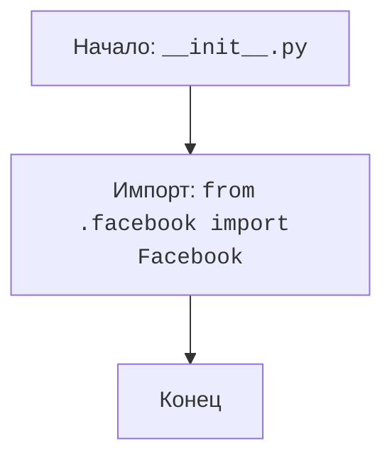

## АНАЛИЗ КОДА: `src/endpoints/advertisement/__init__.py`

### 1. <алгоритм>

1.  **Начало**: Запускается скрипт `__init__.py`.
2.  **Импорт:** Выполняется импорт модуля `Facebook` из локального пакета `src.endpoints.advertisement.facebook`.
3.  **Конец**: Скрипт завершает работу.

**Пример:**

Представим, что в файле `facebook.py` есть класс `FacebookAPI`. После импорта `from .facebook import Facebook` мы можем использовать этот класс в других частях проекта, например:

```python
from src.endpoints.advertisement import Facebook
facebook_api = Facebook.FacebookAPI() 
# и далее работать с facebook_api
```

**Поток данных:**

```
Начало --> Импорт модуля Facebook из facebook.py --> Конец
```

### 2. <mermaid>



**Описание зависимостей:**
- **Начало (Start)**: Начальная точка выполнения скрипта `__init__.py`.
- **Импорт (ImportFacebook)**: Импорт модуля `Facebook` из файла `facebook.py` в том же каталоге. Этот импорт делает доступным код из модуля `facebook` для использования в пакете `src.endpoints.advertisement`.
- **Конец (End)**: Конечная точка выполнения скрипта.

### 3. <объяснение>

**Импорты:**
- `from .facebook import Facebook`: Этот импорт импортирует модуль `Facebook` из файла `facebook.py`, который находится в той же директории.  Это позволяет использовать классы, функции и переменные, определенные в `facebook.py`, внутри пакета `advertisement`.

**Классы:**
- В данном файле нет определения классов, но предполагается, что модуль `Facebook`, импортированный из `facebook.py`,  может содержать классы для взаимодействия с Facebook API, например, класс `FacebookAPI`.

**Функции:**
- В данном файле нет функций.

**Переменные:**
- В данном файле нет переменных, за исключением импортированного модуля `Facebook`.

**Потенциальные ошибки и области для улучшения:**
-   В данном файле нет явных ошибок, так как он является файлом инициализации пакета.  
-   Возможные проблемы могут возникнуть в модуле `facebook.py`, который не показан в примере. Если модуль `facebook.py` не существует или содержит ошибки, импорт может не удаться.
-   Нужно добавить проверку существования и корректности `facebook.py`.

**Взаимосвязь с другими частями проекта:**
- Этот файл является точкой входа для пакета `advertisement`. Другие модули проекта могут импортировать пакет `advertisement` и использовать функционал, предоставляемый модулем `Facebook`, например для создания рекламы в Facebook.

**Цепочка взаимосвязей:**
1.  Другие модули в проекте (например, `src/services/advertisement_service.py` или `src/controllers/advertisement_controller.py`) могут использовать:
    ```python
    from src.endpoints.advertisement import Facebook
    ```
2.  Модуль `Facebook` предоставляет функциональность для взаимодействия с Facebook API (предположительно).
3.  Другие модули через `advertisement` используют этот функционал.

**Пример использования (гипотетический):**

В `src/services/advertisement_service.py`:

```python
from src.endpoints.advertisement import Facebook

class AdvertisementService:
    def __init__(self):
        self.facebook_api = Facebook.FacebookAPI()
    
    def create_facebook_ad(self, ad_data):
        # используем self.facebook_api для создания рекламы
        response = self.facebook_api.create_ad(ad_data)
        return response
```
Здесь класс `AdvertisementService` импортирует `Facebook` из  `src.endpoints.advertisement`, создаёт объект `FacebookAPI` и использует его для создания рекламного объявления.