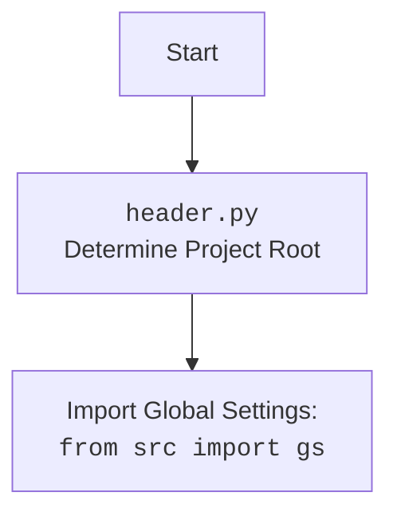

## Анализ кода `facebook_fields.py`

### <алгоритм>

1.  **Инициализация класса `FacebookFields`:**
    *   При создании объекта `FacebookFields` вызывается метод `__init__`.
    *   В `__init__` вызывается метод `_payload` для загрузки данных полей из JSON-файла.
2.  **Загрузка данных в `_payload`:**
    *   Определяется путь к файлу `facebook_feilds.json` с использованием `gs.path.src`, который, предположительно, является корнем проекта. Пример: `путь_к_проекту/src/advertisement/facebok/facebook_feilds.json`
    *   Используется функция `j_loads` для загрузки JSON-данных из файла.
    *   Проверяется, загружены ли данные успешно:
        *   Если данные не загружены (пустой словарь или `None`), в лог записывается сообщение об ошибке, и функция завершается.
        *   Если данные загружены, выполняется итерация по парам ключ-значение в JSON.
    *   Для каждой пары ключ-значение устанавливается атрибут объекта `FacebookFields` с именем ключа и значением из JSON. Например, если JSON содержит `{"campaign_name": "example_campaign"}`,  у объекта появится атрибут `self.campaign_name` со значением `"example_campaign"`.
    *   Метод `_payload` возвращает `True` после успешной загрузки и установки атрибутов.

### <mermaid>

```mermaid
flowchart TD
    Start[Start] --> Init[<code>__init__</code><br> Инициализация объекта <code>FacebookFields</code>]
    Init --> Payload[<code>_payload</code><br> Загрузка данных из JSON]
    Payload --> Path_Construction[Определение пути к файлу JSON:<br><code>Path(gs.path.src, 'advertisement', 'facebok', 'facebook_feilds.json')</code>]
    Path_Construction --> Load_JSON[Загрузка JSON-данных:<br><code>j_loads(file_path)</code>]
    Load_JSON --> Check_Data[Проверка загруженных данных]
    Check_Data -- "Данные не загружены" --> Log_Error[Логирование ошибки]
    Log_Error --> End[End]
    Check_Data -- "Данные загружены" --> Iterate_Data[Итерация по парам ключ-значение в JSON]
    Iterate_Data --> Set_Attribute[Установка атрибута объекта:<br><code>setattr(self, name, value)</code>]
    Set_Attribute -- "Еще данные"--> Iterate_Data
    Set_Attribute -- "Нет данных" --> Return_True[Возврат <code>True</code>]
    Return_True --> End

    classDef common fill:#f9f,stroke:#333,stroke-width:2px
    class Start, Init, Payload, Path_Construction, Load_JSON, Check_Data, Iterate_Data, Set_Attribute, Return_True, End common
     class Log_Error fill:#fcc,stroke:#333,stroke-width:2px
```



### <объяснение>

**Импорты:**

*   `from pathlib import Path`:
    *   Используется для работы с путями к файлам и директориям в операционной системе. Класс `Path` предоставляет объектно-ориентированный интерфейс для манипулирования путями.
*   `from src import gs`:
    *   Импортирует глобальные настройки проекта. Подразумевается, что `gs` (global settings) - это модуль или объект, который содержит глобальные переменные, константы и другие настройки проекта. В данном случае `gs.path.src` используется для определения корневого пути проекта, откуда осуществляется доступ к файлу JSON с полями.
*   `from src.utils.jjson import j_loads, j_loads_ns`:
    *   Импортирует функции `j_loads` и `j_loads_ns` из модуля `src.utils.jjson`. Скорее всего, `j_loads` это обертка над стандартной `json.loads` и используется для безопасной загрузки JSON-данных из файла. `j_loads_ns` вероятно делает тоже самое, но только для именного JSON (когда ключи могут быть недопустимыми именами переменных python).
*   `from src.logger.logger import logger`:
    *   Импортирует объект `logger` из модуля `src.logger.logger`. Используется для логирования сообщений об ошибках и отладочной информации.

**Класс `FacebookFields`:**

*   **Роль:** Предназначен для хранения и управления полями для объектов `объявлений` и `эвентов` Facebook. Представляет собой хранилище данных, загружаемых из JSON-файла.
*   **Атрибуты:** Класс не имеет явно определенных атрибутов на уровне инициализации, они создаются динамически из загруженного JSON.
*   **Методы:**
    *   `__init__(self)`:
        *   Конструктор класса. Инициализирует объект класса и вызывает метод `_payload`.
    *   `_payload(self)`:
        *   Приватный метод (на это указывает префикс `_`), который загружает JSON-данные из файла `facebook_feilds.json`.
        *   Определяет путь к файлу, используя `gs.path.src`.
        *   Использует `j_loads` для загрузки JSON.
        *   Проверяет, были ли данные загружены. Если нет, логирует ошибку и завершает работу метода.
        *   Итерируется по загруженному словарю и для каждой пары ключ-значение создает атрибут у текущего объекта `self` с именем ключа и значением значения.
        *   Возвращает `True` после успешной загрузки.

**Функции:**

*   `__init__`: Инициализация объекта, не принимает параметров, вызывает `self._payload`
*   `_payload`:
    *   **Аргументы:** `self` - ссылка на текущий объект.
    *   **Возвращаемое значение:** `True` при успешной загрузке и `None` при ошибке.
    *   **Назначение:** Загружает JSON-данные из файла и устанавливает атрибуты объекта.

**Переменные:**

*   `data`:
    *   **Тип:** Словарь.
    *   **Использование:** Хранит загруженные из JSON-файла данные.
*   `name`:
    *   **Тип:** Строка.
    *   **Использование:** Ключ из JSON-данных, используемый для создания имени атрибута объекта.
*   `value`:
    *   **Тип:** Любой тип данных, который хранится в JSON.
    *   **Использование:** Значение из JSON-данных, которое присваивается атрибуту объекта.
*   `self`:
    *   **Тип:** Объект класса `FacebookFields`.
    *   **Использование:** Ссылка на текущий объект класса. Используется для доступа к атрибутам и методам объекта.
*   `gs.path.src`:
    *   **Тип:** `Path`, строка.
    *   **Использование:** Используется для получения корневого пути проекта.
*   `Path(...)`:
    *   **Тип:** `Path`
    *   **Использование:** Объект пути к файлу
*   `file_path`:
    *   **Тип:** `Path`
    *   **Использование:** Полный путь к файлу, включая имя файла

**Потенциальные ошибки и области для улучшения:**

*   **Отсутствие файла `facebook_feilds.json`:** Если файл отсутствует, возникнет ошибка при вызове `j_loads`, но логгируется только ошибка загрузки данных, а не отсутствие файла.
*   **Неверный формат JSON:** Если файл содержит невалидный JSON, `j_loads` может выдать ошибку, не обработанную в коде.
*   **Зависимость от глобальных настроек `gs`**: Код полагается на объект `gs`, который должен быть определен и доступен.
*   **Отсутствие проверки типов данных:** Загруженные данные могут быть разных типов, и нет явной проверки на соответствие ожидаемым типам.
*   **Отсутствие обработки ошибок:** Не все возможные ошибки при загрузке JSON и установке атрибутов обработаны.
*   **Отсутствие тестирования**: Нет unit-тестов, которые подтверждают корректность работы кода.

**Цепочка взаимосвязей с другими частями проекта:**

1.  `src.endpoints.advertisement.facebook.facebook_fields.py`
2.  `src.utils.jjson` - предоставляет функциональность для загрузки JSON данных
3.  `src.logger.logger` - обеспечивает логирование ошибок и отладочной информации.
4.  `src.gs` - содержит глобальные настройки проекта.

Этот класс является частью системы управления рекламой на Facebook, и его основная задача - предоставлять удобный интерфейс для доступа к полям рекламных объявлений, извлекаемым из JSON-файла.