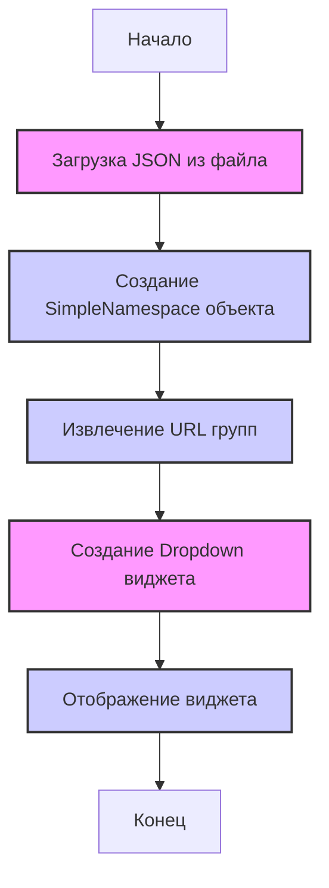
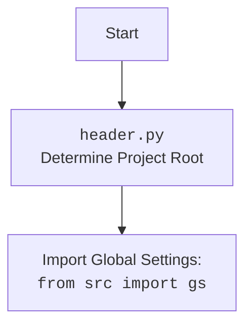

## АНАЛИЗ КОДА: `facebook_groups_widgets.py`

### 1. <алгоритм>

**Блок-схема:**

```mermaid
graph TD
    A[Начало: Инициализация `FacebookGroupsWidget`] --> B{Загрузка JSON-данных из `json_file_path`};
    B --> C[Создание `SimpleNamespace` объекта `groups_data`];
    C --> D[Вызов `create_dropdown()`];
    D --> E{Извлечение URL групп из `groups_data`};
    E --> F[Создание `Dropdown` виджета с URL-ами];
    F --> G[Возврат `Dropdown` виджета];
    G --> H{Присваивание `dropdown` виджета атрибуту объекта `self.dropdown`};
     H --> I[Вызов `display_widget()`];
     I --> J[Отображение `dropdown` виджета];
     J --> K[Конец];
```

**Примеры:**

1.  **Инициализация `FacebookGroupsWidget`:**

    ```python
    json_path = Path("path/to/your/groups.json")
    widget = FacebookGroupsWidget(json_path)
    ```

    *   `json_path`: Объект Path, указывающий на путь к JSON файлу.
    *   `widget`: Объект `FacebookGroupsWidget`, в котором происходит загрузка данных.
2.  **Загрузка JSON данных и создание `SimpleNamespace`:**

    Предположим, что JSON файл (`groups.json`) содержит:

    ```json
    {
      "group_url_1": { "name": "Group 1", "description": "Description 1" },
      "group_url_2": { "name": "Group 2", "description": "Description 2" }
    }
    ```

    В результате `self.groups_data` будет представлять `SimpleNamespace` объект, где атрибуты будут `group_url_1` и `group_url_2`.
3.  **Создание выпадающего списка:**
    В методе `create_dropdown()`,  ключи из `self.groups_data.__dict__.keys()` извлекаются (в данном случае 'group\_url\_1', 'group\_url\_2') и используются для создания выпадающего списка `Dropdown`.
4.  **Отображение выпадающего списка:**

    ```python
    widget.display_widget()
    ```

    Вызывает `display(self.dropdown)`, отображая виджет `Dropdown` в Jupyter Notebook или другом окружении, где поддерживается `ipywidgets`.

### 2. <mermaid>



**Анализ зависимостей:**

*   **`IPython.display`**: Используется для отображения виджетов. В диаграмме не отображается, так как это часть окружения, а не потока выполнения логики.
*   **`ipywidgets`**: Обеспечивает интерактивный выпадающий список (`Dropdown`). В диаграмме представлено как `CreateDropdown`, что отражает создание этого виджета.
*   **`src.utils.jjson`**: Используется для загрузки JSON из файла в виде `SimpleNamespace` (в `j_loads_ns`). Представлено в диаграмме как `LoadJson` и `CreateNameSpace`.
*   **`types.SimpleNamespace`**: Используется как структура данных для представления загруженных JSON данных. В диаграмме представлено как `CreateNameSpace`.
*   **`pathlib.Path`**: Используется для работы с путями к файлам. В диаграмме не отображается, так как это часть аргумента, но не логики.

**header.py (из `import header`):**



### 3. <объяснение>

**Импорты:**

*   **`import header`**: Импортирует файл `header.py`, который, предположительно, настраивает окружение проекта (определяет корневую директорию и загружает глобальные настройки).
*   **`from IPython.display import display`**: Импортирует функцию `display` из модуля `IPython.display`. Эта функция используется для отображения объектов (в данном случае, виджета `Dropdown`) в Jupyter Notebook или подобных средах.
*   **`from ipywidgets import Dropdown`**: Импортирует класс `Dropdown` из модуля `ipywidgets`. Класс `Dropdown` предоставляет интерактивный выпадающий список.
*   **`from src.utils.jjson import j_loads_ns`**: Импортирует функцию `j_loads_ns` из модуля `src.utils.jjson`. Эта функция, предположительно, загружает JSON файл и возвращает данные в виде объекта `SimpleNamespace`.
*   **`from types import SimpleNamespace`**: Импортирует класс `SimpleNamespace` из модуля `types`. `SimpleNamespace` предоставляет простой способ создавать объекты, у которых можно устанавливать произвольные атрибуты.
*   **`from pathlib import Path`**: Импортирует класс `Path` из модуля `pathlib`. Класс `Path` предоставляет удобный способ работать с путями к файлам и директориям.

**Класс `FacebookGroupsWidget`:**

*   **Роль**: Этот класс создает интерактивный виджет выпадающего списка, отображающего URL групп Facebook, полученных из JSON файла.
*   **Атрибуты**:
    *   `groups_data` (`SimpleNamespace`): Хранит данные о группах Facebook, загруженные из JSON файла.
    *   `dropdown` (`Dropdown`): Хранит виджет выпадающего списка.
*   **Методы**:
    *   `__init__(self, json_file_path: Path)`:
        *   **Аргументы**:
            *   `json_file_path` (`Path`): Путь к JSON файлу с данными о группах.
        *   **Назначение**: Инициализирует объект `FacebookGroupsWidget`, загружая данные из JSON файла с помощью `j_loads_ns` и создавая выпадающий список с помощью метода `create_dropdown()`.
    *   `create_dropdown(self) -> Dropdown`:
        *   **Аргументы**: Отсутствуют.
        *   **Возвращаемое значение**: Возвращает объект `Dropdown`.
        *   **Назначение**: Создает и настраивает виджет `Dropdown` с URL групп, извлеченных из `self.groups_data`.
    *   `display_widget(self)`:
        *   **Аргументы**: Отсутствуют.
        *   **Возвращаемое значение**: Отсутствует.
        *   **Назначение**: Отображает виджет `Dropdown` с помощью `display()`.

**Функции:**

*   `j_loads_ns`: Предположительно, функция `j_loads_ns`  загружает JSON данные из файла и возвращает их как `SimpleNamespace`. Использование `SimpleNamespace` позволяет получить доступ к полям JSON данных через атрибуты объекта, что делает код более читаемым.
*   `display`: Функция из `IPython.display`, которая отображает объект (в данном случае `Dropdown`) в Jupyter Notebook или аналогичной среде.
*   `Dropdown`: Класс `Dropdown` из `ipywidgets`, который представляет виджет выпадающего списка.

**Переменные:**

*   `json_file_path` (`Path`): Путь к JSON файлу.
*   `self.groups_data` (`SimpleNamespace`): Объект, содержащий данные о группах Facebook.
*   `group_urls` (`list`): Список URL групп Facebook, извлеченных из `self.groups_data`.
*   `dropdown` (`Dropdown`): Виджет выпадающего списка.

**Потенциальные ошибки и области для улучшения:**

*   **Обработка ошибок:** Код не обрабатывает ошибки, которые могут возникнуть при загрузке JSON файла (например, если файл не существует или имеет неверный формат).
*   **Проверка данных:** Код не выполняет проверку данных JSON (например, что ключи, которые являются URL-ами, действительно являются строками).
*   **Настройка `Dropdown`**: Можно добавить дополнительные параметры к `Dropdown`, такие как начальное значение, стилизация, обработчики событий.
*   **Логика переиспользования:** Код привязан к конкретной задаче отображения групп Facebook, переиспользование может быть затруднено. Можно сделать код более общим, передавая данные для виджета напрямую в метод `create_dropdown()`.
*   **Комментарии:** Код содержит мало комментариев, что затрудняет его понимание. Можно добавить docstring для каждого метода и класса.

**Цепочка взаимосвязей:**

1.  `header.py` → `src.endpoints.advertisement.facebook.facebook_groups_widgets.py`: `header.py` инициализирует глобальные настройки, необходимые для работы проекта, включая текущую директорию и конфигурационные параметры, которые могут быть использованы в  `facebook_groups_widgets.py`
2.  `src.utils.jjson.j_loads_ns` → `src.endpoints.advertisement.facebook.facebook_groups_widgets.py`: `j_loads_ns` предоставляет функциональность для загрузки JSON данных, что необходимо для работы виджета в `facebook_groups_widgets.py`.
3. `ipywidgets.Dropdown` → `src.endpoints.advertisement.facebook.facebook_groups_widgets.py`:   `Dropdown` является ключевой частью виджета для выбора групп.
4.  `IPython.display` → `src.endpoints.advertisement.facebook.facebook_groups_widgets.py`: `display` функция необходима для отображения виджета, созданного в `facebook_groups_widgets.py`.

Таким образом, `facebook_groups_widgets.py` зависит от ряда внешних модулей и файлов для загрузки данных, создания виджетов и их отображения.