## АНАЛИЗ КОДА: `src/endpoints/advertisement/facebook/promoter.py`

### 1. <алгоритм>

**1. `get_event_url(group_url: str) -> str`:**
   - **Вход:** URL группы Facebook (`group_url`).
   - **Обработка:**
     - Извлекает `group_id` из `group_url`. Например, если `group_url` = `https://www.facebook.com/groups/12345/`, то `group_id` будет `12345`.
     - Формирует базовый URL для создания события: `https://www.facebook.com/events/create/`.
     - Создает словарь `params` с необходимыми параметрами, включая `group_id`.
     - Кодирует параметры в строку запроса с помощью `urllib.parse.urlencode`.
   - **Выход:** Модифицированный URL для создания события, например: `https://www.facebook.com/events/create/?acontext=...&dialog_entry_point=group_events_tab&group_id=12345`.

**2. Класс `FacebookPromoter`:**
   - **Инициализация (`__init__`)**:
     - Принимает экземпляр `Driver` (для управления браузером), имя промоутера (`promoter`), пути к файлам групп (`group_file_paths`), и флаг `no_video` (отключать ли видео).
     - Инициализирует атрибуты класса и `spinning_cursor` для отображения анимации загрузки.
   - **Метод `promote(group: SimpleNamespace, item: SimpleNamespace, is_event: bool = False, language: str = None, currency: str = None) -> bool`:**
     - **Вход:** Данные группы (`group`), данные элемента для продвижения (`item`), флаг `is_event`, языковые и валютные настройки.
     - **Обработка:**
       - Проверяет совпадение языка и валюты, если они указаны.
       - Выбирает имя элемента (`item_name`) и текстовые данные (`ev_or_msg`) в зависимости от того, является ли `item` событием или сообщением.
       - Если это событие (`is_event` == `True`), устанавливает свойства `start`, `end`, `promotional_link` у `ev_or_msg` и вызывает `post_event`. В случае ошибки, логирует ее.
       - Если это сообщение (`is_event` == `False`), выбирает метод публикации: `post_ad` для промоутеров `kazarinov` и `emil`, иначе `post_message`.
       - Вызывает метод `update_group_promotion_data` для обновления информации о продвижении.
     - **Выход:** `True`, если продвижение прошло успешно, иначе `False`.
   - **Метод `log_promotion_error(is_event: bool, item_name: str)`:**
     - Логирует ошибку продвижения элемента.
   - **Метод `update_group_promotion_data(group: SimpleNamespace, item_name: str, is_event: bool = False)`:**
     - Обновляет данные группы, добавляя название продвинутого элемента в списки `promoted_events` или `promoted_categories`, а также время последнего продвижения.
   - **Метод `process_groups(campaign_name: str = None, events: list[SimpleNamespace] = None, is_event: bool = False, group_file_paths: list[str] = None, group_categories_to_adv: list[str] = ['sales'], language: str = None, currency: str = None)`:**
      - **Вход:** Название кампании (`campaign_name`), список событий (`events`), флаг `is_event`, пути к файлам групп, категории для продвижения, языковые и валютные настройки.
      - **Обработка:**
          - Итерирует по файлам групп (`group_file_paths`).
          - Загружает данные групп из JSON-файла.
          - Итерирует по группам, проверяя, нужно ли продвигать что-либо:
            - Пропускает группы, если не соблюдается интервал продвижения.
            - Пропускает группы, если их категории не пересекаются с `group_categories_to_adv` или статус не `active`.
            - Получает элемент для продвижения с помощью `get_category_item` или из списка `events`.
            - Пропускает группы, если элемент уже был продвинут.
            - Пропускает группы, если языковые и валютные настройки не совпадают.
            - Переходит на URL группы в браузере.
            - Вызывает метод `promote` для продвижения.
            - Обновляет данные группы в JSON-файле.
            - Задерживает выполнение на случайное время.
     - **Выход:**  `None`.
   - **Метод `get_category_item(self, campaign_name: str, group: SimpleNamespace, language: str, currency: str) -> SimpleNamespace`:**
     - **Вход:** Название кампании (`campaign_name`), данные группы (`group`), языковые и валютные настройки.
     - **Обработка:**
       - Если промоутер – `aliexpress`, вызывает `AliCampaignEditor` для получения категории из кампании.
       - Если промоутер не `aliexpress`, загружает данные рекламной кампании из JSON-файла и формирует элемент для продвижения.
       - Считывает описание из файла для каждой категории.
       -  Добавляет путь к картинке.
     - **Выход:** Объект `SimpleNamespace` с данными элемента для продвижения.
   - **Метод `check_interval(self, group: SimpleNamespace) -> bool`:**
     - Проверяет, прошло ли достаточно времени с момента последнего продвижения группы (реализация не показана, всегда возвращает `True`).
   - **Метод `validate_group(self, group: SimpleNamespace) -> bool`:**
     - Проверяет, что данные группы существуют и содержат нужные атрибуты (URL группы и категории).

```mermaid
flowchart TD
    subgraph FacebookPromoter
        Start[Start Promotion Process]
        Init[Initialize: <code>FacebookPromoter</code><br>Driver, promoter, group_file_paths, no_video]
        ProcessGroups[<code>process_groups</code><br>Iterate through group files]
        LoadGroupData[Load Group Data<br><code>j_loads_ns</code>]
        IterateGroups[Iterate through Groups]
        CheckInterval[<code>check_interval</code><br>Check promotion interval]
        CheckCategoryStatus[Check category and status]
        GetItem[<code>get_category_item</code> or Get Event]
        CheckItemPromoted[Check if item was promoted]
        LanguageCurrencyCheck[Check Language and Currency]
        GetUrl[<code>get_event_url</code> or group url]
        Promote[<code>promote</code><br>Post to Facebook]
        UpdateGroupData[<code>update_group_promotion_data</code><br>Update promoted categories]
        SaveGroupData[Save Group Data<br><code>j_dumps</code>]
        Sleep[Sleep Random Interval]
        End[End Promotion Process]
        LogPromotionError[<code>log_promotion_error</code>]
        
        Start --> Init
        Init --> ProcessGroups
        ProcessGroups --> LoadGroupData
        LoadGroupData --> IterateGroups
        IterateGroups --> CheckInterval
        CheckInterval --No--> IterateGroups
        CheckInterval --Yes--> CheckCategoryStatus
        CheckCategoryStatus --No--> IterateGroups
        CheckCategoryStatus --Yes--> GetItem
        GetItem --> CheckItemPromoted
        CheckItemPromoted --Yes--> IterateGroups
        CheckItemPromoted --No--> LanguageCurrencyCheck
        LanguageCurrencyCheck --No--> IterateGroups
        LanguageCurrencyCheck --Yes--> GetUrl
        GetUrl --> Promote
         Promote -- Error --> LogPromotionError
        Promote -- Success --> UpdateGroupData
         LogPromotionError --> IterateGroups
        UpdateGroupData --> SaveGroupData
        SaveGroupData --> Sleep
        Sleep --> IterateGroups
         IterateGroups -- End Groups --> ProcessGroups
        ProcessGroups -- End Files --> End
        
    end

    subgraph get_event_url
        StartEventUrl[Start <code>get_event_url</code>]
        ExtractGroupId[Extract <code>group_id</code>]
        CreateBaseUrl[Create Base URL]
        CreateParams[Create <code>params</code> dictionary]
        EncodeParams[Encode <code>params</code> to query string]
        ReturnUrl[Return Modified URL]
        
        StartEventUrl --> ExtractGroupId
        ExtractGroupId --> CreateBaseUrl
        CreateBaseUrl --> CreateParams
        CreateParams --> EncodeParams
        EncodeParams --> ReturnUrl
    end
    
    
   
    
  style FacebookPromoter fill:#f9f,stroke:#333,stroke-width:2px
   style get_event_url fill:#ccf,stroke:#333,stroke-width:2px
```

### 2. <mermaid>

**Объяснение `mermaid`:**

1.  **`FacebookPromoter`:**
    *   `Start`: Начало процесса продвижения.
    *   `Init`: Инициализация класса `FacebookPromoter` с необходимыми параметрами (экземпляр драйвера, имя промоутера, пути к файлам групп, флаг для отключения видео).
    *   `ProcessGroups`: Метод для обработки всех групп. Итерирует по файлам групп.
    *   `LoadGroupData`: Загрузка данных групп из JSON-файла.
    *   `IterateGroups`: Итерация по каждой группе внутри загруженных данных.
    *   `CheckInterval`: Проверка интервала, если прошло достаточно времени с последнего продвижения группы.
    *   `CheckCategoryStatus`: Проверка статуса и категорий группы.
    *   `GetItem`: Получение элемента для продвижения (`category` или `event`).
    *   `CheckItemPromoted`: Проверка, был ли уже продвинут данный элемент в группе.
    *  `LanguageCurrencyCheck`: Проверка на совпадение языковых и валютных настроек
    *   `GetUrl`: Получение URL группы или URL для создания события.
    *   `Promote`: Вызов метода `promote`, отправка поста в Facebook.
    *   `UpdateGroupData`: Обновление данных группы после успешного продвижения.
    *   `SaveGroupData`: Сохранение обновленных данных группы в JSON-файл.
     *   `LogPromotionError`: Логирование ошибки продвижения
    *  `Sleep`: Случайная задержка перед переходом к следующей группе
    *   `End`: Конец процесса продвижения.

2.  **`get_event_url`:**
    *   `StartEventUrl`: Начало функции `get_event_url`.
    *   `ExtractGroupId`: Извлечение `group_id` из URL группы.
    *   `CreateBaseUrl`: Создание базового URL для создания события.
    *   `CreateParams`: Создание словаря с необходимыми параметрами.
    *   `EncodeParams`: Кодирование параметров в строку запроса.
    *   `ReturnUrl`: Возврат модифицированного URL.

### 3. <объяснение>

**Импорты:**

-   `random`: Для генерации случайных чисел, используется для перемешивания списков и для задержки по времени.
-   `datetime, timedelta`: Для работы с датой и временем, используется для отслеживания времени последнего продвижения и для отметки времени
-   `pathlib.Path`: Для работы с путями к файлам и директориям.
-   `urllib.parse.urlencode`: Для кодирования параметров URL, используется в `get_event_url`.
-   `types.SimpleNamespace`: Для создания объектов с динамическими атрибутами.
-   `typing.Optional`: Для указания, что аргумент может быть `None`.
-   `src.gs`: Глобальные настройки проекта.
-   `src.endpoints.advertisement.facebook`: Пакет с модулями для работы с Facebook рекламой.
-   `src.webdriver.driver.Driver`: Класс для управления браузером.
-    `src.suppliers.aliexpress.campaign.AliCampaignEditor`: Класс для работы с кампаниями AliExpress.
-    `src.endpoints.advertisement.facebook.scenarios`: Функции-сценарии для публикации контента в Facebook
-   `src.utils.file_async`: Асинхронные утилиты для работы с файлами.
-   `src.utils.jjson`: Утилиты для работы с JSON.
-   `src.utils.cursor_spinner`: Для создания анимации загрузки в консоли.
-   `src.logger.logger`: Для логирования.

**Классы:**

-   `FacebookPromoter`:
    -   **`d: Driver`**: Экземпляр драйвера для браузера, используется для взаимодействия с Facebook.
    -   **`group_file_paths: str | Path`**: Пути к файлам с информацией о группах.
    -   **`no_video: bool`**: Флаг для отключения видео в постах.
    -   **`promoter: str`**: Имя промоутера (например, `'aliexpress'`, `'kazarinov'`).
    -   `__init__(self, d: Driver, promoter: str, group_file_paths: Optional[list[str | Path] | str | Path] = None, no_video: bool = False)`: Конструктор класса.
    -   `promote(self, group: SimpleNamespace, item: SimpleNamespace, is_event: bool = False, language: str = None, currency: str = None) -> bool`: Метод для продвижения элемента в группе.
    -   `log_promotion_error(self, is_event: bool, item_name: str)`: Метод для логирования ошибок при продвижении.
    -   `update_group_promotion_data(self, group: SimpleNamespace, item_name: str, is_event: bool = False)`: Метод для обновления информации о продвижении в данных группы.
    -   `process_groups(self, campaign_name: str = None, events: list[SimpleNamespace] = None, is_event: bool = False, group_file_paths: list[str] = None, group_categories_to_adv: list[str] = ['sales'], language: str = None, currency: str = None)`: Метод для обработки групп и продвижения элементов.
    -   `get_category_item(self, campaign_name: str, group: SimpleNamespace, language: str, currency: str) -> SimpleNamespace`: Метод для получения элемента (категории) для продвижения.
    -    `check_interval(self, group: SimpleNamespace) -> bool`: Метод для проверки интервала перед продвижением в группе (реализация не показана).
    -   `validate_group(self, group: SimpleNamespace) -> bool`: Метод для проверки корректности данных группы.

**Функции:**

-   `get_event_url(group_url: str) -> str`:
    -   **Аргументы:** `group_url` - URL группы Facebook.
    -   **Возвращаемое значение:** Модифицированный URL для создания события.
    -   **Назначение:** Создает URL для создания события в Facebook группе на основе URL группы.

**Переменные:**

-   Переменные внутри методов и классов:
    -   `d`, `group_file_paths`, `no_video`, `promoter` – атрибуты класса `FacebookPromoter`.
    -   `group`, `item`, `is_event`, `language`, `currency` – параметры метода `promote`.
    -   `campaign_name`, `events`, `group_file_paths`, `group_categories_to_adv`, `language`, `currency` - параметры метода `process_groups`.
-   Переменные внутри функций:
    -   `group_id`, `base_url`, `params`, `query_string` – переменные внутри функции `get_event_url`.

**Потенциальные ошибки и области для улучшения:**

1.  **Обработка ошибок:** В коде есть логирование ошибок, но не все операции (например, чтение файлов, запросы к API) обернуты в блоки `try-except`. Необходимо добавить обработку исключений для большей надежности.
2.  **Управление интервалами:** Метод `check_interval` всегда возвращает `True`, что делает проверку бесполезной. Требуется реализация механизма отслеживания времени между продвижениями.
3.  **Асинхронность:**  Использование `asyncio` для работы с браузером, поскольку `src.webdriver.driver.Driver` может это поддерживать.
4.  **Улучшение логики выбора элементов:** Выбор элементов для продвижения (`get_category_item`) можно сделать более гибким, например, добавив фильтрацию, ранжирование и т.д.
5.  **Читаемость кода:**  Некоторые блоки кода можно разбить на более мелкие функции для повышения читаемости.
6. **Отсутствие документации:** В коде мало комментариев для переменных, в целом требуется добавление `docstring` для функций и классов.

**Цепочка взаимосвязей:**

-   `FacebookPromoter` зависит от `src.webdriver.driver.Driver` для управления браузером, от `src.suppliers.aliexpress.campaign.AliCampaignEditor` для работы с AliExpress, от `src.utils.jjson` для работы с JSON, от `src.utils.file_async` для работы с файлами, от `src.logger.logger` для логирования, от `src.endpoints.advertisement.facebook.scenarios` для публикации контента.
-   `get_event_url` использует `urllib.parse.urlencode` для кодирования URL.
-   `FacebookPromoter` использует `src.gs` для доступа к глобальным настройкам проекта.
-   `AliCampaignEditor` взаимодействует с API AliExpress.

Таким образом, код представляет собой фреймворк для автоматизированного продвижения контента в Facebook группах с использованием различных источников и стратегий.