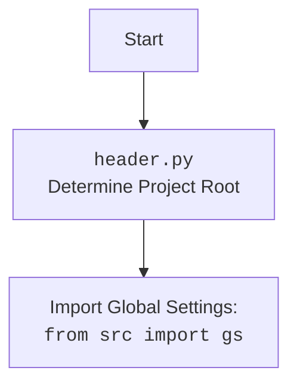

## АНАЛИЗ КОДА: `hypotez/src/endpoints/advertisement/facebook/scenarios/login.py`

### <алгоритм>

1.  **Загрузка локаторов:**
    *   Загрузка данных (JSON) с локаторами веб-элементов Facebook из файла `login.json` в переменную `locators`.
    *   Пример:
        ```json
        // Файл login.json
        {
          "email": {"by": "id", "value": "email"},
          "password": {"by": "id", "value": "pass"},
          "button": {"by": "name", "value": "login"}
        }
        ```
    *   Проверка загруженных локаторов на существование, при отсутствии - запись в лог ошибки.

2.  **Функция `login(d: Driver)`:**
    *   Получение учетных данных Facebook из глобальных настроек `gs.facebook_credentials[0]`.
    *   **Ввод логина:**
        *   Использует `d.send_key_to_webelement()` для ввода логина (username) в поле, найденное по локатору `locators.email`.
        *   Пример: `d.send_key_to_webelement({"by": "id", "value": "email"}, "my_email@example.com")`
        *   Обработка исключений: В случае ошибки логирование и возврат `False`.
    *   Ожидание 1.3 секунды.
    *   **Ввод пароля:**
        *   Использует `d.send_key_to_webelement()` для ввода пароля в поле, найденное по локатору `locators['password']`.
        *   Пример: `d.send_key_to_webelement({"by": "id", "value": "pass"}, "my_password")`
        *   Обработка исключений: В случае ошибки логирование и возврат `False`.
    *   Ожидание 0.5 секунды.
    *   **Нажатие кнопки входа:**
        *   Использует `d.execute_locator()` для нажатия на кнопку входа, найденную по локатору `locators['button']`.
        *   Пример: `d.execute_locator({"by": "name", "value": "login"})`
        *   Обработка исключений: В случае ошибки логирование и возврат `False`.
    *   Возврат `True`, если все шаги прошли успешно.

### <mermaid>

```mermaid
flowchart TD
    Start[Start] --> LoadLocators[Load Locators from login.json]
    LoadLocators -- Locators loaded --> CheckLocators[Check if locators are valid]
    CheckLocators -- Locators are valid --> GetCredentials[Get Facebook Credentials]
    CheckLocators -- Locators are invalid --> LogError[Log error message]
    LogError --> Stop[Stop]
    GetCredentials --> InputEmail[Input email]
    InputEmail -- Email input success --> Wait1_3[Wait 1.3 seconds]
    InputEmail -- Email input failure --> LogErrorEmail[Log error message "Invalid login email"]
    LogErrorEmail --> Stop
    Wait1_3 --> InputPassword[Input password]
    InputPassword -- Password input success --> Wait0_5[Wait 0.5 seconds]
    InputPassword -- Password input failure --> LogErrorPassword[Log error message "Invalid login password"]
    LogErrorPassword --> Stop
    Wait0_5 --> ClickButton[Click Login button]
    ClickButton -- Button click success --> Success[Login successful: return True]
    ClickButton -- Button click failure --> LogErrorButton[Log error message "Invalid login button"]
    LogErrorButton --> Stop
    Success --> Stop

    style Start fill:#f9f,stroke:#333,stroke-width:2px
    style Stop fill:#f9f,stroke:#333,stroke-width:2px
```
**Диаграмма `mermaid`:**

*   `Start`: Начало выполнения сценария.
*   `LoadLocators`: Загрузка локаторов веб-элементов из файла `login.json`.
*   `CheckLocators`: Проверка, загружены ли локаторы. В случае ошибки -  запись в лог ошибки.
*   `GetCredentials`: Получение учетных данных (логин и пароль) Facebook из глобальных настроек.
*   `InputEmail`: Ввод логина в соответствующее поле, используя локатор.
*   `Wait1_3`: Ожидание 1.3 секунды.
*   `InputPassword`: Ввод пароля в соответствующее поле, используя локатор.
*   `Wait0_5`: Ожидание 0.5 секунды.
*   `ClickButton`: Нажатие кнопки "Войти" с использованием соответствующего локатора.
*  `LogErrorEmail`, `LogErrorPassword`, `LogErrorButton`: Логирование ошибок, если ввод данных или нажатие кнопки не удалось.
*   `Success`: Сценарий завершен успешно, вход выполнен (возвращает `True`).
*   `Stop`: Конец выполнения сценария, возвращается `False`.

Импорты и их зависимости:

*   `pathlib.Path`: Используется для работы с путями к файлам, в частности для указания пути к файлу с локаторами.
*   `typing.Dict`: Используется для аннотации типов, в данном случае в коде не используется, но может быть полезна при расширении функционала.
*   `src.gs`: Импортирует глобальные настройки приложения из `src.gs`, которые могут содержать учетные данные и другие параметры. Зависит от глобальных настроек проекта.
*   `src.webdriver.driver.Driver`: Импортирует класс `Driver` из модуля `src.webdriver.driver`, используемый для взаимодействия с веб-браузером. Зависит от webdriver.
*   `src.utils.jjson`: Импортирует функции `j_loads`, `j_loads_ns`, и `j_dumps` из модуля `src.utils.jjson`, используемые для работы с JSON-файлами. Зависит от утилит JSON.
*   `src.logger.logger`: Импортирует модуль `logger` из `src.logger.logger` для логирования событий и ошибок. Зависит от модуля логирования.


### <объяснение>

**Импорты:**

*   `from pathlib import Path`: `Path` используется для создания и манипулирования путями к файлам, что упрощает работу с файловой системой. В данном коде используется для формирования пути к файлу с локаторами `login.json`.
*   `from typing import Dict`: Импортирует тип `Dict` для аннотации типов. В текущем коде не используется, но может быть полезен для расширения функционала и определения типов переменных (например, для локаторов), если понадобится.
*   `from src import gs`: Импортирует модуль `gs` (global settings) из пакета `src`. `gs` содержит глобальные настройки приложения, в том числе учетные данные Facebook. Это обеспечивает доступ к параметрам конфигурации из любого места программы.
*   `from src.webdriver.driver import Driver`: Импортирует класс `Driver` из модуля `src.webdriver.driver`. Класс `Driver` предоставляет методы для управления браузером и веб-элементами (отправка текста, нажатия кнопок и пр.). Зависит от функциональности работы с браузером.
*   `from src.utils.jjson import j_loads, j_loads_ns, j_dumps`: Импортирует функции `j_loads`, `j_loads_ns`, `j_dumps` для работы с JSON файлами (загрузка данных).
    *   `j_loads` - загрузка JSON в словарь;
    *  `j_loads_ns` - загрузка JSON в структуру с доступом по атрибутам (namespace).
    *  `j_dumps` - сохранение данных в json.
*   `from src.logger.logger import logger`: Импортирует модуль `logger` для ведения логов. Он используется для записи информации об ошибках, событиях и других значимых моментах работы приложения.

**Функция `login(d: Driver)`:**

*   **Аргументы:**
    *   `d: Driver`: Экземпляр класса `Driver`, представляющий собой драйвер браузера для взаимодействия с веб-страницами.
*   **Возвращаемое значение:**
    *   `bool`: Возвращает `True`, если вход выполнен успешно, иначе `False`.
*   **Назначение:**
    *   Выполняет авторизацию пользователя на Facebook.
    *   Берет логин и пароль из `gs.facebook_credentials[0]` и передает в соответствующие поля на странице авторизации.
    *   Нажимает кнопку входа.
    *   Обрабатывает исключения при вводе данных и нажатии кнопки.
*   **Пример использования:**
    ```python
    from src.webdriver.driver import Driver
    from src.endpoints.advertisement.facebook.scenarios.login import login

    # Создаем экземпляр драйвера
    driver = Driver()
    driver.get("https://www.facebook.com/") # Открываем Facebook

    # Вызываем функцию авторизации
    if login(driver):
        print("Успешная авторизация!")
    else:
        print("Ошибка при авторизации.")

    driver.quit() # Закрываем браузер
    ```
**Переменные:**

*   `locators`: Переменная, хранящая локаторы веб-элементов Facebook, загруженные из JSON файла. Тип:  `Namespace` (результат работы `j_loads_ns`).
*   `credentials`: Переменная, хранящая учетные данные Facebook, полученные из `gs.facebook_credentials[0]`. Тип: `Namespace` (результат работы `j_loads_ns`).
*   `d`: Экземпляр класса `Driver`.

**Потенциальные ошибки и области для улучшения:**

*   **Жестко заданные индексы**: `gs.facebook_credentials[0]` -  использование `[0]` предполагает, что всегда будет браться первая запись, если их несколько. Лучше сделать логику выбора учетной записи.
*   **Обработка исключений**: Обработка исключений общая, не конкретизирована. Лучше обрабатывать `NoSuchElementException`, `TimeoutException` и прочие более конкретно.
*   **Ожидания**: Использование жестких ожиданий (wait) может быть неэффективным. Лучше использовать "явные" ожидания.
*   **Использование `...`**:  При ошибке загрузки локаторов происходит запись в лог и остановка с помощью многоточия. Лучше генерировать исключение, чтобы было понятно, что это критическая ошибка.
*   **Отсутствие явных типов**: Добавление `typing` для аннотации типов переменных и функций улучшит читаемость и проверку кода.

**Взаимосвязи с другими частями проекта:**

*   `src.webdriver.driver.Driver`:  Класс `Driver` является важной частью модуля для управления браузером. Этот файл зависит от этого модуля для выполнения действий на странице.
*   `src.gs`: Модуль зависит от глобальных настроек, где хранятся учетные данные и другие настройки.
*   `src.utils.jjson`: Модуль зависит от утилит для работы с JSON.
*   `src.logger.logger`: Модуль логирования, важная часть общего функционала приложения для отслеживания ошибок и событий.