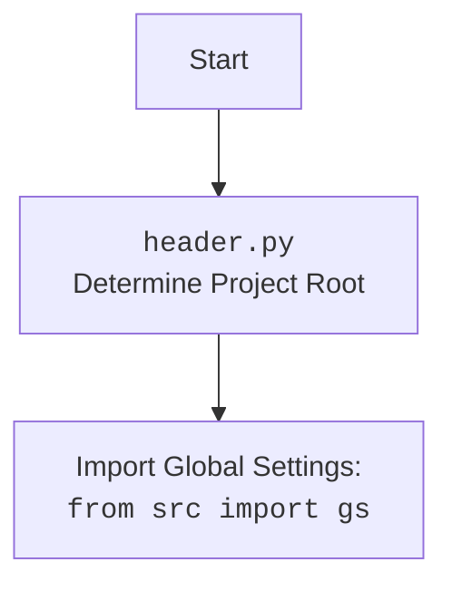

## ИНСТРУКЦИЯ:

Анализируй предоставленный код подробно и объясни его функциональность. Ответ должен включать три раздела:

1.  **<алгоритм>**: Опиши рабочий процесс в виде пошаговой блок-схемы, включая примеры для каждого логического блока, и проиллюстрируй поток данных между функциями, классами или методами.
2.  **<mermaid>**: Напиши код для диаграммы в формате `mermaid`, проанализируй и объясни все зависимости,
    которые импортируются при создании диаграммы.
    **ВАЖНО!** Убедитесь, что все имена переменных, используемые в диаграмме `mermaid`,
    имеют осмысленные и описательные имена. Имена переменных вроде `A`, `B`, `C`, и т.д., не допускаются!

    **Дополнительно**: Если в коде есть импорт `import header`, добавьте блок `mermaid` flowchart, объясняющий `header.py`:
    ```mermaid
    flowchart TD
        Start --> Header[<code>header.py</code><br> Determine Project Root]

        Header --> import[Import Global Settings: <br><code>from src import gs</code>]
    ```

3.  **<объяснение>**: Предоставьте подробные объяснения:
    - **Импорты**: Их назначение и взаимосвязь с другими пакетами `src.`.
    - **Классы**: Их роль, атрибуты, методы и взаимодействие с другими компонентами проекта.
    - **Функции**: Их аргументы, возвращаемые значения, назначение и примеры.
    - **Переменные**: Их типы и использование.
    - Выделите потенциальные ошибки или области для улучшения.

Дополнительно, постройте цепочку взаимосвязей с другими частями проекта (если применимо).

Это обеспечивает всесторонний и структурированный анализ кода.
## Формат ответа: `.md` (markdown)
**КОНЕЦ ИНСТРУКЦИИ**

## <алгоритм>
```mermaid
graph TD
    A[Начало: `promote_post`] --> B{Вызов: `post_title`};
    B -- Успешно --> C{Ожидание: 0.5с};
    B -- Неуспешно --> Z[Конец: `promote_post` (False)];
    C --> D{Вызов: `upload_media`};
    D -- Успешно --> E{Вызов: `d.execute_locator(locator.finish_editing_button)`};
    D -- Неуспешно --> Z;
    E -- Успешно --> F{Вызов: `d.execute_locator(locator.publish)`};
    E -- Неуспешно --> Z;
    F -- Успешно --> G[Конец: `promote_post` (True)];
    F -- Неуспешно --> Z;
    
    subgraph "post_title"
        B --> B1{Прокрутка страницы назад};
        B1 -- Успешно --> B2{Открытие окна добавления поста};
        B1 -- Неуспешно --> B3[Конец: `post_title` (False)];
        B2 -- Успешно --> B4{Формирование сообщения};
        B2 -- Неуспешно --> B3;
        B4 --> B5{Добавление сообщения в поле};
        B5 -- Успешно --> B6[Конец: `post_title` (True)];
        B5 -- Неуспешно --> B3;
    end
    
    subgraph "upload_media"
        D --> D1{Открытие формы добавления медиа};
        D1 -- Успешно --> D2{Ожидание: 0.5с};
         D1 -- Неуспешно --> D5[Конец: `upload_media` (False)];
        D2 --> D3{Итерация по продуктам};
          D3 -- Есть продукты --> D4{Загрузка медиа};
          D3 -- Нет продуктов --> D5;
          D4 -- Успешно --> D2
        D4 -- Неуспешно --> D5;
        D2 --> D6{Открытие формы редактирования};
          D6 -- Успешно --> D7{Получение кадра загруженного медиа};
           D6 -- Неуспешно --> D5
          D7 --> D8{Ожидание 0.3с};
        D8 --> D9{Получение списка текстовых полей};
           D9 -- Успешно --> D10{Вызов: `update_images_captions`};
            D9 -- Неуспешно --> D5
        D10 --> D11[Конец: `upload_media` (True)];
    end
    
    subgraph "update_images_captions"
        D10 --> U1{Загрузка локальных настроек};
        U1 --> U2{Цикл по продуктам};
        U2 -- Есть продукты --> U3{Вызов: `handle_product` в отдельном потоке};
        U2 -- Нет продуктов --> U4[Конец: `update_images_captions`];
         U3 --> U2;
    end
     subgraph "handle_product"
        U3 --> H1{Определение направления текста};
        H1 --> H2{Генерация сообщения};
         H2 --> H3{Отправка сообщения в textarea};
        H3 -- Успешно --> H4[Конец: `handle_product` (True)];
        H3 -- Неуспешно --> H5[Конец: `handle_product` (False)];
        
    end

    style A fill:#f9f,stroke:#333,stroke-width:2px
    style Z fill:#f9f,stroke:#333,stroke-width:2px
```
### Пояснения к блок-схеме
**1. `promote_post` (Главная функция):**
- Начинает процесс публикации, вызывая `post_title` для установки заголовка и описания.
- Если `post_title` возвращает `False`, завершает работу.
- Вызывает `upload_media` для загрузки медиафайлов.
- Если `upload_media` возвращает `False`, завершает работу.
- Вызывает `d.execute_locator(locator.finish_editing_button)` и `d.execute_locator(locator.publish)` для завершения публикации.
- Завершает работу, возвращая `True` в случае успеха, `False` в случае неудачи.

**2. `post_title`:**
   - Прокручивает страницу назад.
   - Открывает окно добавления поста, используя `d.execute_locator(locator.open_add_post_box)`.
    - Если не удается открыть окно, завершает работу с ошибкой.
   - Формирует сообщение, используя `category.title` и `category.description`.
   - Добавляет сообщение в текстовое поле, используя `d.execute_locator(locator.add_message, message)`.
   - Возвращает `True` при успешном добавлении, `None` при неудаче.

**3. `upload_media`:**
   - Открывает форму добавления медиа, используя `d.execute_locator(locator.open_add_foto_video_form)`.
    - Если форма не открыта, завершает работу.
   - Итерируется по списку продуктов:
     - Определяет путь к медиафайлу (видео или изображению).
     - Загружает медиафайл, используя `d.execute_locator(locator.foto_video_input, media_path)`.
        - Если загрузка не удалась, завершает работу.
   - Открывает форму редактирования загруженного медиа, используя `d.execute_locator(locator.edit_uloaded_media_button)`.
        - Если не удается открыть форму, завершает работу
   - Получает кадр загруженного медиа, ожидает.
   - Получает список текстовых полей для подписей.
   - Вызывает асинхронно `update_images_captions` для добавления подписей.
   - Возвращает `True` при успешной загрузке и редактировании медиа, `None` при неудаче.

**4. `update_images_captions`:**
   - Загружает JSON с переводами из файла `translations.json`.
   - Итерируется по списку продуктов и вызывает для каждого `handle_product` в отдельном потоке.

**5. `handle_product`:**
   - Определяет направление текста (слева направо или справа налево).
   - Генерирует сообщение с информацией о продукте, используя данные из `product` (название, цена, скидка, и т. д.) и переводы из локальных настроек.
   - Отправляет сообщение в соответствующее текстовое поле.
   - Возвращает `True` если удалось отправить текст, `None` при неудаче.

## <mermaid>
```mermaid
flowchart TD
    Start(Start) --> ImportModules[Импорт модулей];
    ImportModules --> LoadLocators[Загрузка локаторов: `locator`];
    LoadLocators --> PostTitleFunction[Определение функции: `post_title`];
    PostTitleFunction --> UploadMediaFunction[Определение функции: `upload_media`];
    UploadMediaFunction --> UpdateImagesCaptionsFunction[Определение функции: `update_images_captions`];
    UpdateImagesCaptionsFunction --> PromotePostFunction[Определение функции: `promote_post`];
   
    PromotePostFunction --> PostTitleCall[Вызов `post_title`];
    PostTitleCall --> UploadMediaCall{Вызов `upload_media`};
    UploadMediaCall -- Успешно --> FinishEditing[Вызов `d.execute_locator(locator.finish_editing_button)`];
    UploadMediaCall -- Неуспешно --> End[Конец];

    FinishEditing -- Успешно --> PublishPost[Вызов `d.execute_locator(locator.publish)`];
    FinishEditing -- Неуспешно --> End;
    PublishPost -- Успешно --> End;
      PublishPost -- Неуспешно --> End;

  subgraph post_title
        PostTitleCall --> ScrollPage[Прокрутка страницы];
        ScrollPage --> OpenPostBox[Открытие окна добавления поста];
        OpenPostBox --> ConstructMessage[Формирование сообщения];
        ConstructMessage --> AddMessageToBox[Добавление сообщения в поле];
  end
  subgraph upload_media
       UploadMediaCall --> OpenMediaForm[Открытие формы добавления медиа];
        OpenMediaForm --> IterateProducts[Цикл по продуктам];
       IterateProducts --> UploadMediaFile[Загрузка медиафайла];
        UploadMediaFile --> OpenEditForm[Открытие формы редактирования];
       OpenEditForm--> GetMediaFrame[Получение кадра загруженного медиа];
        GetMediaFrame --> GetTextAreas[Получение списка текстовых полей];
        GetTextAreas --> UpdateCaptionsCall[Вызов `update_images_captions`];
  end
 subgraph update_images_captions
  UpdateCaptionsCall--> LoadTranslations[Загрузка переводов];
  LoadTranslations --> IterateProductsCaptions[Цикл по продуктам для подписей];
 IterateProductsCaptions --> HandleProductCall[Вызов `handle_product` в отдельном потоке];
end
subgraph handle_product
  HandleProductCall --> DetermineTextDirection[Определение направления текста];
  DetermineTextDirection --> GenerateMessage[Генерация сообщения];
  GenerateMessage --> SendMessageToTextArea[Отправка сообщения в текстовое поле];

end

    style Start fill:#f9f,stroke:#333,stroke-width:2px
        style End fill:#f9f,stroke:#333,stroke-width:2px
```
### Пояснения к `mermaid` диаграмме:

**Импорты (ImportModules)**:

*   `time`: используется для ожидания между действиями.
*   `asyncio`: используется для асинхронного программирования.
*   `pathlib.Path`: используется для работы с путями к файлам.
*   `types.SimpleNamespace`: используется для создания объектов с атрибутами, доступными через точку.
*   `typing.Dict`, `typing.List`: используются для аннотации типов.
*   `selenium.webdriver.remote.webelement.WebElement`: используется для взаимодействия с элементами на веб-странице.
*   `src.gs`: глобальные настройки проекта.
*   `src.webdriver.driver.Driver`: класс для управления браузером.
*  `src.utils.jjson.j_loads_ns`, `src.utils.jjson.pprint`: для работы с JSON файлами.
* `src.logger.logger.logger`: для логирования.

**Зависимости и классы:**

*   **`locator`**: Объект `SimpleNamespace`, содержащий локаторы элементов веб-страницы, загружаемый из JSON-файла.
*   **`Driver`**: Класс для управления браузером (`src.webdriver.driver`).
*   **`gs`**: Глобальные настройки проекта (`src`).
*   `SimpleNamespace`:  используется для передачи данных между функциями, например, для параметров продуктов, категорий и локализаций.

**Функции:**

*   **`post_title(d: Driver, category: SimpleNamespace) -> bool`**:
    *   Принимает экземпляр `Driver` и `SimpleNamespace` с данными категории.
    *   Прокручивает страницу назад.
    *   Открывает окно добавления поста и заполняет его заголовком и описанием из `category`.
    *   Возвращает `True` в случае успеха, `None` в случае ошибки.
*  **`upload_media(d: Driver, products: List[SimpleNamespace], no_video:bool = False) -> bool`**:
    *   Принимает экземпляр `Driver` и список `SimpleNamespace` с данными о продуктах.
    *   Открывает форму добавления медиа и загружает медиафайлы (видео или изображения).
    *   Обновляет подписи к загруженным медиафайлам, вызывая `update_images_captions`.
    *   Возвращает `True` в случае успеха, `None` в случае ошибки.
*   **`update_images_captions(d: Driver, products: List[SimpleNamespace], textarea_list: List[WebElement]) -> None`**:
    *   Принимает экземпляр `Driver`, список `SimpleNamespace` с данными о продуктах, и список текстовых полей `WebElement`.
    *   Загружает локализованные строки из `translations.json`.
    *   Асинхронно обновляет подписи к медиафайлам, вызывая `handle_product` для каждого продукта.
*  **`promote_post(d: Driver, category: SimpleNamespace, products: List[SimpleNamespace], no_video:bool = False) -> bool`**:
    *   Принимает экземпляр `Driver`, `SimpleNamespace` с данными категории и список `SimpleNamespace` с данными о продуктах.
    *   Вызывает `post_title` для заполнения заголовка и описания.
    *   Вызывает `upload_media` для загрузки медиафайлов.
    *   Нажимает кнопки "завершить редактирование" и "публиковать".
    *   Возвращает `True` в случае успеха, `None` в случае ошибки.
* **`handle_product(product: SimpleNamespace, textarea_list: List[WebElement], i: int) -> None`**:
     * Принимает `SimpleNamespace` с данными о продукте, список текстовых полей `WebElement` и индекс элемента.
     * Формирует строку сообщения, используя данные из `product` и переводы из локализованных строк.
     * Отправляет строку сообщения в соответствующее текстовое поле.

**Переменные:**

*   `locator`: Объект `SimpleNamespace`, содержащий локаторы элементов веб-страницы.
*   `d`: Экземпляр класса `Driver` для управления браузером.
*   `category`: Объект `SimpleNamespace`, содержащий данные о категории (заголовок, описание).
*   `products`: Список объектов `SimpleNamespace`, содержащих данные о продуктах (пути к медиа, цены, скидки).
*   `message`: Строка, содержащая текст сообщения для публикации.
*  `local_units`: Объект `SimpleNamespace` с переводами.
* `textarea_list`: Список `WebElement`, представляющий текстовые поля для ввода подписей.

## <объяснение>

### Импорты:

*   `time`: Используется для добавления пауз между действиями, например, `time.sleep(1)`.
*   `asyncio`: Используется для написания асинхронного кода, что позволяет выполнять параллельные операции.
*   `pathlib.Path`: Упрощает работу с путями к файлам и каталогам.
*   `types.SimpleNamespace`: Создает простые объекты с атрибутами, к которым можно обращаться через точку. Удобно для передачи данных.
*   `typing.Dict`, `typing.List`: Используются для аннотации типов, улучшая читаемость и предотвращая ошибки.
*   `selenium.webdriver.remote.webelement.WebElement`: Представляет элемент на веб-странице, с которым можно взаимодействовать (например, текстовое поле, кнопка).
*   `src.gs`:  Импортирует глобальные настройки проекта, используется для получения доступа к общим путям и другим настройкам.
*   `src.webdriver.driver.Driver`:  Импортирует класс `Driver`, который является оберткой над Selenium WebDriver и предоставляет методы для взаимодействия с браузером.
*   `src.utils.jjson.j_loads_ns`: Импортирует функцию `j_loads_ns` для загрузки JSON файлов в виде `SimpleNamespace`.
*   `src.utils.jjson.pprint`: Импортирует функцию `pprint` для красивого вывода данных в консоль.
*   `src.logger.logger.logger`: Импортирует логгер для записи сообщений о событиях и ошибках.

### Классы:

*   `Driver`:
    *   **Роль**: Класс для управления браузером, основанный на Selenium WebDriver.
    *   **Атрибуты**: Содержит экземпляр веб-драйвера.
    *   **Методы**:
        *   `execute_locator(locator, *args)`: Находит и выполняет действия с элементами на странице по локатору.
        *   `scroll(direction, pixels)`: Выполняет прокрутку страницы.
        *    `wait(seconds)`: Приостанавливает выполнение на заданное количество секунд.
    *   **Взаимодействие**: Используется в функциях `post_title`, `upload_media`, `update_images_captions` и `promote_post` для взаимодействия с браузером.

### Функции:

*   **`post_title(d: Driver, category: SimpleNamespace) -> bool`**:
    *   **Аргументы**:
        *   `d`: Экземпляр класса `Driver`.
        *   `category`: Объект `SimpleNamespace`, содержащий `title` и `description`.
    *   **Возвращаемое значение**: `True`, если заголовок и описание успешно отправлены, в противном случае `None`.
    *   **Назначение**: Отправляет заголовок и описание в поле сообщения.
    *   **Примеры**:
        ```python
        driver = Driver(...)
        category = SimpleNamespace(title="Заголовок", description="Описание")
        post_title(driver, category) # Возвращает True или None
        ```
*   **`upload_media(d: Driver, products: List[SimpleNamespace], no_video:bool = False) -> bool`**:
    *   **Аргументы**:
        *   `d`: Экземпляр класса `Driver`.
        *   `products`: Список `SimpleNamespace`, содержащих пути к медиафайлам (`local_image_path` или `local_video_path`).
        * `no_video`: Флаг, указывающий, что видео не нужно загружать.
    *   **Возвращаемое значение**: `True`, если медиафайлы успешно загружены, в противном случае `None`.
    *   **Назначение**: Загружает медиафайлы (изображения и/или видео) на страницу.
    *   **Примеры**:
        ```python
        driver = Driver(...)
        products = [SimpleNamespace(local_image_path="path/to/image.jpg"), SimpleNamespace(local_video_path="path/to/video.mp4")]
        await upload_media(driver, products) # Возвращает True или None
        ```
*   **`update_images_captions(d: Driver, products: List[SimpleNamespace], textarea_list: List[WebElement]) -> None`**:
    *   **Аргументы**:
        *   `d`: Экземпляр класса `Driver`.
        *   `products`: Список `SimpleNamespace` с данными о продуктах для подписи.
        *   `textarea_list`: Список элементов `WebElement`, представляющих текстовые поля для подписей.
    *   **Возвращаемое значение**: `None`.
    *   **Назначение**: Добавляет описания к загруженным медиафайлам, используя информацию о продукте.
    *   **Примеры**:
       ```python
        driver = Driver(...)
        products = [SimpleNamespace(product_title="Продукт 1", original_price="100$", sale_price="80$")]
        textarea_list = [...] # Список WebElement
        await update_images_captions(driver, products, textarea_list)
       ```
*   **`promote_post(d: Driver, category: SimpleNamespace, products: List[SimpleNamespace], no_video:bool = False) -> bool`**:
    *   **Аргументы**:
        *   `d`: Экземпляр класса `Driver`.
        *   `category`: Объект `SimpleNamespace` с данными о категории.
        *   `products`: Список `SimpleNamespace` с данными о продуктах.
        *   `no_video`: Флаг, указывающий, что видео не нужно загружать.
    *   **Возвращаемое значение**: `True`, если все этапы публикации завершены успешно, в противном случае `None`.
    *   **Назначение**: Управляет процессом публикации сообщения, включая установку заголовка, описания и загрузку медиафайлов.
    *   **Примеры**:
        ```python
        driver = Driver(...)
        category = SimpleNamespace(title="Заголовок", description="Описание")
        products = [SimpleNamespace(local_image_path="path/to/image.jpg")]
        await promote_post(driver, category, products) # Возвращает True или None
        ```
* **`handle_product(product: SimpleNamespace, textarea_list: List[WebElement], i: int) -> None`**:
    *   **Аргументы**:
        *   `product`:  Объект `SimpleNamespace` с данными о продукте.
        *   `textarea_list`: Список элементов `WebElement`, представляющих текстовые поля для подписей.
        *   `i`: индекс текущего продукта.
    *   **Возвращаемое значение**: `None`.
    *   **Назначение**: Формирует строку сообщения с информацией о продукте и отправляет ее в текстовое поле.

### Переменные:

*   `locator`: Объект `SimpleNamespace`, загруженный из JSON-файла, содержит локаторы элементов для поиска на веб-странице.
*   `d`: Экземпляр класса `Driver`, представляющий браузер и используемый для взаимодействия с ним.
*   `category`: Объект `SimpleNamespace`, передается в функцию `promote_post` и `post_title` и содержит информацию о заголовке и описании поста.
*   `products`: Список объектов `SimpleNamespace`, передается в функцию `promote_post` и содержит информацию о продуктах, включая пути к медиафайлам.
*   `message`: Строка, которая формируется из данных `category` и используется в функции `post_title`.
* `local_units`:  Объект `SimpleNamespace`, загруженный из JSON-файла `translations.json`, содержит переводы.
*   `textarea_list`:  Список элементов `WebElement`, полученный в функции `upload_media` и представляющий текстовые поля, куда вставляются подписи к изображениям.

### Потенциальные ошибки и области для улучшения:

*   **Обработка ошибок**: В коде есть общая обработка исключений, но для более надежной работы лучше использовать более специфичные исключения.
*  **Логирование**:  Логирование ошибок  выполнено на достаточном уровне.
*  **Асинхронность**:  Асинхронность используется для добавления подписей, что повышает производительность, но можно рассмотреть возможность добавить асинхронность и в другие части кода.
* **Дублирование кода**: Есть повторяющиеся куски кода, например, при формировании сообщения для разных направлений текста (LTR и RTL), которые можно вынести в отдельную функцию.
*  **Универсальность локаторов**:  Локаторы для элементов веб-страницы могут быть уязвимы к изменениям в разметке, стоит использовать более надежные стратегии поиска элементов.

### Взаимосвязь с другими частями проекта:
   -   **`src.gs`**: Глобальные настройки проекта используются для определения путей к файлам, что позволяет коду быть переносимым.
    -   **`src.webdriver.driver.Driver`**: Обеспечивает абстракцию от конкретной реализации веб-драйвера, позволяя использовать этот код с разными браузерами.
    -   **`src.utils.jjson`**: Обеспечивает удобный способ загрузки данных из JSON файлов, таких как локаторы и переводы.
    -   **`src.logger`**:  Обеспечивает централизованное логирование, что облегчает отладку и мониторинг работы приложения.

**Дополнительно**:


### Пояснение к `header.py`
`header.py` отвечает за определение корневой директории проекта и загрузку глобальных настроек.
-  `Start`: Начало выполнения.
-  `Header`: `header.py` определяет корневую директорию проекта.
- `import`: Импортируются глобальные настройки проекта, которые доступны через `src.gs`.