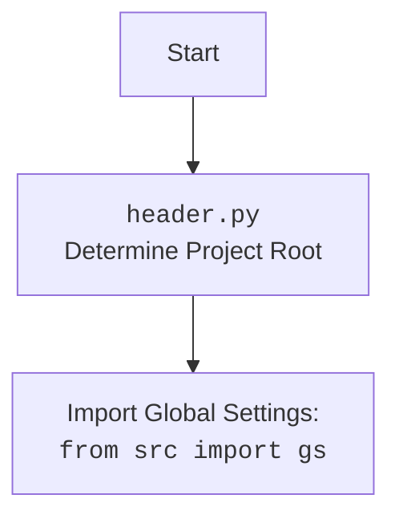

## Анализ кода `switch_account.py`

### <алгоритм>
1. **Импорт библиотек:**
   - Импортируются необходимые библиотеки и модули для работы: `Path` (для работы с путями), `SimpleNamespace` (для создания объектов с атрибутами), `gs` (глобальные настройки проекта), `Driver` (класс для управления веб-драйвером) и `j_loads_ns` (для загрузки данных из JSON в `SimpleNamespace`).
    ```python
    from pathlib import Path
    from types import SimpleNamespace
    from src import gs
    from src.webdriver.driver import Driver
    from src.utils.jjson import j_loads_ns
    ```
    *Пример:* `pathlib` используется для создания путей к файлам, например, к файлу локаторов.

2. **Загрузка локаторов:**
   - Функция `j_loads_ns` загружает данные из JSON-файла, расположенного по пути `src/endpoints/advertisement/facebook/locators/post_message.json`, и преобразует их в объект `SimpleNamespace`, который сохраняется в переменной `locator`. Этот объект содержит локаторы веб-элементов, используемых для взаимодействия со страницей.
     ```python
     locator: SimpleNamespace = j_loads_ns(
         Path(gs.path.src / 'endpoints' / 'advertisement' / 'facebook' / 'locators' / 'post_message.json')
     )
     ```
     *Пример:* `locator` может содержать такие атрибуты, как `locator.switch_to_account_button`, которые указывают на кнопку переключения аккаунта.

3. **Функция `switch_account`:**
   - Функция `switch_account` принимает объект `Driver` в качестве аргумента. Она проверяет, присутствует ли на странице кнопка "Переключить", используя локатор `locator.switch_to_account_button`. Если кнопка есть, она нажимает на неё, выполняя действие переключения аккаунта.
    ```python
    def switch_account(driver: Driver):
        """ Если есть кнопка `Переключить` - нажимаю её  """
        driver.execute_locator(locator.switch_to_account_button)
    ```
    *Пример:* Если на странице есть кнопка с CSS-селектором, указанным в `locator.switch_to_account_button`, то `driver.execute_locator` нажмет на нее.
 
### <mermaid>
```mermaid
flowchart TD
    Start[Start] --> LoadLocators[Load Locators from JSON]
    LoadLocators --> SwitchAccount[Function `switch_account`]
    SwitchAccount --> ExecuteLocator[driver.execute_locator(<br>locator.switch_to_account_button)]
    ExecuteLocator --> End[End]
    
    classDef default fill:#f9f,stroke:#333,stroke-width:2px
    class Start,End,LoadLocators,SwitchAccount,ExecuteLocator default
```


### <объяснение>
**Импорты:**
   - `pathlib.Path`: Используется для представления путей к файлам и каталогам. Это упрощает работу с файловой системой, делая код более читаемым и кроссплатформенным.
   - `types.SimpleNamespace`: Это простой способ создания объектов с атрибутами. Используется здесь для представления локаторов, загруженных из JSON.
   - `src.gs`: Импортирует глобальные настройки проекта. Здесь он используется для получения базового пути к директории проекта через `gs.path.src`.
   - `src.webdriver.driver.Driver`: Класс, который представляет собой веб-драйвер, который используется для управления браузером и взаимодействия с веб-элементами.
   - `src.utils.jjson.j_loads_ns`: Функция для загрузки данных из JSON-файла и преобразования их в `SimpleNamespace`.

**Классы:**
   - `Driver`: Этот класс, вероятно, предоставляет методы для взаимодействия с веб-браузером, такие как навигация по страницам, поиск элементов, клики и т.д.

**Функции:**
   - `switch_account(driver: Driver)`:
     -   **Аргументы:**
          - `driver`: Экземпляр класса `Driver`, используемый для управления браузером.
     -   **Возвращаемое значение:**
         -   `None`. Функция не возвращает никаких значений.
     -   **Назначение:** Функция проверяет наличие на странице кнопки "Переключить аккаунт", используя локатор `locator.switch_to_account_button`, и если она существует, то эмулирует клик по ней.
     -   **Пример:**
        ```python
        from src.webdriver.driver import Driver
        # Предположим, что driver является экземпляром Driver
        driver = Driver()
        switch_account(driver)
        ```

**Переменные:**
   - `locator: SimpleNamespace`: Объект, хранящий локаторы для веб-элементов. Эти локаторы загружаются из JSON-файла, и они используются для поиска элементов на веб-странице.

**Цепочка взаимосвязей:**
   - `switch_account.py` -> `src.webdriver.driver.Driver` (управляет браузером).
   - `switch_account.py` -> `src.utils.jjson.j_loads_ns` (загружает локаторы).
   - `switch_account.py` -> `src.gs` (глобальные настройки проекта).
   - `switch_account.py` использует `locators` из JSON файлов расположенных в `src/endpoints/advertisement/facebook/locators/post_message.json`
   
**Потенциальные ошибки и области для улучшения:**
   - **Обработка ошибок:** В коде отсутствует обработка возможных ошибок, таких как исключения при загрузке JSON или если элемент с указанным локатором не найден на странице.
   - **Явное ожидание:** Было бы лучше добавить явное ожидание появления кнопки, прежде чем пытаться её нажать, чтобы избежать случайных сбоев из-за медленной загрузки страницы.
   - **Логирование:** В код было бы полезно добавить логирование действий, например, успешное нажатие кнопки или неудачная попытка, для облегчения отладки и мониторинга.
   - **Использование try-except:**  Использование блока `try-except` для обработки возможных ошибок при загрузке JSON или выполнении действий с веб-драйвером.
    ```python
    def switch_account(driver: Driver):
        """ Если есть кнопка `Переключить` - нажимаю её  """
        try:
            driver.execute_locator(locator.switch_to_account_button)
        except Exception as e:
            print(f"Ошибка при переключении аккаунта: {e}")
    ```
   - **Проверка существования элемента:** Перед выполнением действия с локатором нужно проверить, существует ли элемент на странице.
    ```python
    def switch_account(driver: Driver):
        """ Если есть кнопка `Переключить` - нажимаю её  """
        if driver.is_element_present(locator.switch_to_account_button):
            try:
                driver.execute_locator(locator.switch_to_account_button)
            except Exception as e:
                print(f"Ошибка при переключении аккаунта: {e}")
        else:
            print("Кнопка переключения аккаунта не найдена.")
    ```
   - **Логирование действий**
    ```python
    import logging

    logging.basicConfig(level=logging.INFO)

    def switch_account(driver: Driver):
        """ Если есть кнопка `Переключить` - нажимаю её  """
        logging.info("Начало переключения аккаунта")
        if driver.is_element_present(locator.switch_to_account_button):
            try:
                driver.execute_locator(locator.switch_to_account_button)
                logging.info("Кнопка переключения аккаунта успешно нажата")
            except Exception as e:
                logging.error(f"Ошибка при переключении аккаунта: {e}")
        else:
            logging.info("Кнопка переключения аккаунта не найдена.")
        logging.info("Конец переключения аккаунта")
    ```

Этот анализ обеспечивает полное понимание функциональности кода, его зависимостей и возможностей для улучшения.