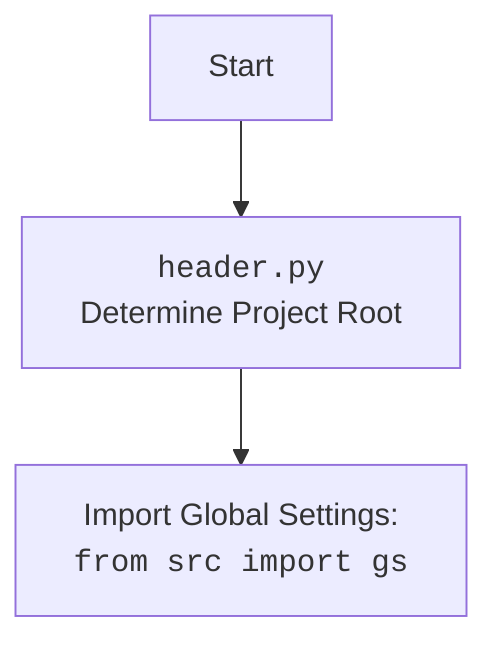

## Анализ кода `src/endpoints/advertisement/facebook/start_event.py`

### 1. `<алгоритм>`

**Блок-схема:**

1.  **Инициализация:**
    *   Импортируются необходимые библиотеки и модули (например, `math`, `time`, `header`, `j_loads`, `Driver`, `Chrome`, `FacebookPromoter`, `logger`).
    *   Создается экземпляр `Driver` с типом `Chrome`.
    *   Выполняется переход на страницу `https://facebook.com`.
    *   Определяются списки файлов `filenames` и `excluded_filenames`, а также список названий событий `events_names`.
    *   Создается экземпляр `FacebookPromoter`.
        *   **Пример**:
            ```python
            promoter: FacebookPromoter = FacebookPromoter(d, group_file_paths=filenames, no_video = True)
            ```
            *  `d` - экземпляр `Driver` (веб-драйвер для управления браузером).
            *  `group_file_paths` - список файлов JSON, содержащих информацию о группах.
            * `no_video=True` - устанавливает опцию, что видео не будет использоваться.
2.  **Основной цикл `while True`:**
    *   В начале каждой итерации цикла, в лог записывается сообщение, что скрипт "просыпается".
        *   **Пример**:
            ```python
            logger.debug(f"waikig up {time.strftime('%H:%M:%S')}",None,False)
            ```
            * Запись в лог текущего времени начала итерации.
    *   Вызывается метод `run_events` у экземпляра `FacebookPromoter`, передавая ему список названий событий и список путей к файлам.
        *   **Пример**:
            ```python
            promoter.run_events(events_names = events_names, group_file_paths = filenames)
            ```
            *   `events_names` - список названий событий для публикации.
            *   `group_file_paths` - список файлов с данными о группах.
    *   После выполнения `run_events`, скрипт делает запись в лог, что он "уходит спать".
         *   **Пример**:
            ```python
            logger.debug(f"going to sleep at {time.strftime('%H:%M:%S')}",None,False)
            ```
            * Запись в лог текущего времени конца итерации.
    *   Скрипт засыпает на 7200 секунд (2 часа).
        *   **Пример**:
            ```python
            time.sleep(7200)
            ```
3.  **Обработка `KeyboardInterrupt`:**
    *   Если возникает прерывание с клавиатуры (Ctrl+C), программа перехватывает исключение `KeyboardInterrupt`, записывает сообщение в лог и завершает работу.
        *   **Пример**:
            ```python
            logger.info("Campaign promotion interrupted.")
            ```
            * Запись в лог сообщения о том, что выполнение скрипта было прервано пользователем.

**Поток данных:**

1.  Данные о настройках (списки файлов, названия событий) передаются при инициализации `FacebookPromoter`.
2.  Экземпляр `Driver` используется `FacebookPromoter` для управления браузером.
3.  `FacebookPromoter.run_events` обрабатывает данные о группах и событиях, используя `Driver`, для публикации в Facebook.
4.  Информация о времени начала и конца итерации отправляется в лог.
5.  В случае прерывания процесса, информация о прерывании также отправляется в лог.

### 2. `<mermaid>`

```mermaid
flowchart TD
    Start[Start Script] --> InitDriver[Initialize Driver: <br><code>Driver(Chrome)</code>]
    InitDriver --> NavigateToFB[Navigate to Facebook: <br><code>d.get_url("https://facebook.com")</code>]
    NavigateToFB --> DefineFiles[Define file paths <br> and event names ]
    DefineFiles --> CreatePromoter[Create FacebookPromoter: <br><code>FacebookPromoter(d, group_file_paths, no_video=True)</code>]
    CreatePromoter --> MainLoop[Main Loop: <code>while True</code>]
    MainLoop --> LogWakeUp[Log wake up event: <br> <code>logger.debug(...)</code>]
    LogWakeUp --> RunEvents[Run Events: <br><code>promoter.run_events(events_names, group_file_paths)</code>]
    RunEvents --> LogSleep[Log sleep event: <br><code>logger.debug(...)</code>]
    LogSleep --> Sleep[Sleep 7200 seconds: <br><code>time.sleep(7200)</code>]
    Sleep --> MainLoop
    MainLoop --> ExceptionHandler[KeyboardInterrupt handler]
    ExceptionHandler --> LogInterrupted[Log interruption: <br><code>logger.info(...)</code>]
    LogInterrupted --> End[End Script]
```

**Анализ зависимостей в `mermaid`:**

*   `Start`: Начало выполнения скрипта.
*   `InitDriver`: Инициализация веб-драйвера с использованием класса `Driver` и `Chrome`.
*   `NavigateToFB`: Переход по указанному адресу `https://facebook.com`, используя `Driver`.
*   `DefineFiles`: Определение путей к файлам с данными о группах и названия событий.
*   `CreatePromoter`: Создание экземпляра класса `FacebookPromoter`, с передачей веб-драйвера `d`  и списка файлов `group_file_paths`, а также отключается публикация видео `no_video=True`.
*   `MainLoop`: Основной цикл, который постоянно выполняется, пока не будет прерван.
*   `LogWakeUp`: Запись в лог сообщения о начале выполнения итерации цикла.
*   `RunEvents`: Вызов метода `run_events` объекта `FacebookPromoter` для публикации событий в Facebook.
*   `LogSleep`: Запись в лог сообщения о завершении итерации цикла.
*   `Sleep`: Пауза выполнения скрипта на 7200 секунд.
*   `ExceptionHandler`: Обработчик прерывания выполнения скрипта с клавиатуры.
*   `LogInterrupted`: Запись в лог сообщения о прерывании скрипта.
*   `End`: Конец выполнения скрипта.

### **Дополнительно:  `header.py`**



### 3. `<объяснение>`

**Импорты:**

*   `from math import log`: Импортирует функцию `log` из модуля `math`, но в коде не используется. Это может быть упущением.
*   `import header`: Импортирует модуль `header`, который, вероятно, используется для определения корневой директории проекта и загрузки глобальных настроек.
*   `import time`: Импортирует модуль `time`, используется для работы со временем, например, для задержки выполнения программы (`time.sleep`) и форматирования времени (`time.strftime`).
*   `from src.utils.jjson import j_loads`: Импортирует функцию `j_loads` из модуля `src.utils.jjson`, который, вероятно, используется для загрузки JSON файлов.
*   `from src.webdriver.driver import Driver, Chrome`: Импортирует классы `Driver` и `Chrome` из модуля `src.webdriver.driver`, которые, вероятно, используются для управления веб-браузером.
*   `from src.endpoints.advertisement.facebook import FacebookPromoter`: Импортирует класс `FacebookPromoter` из модуля `src.endpoints.advertisement.facebook`, который отвечает за публикацию событий в Facebook.
*   `from src.logger.logger import logger`: Импортирует объект `logger` из модуля `src.logger.logger`, используемый для логирования.

**Классы:**

*   `Driver(Chrome)`: Класс, управляющий веб-драйвером. `Chrome` вероятно задает конкретный браузер.
*   `FacebookPromoter`: Класс, отвечающий за публикацию событий в Facebook. Он принимает в качестве аргументов экземпляр драйвера, пути к файлам с группами, и флаг `no_video`.

**Функции:**

*   `time.sleep(7200)`: Функция, которая приостанавливает выполнение программы на 7200 секунд (2 часа).
*   `logger.debug(f"...", None, False)`: Функция, которая записывает отладочное сообщение в лог.
*   `logger.info(...)`: Функция, которая записывает информационное сообщение в лог.
*   `time.strftime('%H:%M:%S')`: Форматирует текущее время в строку вида "ЧЧ:ММ:СС".
*   `FacebookPromoter.run_events(events_names, group_file_paths)`: Метод класса `FacebookPromoter`, который выполняет публикацию событий в Facebook.
*   `d.get_url(r"https://facebook.com")`: Метод для перехода по ссылке на веб-странице.

**Переменные:**

*   `filenames`: Список строк, представляющих имена файлов, содержащих информацию о группах.
*   `excluded_filenames`: Список строк, представляющих имена файлов, которые следует исключить из обработки.
*    `events_names`: Список строк, представляющих имена событий для публикации.
*   `promoter`: Экземпляр класса `FacebookPromoter`.
*   `d`: Экземпляр класса `Driver`.

**Потенциальные ошибки и области для улучшения:**

*   Импорт `from math import log` не используется в коде и его можно удалить.
*   Использование жестко заданных имен файлов и названий событий может ограничить гибкость скрипта. Желательно было бы перенести их в конфигурационный файл или аргументы командной строки.
*   Отсутствует обработка возможных ошибок при выполнении `promoter.run_events`. Стоит добавить блок `try...except`, чтобы ловить ошибки и обрабатывать их.
*   Используется бесконечный цикл `while True`, который может быть проблематичным, если нет четкого механизма завершения работы скрипта, помимо прерывания с клавиатуры. Было бы лучше рассмотреть возможность запуска скрипта в заданное время с помощью `cron` или другой утилиты планирования.
*   В лог сообщениях нет конкретики, что именно происходит в `run_events`, стоит добавить больше информации.

**Цепочка взаимосвязей:**

1.  Скрипт `start_event.py` использует `header.py` для определения корня проекта и глобальных настроек.
2.  Он использует `j_loads` из `src.utils.jjson` для загрузки данных из JSON файлов.
3.  Используется `Driver` и `Chrome` из `src.webdriver.driver` для управления браузером.
4.  `FacebookPromoter` из `src.endpoints.advertisement.facebook` используется для публикации событий в Facebook.
5.  `logger` из `src.logger.logger` используется для логирования.

В целом, код выполняет свою основную задачу публикации событий в Facebook, но требует доработки в плане гибкости, обработки ошибок, и более детального логирования.