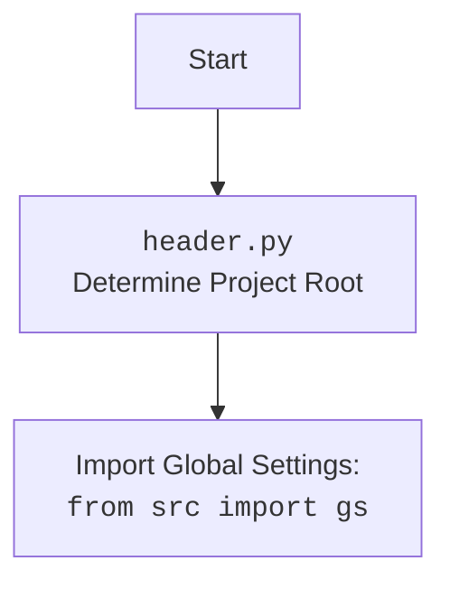

# Анализ кода `start_posting.py`

## 1. <алгоритм>

**Назначение**: Скрипт предназначен для автоматической публикации рекламных объявлений в группах Facebook. Он использует заранее подготовленные данные о группах и рекламных кампаниях, и циклически запускает их с определенным интервалом.

**Пошаговая блок-схема**:

1.  **Инициализация**:
    *   Импортируются необходимые библиотеки и модули: `math`, `header`, `time`, `copy`, `Driver`, `Chrome`, `FacebookPromoter`, `logger`.
    *   Создается экземпляр веб-драйвера `Driver` с использованием `Chrome`.
    *   Драйвер открывает страницу Facebook.
    *   Определяются списки файлов `filenames`, `excluded_filenames` и список кампаний `campaigns`.
2.  **Создание промоутера**:
    *   Создается экземпляр класса `FacebookPromoter`, которому передается драйвер, список файлов групп, и флаг `no_video = True`.
3.  **Основной цикл**:
    *   Запускается бесконечный цикл `while True`.
    *   Внутри цикла вызывается метод `run_campaigns` объекта `promoter` c копией списка `campaigns` и списком файлов `filenames`.
    *   Выводится сообщение в консоль с информацией о текущем времени и засыпании.
    *   Скрипт "засыпает" на 180 секунд.
    *   Переходит к следующей итерации цикла.
4.  **Обработка прерывания**:
    *   При получении сигнала прерывания с клавиатуры (KeyboardInterrupt) цикл прерывается.
    *   В лог записывается сообщение о прерывании рекламной кампании.

**Пример логических блоков**:

*   **Инициализация**: Создание драйвера, открытие страницы Facebook, определение списков файлов и кампаний.
    ```python
    d = Driver(Chrome) # создает экземпляр ChromeDriver
    d.get_url(r"https://facebook.com") # Открывает страницу Facebook
    filenames:list[str] = ["usa.json", "he_ils.json"] # Список файлов с данными о группах
    campaigns:list = ['brands', 'mom_and_baby'] # Список названий рекламных кампаний
    ```
*   **Создание промоутера**: Создание экземпляра `FacebookPromoter`.
    ```python
    promoter:FacebookPromoter = FacebookPromoter(d, group_file_paths=filenames, no_video = True)
    ```
*   **Основной цикл**: Бесконечный цикл запускающий `run_campaigns`.
    ```python
    while True:
        promoter.run_campaigns(campaigns = copy.copy(campaigns), group_file_paths = filenames)
        time.sleep(180)
    ```
*   **Обработка прерывания**: Завершение работы скрипта.
    ```python
    except KeyboardInterrupt:
        logger.info("Campaign promotion interrupted.")
    ```
## 2. <mermaid>

```mermaid
flowchart TD
    Start --> InitializeDriver[Initialize Driver: <br> <code>d = Driver(Chrome)</code>]
    InitializeDriver --> OpenFacebook[Open Facebook Page: <br> <code>d.get_url("https://facebook.com")</code>]
    OpenFacebook --> DefineFilesAndCampaigns[Define Files and Campaigns: <br> <code>filenames, excluded_filenames, campaigns</code>]
    DefineFilesAndCampaigns --> CreatePromoter[Create Facebook Promoter: <br> <code>promoter = FacebookPromoter(d, filenames, no_video=True)</code>]
    CreatePromoter --> MainLoop[Start Main Loop: <br><code>while True</code>]
    MainLoop --> RunCampaigns[Run Campaigns: <br> <code>promoter.run_campaigns(campaigns, filenames)</code>]
    RunCampaigns --> Sleep[Sleep for 180 seconds: <br><code>time.sleep(180)</code>]
    Sleep --> MainLoop
    MainLoop --> KeyboardInterrupt[Keyboard Interrupt: <br><code>except KeyboardInterrupt</code>]
    KeyboardInterrupt --> LogInterrupt[Log Interrupt Message: <br><code>logger.info("Campaign promotion interrupted.")</code>]
    LogInterrupt --> End
    
    
    
```

**Анализ зависимостей в `mermaid` диаграмме**:

*   `InitializeDriver`: Инициализирует веб-драйвер, используя `Driver` и `Chrome` из `src.webdriver.driver`.
*   `OpenFacebook`: Открывает страницу Facebook, используя метод `get_url` экземпляра `Driver`.
*   `DefineFilesAndCampaigns`: Инициализирует списки `filenames`, `excluded_filenames` и `campaigns`.
*   `CreatePromoter`: Создает экземпляр `FacebookPromoter`, которому передается `Driver`, списки файлов и флаг для отключения видео. Класс `FacebookPromoter` импортируется из `src.endpoints.advertisement.facebook`.
*   `MainLoop`: Запускает основной бесконечный цикл.
*   `RunCampaigns`: Запускает рекламные кампании, вызывая метод `run_campaigns` экземпляра `FacebookPromoter`.
*   `Sleep`: Приостанавливает выполнение скрипта на 180 секунд.
*  `KeyboardInterrupt`: Обрабатывает прерывание скрипта с клавиатуры.
* `LogInterrupt`: Записывает в лог сообщение о прерывании.

**mermaid flowchart для `header.py` (если он импортируется)**:


## 3. <объяснение>

**Импорты**:

*   `from math import log`: Импортирует функцию `log` из модуля `math`, хотя в данном коде она не используется. Возможно, это заготовка для будущего функционала.
*   `import header`: Импортирует модуль `header`, который, вероятно, содержит общие настройки или функции для проекта. Обычно, в файле header.py определяется корень проекта и настраивается доступ к переменным окружения.
*   `import time`: Импортирует модуль `time` для работы со временем, например, для задержки между циклами.
*   `import copy`: Импортирует модуль `copy` для создания глубокой копии списка кампаний `campaigns`. Это необходимо для того, чтобы метод `run_campaigns` не изменял исходный список `campaigns`.
*   `from src.webdriver.driver import Driver, Chrome`: Импортирует классы `Driver` и `Chrome` из модуля `src.webdriver.driver`, которые используются для управления веб-браузером.
*   `from src.endpoints.advertisement.facebook import FacebookPromoter`: Импортирует класс `FacebookPromoter` из модуля `src.endpoints.advertisement.facebook`, который отвечает за публикацию рекламных объявлений.
*   `from src.logger.logger import logger`: Импортирует объект `logger` из модуля `src.logger.logger`, который используется для логирования событий.

**Классы**:

*   `Driver` (из `src.webdriver.driver`): Класс для управления веб-браузером. Он инициализируется с типом браузера (в данном случае `Chrome`) и предоставляет методы для открытия страниц и взаимодействия с элементами на странице.
*   `Chrome` (из `src.webdriver.driver`): Класс, предоставляющий настройки и функциональность для управления браузером Chrome.
*   `FacebookPromoter` (из `src.endpoints.advertisement.facebook`): Класс, ответственный за запуск рекламных кампаний в группах Facebook. Принимает экземпляр драйвера, список файлов с данными о группах и флаг для отключения видео.

**Функции**:

*   В данном коде есть только одна пользовательская функция - `run_campaigns` которая является методом класса `FacebookPromoter`,  ее аргументы:
  *   `campaigns` - список названий рекламных кампаний.
  *   `group_file_paths` - список путей к файлам с данными о группах.
  *   Функция не возвращает значения явно, но  запускает рекламные кампании в группах.
*   `time.sleep(seconds)`: Функция, которая приостанавливает выполнение скрипта на указанное количество секунд.
*   `copy.copy(list)`: Функция, которая создает поверхностную копию списка.
*  `logger.info(message)`: Функция, которая записывает информационное сообщение в лог.
*  `d.get_url(url)`: Функция драйвера, которая открывает страницу по указанному URL

**Переменные**:

*   `d`: Экземпляр класса `Driver`, используемый для управления браузером.
*   `filenames`: Список строк, содержащий имена файлов с данными о группах Facebook.
*   `excluded_filenames`: Список строк, содержащий имена файлов, которые нужно исключить из обработки.
*   `campaigns`: Список строк, содержащий названия рекламных кампаний.
*   `promoter`: Экземпляр класса `FacebookPromoter`, ответственный за запуск рекламных кампаний.

**Потенциальные ошибки и области для улучшения**:

*   **Неиспользуемый импорт**: Импорт `from math import log` не используется в коде и может быть удален.
*   **Жестко заданные пути к файлам**: Пути к файлам (`filenames`) заданы непосредственно в коде, что может быть неудобно при изменении структуры файлов. Следует использовать конфигурационный файл или переменные окружения для их хранения.
*   **Бесконечный цикл**: Бесконечный цикл `while True` полагается на обработку `KeyboardInterrupt` для остановки, что может быть не лучшим решением в долгосрочной перспективе. Лучше добавить условие для прерывания цикла или использования другого механизма управления работой скрипта.
*   **Отсутствие обработки ошибок**: В коде не предусмотрена обработка возможных ошибок, например, при работе с файлами или с веб-драйвером. Следует добавить блоки `try...except` для обработки таких ошибок.
*   **Отсутствие конфигурации параметров**: Параметры, такие как время сна (180 секунд), можно вынести в конфигурационный файл.
*   **Дублирование кода**: Список `filenames` используется и при создании `promoter`, и в методе `run_campaigns`, стоит рассмотреть возможность оптимизировать передачу этих данных.
*  **Отсутствует гибкость**: Использование `copy.copy` для campaigns создает поверхностную копию, если список будет содержать изменяемые объекты это может привести к проблемам.

**Взаимосвязи с другими частями проекта**:

*   Код зависит от модулей `src.webdriver.driver` (для управления браузером), `src.endpoints.advertisement.facebook` (для запуска рекламных кампаний) и `src.logger.logger` (для логирования).
*   Файлы с данными о группах (`.json` файлы в `filenames`) также являются частью проекта и должны быть корректно структурированы.
*   Модуль `header` вероятно содержит общие настройки и переменные проекта.

Это подробный анализ кода `start_posting.py`, который охватывает все необходимые аспекты, описанные в инструкции.