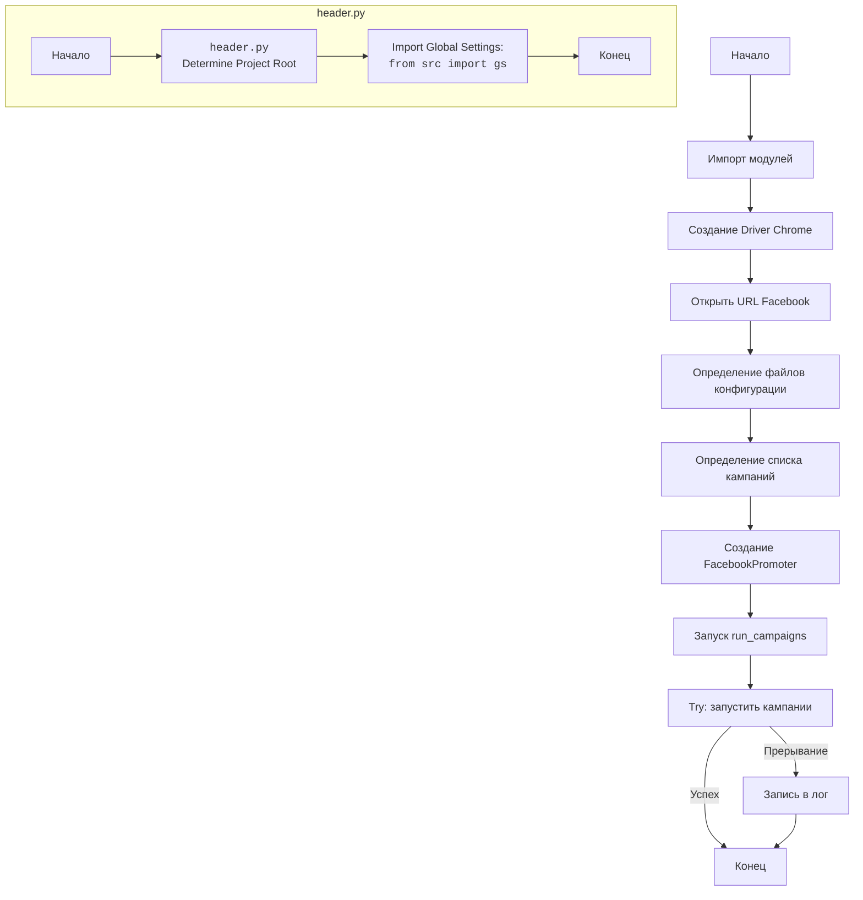

## АНАЛИЗ КОДА: `hypotez/src/endpoints/advertisement/facebook/start_posting_katia.py`

### 1. <алгоритм>

1. **Инициализация:**
   - Импортируются необходимые модули: `header`, `Driver`, `Chrome`, `FacebookPromoter`, `logger`.
   - Создается экземпляр драйвера `Driver` с использованием `Chrome`.
   - Загружается страница Facebook по URL `https://facebook.com`.
2. **Настройка рекламной кампании:**
   - Задаются имена файлов конфигурации `filenames` (в данном случае `['katia_homepage.json']`).
   - Определяется список рекламных кампаний `campaigns` (например, `sport_and_activity`, `bags_backpacks_suitcases`, и др.).
3. **Создание промоутера:**
   - Создается экземпляр `FacebookPromoter` с передачей драйвера, файлов конфигурации и флага `no_video = False`.
4. **Запуск кампаний:**
   - Вызывается метод `run_campaigns` объекта `promoter` со списком `campaigns`.
   - Цикл прохода по кампаниям для запуска.
5. **Обработка прерывания:**
   - Используется блок `try...except` для отлова `KeyboardInterrupt`, чтобы корректно завершить работу скрипта в случае прерывания.

### 2. <mermaid>

**Объяснение `mermaid`:**

- **`Start`**: Начало выполнения скрипта.
- **`ImportModules`**: Импортирование необходимых модулей, включая `header`, `Driver`, `Chrome`, `FacebookPromoter`, и `logger`.
- **`CreateDriver`**: Создание экземпляра драйвера `Driver` с использованием `Chrome`, что позволяет автоматизировать взаимодействие с браузером.
- **`GetFacebookURL`**: Загрузка стартовой страницы Facebook в браузере, которым управляет драйвер.
- **`DefineFilenames`**: Определение списка имен файлов конфигурации для рекламных кампаний (например, `katia_homepage.json`).
- **`DefineCampaigns`**: Определение списка имен рекламных кампаний, которые будут запущены.
- **`CreatePromoter`**: Создание экземпляра `FacebookPromoter`, который отвечает за запуск рекламных объявлений.
- **`RunCampaigns`**: Запуск рекламных кампаний методом `run_campaigns` объекта `FacebookPromoter`.
- **`CheckInterrupt`**: Блок `try...except` проверяет, было ли прерывание работы скрипта (например, Ctrl+C).
- **`LogInterrupt`**: Если было прерывание, то записывается соответствующее сообщение в лог.
- **`End`**: Конец выполнения скрипта.

**Объяснение `header.py` (дополнительный блок `mermaid`):**

- **`HeaderStart`**: Начало выполнения `header.py`.
- **`Header`**: Модуль `header.py` определяет корень проекта для корректного импорта.
- **`ImportGlobalSettings`**: `header.py` импортирует глобальные настройки проекта из `src.gs`.
- **`HeaderEnd`**: Завершение выполнения `header.py`.

### 3. <объяснение>

**Импорты:**

-   `import header`: Модуль `header.py` используется для определения корня проекта, что важно для корректного импорта других модулей. Модуль помогает настроить правильные пути для импорта.
-   `from src.webdriver.driver import Driver, Chrome`:
    -   `Driver`: Абстрактный класс для управления веб-драйверами.
    -   `Chrome`: Класс, реализующий `Driver` для управления браузером Chrome.
-   `from src.endpoints.advertisement.facebook.promoter import FacebookPromoter`: Класс `FacebookPromoter`, отвечающий за размещение рекламных объявлений в Facebook.
-   `from src.logger.logger import logger`: Модуль `logger` для записи сообщений (логирования) о работе скрипта, ошибок, и т.д.

**Классы:**

-   `Driver(Chrome)`: Класс `Driver` инициализируется с параметром `Chrome`, что создает драйвер для управления браузером Chrome. Этот драйвер используется для автоматизации действий в браузере.
-   `FacebookPromoter`:
    -   Атрибуты:
        -   `d` (экземпляр `Driver`): Драйвер для управления браузером.
        -   `group_file_paths` (список): Список путей к файлам конфигурации для групп.
        -   `no_video` (boolean): Флаг для отключения видео в рекламных объявлениях.
    -   Методы:
        -   `run_campaigns(campaigns)`: Запускает рекламные кампании из списка `campaigns`.

**Функции:**

-   В данном коде нет явно определенных функций, кроме методов классов.
-   `promoter.run_campaigns(campaigns)`: Функция, которая отвечает за запуск рекламных кампаний для групп.  Ожидает на вход массив кампаний для запуска.

**Переменные:**

-   `d`: Экземпляр класса `Driver`, который управляет браузером.
-   `filenames`: Список строк, представляющих имена файлов конфигурации.
-   `campaigns`: Список строк, представляющих названия рекламных кампаний.
-   `promoter`: Экземпляр класса `FacebookPromoter`, который отвечает за проведение рекламных кампаний.

**Потенциальные ошибки и области для улучшения:**

-   **Обработка ошибок:** Код обрабатывает только прерывание скрипта (`KeyboardInterrupt`), но не обрабатывает другие возможные ошибки (например, ошибки подключения к сети, ошибки загрузки файлов, проблемы с веб-драйвером).
-   **Конфигурация:** Файлы конфигурации `filenames` (например, `'katia_homepage.json'`) и содержимое этих файлов не описаны.
-   **Логирование:** Можно улучшить логирование, добавляя более подробные сообщения об ошибках, ходе выполнения и результатах кампаний.
-   **Управляемость параметрами:** Список кампаний определен непосредственно в коде, что может быть неудобно для управления. Было бы лучше, если бы они могли задаваться из внешнего конфигурационного файла или через аргументы командной строки.
-   **Абстракция:** Можно рассмотреть возможность абстрагировать функциональность работы с facebook, создав отдельный модуль, который будет заниматься конкретно этой задачей.

**Взаимосвязи с другими частями проекта:**

-   Этот скрипт использует модули из других частей проекта:
    -   `src.webdriver.driver`: Для управления веб-драйвером.
    -   `src.endpoints.advertisement.facebook.promoter`: Для проведения рекламных кампаний.
    -   `src.logger.logger`: Для ведения логов.
-   Также есть неявная зависимость от структуры файлов конфигурации, которые должны соответствовать ожиданиям `FacebookPromoter`.
-    `src.gs` -  глобальные настройки проекта, использующиеся модулем `header`
-   Весь код, вероятно, является частью более крупного проекта, который включает в себя функционал автоматизации и работы с веб-сервисами.

**Цепочка взаимосвязей (пример):**

1. Скрипт `start_posting_katia.py` -> инициализирует `Driver(Chrome)` из `src.webdriver.driver`
2. `start_posting_katia.py` -> создает экземпляр `FacebookPromoter` из `src.endpoints.advertisement.facebook.promoter`, передавая ему драйвер и файлы конфигурации.
3. `FacebookPromoter` -> использует драйвер для управления браузером.
4. `start_posting_katia.py` -> использует `logger` из `src.logger.logger` для логирования операций.
5. `header.py`-> импортирует  `src.gs` для получения глобальных настроек.