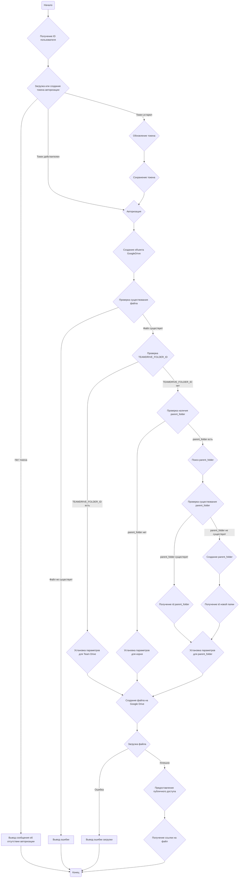

## Анализ кода `hypotez/src/endpoints/bots/google_dirve/upload.py`

### 1. <алгоритм>

**Блок-схема процесса загрузки файла в Google Drive:**

```mermaid
graph LR
    A[Начало] --> B{Получение ID пользователя};
    B --> C{Загрузка или создание токена авторизации};
    C -- Нет токена --> D[Вывод сообщения об отсутствии авторизации];
    C -- Токен устарел --> E{Обновление токена};
    E --> F[Сохранение токена];
    C -- Токен действителен --> G[Авторизация];
    D --> H[Конец];
    F --> G
    G --> I{Создание объекта GoogleDrive};
     I --> J{Проверка существования файла};
    J -- Файл не существует --> K[Вывод ошибки];
    K --> H
    J -- Файл существует --> L{Проверка TEAMDRIVE_FOLDER_ID};
    L -- TEAMDRIVE_FOLDER_ID есть --> M[Использовать TEAMDRIVE_FOLDER_ID];
    L -- TEAMDRIVE_FOLDER_ID нет --> N{Проверка наличия parent_folder};
     N -- parent_folder есть --> O{Поиск parent_folder};
    O --> P{Проверка существования parent_folder};
    P -- parent_folder существует --> Q[Получение id parent_folder];
    Q-->R[Загрузка файла в указанную папку];
    P -- parent_folder не существует --> S{Создание parent_folder};
    S --> T{Получение id новой папки};
    T --> R
     N -- parent_folder нет --> U[Загрузка файла в корень];
    M --> V[Загрузка файла в TeamDrive];
    R --> W{Создание файла на Google Drive};
    U --> W
    V --> W
   W --> X{Загрузка файла на Google Drive};
   X -- Успешно -->Y{Предоставление публичного доступа};
   X -- Ошибка -->Z{Вывод ошибки загрузки};
   Y-->AA{Получение ссылки на файл}
   AA-->H
   Z-->H
```

**Примеры для каждого логического блока:**

*   **A**: Начало выполнения скрипта.
*   **B**: ID пользователя, например, `123456789`.
*   **C**: Проверка наличия файла `123456789` в директории с кодом. Если файл существует, то загружаем токен, в противном случае авторизовываем пользователя.
*   **D**: Выводится сообщение "not Auth Users" если нет файла с токеном.
*    **E**: Если токен устарел, то вызываем метод `Refresh()`.
*   **F**: Сохраняем обновленный токен в файл `123456789`
*   **G**: Вызывается метод `Authorize()`.
*   **I**:  Создание объекта `GoogleDrive` с использованием авторизованных данных.
*   **J**: Проверка, существует ли файл, например, `example.txt` на диске.
*   **K**: Вывод сообщения "Specified filename example.txt does not exist!".
*   **L**: Проверяется наличие `Creds.TEAMDRIVE_FOLDER_ID`.
*   **M**: Параметр `parents` устанавливается для Team Drive.
*   **N**: Проверяется наличие параметра `parent_folder`, например, `MyFolder`.
*   **O**: Выполняется поиск папки с именем `MyFolder`.
*  **P**: Проверка, найдена ли папка `MyFolder`.
*  **Q**:  Получение `id` папки `MyFolder`, например, `abcdef123456`.
*  **S**: Создание папки `MyFolder`.
*  **T**:  Получение `id` созданной папки, например, `ghijkl789012`.
*   **R**: Параметр `parents` устанавливается для папки `MyFolder`.
*   **U**: Файл загружается в корневую папку.
*   **V**: Файл загружается в Team Drive.
*  **W**: Создается объект файла на Google Drive.
*  **X**: Загрузка файла.
*   **Y**: Предоставление публичного доступа к файлу.
*   **Z**: Вывод ошибки загрузки.
*   **AA**: Возвращается ссылка на файл.
*   **H**: Завершение выполнения скрипта.

### 2. <mermaid>

**Анализ `mermaid`:**

Диаграмма представляет собой блок-схему, описывающую процесс загрузки файла на Google Drive.

*   **Начало (`Start`)**: Начальная точка выполнения скрипта.
*   **Получение ID пользователя (`GetUserID`)**: Получение идентификатора пользователя.
*   **Загрузка или создание токена авторизации (`LoadCredentials`)**: Загрузка сохраненных учетных данных пользователя, если они существуют, или создание новых.
*   **Вывод сообщения об отсутствии авторизации (`NotAuth`)**: Выводится, если нет сохраненных учетных данных.
*    **Обновление токена (`RefreshToken`)**: Обновляет токен авторизации, если он устарел.
*   **Сохранение токена (`SaveCredentials`)**: Сохранение обновленного токена авторизации.
*   **Авторизация (`AuthorizeUser`)**: Инициализация Google Drive API с использованием токена авторизации.
*   **Создание объекта GoogleDrive (`CreateGoogleDrive`)**: Создание объекта для взаимодействия с Google Drive API.
*   **Проверка существования файла (`CheckFileExists`)**: Проверка наличия файла, который нужно загрузить.
*   **Вывод ошибки (`FileNotExist`)**: Выводится, если файл не существует.
*   **Проверка TEAMDRIVE_FOLDER_ID (`CheckTeamDriveId`)**: Проверка наличия ID папки Team Drive.
*   **Установка параметров для Team Drive (`SetTeamDriveParents`)**: Установка параметров загрузки в Team Drive.
*   **Проверка наличия parent_folder (`CheckParentFolder`)**: Проверка наличия родительской папки.
*   **Поиск parent_folder (`SearchParentFolder`)**: Поиск папки с указанным именем.
*   **Проверка существования parent_folder (`CheckParentFolderExists`)**: Проверка, существует ли папка.
*   **Получение id parent_folder (`GetParentFolderId`)**: Получение ID существующей папки.
*    **Создание parent_folder (`CreateParentFolder`)**: Создание новой папки.
*    **Получение id новой папки (`GetNewParentFolderId`)**: Получение ID созданной папки.
*   **Установка параметров для parent_folder (`SetFileParentFolder`)**: Установка параметров загрузки в родительскую папку.
*   **Установка параметров для корня (`SetRootFolder`)**: Установка параметров загрузки в корень.
*   **Создание файла на Google Drive (`CreateFileOnDrive`)**: Создание объекта файла для загрузки на Google Drive.
*   **Загрузка файла (`UploadFile`)**: Загрузка файла на Google Drive.
*    **Вывод ошибки загрузки (`UploadError`)**: Выводится, если при загрузке произошла ошибка.
*   **Предоставление публичного доступа (`PublicAccess`)**: Предоставление публичного доступа к загруженному файлу.
*   **Получение ссылки на файл (`GetFileLink`)**: Получение ссылки на загруженный файл.
*   **Конец (`End`)**: Конечная точка выполнения скрипта.

### 3. <объяснение>

**Импорты:**

*   `argparse`: Используется для разбора аргументов командной строки, но в данном коде не используется.
*   `json`: Используется для работы с данными в формате JSON, но в данном коде не используется.
*   `os`: Предоставляет функции для работы с операционной системой, такие как проверка существования файла.
*   `os.path`: Предоставляет функции для работы с путями к файлам, такие как получение абсолютного пути, получение директории файла.
*    `re`: Используется для работы с регулярными выражениями, но в данном коде не используется.
*   `creds`:  Импортирует класс `Creds`, который предположительно содержит данные для доступа к Google Drive API (например, ID Team Drive).
*   `plugins`: Импортирует константу `TEXT`, но в коде она не используется.
*   `pydrive.auth`: Импортирует класс `GoogleAuth` для управления авторизацией.
*   `pydrive.drive`: Импортирует класс `GoogleDrive` для работы с Google Drive API.

**Переменные:**

*   `FOLDER_MIME_TYPE`: Константа, задающая MIME-тип для папки Google Drive.
*   `drive`: Переменная типа `GoogleDrive`, используется для взаимодействия с Google Drive API.
*   `http`: Переменная, хранящая объект HTTP для выполнения запросов.
*   `initial_folder`:  Переменная, которая не используется.
*   `filename`: Имя файла, который нужно загрузить.
*   `update`: Объект сообщения, которое содержит информацию о пользователе.
*   `context`: Контекст пользователя (не используется).
*   `parent_folder`: Имя родительской папки, куда нужно загрузить файл.
*   `gauth`:  Объект класса `GoogleAuth`, используется для авторизации.
*   `ID`: ID пользователя.
*   `file_list`: Список файлов и папок в Google Drive.
*   `file_folder`: Отдельный файл или папка из списка `file_list`.
*   `folderid`: ID родительской папки.
*   `folder_metadata`: Метаданные для создания папки.
*   `folder`: Объект `File`, который представляет созданную папку.
*   `foldertitle`: Название созданной папки.
*   `file_params`: Параметры файла, который будет загружен.
*   `file_to_upload`:  Объект `File`, который представляет загружаемый файл.

**Функция `upload`:**

*   **Аргументы:**
    *   `filename` (str): Имя файла, который нужно загрузить.
    *   `update`: Объект сообщения, содержащий информацию о пользователе.
    *    `context`: Контекст пользователя.
    *   `parent_folder` (str, optional): Имя родительской папки, по умолчанию `None`.
*   **Возвращает:**
    *   `str` : Ссылка на загруженный файл.
*   **Назначение:**
    Загружает указанный файл в Google Drive. Если указана `parent_folder`, файл загружается в эту папку, в противном случае файл загружается в корень или в Team Drive, если указан `Creds.TEAMDRIVE_FOLDER_ID`. Функция также предоставляет публичный доступ к файлу (если он не загружен в Team Drive) и возвращает ссылку на него.
*   **Примеры:**
    *   `upload('my_document.pdf', update, context)`: Загрузка файла `my_document.pdf` в корневую папку Google Drive.
    *   `upload('my_image.png', update, context, parent_folder='MyFolder')`: Загрузка файла `my_image.png` в папку `MyFolder`, предварительно создав ее если она не существует.
*  **Функциональность:**
1. **Авторизация:**
   - Загружает сохраненные учетные данные пользователя или создает новые, если их нет.
   - Обновляет токен доступа, если он устарел.
   - Авторизует пользователя в Google Drive.
2. **Подготовка к загрузке:**
   - Проверяет, существует ли файл, который нужно загрузить.
   - Определяет, нужно ли загружать в Team Drive, родительскую папку или в корень.
   - Если указана родительская папка, проверяет её наличие и создает, если её нет.
3. **Загрузка:**
   - Создает объект `File` и загружает файл на Google Drive.
   - Если загрузка в Team Drive, устанавливает соответствующие параметры.
4. **Публичный доступ:**
   -  Предоставляет публичный доступ к файлу, если он не загружен в Team Drive.
5. **Возврат ссылки:**
   - Возвращает ссылку на загруженный файл.

**Потенциальные ошибки и области для улучшения:**

1. **Обработка ошибок:** Функция использует `try-except` для обработки ошибок при загрузке, но не предоставляет более подробную информацию об ошибке.
2. **`argparse` и `json`**: Импортированы, но не используются, нужно либо их удалить, либо использовать.
3. **Константа `TEXT`**: Импортирована, но не используется, нужно либо удалить, либо использовать.
4. **Переменные:**
    - `FOLDER_MIME_TYPE`, `drive`, `http`, `initial_folder` объявляются как глобальные, а потом заново внутри функции, что может привести к путанице, лучше использовать их локально.
5. **Дублирование кода:**
    -  Код для получения `ID` пользователя повторяется.

**Цепочка взаимосвязей:**

1.  Функция `upload` использует класс `Creds` для получения доступа к Team Drive.
2.  Функция `upload` использует классы `GoogleAuth` и `GoogleDrive` из библиотеки `pydrive` для взаимодействия с Google Drive API.
3.  Функция `upload` может быть вызвана из других частей проекта, например, из обработчика команд бота, для загрузки файлов, полученных от пользователя.
4.   Функция `upload` взаимодействует с файловой системой (`os`, `os.path`) для проверки существования файла перед загрузкой.

**Дополнительно:**

*   Для более надежной работы функции можно добавить логирование.
*   Можно добавить валидацию аргументов `filename` и `parent_folder` перед их использованием.
*   Возможно стоит добавить проверку типа файла, для правильной обработки.