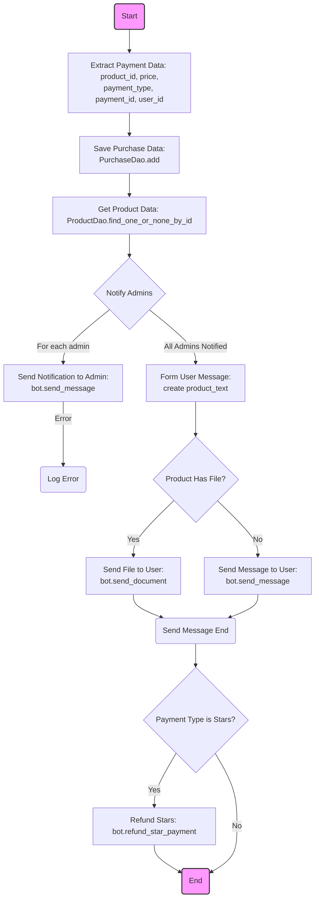
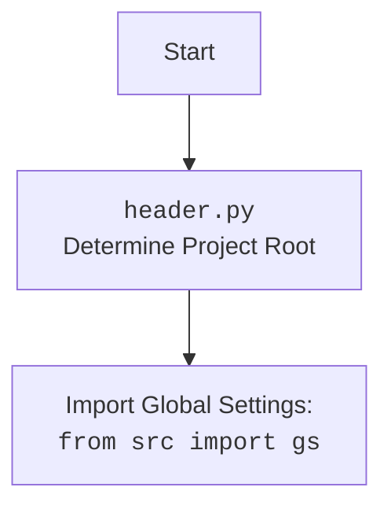

## ИНСТРУКЦИЯ:

Анализируй предоставленный код подробно и объясни его функциональность. Ответ должен включать три раздела:  

1. **<алгоритм>**: Опиши рабочий процесс в виде пошаговой блок-схемы, включая примеры для каждого логического блока, и проиллюстрируй поток данных между функциями, классами или методами.  
2. **<mermaid>**: Напиши код для диаграммы в формате `mermaid`, проанализируй и объясни все зависимости, 
    которые импортируются при создании диаграммы. 
    **ВАЖНО!** Убедитесь, что все имена переменных, используемые в диаграмме `mermaid`, 
    имеют осмысленные и описательные имена. Имена переменных вроде `A`, `B`, `C`, и т.д., не допускаются!  
    
    **Дополнительно**: Если в коде есть импорт `import header`, добавьте блок `mermaid` flowchart, объясняющий `header.py`:\
    ```mermaid
    flowchart TD
        Start --> Header[<code>header.py</code><br> Determine Project Root]
    
        Header --> import[Import Global Settings: <br><code>from src import gs</code>] 
    ```

3. **<объяснение>**: Предоставьте подробные объяснения:  
   - **Импорты**: Их назначение и взаимосвязь с другими пакетами `src.`.  
   - **Классы**: Их роль, атрибуты, методы и взаимодействие с другими компонентами проекта.  
   - **Функции**: Их аргументы, возвращаемые значения, назначение и примеры.  
   - **Переменные**: Их типы и использование.  
   - Выделите потенциальные ошибки или области для улучшения.  

Дополнительно, постройте цепочку взаимосвязей с другими частями проекта (если применимо).  

Это обеспечивает всесторонний и структурированный анализ кода.
## Формат ответа: `.md` (markdown)
**КОНЕЦ ИНСТРУКЦИИ**
```md
## <алгоритм>

1. **Начало**: Функция `successful_payment_logic` принимает данные об успешной оплате, включая сессию БД (`session`), данные платежа (`payment_data`), валюту (`currency`), ID пользователя (`user_tg_id`) и экземпляр бота (`bot`).

2. **Извлечение данных**: Извлекаются `product_id`, `price`, `payment_type`, `payment_id` и `user_id` из `payment_data`. 
    - Пример: `payment_data` может быть словарем `{'product_id': '123', 'price': 10.0, 'payment_type': 'card', 'payment_id': 'abc', 'user_id': 456}`.

3. **Сохранение данных о покупке**: Функция `PurchaseDao.add` добавляет данные о покупке в базу данных, используя модель `PaymentData`.
    - Пример: в базу данных добавляется запись о совершенной покупке с данными `{'product_id': 123, 'price': 10.0, 'payment_type': 'card', 'payment_id': 'abc', 'user_id': 456}`.

4. **Получение данных о продукте**: Функция `ProductDao.find_one_or_none_by_id` извлекает из базы данных информацию о купленном продукте по его `product_id`.
    - Пример: из базы данных извлекается объект `product_data` с полями `name`, `description`, `hidden_content`, `file_id`.

5. **Уведомление администраторов**: 
    - Проходим по списку ID администраторов `settings.ADMIN_IDS`.
        - Для каждого администратора отправляется уведомление с информацией о покупке.
            - Пример: отправляется сообщение админу с ID 12345: "💲 Пользователь c ID 456 купил товар **Название продукта** (ID: 123) за **10.0 USD**.".
        - Если происходит ошибка при отправке, она логируется.

6. **Формирование сообщения пользователю**:
    - Собирается текстовое сообщение с информацией о покупке, включая название, описание, цену и скрытое описание продукта.
    - Формируется текст `file_text`, указывающий на наличие или отсутствие файла.
        - Пример: `file_text` будет "📦 <b>Товар включает файл:</b>" если у продукта есть `file_id`, в противном случае: "📄 <b>Товар не включает файлы:</b>".

7. **Отправка сообщения пользователю**:
    - Если у продукта есть файл (`product_data.file_id`):
        - Отправляется файл пользователю с текстовым сообщением в виде подписи к файлу и с клавиатурой `main_user_kb`.
    - Если у продукта нет файла:
        - Отправляется текстовое сообщение пользователю с клавиатурой `main_user_kb`.

8. **Автоматический возврат звезд**:
    - Если `payment_type` равен 'stars', вызывается функция `bot.refund_star_payment` для возврата звезд пользователю.
        - Пример: если пользователь оплатил покупку звездами, то они возвращаются ему на баланс.
        - Функция не до конца понятна, поскольку не описана в коде.

9. **Конец**.

## <mermaid>




**Разбор зависимостей в mermaid диаграмме:**
-   `Start` и `End`: Начало и конец процесса, не имеют зависимостей.
-   `ExtractData`:  Извлекает данные из словаря `payment_data`, не импортирует ничего, использует только локальные переменные.
-   `SavePurchaseData`: Использует `PurchaseDao.add` для сохранения данных, зависит от класса `PurchaseDao` и модели `PaymentData`.
-   `GetProductData`:  Использует `ProductDao.find_one_or_none_by_id` для получения данных продукта, зависит от класса `ProductDao`.
-   `NotifyAdmins`:  Принимает данные из  `settings.ADMIN_IDS` и использует метод `bot.send_message`, зависит от `settings` и `bot`.
-   `SendAdminNotification`: Использует `bot.send_message`, зависит от `bot`.
-  `LogErrorAdmin`: Использует `logger.error`, зависит от библиотеки `loguru`.
-   `FormMessage`:  Формирует текст сообщения, не имеет явных зависимостей.
-   `CheckFile`: Проверяет наличие `product_data.file_id`, зависит от `product_data`.
-   `SendFile`:  Использует `bot.send_document`, зависит от `bot` и `product_data`.
-   `SendMessage`: Использует `bot.send_message`, зависит от `bot`.
-   `SendMessageEnd`:  Представляет конец процесса отправки сообщения, не имеет зависимостей.
-  `CheckPaymentType`: Проверяет `payment_type` на равенство `stars`, не имеет зависимостей.
-   `RefundStars`: Использует `bot.refund_star_payment`, зависит от `bot`.

## <объяснение>

**Импорты:**

-   `from aiogram import Bot`: Импортирует класс `Bot` из библиотеки `aiogram`, который используется для взаимодействия с Telegram Bot API.
-   `from loguru import logger`: Импортирует объект `logger` из библиотеки `loguru` для логирования событий и ошибок.
-   `from sqlalchemy.ext.asyncio import AsyncSession`: Импортирует класс `AsyncSession` из `sqlalchemy` для асинхронного взаимодействия с базой данных.
-   `from bot.config import settings`: Импортирует объект `settings` из модуля `config` для доступа к глобальным настройкам бота.
-   `from bot.dao.dao import PurchaseDao, ProductDao`: Импортирует классы `PurchaseDao` и `ProductDao` из модуля `dao` для доступа к методам работы с базой данных.
-   `from bot.user.kbs import main_user_kb`: Импортирует функцию `main_user_kb` из модуля `kbs` для создания клавиатур для пользователей.
-   `from bot.user.schemas import PaymentData`: Импортирует класс `PaymentData` из модуля `schemas` для валидации и представления данных о покупке.

**Классы:**

-   `PurchaseDao`: Класс для работы с данными о покупках в базе данных.
    -   Имеет метод `add`, который добавляет информацию о покупке в базу данных.
    -   Взаимодействует с базой данных через `AsyncSession`.
-   `ProductDao`: Класс для работы с данными о продуктах в базе данных.
    -   Имеет метод `find_one_or_none_by_id`, который находит продукт по его ID.
    -   Взаимодействует с базой данных через `AsyncSession`.
-   `PaymentData`: Pydantic схема для валидации и представления данных о платеже.
   -  Используется для формирования данных, которые сохраняются в БД.

**Функции:**

-   `successful_payment_logic(session: AsyncSession, payment_data, currency, user_tg_id, bot: Bot)`:
    -   **Аргументы**:
        -   `session`: Экземпляр `AsyncSession` для взаимодействия с базой данных.
        -   `payment_data`: Словарь, содержащий данные о платеже (ID продукта, цена, тип платежа и т.д.).
        -   `currency`: Валюта платежа.
        -   `user_tg_id`: Telegram ID пользователя, совершившего покупку.
        -   `bot`: Экземпляр класса `Bot` для взаимодействия с Telegram API.
    -   **Возвращаемое значение**: `None`.
    -   **Назначение**: Обрабатывает логику успешной оплаты, сохраняет информацию о покупке в базу данных, отправляет уведомления администраторам и пользователю, и в случае оплаты звездами возвращает их на счет пользователя.
    -   **Примеры**: 
        -   `payment_data = {"product_id": "1", "price": 10.0, "payment_type": "card", "payment_id": "123", "user_id": "100"}`
        -   `currency = "USD"`
        -   `user_tg_id = 123456789`
        -   `bot` - экземпляр бота
        - Функция  сохранит данные о покупке, отправит уведомление администраторам и сообщение пользователю.

**Переменные:**

-   `product_id`: ID купленного продукта (тип: int).
-   `price`: Цена товара (тип: float).
-   `payment_type`: Тип платежа (например, "card" или "stars") (тип: str).
-   `payment_id`: ID платежа (тип: str).
-    `user_id`: ID пользователя в системе (тип: int/str).
-   `product_data`: Объект, содержащий информацию о продукте (тип: объект, возвращаемый `ProductDao`).
-   `admin_id`: ID администратора (тип: int).
-   `file_text`: Текст, указывающий на наличие или отсутствие файла у продукта (тип: str).
-   `product_text`: Текст сообщения с информацией о продукте для пользователя (тип: str).

**Потенциальные ошибки и области для улучшения:**

-   **Обработка ошибок**: В коде есть блок `try-except` для обработки ошибок при отправке уведомлений администраторам, но не хватает обработки других потенциальных исключений (например, ошибки базы данных).
-   **Логирование**: Можно добавить больше логов для отслеживания важных событий, таких как успешное сохранение данных или отправка сообщений.
-   **Безопасность**: Необходимо убедиться, что `payment_data` и другие входные данные надежно валидируются.
-   **Производительность**: Функция `bot.refund_star_payment` не определена, возможно, это место нуждается в реализации.

**Взаимосвязи с другими частями проекта:**

-   **Конфигурация**: Функция использует `settings` для доступа к ID администраторов, что является частью общей конфигурации бота.
-   **DAO**: Использует `PurchaseDao` и `ProductDao` для взаимодействия с базой данных, что является частью слоя доступа к данным.
-   **Keyboard**: использует `main_user_kb` для построения клавиатур, которые возвращаются пользователю.
-   **Telegram Bot API**: Использует `Bot` для отправки сообщений и документов, что является частью интеграции с Telegram.

Этот код является важной частью бизнес-логики бота, обрабатывающей успешные платежи, оповещая администраторов, предоставляя пользователю информацию о покупке, а так же, если оплата была произведена звездами, возвращая их.
```