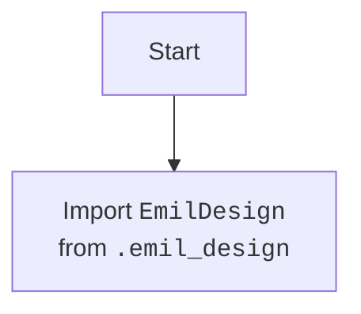

## Анализ кода `src/endpoints/emil/__init__.py`

### 1. <алгоритм>

1.  **Импорт модуля `emil_design`**:
    *   Начало работы. Импортируется модуль `EmilDesign` из `src.endpoints.emil.emil_design`. 
    *   Пример: `from .emil_design import EmilDesign` означает, что класс `EmilDesign` становится доступен для использования в текущем модуле.

### 2. <mermaid>

**Объяснение `mermaid`:**

*   `Start`:  Начало процесса импорта.
*   `ImportEmilDesign`:  Импорт класса `EmilDesign` из модуля `emil_design`, расположенного в той же директории.

### 3. <объяснение>

*   **Импорты**:
    *   `from .emil_design import EmilDesign`: Этот импорт означает, что из файла `emil_design.py`, расположенного в той же директории, что и текущий файл `__init__.py`, импортируется класс `EmilDesign`. Это позволяет использовать класс `EmilDesign` внутри пакета `emil`. В контексте структуры проекта, `.` указывает на текущий каталог (`emil`), и импорт является модулем в структуре проекта.
*   **Классы**:
    *   `EmilDesign`: Класс, который представляет функциональность, связанную с дизайном в контексте "emil".  Этот класс, скорее всего, содержит методы и атрибуты для обработки и предоставления информации о дизайне. Предположительно, этот класс будет использоваться для обработки данных, относящихся к дизайну, возможно, для создания различных элементов дизайна или для его настройки. 
*   **Функции**:
    *   В текущем файле нет явно объявленных функций. Однако, файл `__init__.py` часто используется для импорта и инициализации, делая классы и функции из других модулей пакета доступными для внешнего использования.
*   **Переменные**:
    *   В текущем файле нет явно объявленных переменных, помимо импортированного класса `EmilDesign`.
* **Потенциальные улучшения и ошибки:**
    *   Код выглядит очень минималистичным. В будущем сюда могут быть добавлены дополнительные импорты, а также могут быть реализованы функции для инициализации пакета.
    *   Отсутствует docstring для самого пакета `emil` в `__init__.py` (кроме краткого комментария в начале). Рекомендуется добавить общее описание пакета для лучшей читаемости и понимания его назначения.

**Цепочка взаимосвязей с другими частями проекта:**

*   Данный файл `__init__.py` является частью пакета `src.endpoints.emil`. Он позволяет другим частям проекта обращаться к `EmilDesign` через импорт `from src.endpoints.emil import EmilDesign`. Это указывает на то, что `EmilDesign` будет использован в других частях проекта, вероятно, в логике обработки запросов или бизнес-логике. Например, он может быть использован в каком-либо endpoint, обрабатывающем запросы, связанные с дизайном.