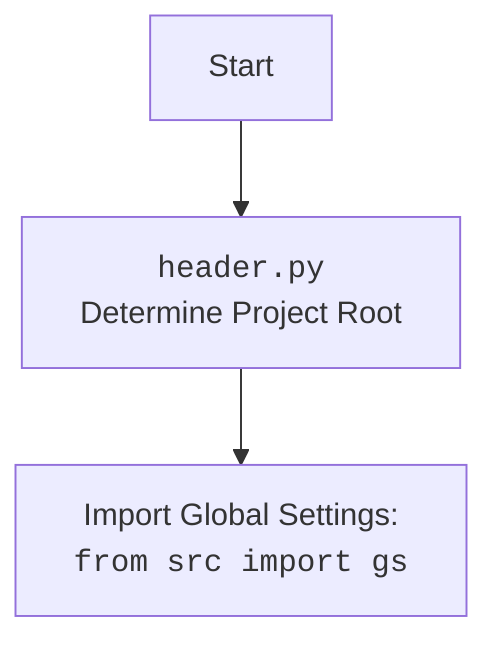

## <алгоритм>
1.  **Инициализация `EmilDesign`**:
    *   Создается экземпляр класса `EmilDesign`.
    *   Загружается конфигурация из `emil.json` в `config:SimpleNamespace`.
    *   Определяется путь к данным (`data_path`) на основе конфигурации.

2.  **`describe_images(lang: str)`**:
    *   **Пример**: `emil.describe_images(lang='he')`
    *   **Инициализация AI**:
        *   Определяется путь к файлу с инструкциями для AI (`hand_made_furniture_{lang}.md`).
        *   Если `use_openai` равен `True`, то инициализируется модель `OpenAIModel`, но в примере, `use_openai` = `False`
        *   Если `use_gemini` равен `True` (как в примере), то инициализируется модель `GoogleGenerativeAI` с API ключом из `gs.credentials.gemini.emil`, моделью `gemini-1.5-flash` и системными инструкциями.
        *   **Пример**: Gemini API key из настроек, модель `gemini-1.5-flash`, инструкции из файла.
    *   **Настройка данных**:
        *   Загружаются категории мебели из файла `main_categories_furniture.json`.
        *   Создается путь к выходному файлу описаний изображений (`described_images_{lang}.json`).
        *   Загружаются уже описанные изображения из `described_images.txt`.
        *   Определяется директория с изображениями `furniture_images`.
        *   Получается список файлов изображений в этой директории (`images_files_list`).
    *   **Фильтрация изображений**:
        *   Из списка всех изображений исключаются уже описанные изображения (`images_to_process`).
        *   Определяется путь для выходного JSON файла `out_{gs.now}_{lang}.json`
    *   **Обработка изображений**:
        *   Итерируется по списку неотработанных изображений `images_to_process`.
        *   Для каждого изображения:
            *   Делается пауза 20 секунд.
            *   Получается полный путь к файлу изображения.
            *   Получаются байты изображения используя `get_image_bytes()` и бинарные данные `get_raw_image_data()`.
            *   Запускается запрос к модели `gemini.describe_image()`, с передачей бинарных данных `raw_img_data`, mime type 'image/jpeg' и системным инструкциям.
            *   Если ответ от модели получен:
                *   Конвертируется JSON-ответ в `SimpleNamespace` (или список `SimpleNamespace`).
                *   Если получен список, выбирается первый элемент.
                *   Добавляется атрибут `local_image_path` с путем к файлу изображения.
                *   Добавляется описание в список `data` и сохраняется в JSON файл.
                *   Путь к изображению добавляется в список `described_images` и сохраняется в файл.

3.  **`promote_to_facebook()`**:
    *   **Пример**: `emil.promote_to_facebook()`
    *   Инициализируется веб-драйвер `Chrome`.
    *   Открывается страница Facebook по URL.
    *   Загружаются описания изображений из файла `images_descritions_he.json`.
    *   Итерируется по описаниям изображений:
        *   Создается `SimpleNamespace` для сообщения.
        *   Устанавливаются `title` и `description` из описания.
        *   Устанавливается `local_image_path` для изображения.
        *   Вызывается функция `post_message` для публикации сообщения в Facebook.

4.  **`upload_to_prestashop(products_list: Optional[SimpleNamespace | list[SimpleNamespace]] = None, lang: Optional[str] = None)`**:
    *   **Пример**: `emil.upload_to_prestashop(lang='he')`
    *   Загружаются данные о продуктах, либо из переданного аргумента `products_list`, либо из файла "out\_250108230345305\_he.json", если `products_list` не передан.
    *   Загружаются языковые настройки из файла `locales.json`.
    *   Извлекается индекс языка из настроек (`lang_index`).
    *   Создается экземпляр `ProductFields` с индексом языка.
    *   Устанавливаются хост и api ключ для PrestaShop.
    *   Итерируется по списку продуктов:
        *   Заполняются поля `ProductFields` данными из `product_ns`.
        *   Инициализируется `ProductAsync` и вызывается `add_new_product` для загрузки данных в PrestaShop.

5.  **`if __name__ == "__main__":`**:
    *   Создается экземпляр `EmilDesign`.
    *   Запускается асинхронная функция `upload_to_prestashop` с `lang='he'`.
    *   Также показан пример запуска `describe_images` с `lang='he'`, и `promote_to_facebook()`

## <mermaid>
```mermaid
flowchart TD
    subgraph EmilDesign
        Start(Start) --> Init[Initialize EmilDesign]
        Init --> LoadConfig[Load config from emil.json]
        LoadConfig --> DetermineDataPath[Determine data path]

        subgraph describe_images(lang: str)
            DStart(Start) --> LoadInstructions[Load system instructions]
             LoadInstructions --> InitAI{Init AI Model}
            InitAI -- use_openai=true --> InitOpenAI[Init OpenAI Model]
            InitAI -- use_gemini=true --> InitGemini[Init Gemini Model]
            InitGemini --> LoadCategories[Load furniture categories]
            LoadCategories --> CreatePaths[Create paths for output files]
            CreatePaths --> LoadDescribedImages[Load already described images]
            LoadDescribedImages --> GetImagesList[Get all images list from directory]
             GetImagesList --> FilterImages[Filter out described images]
            FilterImages --> LoopThroughImages{Loop through images}
              LoopThroughImages --> GetImgPath[Get image path]
              GetImgPath --> GetImageBytes[Get image bytes using PIL]
              GetImageBytes --> GetRawImageData[Get raw image data]
              GetRawImageData --> CallGeminiAPI[Call Gemini API to describe image]
                CallGeminiAPI --> CheckResponse{Check if API response is valid}
                    CheckResponse -- No --> ContinueLoop[Continue to the next image]
                    CheckResponse -- Yes --> ConvertResponse[Convert API response to SimpleNamespace]
                        ConvertResponse --> AddImagePath[Add image local path to SimpleNamespace]
                        AddImagePath --> SaveDescriptionToList[Append to description list]
                        SaveDescriptionToList --> SaveDescriptionToFile[Save descriptions to JSON file]
                            SaveDescriptionToFile --> UpdateProcessedList[Update processed images list]
                                UpdateProcessedList --> SaveProcessedList[Save processed list to file]
                                    SaveProcessedList --> LoopThroughImages
              LoopThroughImages -- No more images --> DEnd(End describe_images)
        end
            
        subgraph promote_to_facebook()
            FStart(Start) --> InitDriver[Init Web Driver]
            InitDriver --> GetFBUrl[Navigate to Facebook group URL]
            GetFBUrl --> LoadDescriptions[Load descriptions from images_descritions_he.json]
            LoadDescriptions --> LoopThroughDescriptions{Loop through descriptions}
               LoopThroughDescriptions --> CreateMessage[Create message SimpleNamespace]
                   CreateMessage --> SetTitleDescription[Set message title and description]
                        SetTitleDescription --> SetImagePath[Set local image path to message]
                            SetImagePath --> CallPostMessage[Call post_message function to Facebook]
                                CallPostMessage --> LoopThroughDescriptions
                LoopThroughDescriptions -- No more descriptions --> FEnd(End promote_to_facebook)
        end

        subgraph upload_to_prestashop(products_list, lang)
            PStart(Start) --> LoadProductList[Load products list (if not provided from file)]
            LoadProductList --> LoadLocales[Load locales config from locales.json]
                LoadLocales -->  GetLanguageIndex[Get language index from locales]
                    GetLanguageIndex --> CreateProductFields[Create ProductFields instance]
                        CreateProductFields --> GetPrestashopCreds[Get PrestaShop credentials]
                            GetPrestashopCreds --> LoopThroughProducts{Loop through products}
                                LoopThroughProducts --> SetProductFields[Set product fields using SimpleNamespace]
                                     SetProductFields --> InitProductAsync[Init ProductAsync with credentials]
                                         InitProductAsync --> CallAddProduct[Call PrestaShop API to add product]
                                             CallAddProduct --> LoopThroughProducts
            LoopThroughProducts -- No more products --> PEnd(End upload_to_prestashop)
        end
        
       Start --> Init --> describe_images
        Init --> promote_to_facebook
        Init --> upload_to_prestashop
    end
    
    classDef file fill:#f9f,stroke:#333,stroke-width:2px
    class EmilDesign file
    class describe_images file
    class promote_to_facebook file
    class upload_to_prestashop file
```



## <объяснение>

### Импорты
*   **`from __future__ import annotations`**:  Позволяет использовать аннотации типов, которые могут ссылаться на классы, которые еще не полностью определены.
*   **`from typing import Optional`**: Используется для указания, что переменная или аргумент функции может быть либо определенного типа, либо `None`.
*   **`import asyncio`**: Библиотека для написания асинхронного кода.
*   **`import time`**: Модуль для работы со временем, используется для пауз в коде.
*   **`from pathlib import Path`**:  Класс для работы с путями к файлам и директориям.
*   **`from types import SimpleNamespace`**:  Создает простые объекты с атрибутами, что удобно для хранения настроек и данных.
*   **`import header`**:  Модуль, который вероятно, определяет корень проекта и может настраивать глобальные параметры.
*   **`from src import gs`**: Импортирует глобальные настройки проекта, хранящиеся в `src.gs`. Это может включать пути к файлам, ключи API, настройки базы данных и т. д.
*   **`from src.webdriver.driver import Driver`**: Импортирует базовый класс для веб-драйверов.
*   **`from src.webdriver.chrome import Chrome`**: Импортирует класс для управления браузером Chrome.
*   **`from src.webdriver.firefox import Firefox`**: Импортирует класс для управления браузером Firefox.
*   **`from src.ai.gemini import GoogleGenerativeAI`**: Импортирует класс для работы с AI моделью Gemini.
*    **`from src.ai.openai.model import OpenAIModel`**: Импортирует класс для работы с AI моделью OpenAI.
*   **`from src.endpoints.prestashop.product_fields import ProductFields`**:  Импортирует класс для работы с полями продуктов PrestaShop.
*   **`from src.endpoints.prestashop.product_async import ProductAsync`**:  Импортирует класс для асинхронной работы с продуктами PrestaShop.
*   **`from src.endpoints.advertisement.facebook.scenarios.post_message import post_message, post_title, upload_media`**: Импортирует функции для публикации сообщений и медиа в Facebook.
*    **`from src.utils.file_async import read_text_file, save_text_file, get_filenames_from_directory`**: Импортирует асинхронные функции для работы с файлами.
*   **`from src.utils.jjson import j_loads, j_loads_ns, j_dumps`**: Импортирует функции для работы с JSON, включая загрузку JSON в `SimpleNamespace`.
*   **`from src.utils.image import get_image_bytes, get_raw_image_data`**: Импортирует функции для работы с изображениями (получение байтов и raw data).
*   **`from src.utils.convertors.ns import ns2dict`**: Импортирует функцию для преобразования `SimpleNamespace` в словарь.
*    **`from src.logger.logger import logger`**: Импортирует объект для логирования.

### Класс `EmilDesign`

*   **`ENDPOINT: str = 'emil'`**:  Константа, определяющая имя endpoint.
*   **`gemini: 'GoogleGenerativeAI'`**:  Экземпляр класса для работы с AI моделью Gemini.
*   **`openai: 'OpenAIModel'`**:  Экземпляр класса для работы с AI моделью OpenAI.
*   **`base_path: Path`**:  Путь к базовой директории endpoint `emil`, где хранятся конфигурационные файлы.
*   **`config: SimpleNamespace`**:  Конфигурация загружается из `emil.json` в виде `SimpleNamespace`.
*   **`data_path: Path`**:  Путь к директории для хранения данных, который берется из `config.storage` или дефолтный путь `external_storage`.
*   **`__init__(self)`**:  Конструктор класса.
*   **`async def describe_images(self, lang: str)`**:  Метод для описания изображений с использованием AI.

    *   Загружает инструкции для AI из markdown файла.
    *   Инициализирует модели AI (`OpenAIModel` или `GoogleGenerativeAI`) в зависимости от конфигурации.
    *   Получает список изображений из директории.
    *   Фильтрует уже описанные изображения.
    *   Обрабатывает каждое изображение: получает описание от AI, сохраняет результат и обновляет список обработанных изображений.
*   **`async def promote_to_facebook(self)`**:  Метод для публикации описаний изображений в Facebook.

    *   Инициализирует веб-драйвер.
    *   Загружает описания из JSON файла.
    *   Публикует сообщения в Facebook.
*    **`async def upload_to_prestashop(self, products_list: Optional[SimpleNamespace | list[SimpleNamespace]] = None, lang: Optional[str] = None) -> bool`**: Метод для загрузки информации о продуктах в PrestaShop.
    *  Получает список продуктов из JSON файла, или переданного параметра.
    *   Загружает локали и создает экземпляр `ProductFields`.
    *   Обновляет данные продукта в PrestaShop через `ProductAsync`.

### Функции
*   **`if __name__ == "__main__":`**:
    *   Точка входа в программу.
    *   Создает экземпляр `EmilDesign`.
    *   Запускает асинхронную функцию `upload_to_prestashop` (или `describe_images` или `promote_to_facebook` при раскомментировании соответствующих строк).
### Переменные
*   `lang: str` - язык, для описания изображений
* `products_list` - список товаров для загрузки в prestashop
* `images_to_process` - список файлов изображений для обработки

### Области для улучшения
*   Более гибкая конфигурация, например, через переменные окружения.
*   Более подробная обработка ошибок при взаимодействии с API.
*   Рефакторинг: Разделение `describe_images` на более мелкие функции для лучшей читаемости.
*   Добавление обработки ошибок в `upload_to_prestashop`.
*   Использование `async with`  для файловых операций для повышения производительности.
*   Более гибкая настройка задержки `time.sleep(20)`.

### Взаимосвязи с другими частями проекта
*   `header.py`  определяет корень проекта и загружает глобальные настройки.
*   `gs` (global settings)  содержит настройки, такие как пути, ключи API и т. д.
*   `src.webdriver`  отвечает за управление браузерами.
*   `src.ai`  содержит классы для работы с AI моделями.
*   `src.endpoints.prestashop`  отвечает за взаимодействие с PrestaShop.
*   `src.endpoints.advertisement.facebook`  отвечает за взаимодействие с Facebook.
*   `src.utils`  содержит утилиты для работы с файлами, JSON, изображениями и т.д.
*   `src.logger`  отвечает за логирование событий.