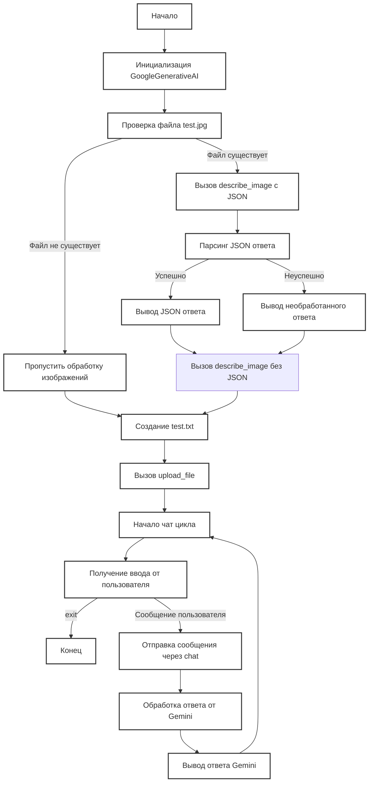
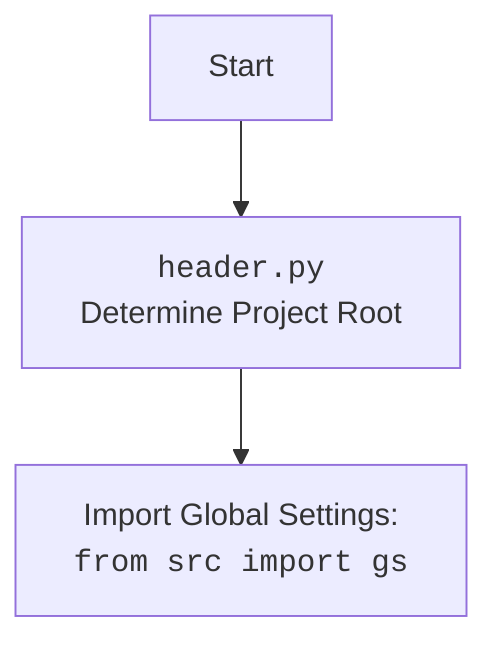

## ИНСТРУКЦИЯ:

Анализируй предоставленный код подробно и объясни его функциональность. Ответ должен включать три раздела:

1.  **<алгоритм>**: Опиши рабочий процесс в виде пошаговой блок-схемы, включая примеры для каждого логического блока, и проиллюстрируй поток данных между функциями, классами или методами.
2.  **<mermaid>**: Напиши код для диаграммы в формате `mermaid`, проанализируй и объясни все зависимости,
    которые импортируются при создании диаграммы.
    **ВАЖНО!** Убедитесь, что все имена переменных, используемые в диаграмме `mermaid`,
    имеют осмысленные и описательные имена. Имена переменных вроде `A`, `B`, `C`, и т.д., не допускаются!

    **Дополнительно**: Если в коде есть импорт `import header`, добавьте блок `mermaid` flowchart, объясняющий `header.py`:\
    ```mermaid
    flowchart TD
        Start --> Header[<code>header.py</code><br> Determine Project Root]

        Header --> import[Import Global Settings: <br><code>from src import gs</code>]
    ```

3.  **<объяснение>**: Предоставьте подробные объяснения:
    -   **Импорты**: Их назначение и взаимосвязь с другими пакетами `src.`.
    -   **Классы**: Их роль, атрибуты, методы и взаимодействие с другими компонентами проекта.
    -   **Функции**: Их аргументы, возвращаемые значения, назначение и примеры.
    -   **Переменные**: Их типы и использование.
    -   Выделите потенциальные ошибки или области для улучшения.

Дополнительно, постройте цепочку взаимосвязей с другими частями проекта (если применимо).

Это обеспечивает всесторонний и структурированный анализ кода.
## Формат ответа: `.md` (markdown)
**КОНЕЦ ИНСТРУКЦИИ**

## <алгоритм>

1.  **Инициализация `GoogleGenerativeAI`**:
    -   Создается экземпляр класса `GoogleGenerativeAI`.
    -   Пример: `ai = GoogleGenerativeAI(api_key=gs.credentials.gemini.api_key, system_instruction=system_instruction)`
    -   Передаются: API ключ, имя модели (по умолчанию "gemini-2.0-flash-exp") и системная инструкция.
2.  **Проверка наличия файла изображения**:
    -   Проверяется существует ли файл изображения `test.jpg` по указанному пути.
    -   Пример: `image_path = Path(r"test.jpg")`, `if not image_path.is_file(): ...`
3.  **Вызов `describe_image` с JSON форматом**:
    -   Если файл существует, вызывается метод `describe_image` для получения описания изображения с промптом в JSON формате.
    -   Пример: `description = await ai.describe_image(image_path, prompt=prompt)`.
    -   Промпт: `"Проанализируй это изображение. Выдай ответ в формате JSON, где ключом будет имя объекта, а значением его описание. Если есть люди, опиши их действия."`
    -   Обработка ответа: Если описание получено, пытаемся распарсить его как JSON. Если JSON распарсить не удалось, выводим полученный текст.
4.  **Вызов `describe_image` без JSON формата**:
    -   Вызывается метод `describe_image` для получения текстового описания изображения.
    -   Пример: `description = await ai.describe_image(image_path, prompt=prompt)`
    -   Промпт: `"Проанализируй это изображение. Перечисли все объекты, которые ты можешь распознать."`
    -   Обработка ответа: Выводится полученный текстовый ответ.
5.  **Создание и загрузка файла**:
    -   Создается текстовый файл `test.txt` и записывается в него строка "Hello, Gemini!".
    -   Пример: `file_path = Path('test.txt')`, `with open(file_path, "w") as f: f.write("Hello, Gemini!")`.
    -   Вызывается метод `upload_file` для загрузки файла в API.
    -   Пример: `file_upload = await ai.upload_file(file_path, 'test_file.txt')`
6.  **Интерактивный чат**:
    -   Запускается бесконечный цикл.
    -   Пользователь вводит сообщение.
    -   Если введено "exit", цикл завершается.
    -   Вызывается метод `chat`, чтобы отправить сообщение пользователя и получить ответ от модели.
    -   Пример: `ai_message = await ai.chat(user_message)`.
    -   Выводится ответ модели или сообщение об ошибке.
7.  **Запуск `main`**:
    -   Запускается асинхронная функция `main` в основном потоке.
    -   Пример: `asyncio.run(main())`

## <mermaid>



## <объяснение>

### Импорты:
-   `asyncio`: Используется для асинхронного программирования, позволяя выполнять операции неблокирующим образом. В контексте кода, применяется для асинхронного вызова API Gemini и для работы с асинхронным вводом/выводом (например, в методе `describe_image`, `upload_file` и `chat`).
-   `pathlib.Path`: Представляет пути к файлам и директориям. Упрощает работу с файловыми путями, например, при проверке наличия файла `test.jpg`.
-   `src.ai.gemini.GoogleGenerativeAI`: Импортирует класс `GoogleGenerativeAI`, который инкапсулирует логику взаимодействия с API Google Gemini.
-   `src.gs`: Импортирует глобальные настройки проекта (конфигурации, ключи API и т.д.) из файла `src/gs.py`.
-   `src.utils.jjson.j_loads`:  Импортирует функцию `j_loads` для безопасного разбора JSON-строк.
### Классы:
-   `GoogleGenerativeAI`:
    -   **Роль**: Класс предоставляет высокоуровневый интерфейс для взаимодействия с API Google Gemini. Он инкапсулирует логику отправки запросов, обработки ответов и управления историей чата.
    -   **Атрибуты**:
        -   `api_key` (str): API-ключ Google Gemini.
        -   `model_name` (str): Имя используемой модели Gemini (по умолчанию "gemini-2.0-flash-exp").
        -   `generation_config` (Dict): Конфигурация генерации.
        -   `system_instruction` (Optional[str]): Системные инструкции для модели.
    -   **Методы**:
        -   `__init__`: Конструктор класса, инициализирует экземпляр с API ключом, именем модели, конфигурацией и системной инструкцией.
        -   `ask`: Отправляет текстовый запрос и возвращает ответ.
        -   `chat`: Отправляет сообщение в чат и сохраняет историю.
        -   `describe_image`: Описывает изображение по пути к файлу или байтам и возвращает текстовое описание.
        -   `upload_file`: Загружает файл в API Gemini.
### Функции:
-   `main()`:
    -   **Аргументы**: Нет.
    -   **Возвращаемое значение**: Нет. Функция асинхронная.
    -   **Назначение**: Главная асинхронная функция программы. Она демонстрирует использование класса `GoogleGenerativeAI` для описания изображений, загрузки файлов и ведения диалогов.
    -   **Пример**: Запускается как `asyncio.run(main())`.
### Переменные:
-   `system_instruction` (str): Системная инструкция для модели Gemini.
-   `ai` (`GoogleGenerativeAI`): Экземпляр класса `GoogleGenerativeAI`.
-   `image_path` (`Path`): Путь к файлу изображения.
-   `prompt` (str): Текстовый промпт для модели.
-   `description` (Optional[str]): Описание изображения, возвращаемое `describe_image`.
-  `parsed_description` (Optional[dict]) : Распарсенное JSON описание изображения.
-  `file_path` (`Path`): Путь к текстовому файлу.
-   `file_upload` (bool): Результат загрузки файла (True или False).
-   `user_message` (str): Сообщение, введенное пользователем.
-   `ai_message` (Optional[str]): Ответ модели Gemini на сообщение пользователя.

### Объяснение
- Код представляет собой пример использования класса `GoogleGenerativeAI` для взаимодействия с API Google Gemini. Основной функционал состоит в том, чтобы загружать изображения, описывать их, загружать файлы и вести диалог с моделью.
- `main()` является примером использования всех основных функций. Он проверяет наличие файла `test.jpg`, отправляет запрос на описание изображения в JSON формате, обрабатывает ответ, затем запрашивает описание в текстовом формате. После чего создает файл `test.txt` и загружает его в Gemini API. В конце запускается интерактивный чат.
- Код использует асинхронные функции для выполнения IO-операций, что позволяет эффективно использовать ресурсы.
- В коде используется модуль `pathlib` для работы с файловыми путями, что делает его более читаемым и кроссплатформенным.
- Для сохранения и загрузки истории чата используются JSON и текстовые файлы.
- Код обрабатывает ошибки, такие как сетевые сбои и ошибки API, с помощью повторных попыток, что повышает надежность программы.
- Управление логированием происходит с помощью библиотеки `src.utils.logger`
- В `config.json` можно менять настройки приложения (пути к файлам, api ключ, и т.д.)

### Потенциальные ошибки и улучшения
-  **Отсутствие `test.jpg`**: Если файл `test.jpg` не найден, программа выведет сообщение об ошибке и перейдет к загрузке файла и чату, что может быть неочевидным для пользователя.
-  **Обработка JSON**:  Обработка JSON ответа производится через `try/except`, что может быть недостаточно информативно при возникновении ошибки.
-  **Необработанные ошибки `upload_file`**: Метод `upload_file` возвращает `bool`, но в коде не обрабатывается возможная ошибка загрузки файла (возврат `False`).
-  **Жестко закодированные пути**:  Использование жестко закодированного пути к `test.jpg` ограничивает гибкость программы. Необходимо сделать его либо конфигурируемым, либо давать пользователю возможность выбрать файл.
-  **Зависимость от наличия `config.json`**: Приложение зависит от наличия файла конфигурации, что может привести к проблемам, если файл отсутствует или имеет неправильную структуру. Необходимо добавить проверку наличия и корректности файла.
-  **Улучшить логику `describe_image`**:  Если описание изображения не получается, программа просто выводит сообщение об ошибке. Было бы лучше добавить подробности ошибки.
-  **Интерактивный чат**: Чат не очищает консоль. Было бы удобно добавить команду для очистки консоли или сделать более понятный вывод сообщений.
-  **Зависимости**: В коде не описаны все зависимости.

### Связь с другими частями проекта
-   `src.ai.gemini`: Класс `GoogleGenerativeAI` является частью пакета `src.ai.gemini`, который содержит логику интеграции с Google Gemini API.
-   `src.gs`:  Используется для доступа к глобальным настройкам и API ключам, что позволяет избежать жесткого кодирования.
-   `src.utils.jjson`: Функция `j_loads` используется для безопасного парсинга JSON.
-  `src.utils.logger` - используется для логгирования ошибок, диалогов.