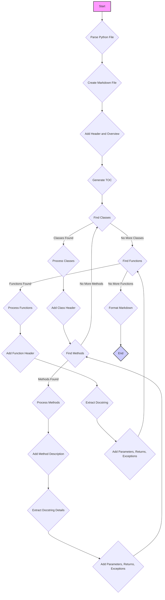

## ИНСТРУКЦИЯ:

### <алгоритм>

1. **Инициализация**:
   - Начать процесс создания документации.
   - Получить на вход Python-файл.

2. **Подготовка документации**:
   - Создать markdown-файл с соответствующим именем.
   - Добавить начальный заголовок в формате Markdown `# Название модуля`.
   - Добавить краткое описание модуля под заголовком `## Обзор`.
   - Сгенерировать оглавление в начале файла (TOC), включающее ссылки на разделы классов и функций.

3. **Обработка классов**:
   - Найти все классы в Python-файле.
   - Для каждого класса:
     - Создать заголовок `### ClassName`.
     - Добавить описание класса.
     - Найти все методы класса.
     - Для каждого метода:
        - Добавить описание метода в разделе `**Методы**`.
        - Извлечь документацию из docstring метода (если есть).
        - Добавить подробное описание параметров, возвращаемых значений и исключений (если есть).

4. **Обработка функций**:
   - Найти все функции в Python-файле.
   - Для каждой функции:
     - Создать заголовок `### function_name`.
     - Извлечь описание функции из docstring.
     - Добавить описание функции.
     - Добавить описание параметров, возвращаемых значений и исключений (если есть).

5. **Форматирование и завершение**:
   - Применить синтаксис Markdown для всех заголовков, списков и ссылок.
   - Завершить запись в Markdown-файл.

### <mermaid>

**Описание зависимостей `mermaid`:**

Диаграмма `mermaid` описывает последовательность шагов, необходимых для создания документации для Python-файла в формате Markdown.

- `Start` (A): Начало процесса.
- `Parse Python File` (B): Анализ входного Python файла.
- `Create Markdown File` (C): Создание markdown-файла для документации.
- `Add Header and Overview` (D): Добавление основного заголовка и обзора.
- `Generate TOC` (E): Генерация оглавления для навигации по документу.
- `Find Classes` (F): Поиск всех классов в Python файле.
- `Process Classes` (G): Обработка найденных классов.
- `Add Class Header` (H): Добавление заголовка для класса.
- `Find Methods` (I): Поиск всех методов класса.
- `Process Methods` (J): Обработка найденных методов.
- `Add Method Description` (K): Добавление описания метода.
- `Extract Docstring Details` (L): Извлечение информации из docstring метода.
- `Add Parameters, Returns, Exceptions` (M): Добавление описания параметров, возвращаемых значений и исключений метода.
- `Find Functions` (N): Поиск всех функций в Python файле.
- `Process Functions` (O): Обработка найденных функций.
- `Add Function Header` (P): Добавление заголовка для функции.
- `Extract Docstring` (Q): Извлечение информации из docstring функции.
- `Add Parameters, Returns, Exceptions` (R): Добавление описания параметров, возвращаемых значений и исключений функции.
- `Format Markdown` (S): Форматирование документации с использованием синтаксиса Markdown.
- `End` (T): Завершение процесса.

### <объяснение>

**Общая идея**:
Инструкция описывает процесс автоматической генерации документации для Python-файлов в формате Markdown. Основная цель - упростить процесс документирования кода, предоставляя структурированное описание классов, функций и их составляющих.

**Импорты:**
В предоставленном фрагменте кода нет явных импортов, но, по логике работы, скрипт должен иметь доступ к функционалу для чтения Python-файлов, извлечения классов, методов, функций, их docstring, и записи данных в файл. 
-  `src` импортируются через `from src import gs`, где `gs` - это глобальные настройки.  

**Классы:**
В предоставленном коде не содержатся описания классов, однако он предполагает их обработку. 
-  В процессе обработки классов, каждый класс будет представлен в документации как секция, включая заголовок, описание и список методов.
- Методы класса будут представлены с их описанием, параметрами, возвращаемыми значениями и исключениями.

**Функции:**
Код описывает процесс обработки функций Python. Каждая функция будет описана в документации с:
- Именем функции (заголовок).
- Кратким описанием из docstring.
- Описанием параметров, их типами и назначениями.
- Описанием возвращаемых значений и их типами.
- Описанием вызываемых исключений.

**Переменные:**
В явном виде переменные не представлены. Но в процессе выполнения будут использоваться переменные для хранения:
- Имени файла.
- Содержимого файла.
- Классов и методов, найденных в коде.
- Функций, найденных в коде.
- Описаний, извлеченных из docstring.

**Потенциальные ошибки и области для улучшения**:
- **Обработка сложных docstring**: Парсинг docstring может быть сложным, если docstring содержит нестандартное форматирование.
- **Связи с другими модулями**: В текущем описании не рассматривается обработка связей между различными модулями.
- **Обработка статических методов и свойств классов**: Обработка статических методов и свойств классов не описана явно.
- **Генерация примеров**: Было бы полезно добавить возможность генерации примеров использования классов и функций.

**Взаимосвязи с другими частями проекта**:
- Этот код является частью процесса разработки программного обеспечения.
- Он связан с другими частями проекта через:
   - Чтение исходных Python-файлов, которые могут быть расположены в других частях проекта.
   - Создание markdown-файлов, которые могут использоваться для документирования проекта.
   - Использование `src.gs` для получения доступа к глобальным настройкам проекта.

**Дополнительно**:
Для улучшения документации можно добавить:
- Возможность настройки формата Markdown.
- Поддержку различных стилей docstring.
- Возможность интеграции с системами непрерывной интеграции (CI).
- Опцию для фильтрации исключений и параметров, не требующих документирования.