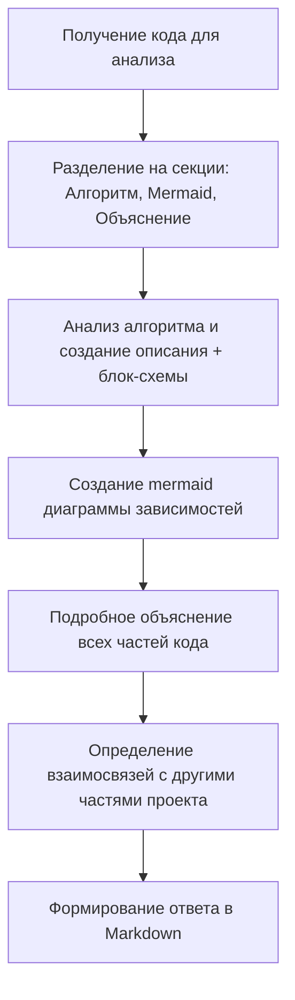

## АНАЛИЗ ИНСТРУКЦИЙ ОБРАБОТКИ КОДА

### 1. <алгоритм>

Инструкция определяет процесс анализа кода, который должен быть выполнен моделью. Алгоритм можно описать следующими шагами:

1.  **Получение кода**: Модель получает на вход код для анализа. Это может быть код на Python или другом языке.
    *   **Пример**: `input_code` из запроса - это место где размещают код для анализа.
2.  **Разделение на секции**: Модель должна структурировать свой ответ в три секции:
    *   `Алгоритм`: Описание рабочего процесса в виде пошаговой блок-схемы.
    *   `mermaid`: Код для диаграммы в формате mermaid, описывающий зависимости.
    *   `объяснение`: Подробное объяснение кода.
3.  **Анализ алгоритма**:
    *   Модель формирует описание алгоритма (текстом) и блок-схему.
        *   **Пример**: Описание, как код работает, в каких случаях он выполняется.
4.  **Создание диаграммы**:
    *   Модель создает mermaid-диаграмму, представляющую зависимости кода.
    *   **Пример**: Диаграмма классов, потока данных между функциями.
5.  **Подробное объяснение**:
    *   Модель предоставляет подробное объяснение всех частей кода.
        *   **Пример**: Объяснение назначения импортов, классов, функций, переменных, потенциальных ошибок.
6.  **Цепочка взаимосвязей**:
    *   Модель определяет взаимосвязи между анализируемым кодом и другими частями проекта (если таковые имеются).
    *   **Пример**: Указывает, какие модули используют данный код и наоборот.
7.  **Формирование ответа**:
    *   Модель форматирует ответ в формате Markdown (`.md`).

### 2. <mermaid>

**Разбор диаграммы:**

*   **graph TD**: Определяет тип диаграммы как направленный граф (top-down).
*   **A[Получение кода для анализа]**: Начальный узел, представляющий этап получения кода для анализа.
*   **B[Разделение на секции: Алгоритм, Mermaid, Объяснение]**: Узел, описывающий разделение ответа на 3 секции.
*   **C[Анализ алгоритма и создание описания + блок-схемы]**: Узел, описывающий этап анализа алгоритма.
*   **D[Создание mermaid диаграммы зависимостей]**: Узел, описывающий этап создания диаграммы зависимостей.
*   **E[Подробное объяснение всех частей кода]**: Узел, описывающий этап подробного объяснения кода.
*   **F[Определение взаимосвязей с другими частями проекта]**: Узел, описывающий этап выявления взаимосвязей с другими частями проекта.
*   **G[Формирование ответа в Markdown]**: Узел, описывающий этап формирования ответа в формате Markdown.
*   **-->**:  Стрелки, обозначающие последовательность выполнения этапов.

### 3. <объяснение>

**Импорты:**

В данном случае, конкретных импортов в тексте инструкций нет, поскольку текст описывает процесс анализа кода, а не сам код. Однако, в примерах, указаны импорты: `from src import gs`, подразумевая, что могут импортироваться глобальные настройки из пакета `src`, и `import header`, подразумевая необходимость рассмотреть `header.py`.

**Классы:**

В инструкциях классы не используются. Инструкции описывают процесс анализа, а не являются кодом, содержащим классы.

**Функции:**

Инструкции описывают функции, которые должны выполняться моделью для анализа кода. По сути, модель должна реализовывать функции анализа, создания диаграмм и текстового объяснения.

**Переменные:**

Переменные, используемые в тексте, - это концептуальные понятия, такие как `input_code` (входной код), `алгоритм`, `mermaid`, `объяснение`, которые описывают структуру данных и процесс анализа, а не переменные в традиционном понимании кода.

**Потенциальные ошибки и области для улучшения:**

*   **Сложность обработки разных языков**: Инструкция не определяет, как обрабатывать код, написанный на разных языках программирования.
*   **Зависимость от качества кода**: Качество анализа напрямую зависит от качества входного кода. Неструктурированный, неочевидный код может привести к неточному анализу.
*   **Сложность понимания сложных зависимостей**: Сложные зависимости в коде могут быть не полностью отражены в диаграмме `mermaid`.
*   **Размытость требований**: Запрос "подробное объяснение" можно трактовать по-разному, что может привести к несогласованным ответам.

**Цепочка взаимосвязей:**

Инструкция сама по себе является частью более крупной системы - системы обработки кода, включающей:

*   **Модель**: Выполняет анализ, опираясь на данную инструкцию.
*   **Интерфейс ввода**: Предоставляет входной код модели.
*   **Интерфейс вывода**: Форматирует и выдает результат анализа пользователю.
*   **Внешние библиотеки**: Вспомогательные инструменты для анализа и построения диаграмм.

Данная инструкция задает основные принципы анализа и взаимодействия этих частей, обеспечивая структурированный и понятный результат.