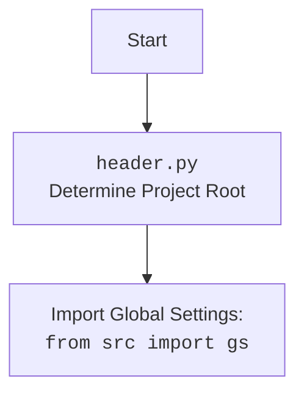

## <алгоритм>

1. **Импорт модулей**:
    - Импортируется модуль `header` для определения корневой директории проекта.
    - Импортируется `gs` из пакета `src` для доступа к глобальным настройкам, включая пути.
    - Импортируется `PDFUtils` из `src.utils.pdf` для конвертации PDF в HTML.

2. **Определение функции `pdf2html`**:
    - Функция `pdf2html` принимает два аргумента: `pdf_file` (путь к PDF файлу) и `html_file` (путь для сохранения HTML файла).
    - Внутри функции вызывается метод `PDFUtils.pdf_to_html` для непосредственной конвертации PDF в HTML.

   **Пример:**
   ```python
   def pdf2html(pdf_file, html_file):
       PDFUtils.pdf_to_html(pdf_file, html_file)
   # pdf_file = "/path/to/document.pdf"
   # html_file = "/path/to/document.html"
   # PDFUtils.pdf_to_html("/path/to/document.pdf", "/path/to/document.html") # внутри функции
   ```

3. **Определение путей к файлам**:
    - `pdf_file` устанавливается как путь к PDF файлу, расположенному в директории `assets/materials`, используя пути, сконфигурированные в `gs`.
    - `html_file` устанавливается как путь для сохранения HTML файла в той же директории, но с другим именем.

   **Пример:**
   ```python
   pdf_file = gs.path.root / 'assets' / 'materials' / '101_BASIC_Computer_Games_Mar75.pdf'
   # gs.path.root = "/home/user/project"
   # pdf_file = "/home/user/project/assets/materials/101_BASIC_Computer_Games_Mar75.pdf"
   html_file = gs.path.root / 'assets' / 'materials' / '101_BASIC_Computer_Games_Mar75.html'
   # html_file = "/home/user/project/assets/materials/101_BASIC_Computer_Games_Mar75.html"
   ```

4. **Вызов функции `pdf2html`**:
    - Функция `pdf2html` вызывается с полученными путями `pdf_file` и `html_file`, что запускает процесс конвертации.

   **Пример:**
   ```python
   pdf2html(pdf_file, html_file)
   # pdf2html("/home/user/project/assets/materials/101_BASIC_Computer_Games_Mar75.pdf", "/home/user/project/assets/materials/101_BASIC_Computer_Games_Mar75.html")
   ```

## <mermaid>

```mermaid
flowchart TD
    Start --> ImportModules[Импорт модулей: <br><code>header</code>, <code>gs</code>, <code>PDFUtils</code>]
    ImportModules --> DefinePdf2Html[Определение функции <code>pdf2html(pdf_file, html_file)</code>]
    DefinePdf2Html --> CallPdfUtils[Вызов <code>PDFUtils.pdf_to_html(pdf_file, html_file)</code>]
    DefinePdf2Html --> DefinePdfFilePath[Определение пути к PDF файлу: <code>pdf_file</code>]
    DefinePdfFilePath --> DefineHtmlFilePath[Определение пути к HTML файлу: <code>html_file</code>]
    DefineHtmlFilePath --> CallPdf2Html[Вызов функции <code>pdf2html(pdf_file, html_file)</code>]
    CallPdfUtils --> End
    CallPdf2Html --> End
    
    subgraph "PDF to HTML Conversion"
    Start
    ImportModules
    DefinePdf2Html
    CallPdfUtils
    DefinePdfFilePath
    DefineHtmlFilePath
    CallPdf2Html
    End
    end
```



## <объяснение>

**Импорты:**

*   `import header`: Этот импорт, вероятно, предназначен для определения корневой директории проекта. Это позволяет коду быть переносимым и независимым от конкретного места его запуска. Скорее всего, `header.py` содержит логику для поиска или определения корневой директории проекта.
*   `from src import gs`: Импортирует объект `gs` (предположительно "global settings") из пакета `src`. Этот объект, вероятно, содержит глобальные настройки проекта, такие как пути к различным директориям, например, `gs.path.root`.
*   `from src.utils.pdf import PDFUtils`: Импортирует класс `PDFUtils` из модуля `pdf` в пакете `src.utils`. Класс `PDFUtils` предназначен для обработки PDF файлов, в частности, для конвертации их в HTML.

**Классы:**

*   `PDFUtils`: Этот класс, вероятно, содержит статический метод `pdf_to_html`, который принимает пути к PDF и HTML файлам и выполняет их конвертацию. Он отвечает за всю логику, связанную с обработкой PDF файлов.

**Функции:**

*   `pdf2html(pdf_file, html_file)`:
    *   Аргументы:
        *   `pdf_file`: Строка, представляющая путь к PDF файлу, который нужно конвертировать.
        *   `html_file`: Строка, представляющая путь к файлу, в который нужно сохранить HTML.
    *   Возвращаемое значение: Функция ничего не возвращает явно (`None`).
    *   Назначение: Функция является оберткой для вызова `PDFUtils.pdf_to_html` и служит для инкапсуляции процесса конвертации PDF в HTML.
    *   Пример:
        ```python
        pdf_file_path = "/path/to/document.pdf"
        html_file_path = "/path/to/document.html"
        pdf2html(pdf_file_path, html_file_path) # вызов функции с путями
        ```

**Переменные:**

*   `pdf_file`: Переменная типа `Path`, представляющая путь к PDF файлу.  Она формируется путем соединения `gs.path.root` (корневой каталог проекта) с относительными путями `assets/materials/101_BASIC_Computer_Games_Mar75.pdf`.
*   `html_file`: Переменная типа `Path`, представляющая путь к HTML файлу. Она формируется аналогичным образом, как и `pdf_file`, но с другим именем файла.

**Взаимосвязи с другими частями проекта:**

*   `header.py`: Определяет корень проекта.
*   `src/gs.py`: Содержит настройки проекта, включая путь к корневому каталогу `gs.path.root`, который используется для формирования полных путей к файлам.
*   `src/utils/pdf.py`: Содержит класс `PDFUtils`, который реализует логику конвертации PDF в HTML.

**Потенциальные ошибки и области для улучшения:**

*   **Обработка исключений:** Код не содержит явной обработки исключений. Если конвертация PDF в HTML по какой-то причине не удастся, это может привести к сбою программы. Следует добавить блок `try-except` для обработки возможных ошибок, например, если PDF файл не найден, или если возникли проблемы при конвертации.
*   **Конфигурируемые пути:** Пути к PDF и HTML файлам жестко заданы в коде. Можно сделать их более гибкими, например, передавая как аргументы командной строки или считывая из конфигурационного файла.
*   **Проверка наличия файлов:** Перед выполнением конвертации можно добавить проверку существования PDF файла.
*   **Расширение функциональности:** Можно добавить дополнительные параметры для управления процессом конвертации, например, разрешение или формат вывода HTML.

**Цепочка взаимосвязей:**

1.  `header.py` определяет корневую директорию проекта.
2.  `gs` из `src/gs.py` предоставляет доступ к глобальным настройкам и путям, включая корневую директорию.
3.  `pdf2html.py` использует `gs.path.root` для определения полных путей к файлам PDF и HTML.
4.  `pdf2html.py` вызывает `PDFUtils.pdf_to_html` для фактической конвертации PDF в HTML.
5. `src/utils/pdf.py` содержит класс `PDFUtils`, который выполняет конвертацию PDF в HTML.