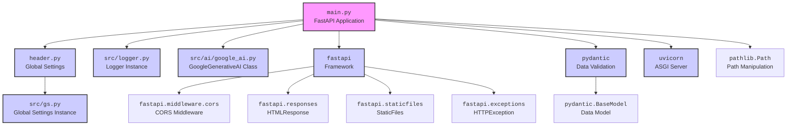
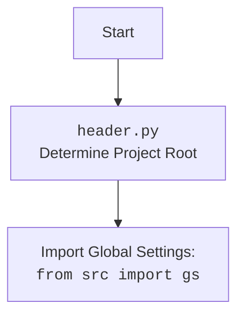

## АНАЛИЗ КОДА: `hypotez/src/endpoints/hypo69/desktop_assistant/main.py`

### 1. <алгоритм>

**Блок-схема:**

```mermaid
graph LR
    A[Начало: Запуск FastAPI] --> B(Инициализация: Настройка путей, CORS, загрузка зависимостей);
    B --> C{Создание экземпляра FastAPI app};
    C --> D[Подключение статических файлов: templates];
    D --> E{Определение роутов: "/", "/api/chat", "/locales/{lang}.json"};
    E --> F[GET /: Загрузка и отправка index.html];
    F --> G{Обработка ошибок};
    G -- Ошибка --> H[Возврат ошибки 500];
    G -- Успех --> I[Отправка HTMLResponse];
    E --> J[POST /api/chat: Обработка запроса чата];
    J --> K{Инициализация GoogleGenerativeAI (если не существует)};
    K --> L[Запрос ответа у модели];
    L --> M{Обработка ошибок};
    M -- Ошибка --> N[Возврат ошибки 500];
    M -- Успех --> O[Возврат ответа чата];
    E --> P[GET /locales/{lang}.json: Запрос локализации];
    P --> Q(Чтение файла локализации);
     Q --> R{Обработка ошибок};
    R -- FileNotFoundError --> S[Возврат ошибки 404];
    R -- JSONDecodeError --> T[Возврат ошибки 500];
     R -- Успех --> U[Возврат JSON локализации];
     R -- Ошибка --> V[Возврат ошибки 500];
    B --> W[Инициализация uvicorn для запуска сервера];
    W --> X[Запуск сервера на 127.0.0.1:8000];
    X --> Y[Конец: Сервер запущен];
    
    style A fill:#f9f,stroke:#333,stroke-width:2px
    style Y fill:#f9f,stroke:#333,stroke-width:2px
    style K fill:#ccf,stroke:#333,stroke-width:2px
    style Q fill:#ccf,stroke:#333,stroke-width:2px
    
```

**Примеры:**

1. **Инициализация путей:** `base_path` определяется как путь к каталогу `desktop_assistant`, `templates_path` указывает на каталог `templates` внутри `base_path`, `locales_path` на каталог `translations`.
   
2. **`GET /`:** При обращении к корню `/` сервера, происходит чтение файла `index.html` из директории `templates` и его отправка в виде HTML ответа. Если файл не найден или произошла ошибка, возвращается HTTP 500 ошибка.
   
3.  **`POST /api/chat`:** Получает JSON с полем `message`, которое передается модели GoogleGenerativeAI для получения ответа. Возвращает JSON с ответом или HTTP 500 ошибку в случае возникновения ошибки.

4.  **`GET /locales/{lang}.json`:** Запрашивает JSON файл локализации по языку,  например, `/locales/en.json`, читает соответствующий файл и возвращает его. В случае ошибок (например, файл не найден, JSON невалиден) возвращается HTTP 404 или 500 ошибка.

### 2. <mermaid>


**Разъяснение зависимостей:**

1.  `main.py`: Основной файл, содержащий FastAPI приложение.
2.  `header.py`: Модуль для определения базового пути проекта, импортируется для настройки путей к файлам.
3.  `src/gs.py`: Содержит глобальные настройки проекта (пути, ключи и т.д.).
4.  `src/logger.py`: Модуль для логирования событий в приложении.
5.  `src/ai/google_ai.py`: Модуль, содержащий класс `GoogleGenerativeAI`,  для взаимодействия с Google Gemini API.
6.  `fastapi`: Веб-фреймворк для создания API.
7. `fastapi.middleware.cors`: Промежуточный слой для обработки CORS (Cross-Origin Resource Sharing) запросов.
8.  `fastapi.responses`: Содержит классы для формирования ответов API, в частности, `HTMLResponse`.
9.  `fastapi.staticfiles`: Используется для обработки и доставки статических файлов (HTML, CSS, JS).
10. `fastapi.exceptions`:  Содержит `HTTPException` для  возврата HTTP ошибок.
11. `pydantic`: Используется для валидации данных.
12. `pydantic.BaseModel`: Базовый класс для создания моделей данных.
13. `uvicorn`: ASGI сервер для запуска FastAPI приложения.
14. `pathlib.Path`:  Модуль для работы с путями файлов.


### 3. <объяснение>

**Импорты:**

-   `from __future__ import annotations`:  Позволяет использовать аннотации типов в Python до их официального включения в язык.

-   `import sys`: Используется для доступа к некоторым переменным и функциям, связанным с интерпретатором.

-   `from pathlib import Path`:  Класс `Path` для работы с путями файлов.

-   `from types import SimpleNamespace`:  Создание простых объектов с атрибутами.

-   `from fastapi.middleware.cors import CORSMiddleware`:  Используется для настройки CORS (Cross-Origin Resource Sharing).

-   `from fastapi import FastAPI, HTTPException`: Основные компоненты FastAPI: класс `FastAPI` для создания приложения и `HTTPException` для генерации HTTP ошибок.

-   `from fastapi.responses import HTMLResponse`: Класс для возврата HTML-контента.

-   `from fastapi.staticfiles import StaticFiles`: Для обработки статических файлов.

-   `from pydantic import BaseModel`: Базовый класс для создания моделей данных с валидацией.

-   `import uvicorn`: ASGI-сервер для запуска FastAPI приложения.

-   `import json`:  Для работы с JSON-данными.

-   `import header`: Модуль для определения базового пути проекта.

-   `from src import gs`:  Глобальные настройки проекта, хранятся в  `src/gs.py`.

-   `from src.logger import logger`:  Логгер для записи событий в приложение.

-   `from src.ai import GoogleGenerativeAI`: Класс для взаимодействия с Google Gemini API.

**Переменные:**

-   `base_path`: Путь к директории `hypo69/desktop_assistant`, определенный относительно корня проекта.

-   `templates_path`: Путь к директории с HTML шаблонами (`templates`).

-   `locales_path`: Путь к директории с файлами локализации (`translations`).

-   `app`: Экземпляр класса `FastAPI`.

-   `model`:  Экземпляр `GoogleGenerativeAI`, создается при первом обращении к `/api/chat`.

-   `api_key`: API ключ для доступа к Google Gemini API.

-   `system_instruction`: Инструкция для модели.

**Классы:**

-   `ChatRequest(BaseModel)`: Класс для валидации JSON, получаемого при запросе `/api/chat`. Определяет структуру ожидаемого JSON.

    ```python
    class ChatRequest(BaseModel):
      message: str
    ```

**Функции:**

-   `root()`:
    -   Обрабатывает GET-запросы к корневому URL ("/").
    -   Читает файл `index.html` из директории `templates` и возвращает его как HTMLResponse.
    -   Если происходит ошибка чтения файла или файл не найден, то возвращает `HTTPException` с кодом 500.

-   `chat(request: ChatRequest)`:
    -   Обрабатывает POST-запросы к `/api/chat`.
    -   Получает сообщение из JSON тела запроса в виде объекта `ChatRequest`.
    -   Если `model` не инициализирован, то создает экземпляр `GoogleGenerativeAI`.
    -   Передает сообщение модели и возвращает ответ в формате JSON.
    -   В случае ошибки возвращает `HTTPException` с кодом 500.

- `get_locale_file(lang: str)`:
    - Принимает строковой параметр `lang` (например, "en").
    - Формирует путь к файлу JSON локализации (`locales_path/lang.json`).
    - Читает JSON файл и возвращает его содержимое.
    - Возвращает `HTTPException` с кодом 404, если файл не найден, код 500, если ошибка JSON или другая ошибка.

- `locales(lang:str)`:
    -   Обрабатывает GET-запросы к `/locales/{lang}.json`
    -   Использует функцию `get_locale_file` и возвращает JSON локализации для указанного языка.

**Цепочка взаимосвязей:**

1.  `main.py` использует `header.py` для получения базового пути проекта, далее `gs.py` для загрузки глобальных настроек.
2.  `main.py` использует  `logger.py` для логирования событий.
3. `main.py` использует  `GoogleGenerativeAI` из `src.ai` для генерации ответов.
4. `main.py` использует `fastapi` для создания API, обрабатывает запросы и возвращает ответы.

**Потенциальные ошибки и улучшения:**

1.  **Обработка ошибок**:  Обработка ошибок во всех функциях реализована с помощью try-except блоков, что является хорошей практикой.  Однако, можно добавить более детальное логгирование и обработку ошибок.
2.  **Конфигурация:** Некоторые параметры, такие как `api_key`, `model_name`, `host`, `port`, можно вынести в файл настроек или переменные окружения для большей гибкости.
3.  **Системные инструкции:** Для `GoogleGenerativeAI`  можно добавить возможность загрузки системных инструкций из внешнего файла или переменной окружения.
4.  **Синхронность:**  `async/await` используется правильно для асинхронных операций.

В целом, код хорошо структурирован, придерживается принципов FastAPI и содержит базовую логику для чат-бота.