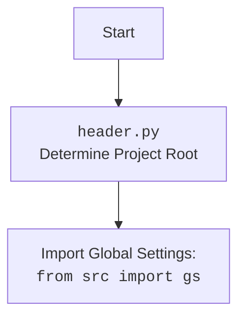

## АНАЛИЗ КОДА `hypotez/src/endpoints/prestashop/_examples/header.py`

### 1. <алгоритм>

**Начало**: Скрипт начинается с определения пути к корневой директории проекта `hypotez`.

1.  **Определение корня проекта**:
    *   Получение текущей рабочей директории `os.getcwd()`.
    *   Поиск последнего вхождения подстроки 'hypotez' в текущей рабочей директории.
    *   Извлечение части строки до 'hypotez' и добавление длины 'hypotez' + 1 (чтобы захватить  'hypotez').
    *   Создание объекта `Path` из полученной строки, представляющего путь к корню проекта `dir_root`.
     **Пример:** Если `os.getcwd()` возвращает `/home/user/projects/hypotez/src/endpoints/prestashop`, `dir_root` станет `/home/user/projects/hypotez/`.

2.  **Добавление корневой директории в `sys.path`**:
    *   Преобразование `dir_root` в строку `str(dir_root)`.
    *   Добавление пути к корневой директории в список путей поиска модулей Python (`sys.path`).
    *   Это позволяет импортировать модули из корневой директории и ее поддиректорий.
     **Пример:** `sys.path` пополняется путем `/home/user/projects/hypotez/` .

3.  **Определение директории `src`**:
    *   Создание объекта `Path` для директории `src` внутри корневой директории `dir_src = Path (dir_root, 'src')`.
    *   Добавление директории `src` в список `sys.path`.

4.  **Импорт модулей:**
    *   Импортируются стандартные модули: `sys`, `os`, `pathlib.Path`, `json`, `re`.
    *   Импортируются пользовательские модули из пакета `src`:
        *   `gs` (предположительно, глобальные настройки).
        *   `Supplier` (предположительно, класс поставщика) из `src.suppliers`.
        *   `Product`, `ProductFields`, `ProductFieldsLocators` (предположительно, классы для работы с продуктами) из `src.product`.
        *   `Category` (предположительно, класс категории) из `src.category`.
        *   `j_dumps`, `j_loads`, `pprint`, `save_text_file` (предположительно, утилиты для работы с JSON) из `src.utils.jjson`.
        *   `logger` (предположительно, класс для логирования) из `src.logger.logger`.
         `StringNormalizer` , `ProductFieldsValidator` предположительно классы для валидации.
5.  **Вывод пути к корню проекта**:
    *   Вывод пути к корневой директории проекта `dir_root` в консоль.
     **Пример:**  `/home/user/projects/hypotez/` будет выведено в консоль.

**Конец**: Скрипт завершается после вывода пути к корневой директории и импорта всех необходимых модулей.

### 2. <mermaid>

```mermaid
flowchart TD
    Start[Начало] --> GetWorkingDirectory[Получение текущей рабочей директории: <code>os.getcwd()</code>];
    GetWorkingDirectory --> FindHypotez[Поиск последнего вхождения 'hypotez' ];
    FindHypotez --> ExtractRootPath[Извлечение корня проекта];
    ExtractRootPath --> CreatePathObject[Создание объекта Path: <code>dir_root</code>];
    CreatePathObject --> AppendRootToSysPath[Добавление <code>dir_root</code> в <code>sys.path</code>];
    AppendRootToSysPath --> CreateSrcPathObject[Создание объекта Path для <code>src</code>: <code>dir_src</code>];
    CreateSrcPathObject --> AppendSrcToSysPath[Добавление <code>dir_src</code> в <code>sys.path</code> ];
    AppendSrcToSysPath --> ImportModules[Импорт модулей];
    ImportModules --> PrintRootPath[Вывод <code>dir_root</code> в консоль];
    PrintRootPath --> End[Конец];
    
    style Start fill:#f9f,stroke:#333,stroke-width:2px
    style End fill:#ccf,stroke:#333,stroke-width:2px
    style GetWorkingDirectory fill:#ccf,stroke:#333,stroke-width:2px
    style FindHypotez fill:#ccf,stroke:#333,stroke-width:2px
    style ExtractRootPath fill:#ccf,stroke:#333,stroke-width:2px
    style CreatePathObject fill:#ccf,stroke:#333,stroke-width:2px
    style AppendRootToSysPath fill:#ccf,stroke:#333,stroke-width:2px
    style CreateSrcPathObject fill:#ccf,stroke:#333,stroke-width:2px
    style AppendSrcToSysPath fill:#ccf,stroke:#333,stroke-width:2px
    style ImportModules fill:#ccf,stroke:#333,stroke-width:2px
    style PrintRootPath fill:#ccf,stroke:#333,stroke-width:2px
```



**Объяснение `mermaid`:**

*   **flowchart TD**:  Определяет тип диаграммы как блок-схему (flowchart), и расположение элементов сверху вниз (TD - top down).
*   **Start[Начало]**: Начало процесса, определенное как "Начало".
*   **GetWorkingDirectory[Получение текущей рабочей директории: `os.getcwd()`]**:  Получение текущей рабочей директории при помощи `os.getcwd()`.
*   **FindHypotez[Поиск последнего вхождения 'hypotez']**:  Поиск вхождения подстроки 'hypotez' в строке пути.
*   **ExtractRootPath[Извлечение корня проекта]**: Извлечение пути к корневой директории на основе найденной позиции 'hypotez'.
*    **CreatePathObject[Создание объекта Path: `dir_root`]**: Создание объекта Path из извлеченного пути к корню проекта.
*   **AppendRootToSysPath[Добавление `dir_root` в `sys.path`]**:  Добавление корневой директории в `sys.path` для поиска модулей.
*  **CreateSrcPathObject[Создание объекта Path для `src`: `dir_src`]**: Создание объекта Path для директории `src`.
*  **AppendSrcToSysPath[Добавление `dir_src` в `sys.path`]**:  Добавление директории `src` в `sys.path`.
*   **ImportModules[Импорт модулей]**: Импорт необходимых модулей для работы.
*   **PrintRootPath[Вывод `dir_root` в консоль]**: Вывод пути к корневой директории в консоль.
*   **End[Конец]**: Конец процесса, определенный как "Конец".

### 3. <объяснение>

**Импорты:**

*   `import sys`: Модуль `sys` предоставляет доступ к некоторым переменным и функциям, которые взаимодействуют с интерпретатором Python, в данном случае для работы с `sys.path` (путями поиска модулей).
*   `import os`: Модуль `os` предоставляет функции для взаимодействия с операционной системой, в данном случае используется `os.getcwd()` для получения текущей рабочей директории.
*   `from pathlib import Path`: Класс `Path` из модуля `pathlib` предоставляет более удобный способ работы с путями к файлам и директориям, чем стандартные строки.
*   `import json`:  Импорт модуля `json`, для работы с данными в формате JSON.
*   `import re`: Импорт модуля `re`, для работы с регулярными выражениями.
*   `from src import gs`: Импорт модуля `gs`, который, вероятно, содержит глобальные настройки приложения. Модуль находится в пакете `src`.
*   `from src.suppliers import Supplier`: Импорт класса `Supplier` из модуля `suppliers` в пакете `src`.
*   `from src.product import Product, ProductFields, ProductFieldsLocators`: Импорт классов `Product`, `ProductFields`, `ProductFieldsLocators` из модуля `product` в пакете `src`.
*   `from src.category import Category`: Импорт класса `Category` из модуля `category` в пакете `src`.
*   `from src.utils.jjson import j_dumps, j_loads, pprint, save_text_file`: Импорт функций для работы с JSON (`j_dumps`, `j_loads`, `pprint`) и для сохранения текста в файл (`save_text_file`) из модуля `jjson` в пакете `src.utils`.
*   `from src.logger.logger import logger`: Импорт объекта `logger` из модуля `logger` в пакете `src.logger`, используемого для логирования.
*  `StringNormalizer, ProductFieldsValidator`  - импорт классов валидации.

**Переменные:**

*   `dir_root`:  Объект типа `pathlib.Path`, представляющий путь к корневой директории проекта.
*   `dir_src`: Объект типа `pathlib.Path`, представляющий путь к директории `src` внутри проекта.

**Функции:**

В данном скрипте явно не определено ни одной функции. Он в основном состоит из настроек и импортов.

**Объяснение:**

Скрипт `header.py` служит для определения корневой директории проекта `hypotez`, и добавления этой директории, а так же директории `src` в `sys.path`. Это необходимо для того, чтобы модули из проекта могли импортироваться корректно независимо от текущей рабочей директории при запуске скрипта.  После определения корневой директории скрипт импортирует ряд модулей для дальнейшей работы, включая общие настройки (`gs`), классы для работы с продуктами (`Product`, `ProductFields`, `ProductFieldsLocators`), категориями (`Category`), поставщиками (`Supplier`), JSON (`j_dumps`, `j_loads`, `pprint`), логгер (`logger`), валидаторы (`StringNormalizer, ProductFieldsValidator`) и утилиты работы с файлами.

**Потенциальные проблемы и улучшения:**

1.  **Жестко закодированное имя проекта**:  Скрипт полагается на поиск подстроки `hypotez` в пути. Это может быть проблемой, если имя проекта изменится. Можно рассмотреть использование переменных окружения или файла конфигурации для определения корневой директории.
2.  **Относительные пути**: Скрипт манипулирует путями с помощью `os.getcwd()` и индексации строк. Использование `os.path.dirname` или `Path.parent` могло бы сделать код более читаемым и надежным.
3.  **Избыточный импорт**: Некоторые импортированные модули, вроде `json` и `re`, могут быть не использованы непосредственно в этом файле. Их можно удалить или переместить туда, где они действительно необходимы.
4.   **Отсутствие явной функции**: Весь скрипт выполняется в глобальном пространстве имен.  Было бы лучше обернуть основную логику в функцию для лучшей организации.
5.  **Повторяющийся код**:  Строка `sys.path.append (str (dir_root) )` повторяется.

**Взаимосвязи с другими частями проекта:**

Скрипт является важной частью всего проекта, поскольку он устанавливает корректные пути для импорта модулей из пакета `src`. Это позволяет другим скриптам и модулям внутри проекта корректно использовать общие ресурсы, настройки, и классы, такие как `Supplier`, `Product`, `Category`,  `logger`, утилиты `jjson`,  валидаторы. Он является основой для других модулей, зависящих от пакета `src`.