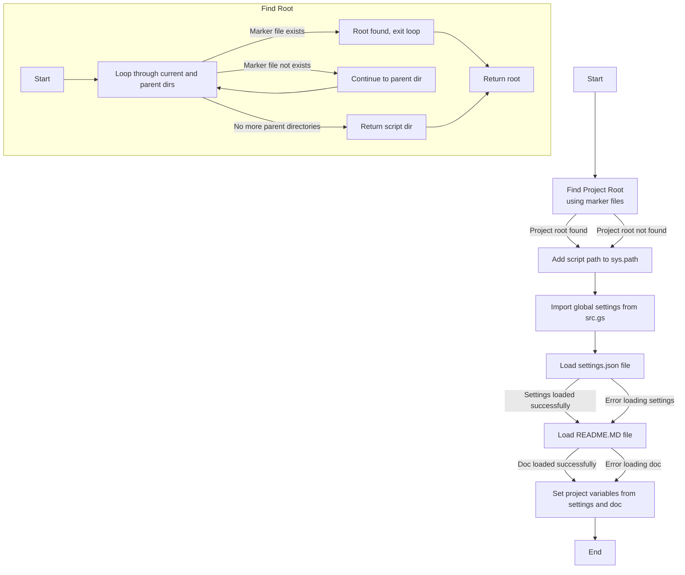

## ИНСТРУКЦИЯ:

Анализируй предоставленный код подробно и объясни его функциональность. Ответ должен включать три раздела:

1.  **<алгоритм>**: Опиши рабочий процесс в виде пошаговой блок-схемы, включая примеры для каждого логического блока, и проиллюстрируй поток данных между функциями, классами или методами.
2.  **<mermaid>**: Напиши код для диаграммы в формате `mermaid`, проанализируй и объясни все зависимости,
    которые импортируются при создании диаграммы.
    **ВАЖНО!** Убедитесь, что все имена переменных, используемые в диаграмме `mermaid`,
    имеют осмысленные и описательные имена. Имена переменных вроде `A`, `B`, `C`, и т.д., не допускаются!

    **Дополнительно**: Если в коде есть импорт `import header`, добавьте блок `mermaid` flowchart, объясняющий `header.py`:
    ```mermaid
    flowchart TD
        Start --> Header[<code>header.py</code><br> Determine Project Root]

        Header --> import[Import Global Settings: <br><code>from src import gs</code>]
    ```

3.  **<объяснение>**: Предоставьте подробные объяснения:
    *   **Импорты**: Их назначение и взаимосвязь с другими пакетами `src.`.
    *   **Классы**: Их роль, атрибуты, методы и взаимодействие с другими компонентами проекта.
    *   **Функции**: Их аргументы, возвращаемые значения, назначение и примеры.
    *   **Переменные**: Их типы и использование.
    *   Выделите потенциальные ошибки или области для улучшения.

Дополнительно, постройте цепочку взаимосвязей с другими частями проекта (если применимо).

Это обеспечивает всесторонний и структурированный анализ кода.
## Формат ответа: `.md` (markdown)
**КОНЕЦ ИНСТРУКЦИИ**

## <алгоритм>



**Примеры:**

1.  **Поиск корневой директории:** Функция `set_project_root` ищет маркерные файлы, такие как `__root__` или `.git`, начиная с текущей директории и двигаясь вверх по дереву. Если маркерный файл найден, возвращается путь к родительской директории, содержащей его. Если маркерный файл не найден, возвращается путь к директории, где находится скрипт.
2.  **Загрузка `settings.json`:** После определения корневой директории, код пытается открыть и загрузить файл `settings.json` из каталога `src`. Если файл не найден или не является корректным JSON, возникает исключение, которое обрабатывается без каких-либо действий ( `...` ).
3.  **Загрузка `README.MD`:** Аналогично, код пытается загрузить `README.MD` из каталога `src`. Если файл не найден, или произошла ошибка, исключение обрабатывается без каких-либо действий.
4.  **Установка переменных:** Из загруженных `settings.json` и `README.MD` устанавливаются глобальные переменные: `__project_name__`, `__version__`, `__doc__`, `__details__`, `__author__`, `__copyright__` и `__cofee__`. Если `settings.json` не был загружен, используются значения по умолчанию.
   
## <mermaid>

```mermaid
flowchart TD
    Start --> FindRoot[<code>set_project_root()</code><br> Determine Project Root using marker files: "__root__", ".git"]
    FindRoot --> SetSysPath[Add project root to <code>sys.path</code>]
    SetSysPath --> ImportGS[Import Global Settings: <br><code>from src import gs</code>]
     ImportGS --> LoadSettings[Load <code>settings.json</code> <br>from project root]
    LoadSettings -- Success --> LoadDoc[Load <code>README.MD</code> <br>from project root]
    LoadSettings -- Error --> LoadDoc[Load <code>README.MD</code> <br>from project root]
     LoadDoc -- Success --> SetProjectVars[Set project global variables from <br> <code>settings.json</code> and <code>README.MD</code>]
    LoadDoc -- Error --> SetProjectVars[Set project global variables from <br> <code>settings.json</code>]
    SetProjectVars --> End
    
    subgraph  Find Project Root Loop
    FindRootStart[Start Function] --> FindRootLoop[Loop through current and parent directories]
    FindRootLoop -- Marker file exists --> FindRootExit[Project root found, exit loop]
    FindRootLoop -- Marker file not exists --> FindRootContinue[Continue to parent directory]
    FindRootContinue --> FindRootLoop
    FindRootExit--> FindRootEnd[Return project root Path]
    FindRootLoop -- No more parent directories --> FindRootNoRoot[Return current script directory]
    FindRootNoRoot--> FindRootEnd
    end
    
    
     classDef settings fill:#f9f,stroke:#333,stroke-width:2px
    LoadSettings:::settings
    SetProjectVars:::settings
    classDef doc fill:#ccf,stroke:#333,stroke-width:2px
    LoadDoc:::doc
    classDef path fill:#afa,stroke:#333,stroke-width:2px
    SetSysPath:::path
    FindRoot:::path
```

**Объяснение диаграммы:**

*   `Start`: Начало выполнения скрипта.
*   `FindRoot`: Функция `set_project_root` ищет корневую директорию проекта.
*   `SetSysPath`: Добавляет найденную корневую директорию в `sys.path`, чтобы можно было импортировать модули проекта.
*   `ImportGS`: Импортирует глобальные настройки из модуля `src.gs`.
*   `LoadSettings`: Загружает данные из файла `settings.json`.
*  `LoadDoc`: Загружает данные из файла `README.MD`.
*   `SetProjectVars`: Устанавливает глобальные переменные проекта на основе загруженных данных и значений по умолчанию.
*   `End`: Конец выполнения скрипта.

**Зависимости:**

*   `sys`: Модуль `sys` используется для работы с системными переменными и путями, включая `sys.path`.
*   `json`: Модуль `json` используется для загрузки данных из файла `settings.json`.
*   `packaging.version.Version`: Модуль `packaging.version` используется для работы с версиями.
*   `pathlib.Path`: Класс `Path` используется для работы с путями файловой системы.
*   `src.gs`: Модуль `src.gs` импортируется для получения доступа к глобальным настройкам проекта.

## <объяснение>

**Импорты:**

*   `import sys`: Модуль `sys` используется для модификации `sys.path`, добавляя путь к корневой директории проекта для импорта модулей.
*   `import json`: Модуль `json` используется для загрузки данных из файла `settings.json` в формате JSON.
*  `from packaging.version import Version`:  Импортируется класс `Version` из библиотеки `packaging`. В данном коде не используется, но вероятно, предполагается дальнейшее использование для обработки версий.
*   `from pathlib import Path`: Класс `Path` используется для представления путей к файлам и директориям в виде объектов, что упрощает работу с файловой системой.
*   `from src import gs`: Импортирует модуль `gs` из пакета `src`, который вероятно содержит глобальные настройки проекта, такие как путь к корневой директории.

**Функции:**

*   `set_project_root(marker_files=('__root__', '.git')) -> Path`:
    *   **Аргументы**:
        *   `marker_files`: Кортеж строк, представляющий имена файлов или директорий, которые используются для определения корневой директории проекта (по умолчанию `__root__` и `.git`).
    *   **Возвращаемое значение**:
        *   `Path`: Объект `Path`, представляющий путь к корневой директории проекта.
    *   **Назначение**: Функция находит корневую директорию проекта, начиная с директории, в которой находится данный скрипт. Она ищет родительские директории, пока не найдет одну из директорий, содержащую один из маркерных файлов или пока не достигнет верхней директории.
    *   **Пример:**
        *   Если скрипт расположен в `/home/user/project/src/endpoints/prestashop/api/header.py`, и в `/home/user/project/` находится файл `.git`, то функция вернет `Path("/home/user/project/")`. Если `.git` нет, и есть файл `__root__` в `/home/user/project/`, тогда также вернет `Path("/home/user/project/")`. Если ни того, ни другого нет, то вернет путь до директории в которой находится сам файл `/home/user/project/src/endpoints/prestashop/api`.
        *  После этого найденный путь добавляется в `sys.path`, для того что бы импорты `from src import ...` работали правильно.

**Переменные:**

*   `__root__: Path`:  Переменная хранит путь к корневой директории проекта.
*   `settings: dict`: Переменная хранит настройки проекта, загруженные из файла `settings.json` в виде словаря.
*   `doc_str: str`: Переменная хранит содержимое файла `README.MD` в виде строки.
*  `__project_name__: str`: Имя проекта, берется из settings.json, либо по умолчанию `hypotez`.
*  `__version__: str`: Версия проекта, берется из settings.json, либо по умолчанию `''`.
*  `__doc__: str`: Документация проекта, берется из README.MD, либо по умолчанию `''`.
*   `__details__: str`:  Используется для будущих задач (пока пустая).
*   `__author__: str`: Автор проекта, берется из settings.json, либо по умолчанию `''`.
*   `__copyright__: str`: Информация об авторских правах, берется из settings.json, либо по умолчанию `''`.
*   `__cofee__: str`: Текст про спонсорство, берется из settings.json, либо по умолчанию "Treat the developer to a cup of coffee for boosting enthusiasm in development: https://boosty.to/hypo69".

**Потенциальные ошибки и улучшения:**

*   **Обработка ошибок:** Обработка исключений `FileNotFoundError` и `json.JSONDecodeError` при загрузке `settings.json` и `README.MD` очень минимальна (`...`). Лучше бы регистрировать ошибки или использовать значения по умолчанию, а не просто их игнорировать.
*   **Необязательное использование `packaging.version`**:  Импорт `Version` не используется в коде. Этот импорт можно либо удалить, либо использовать для проверки версии проекта.
*   **Зависимость от наличия файлов:** Код зависит от наличия `settings.json` и `README.MD` в директории `src`. В случае их отсутствия будут использоваться дефолтные значения, и это нужно учесть.
*   **Возможность конфигурации:** Маркерные файлы (`__root__`, `.git`)  могут быть параметризованы через файл конфигурации проекта, для гибкости.
*   **Именование `cofee`**: Возможно, опечатка в имени переменной `cofee`, правильнее будет `coffee`.

**Взаимосвязь с другими частями проекта:**

*   Этот файл является частью API `Prestashop`, и он устанавливает глобальные переменные и настройки проекта, которые затем могут использоваться в других модулях API, и, вероятно, в других частях проекта.
*   Файл `src/gs.py` и его переменные, которые используются в этом коде, устанавливаются при запуске проекта.
*   Этот файл устанавливает `sys.path`, что позволяет другим частям проекта импортировать модули из каталога `src`

Этот код представляет собой важную точку входа, определяющую основные параметры проекта, а именно его имя, версию, документацию, автора и другие настройки, которые могут быть использованы в дальнейшем.