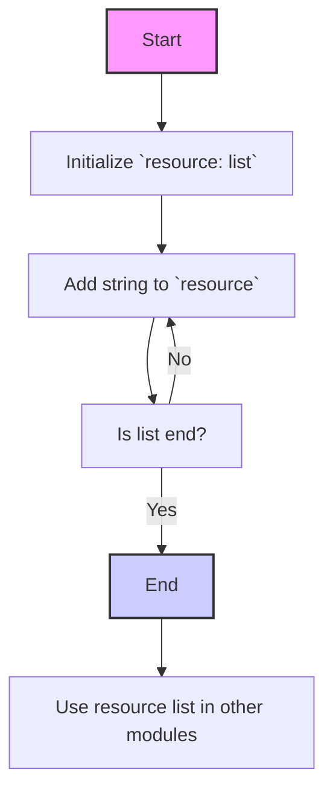
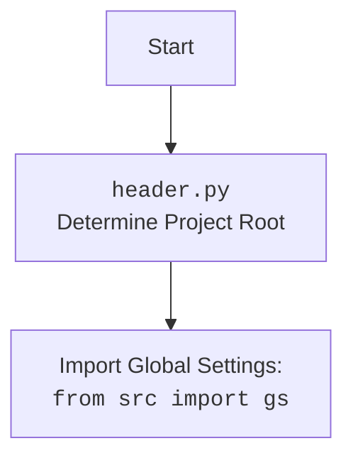

## <алгоритм>

1. **Инициализация списка ресурсов:**
   - Создается переменная `resource` типа `list`.
   - В эту переменную записывается список строк, представляющих названия API ресурсов PrestaShop.
   - Пример: `resource = ['products', 'categories', ...]`.

2. **Использование списка ресурсов:**
   - Список `resource` может быть использован другими частями программы для:
     - Генерации URL для API вызовов PrestaShop.
     - Автоматической проверки доступных ресурсов.
     - Динамического создания документации по API.
   - Пример: Функция, принимающая имя ресурса как аргумент, проверяет, существует ли этот ресурс в списке, и в зависимости от этого выполняет запрос или возвращает ошибку.

## <mermaid>

## <объяснение>

### Импорты:
- В данном коде нет импортов, так как он представляет собой простое определение списка строк. Это означает, что этот файл не зависит от других модулей в явном виде.

### Классы:
- В данном коде нет классов.

### Функции:
- В данном коде нет функций.

### Переменные:
- `resource`:
  - Тип: `list`
  - Назначение: Хранит список строк, где каждая строка представляет название ресурса API PrestaShop.
  - Использование: Используется как источник данных для других функций, которые взаимодействуют с API PrestaShop. Этот список позволяет программе динамически работать с разными ресурсами, не хардкодя их имена.

### Детальное объяснение:

- Файл `api_resourses_list.py` содержит список строк `resource`, представляющих собой доступные ресурсы API PrestaShop.
- Этот список является центральным элементом, который помогает другим частям системы взаимодействовать с API PrestaShop.
- Например, при создании URL для запроса к API, можно проверить наличие ресурса в данном списке, чтобы убедиться, что он существует в PrestaShop.
- **Возможные улучшения:**
   - Если список ресурсов когда-либо изменится или станет очень большим, можно рассмотреть возможность загрузки этого списка из внешнего файла, а не хранить его в коде.
   - Если необходимо добавить метаданные для каждого ресурса, можно преобразовать список в словарь, где ключом будет имя ресурса, а значением - его метаданные.
   - Добавить валидацию данных, чтобы убедиться, что все элементы в списке являются строками и соответствуют определенному формату.

### Связи с другими частями проекта:

- Данный список используется как источник данных для создания запросов к API PrestaShop.
- Например, функции, которые создают URL для API, будут проверять этот список, чтобы убедиться в корректности формируемого запроса.
- Функции, которые автоматически генерируют документацию для API, также могут использовать этот список для формирования описания доступных ресурсов.
- Список используется для валидации входных данных при запросах к API.

В целом, `api_resourses_list.py` обеспечивает централизованное хранение списка доступных ресурсов API PrestaShop, что облегчает обслуживание и расширение проекта. Он представляет собой статическую конфигурацию, которая используется другими частями системы для динамического взаимодействия с API.