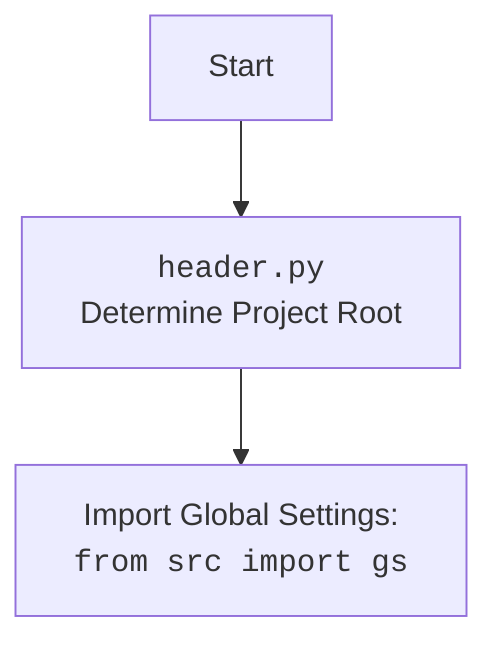

# Анализ кода `hypotez/src/endpoints/prestashop/customer.py`

## <алгоритм>

1. **Импорт модулей**:
   - Импортируются необходимые модули, такие как `sys`, `os`, `attr`, `pathlib`, `typing`, `SimpleNamespace`, `header`, `src`, `logger`, `jjson`, `PrestaShop`.
   - Пример: `import sys`, `from pathlib import Path`, `from src.logger.logger import logger`.

2. **Определение класса `PrestaCustomer`**:
   - Класс `PrestaCustomer` наследуется от класса `PrestaShop`.
   - Пример: `class PrestaCustomer(PrestaShop):`.

3. **Инициализация `__init__`**:
   - Принимает `credentials` (словарь или `SimpleNamespace`), `api_domain`, `api_key` как параметры.
   - Если `credentials` предоставлены, извлекает `api_domain` и `api_key` из них.
     - Пример: `api_domain = credentials.get('api_domain', api_domain)`
   - Проверяет наличие `api_domain` и `api_key`, выбрасывает исключение `ValueError`, если их нет.
     - Пример: `if not api_domain or not api_key: raise ValueError(...)`
   - Инициализирует родительский класс `PrestaShop` с полученными `api_domain` и `api_key`.
     - Пример: `super().__init__(api_domain, api_key, *args, **kwards)`

## <mermaid>

```mermaid
flowchart TD
    Start --> ImportModules[Импорт модулей: sys, os, attr, pathlib, typing, SimpleNamespace, header, src, logger, jjson, PrestaShop]
    ImportModules --> DefineClass[Определение класса PrestaCustomer(PrestaShop)]
    DefineClass --> InitMethod[Инициализация __init__: credentials, api_domain, api_key]
    InitMethod --> CheckCredentials{Проверка credentials?}
    CheckCredentials -- Yes --> ExtractCredentials[Извлечение api_domain и api_key из credentials]
    ExtractCredentials --> CheckApiParams{Проверка api_domain и api_key}
    CheckCredentials -- No --> CheckApiParams
    CheckApiParams -->|Нет api_domain или api_key| ThrowError[Выброс ValueError]
    CheckApiParams -->|Есть api_domain и api_key| InitSuperClass[Инициализация super().__init__]
    InitSuperClass --> End
    ThrowError --> End
    
   
    
    
    
    
```


## <объяснение>

### Импорты:

-   **`sys`**: Используется для доступа к некоторым переменным и функциям, взаимодействующим с интерпретатором Python.
-   **`os`**: Предоставляет функции для взаимодействия с операционной системой (например, для работы с путями к файлам).
-   **`attr`**: Библиотека для определения классов с автоматической генерацией методов (`__init__`, `__repr__` и т.д.). В данном коде используется для декораторов `@attrs` и `@attr` (хотя в предоставленном коде не применяется напрямую, но импортируется).
-   **`pathlib`**: Модуль для работы с файловыми путями в объектно-ориентированном стиле.
-  **`typing`**: Используется для аннотации типов, что помогает в статической проверке кода и повышает читаемость.
     -  `Union`: Позволяет указывать, что переменная может быть одного из нескольких типов.
     -  `Optional`: Указывает, что переменная может быть либо определенного типа, либо `None`.
-   **`types.SimpleNamespace`**: Создает простой объект, атрибуты которого доступны через точечную нотацию.
-   **`header`**: Пользовательский модуль для определения корневой директории проекта и загрузки общих настроек.
-   **`src`**: Корень пакета, содержащий другие модули проекта (например `src.gs` - глобальные настройки, `src.logger.logger` - логгер).
     -   `src.gs`: Модуль, содержащий глобальные настройки проекта.
     - `src.logger.logger`: Модуль, предоставляющий функциональность логирования.
     - `src.utils.jjson`: Модуль, предоставляющий функции для загрузки json.
-   **`.api`**: Модуль `api.py` из той же директории (`src/endpoints/prestashop`), содержащий класс `PrestaShop`, предоставляющий базовую функциональность для работы с PrestaShop API.
- `src.logger.exceptions`: Модуль, содержащий пользовательские исключения для проекта.

### Классы:

-   **`PrestaCustomer(PrestaShop)`**: Класс для работы с клиентами в PrestaShop.
    -   Наследуется от `PrestaShop`, что позволяет использовать функциональность базового API для PrestaShop.
    -   Атрибуты: `api_domain`, `api_key` (унаследованы от `PrestaShop`).
    -   Методы:
        -   `__init__`: Конструктор класса, инициализирует экземпляр класса `PrestaCustomer`. Принимает `credentials`, `api_domain` и `api_key`. Если `credentials` переданы, пытается извлечь `api_domain` и `api_key` из них. Если необходимые параметры не предоставлены, выбрасывает `ValueError`.

### Функции:

-   `__init__`: Конструктор класса `PrestaCustomer`.
    -   Аргументы:
        -   `credentials` (Optional[dict | SimpleNamespace] = None): Словарь или объект SimpleNamespace с параметрами `api_domain` и `api_key`.
        -   `api_domain` (Optional[str] = None): Домен API PrestaShop.
        -   `api_key` (Optional[str] = None): Ключ API PrestaShop.
        -   `*args, **kwargs`: Дополнительные аргументы для передачи в конструктор родительского класса `PrestaShop`.
    -   Возвращаемое значение: None (конструктор).
    -   Назначение: Инициализирует экземпляр класса `PrestaCustomer`, проверяя наличие необходимых параметров для работы с PrestaShop API. Выбрасывает `ValueError`, если `api_domain` или `api_key` не предоставлены.

### Переменные:

-   `credentials`: Параметр, принимающий либо словарь, либо объект `SimpleNamespace`, который содержит `api_domain` и `api_key`.
-   `api_domain`: Доменное имя API PrestaShop.
-   `api_key`: Ключ для доступа к API PrestaShop.

### Потенциальные ошибки и области для улучшения:

-   В текущем виде класс `PrestaCustomer` только инициализируется и не имеет методов для работы с API PrestaShop, кроме базовых, унаследованных от `PrestaShop`.  Необходимо добавить методы для выполнения CRUD операций с клиентами (создание, чтение, обновление, удаление), как это показано в примере в docstring класса.
-   В коде отсутствует обработка исключений при работе с API, нужно добавить `try/except` блоки для обработки ошибок от PrestaShop.
-   Желательно валидировать `api_domain` и `api_key`. Например, проверить формат доменного имени или длину ключа.

### Взаимосвязи с другими частями проекта:

-   `header.py` и `src.gs`: Используются для загрузки общих настроек проекта.
-   `src.logger.logger`: Используется для логирования событий и ошибок.
-   `src.utils.jjson`: Используется для загрузки json.
-   `src.endpoints.prestashop.api`: Класс `PrestaShop` используется как базовый класс для `PrestaCustomer`, предоставляя базовый функционал для работы с API PrestaShop.

Этот код является частью более крупного проекта, который, вероятно, предназначен для интеграции с PrestaShop. `PrestaCustomer` является одним из эндпоинтов, предназначенных для работы с данными PrestaShop через API.