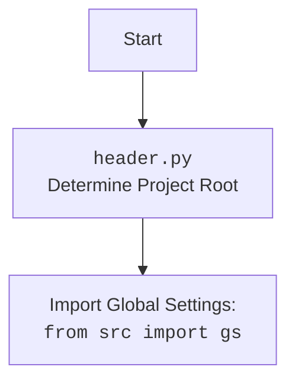

## Анализ кода `hypotez/src/endpoints/prestashop/header.py`

### 1. **<алгоритм>**
   **Функция `set_project_root(marker_files=('.git', '__root__'))`**:

   1. **Начало**:
      - Получаем абсолютный путь к директории, в которой находится текущий файл `header.py`.
         ```python
         current_path: Path = Path(__file__).resolve().parent
         # Пример: если файл находится в `/home/user/project/src/endpoints/prestashop`, то `current_path` будет `/home/user/project/src/endpoints/prestashop`
         ```
      - Инициализируем переменную `__root__` текущим путем.
         ```python
         __root__ = current_path
         # __root__  равен  `/home/user/project/src/endpoints/prestashop`
         ```
   2. **Поиск корневой директории**:
      - Начинаем обход от текущей директории до корневой, проверяя наличие маркерных файлов.
      ```mermaid
        flowchart TD
        Start([Start]) --> CheckCurrentDir{Проверить текущую директорию на маркер};
        CheckCurrentDir -- Маркер найден --> SetRoot{Установить __root__ = текущей директории};
        CheckCurrentDir -- Маркер не найден --> CheckParentDir{Перейти к родительской директории};
         CheckParentDir -- Нет родительской директории --> SetCurrentAsRoot{Установить __root__ = текущей директории}
         CheckParentDir -- Есть родительская директория --> CheckParentDir;
        SetRoot --> CheckInSysPath{Проверить __root__ в sys.path};
        SetCurrentAsRoot --> CheckInSysPath;
        CheckInSysPath -- __root__ есть в sys.path --> End([End]);
        CheckInSysPath -- __root__ нет в sys.path --> AddRootToPath{Добавить __root__ в sys.path};
       AddRootToPath --> End;

      ```
         - Для каждой родительской директории (включая текущую):
           - Проверяем, существует ли в ней любой из файлов или папок, указанных в `marker_files`.
           ```python
           if any((parent / marker).exists() for marker in marker_files):
             # Если найден маркер, устанавливаем __root__ родительской директорией
             __root__ = parent
             # Прерываем цикл, так как корень проекта найден
             break
           ```
           - Пример: если в `/home/user/project` есть файл `.git`, то `__root__` будет равен `/home/user/project`.
   3. **Добавление в `sys.path`**:
      - Проверяем, есть ли путь к корневой директории (`__root__`) в `sys.path`.
        ```python
        if __root__ not in sys.path:
            # Если нет, то добавляем в начало списка
            sys.path.insert(0, str(__root__))
        ```
   4. **Возврат**:
      - Возвращаем путь к корневой директории (`__root__`).
        ```python
        return __root__
        ```

   **Основной блок**:
   1. **Вызов `set_project_root()`**:
      - Вызываем функцию `set_project_root()` для определения корневого пути и сохраняем его в переменную `__root__`.
      ```python
      __root__: Path = set_project_root()
      ```
   2. **Импорт глобальных настроек**:
     - Импортируем `gs` из `src`. Предполагается, что `gs` содержит информацию о путях, включая `gs.path.root`.
        ```python
        from src import gs
        ```
   3.  **Загрузка настроек из `settings.json`**:
      - Открываем файл `settings.json`, который расположен в `<root>/src/settings.json`.
        ```python
         try:
              with open(gs.path.root / 'src' /  'settings.json', 'r') as settings_file:
              settings = json.load(settings_file)
         except (FileNotFoundError, json.JSONDecodeError):
           ...
        ```
      - Если файл найден и успешно прочитан, то загружаем настройки в переменную `settings`.
   4.  **Загрузка документации из `README.MD`**:
       - Аналогично загрузке настроек, читаем контент из `README.MD`, который расположен в `<root>/src/README.MD` и сохраняем его в `doc_str`.
        ```python
            try:
                with open(gs.path.root / 'src' /  'README.MD', 'r') as settings_file:
                    doc_str = settings_file.read()
            except (FileNotFoundError, json.JSONDecodeError):
                ...
        ```
   5.  **Инициализация глобальных переменных**:
      - Инициализируем глобальные переменные проекта, такие как `__project_name__`, `__version__`, `__doc__`, `__details__`, `__author__`, `__copyright__`, `__cofee__`,  беря значения из `settings` (если они существуют) или значения по умолчанию.
      ```python
        __project_name__ = settings.get("project_name", 'hypotez') if settings  else 'hypotez'
        __version__: str = settings.get("version", '')  if settings  else ''
        __doc__: str = doc_str if doc_str else ''
        __details__: str = ''
        __author__: str = settings.get("author", '')  if settings  else ''
        __copyright__: str = settings.get("copyrihgnt", '')  if settings  else ''
        __cofee__: str = settings.get("cofee", "Treat the developer to a cup of coffee for boosting enthusiasm in development: https://boosty.to/hypo69")  if settings  else "Treat the developer to a cup of coffee for boosting enthusiasm in development: https://boosty.to/hypo69"
      ```

### 2. **<mermaid>**

```mermaid
flowchart TD
    Start([Start]) --> FindProjectRoot{Определение корневой директории проекта}
    FindProjectRoot --> SetRoot[<code>set_project_root()</code>: Поиск корневой директории];
    SetRoot --> ImportGS[Импорт глобальных настроек: <br><code>from src import gs</code>];
    ImportGS --> LoadSettings{Загрузка настроек из <br><code>settings.json</code>}
    LoadSettings --> LoadDoc{Загрузка документации из <br><code>README.MD</code>}
    LoadDoc --> InitGlobalVars{Инициализация глобальных переменных проекта};
    InitGlobalVars --> End([End]);

    style FindProjectRoot fill:#f9f,stroke:#333,stroke-width:2px
    style ImportGS fill:#ccf,stroke:#333,stroke-width:2px
    style SetRoot fill:#ccf,stroke:#333,stroke-width:2px
```


### 3. **<объяснение>**

**Импорты**:

- `sys`: Используется для взаимодействия с интерпретатором Python, в частности, для изменения пути поиска модулей (`sys.path`).
- `json`: Используется для работы с файлами JSON (загрузка настроек проекта).
- `pathlib.Path`: Предоставляет объектно-ориентированный способ работы с путями в файловой системе.
- `packaging.version.Version`: Используется для работы с версиями.
- `src`: Импортирует модуль `gs` (глобальные настройки) из пакета `src`.

**Функции**:

- `set_project_root(marker_files=('.git', '__root__')) -> Path`:
    - **Аргументы**:
        - `marker_files` (tuple): Кортеж с именами файлов или директорий, которые являются признаками корневой директории проекта.
    - **Возвращает**:
        - `Path`: Объект `Path`, представляющий абсолютный путь к корневой директории проекта.
    - **Назначение**:
      - Функция предназначена для автоматического определения корневой директории проекта. Она ищет директорию, в которой находится хотя бы один из `marker_files`, начиная с директории текущего файла и двигаясь вверх по иерархии каталогов.
      - Путь к корневой директории добавляется в `sys.path`, чтобы обеспечить возможность импорта модулей из проекта без необходимости указывать относительные пути.
    - **Пример**:
      - Если файл `header.py` расположен по пути `/home/user/project/src/endpoints/prestashop`, а файл `.git` есть в каталоге `/home/user/project`, то функция вернет путь `/home/user/project`, добавив его в `sys.path`.
        ```python
        project_root = set_project_root() # project_root будет равен /home/user/project
        ```

**Переменные**:

- `__root__` (Path): Глобальная переменная, хранящая путь к корневой директории проекта. Она инициализируется результатом работы функции `set_project_root()`.
- `settings` (dict): Словарь, содержащий загруженные из файла `settings.json` настройки проекта.
- `doc_str` (str): Строка, содержащая прочитанное из `README.MD` описание проекта.
- `__project_name__` (str): Имя проекта, по умолчанию 'hypotez' (если нет в `settings`).
- `__version__` (str): Версия проекта (берется из `settings`).
- `__doc__` (str): Описание проекта (берется из `README.MD`).
- `__details__` (str): Дополнительная информация о проекте.
- `__author__` (str): Автор проекта (берется из `settings`).
- `__copyright__` (str): Информация о копирайте проекта (берется из `settings`).
- `__cofee__` (str): Сообщение о поддержке автора (берется из `settings` или стандартное сообщение).

**Взаимосвязи с другими частями проекта**:

- Данный модуль `header.py` является центральным для проекта, поскольку определяет корневую директорию и загружает настройки.
- Он устанавливает глобальные переменные, которые используются другими модулями для доступа к информации о проекте.
- Модуль `gs` из `src` содержит пути и общие настройки, которые используются для определения пути к файлам настроек (`settings.json`, `README.MD`).

**Потенциальные ошибки и области для улучшения**:

- **Обработка ошибок**: Блок `try-except` для открытия файлов `settings.json` и `README.MD` только пропускает исключения (`pass` или `...`). Было бы лучше логировать ошибки или выводить предупреждения.
- **Зависимости**: Зависимость от `src.gs` означает, что данный модуль должен быть вызван после инициализации `gs`, что может вызвать проблемы с порядком импортов.
- **Динамическое определение root**: Логика поиска корневой директории может быть улучшена, если проект станет более сложным.
- **Повторяющийся код:** Загрузка настроек и документации повторяет код (открытие файлов и чтение), можно вынести в отдельную функцию.