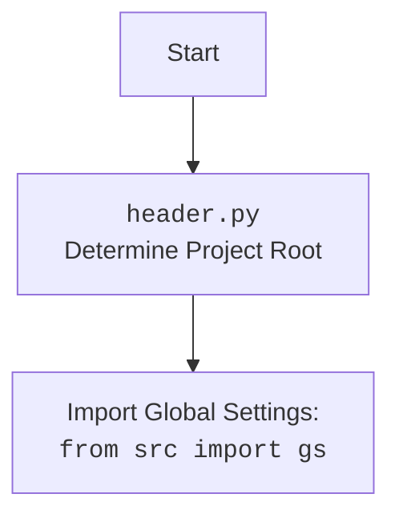

## <алгоритм>

1.  **Инициализация `PrestaLanguage`**:
    *   При создании экземпляра класса `PrestaLanguage` вызывается метод `__init__`.
    *   Принимает аргументы: `credentials` (словарь или `SimpleNamespace`, содержащий `api_domain` и `api_key`), `api_domain` (строка), `api_key` (строка) и произвольные `*args`, `**kwargs`.
    *   Если передан `credentials`, то значения `api_domain` и `api_key` берутся из него, если они там есть.
    *   Если `api_domain` или `api_key` не переданы или не найдены в `credentials`, выбрасывается ошибка `ValueError`.
    *   Вызывается `__init__` родительского класса `PrestaShop` с переданными `api_domain` и `api_key` и произвольными аргументами `*args`, `**kwargs`.
    *   _Пример_:
        ```python
        # Пример с передачей api_domain и api_key напрямую:
        presta_lang_1 = PrestaLanguage(api_domain="https://example.com", api_key="your_api_key")
        
        # Пример с передачей api_domain и api_key через credentials:
        creds = {"api_domain": "https://example.com", "api_key": "your_api_key"}
        presta_lang_2 = PrestaLanguage(credentials=creds)

        # Пример с SimpleNamespace:
        from types import SimpleNamespace
        creds_ns = SimpleNamespace(api_domain="https://example.com", api_key="your_api_key")
        presta_lang_3 = PrestaLanguage(credentials=creds_ns)
        ```

2.  **Наследование**:
    *   `PrestaLanguage` наследует функциональность класса `PrestaShop`, который отвечает за взаимодействие с API PrestaShop. Таким образом, `PrestaLanguage` получает все методы и атрибуты `PrestaShop`.
    *   _Пример_:
        ```mermaid
        classDiagram
        class PrestaShop {
            +api_domain: str
            +api_key: str
            +__init__(api_domain: str, api_key: str)
        }
        class PrestaLanguage {
            +__init__(credentials: Optional[dict | SimpleNamespace], api_domain: Optional[str], api_key: Optional[str])
        }
        PrestaLanguage --|> PrestaShop: наследует
        ```
    *   Создание объекта `PrestaLanguage` автоматически создаёт объект `PrestaShop` внутри него (через `super().__init__`).

## <mermaid>

```mermaid
flowchart TD
    Start[Начало] --> InitPrestaLanguage[<code>PrestaLanguage.__init__</code><br>Инициализация класса PrestaLanguage];
    
    InitPrestaLanguage --> CheckCredentials{Проверка `credentials`};
    CheckCredentials -- Yes --> GetCreds[Извлечение `api_domain` и `api_key` из `credentials`];
    CheckCredentials -- No --> CheckApiDomainKey{Проверка `api_domain` и `api_key`};

    GetCreds --> CheckApiDomainKey;

    CheckApiDomainKey --> ValidApiDomainKey{Проверка на наличие `api_domain` и `api_key`};
    ValidApiDomainKey -- Yes --> InitPrestaShop[Вызов <code>super().__init__</code><br>Инициализация родительского класса <code>PrestaShop</code>];
    ValidApiDomainKey -- No --> ErrorValue[Выброс ошибки <code>ValueError</code>];
    
    InitPrestaShop --> End[Конец];
    ErrorValue --> End;
    
    style InitPrestaLanguage fill:#f9f,stroke:#333,stroke-width:2px
    style ValidApiDomainKey fill:#ccf,stroke:#333,stroke-width:2px

```



**Объяснение зависимостей:**

*   **`Start`**: Начальная точка выполнения скрипта.
*   **`InitPrestaLanguage`**: Вызов конструктора класса `PrestaLanguage`.
*   **`CheckCredentials`**: Проверка, был ли передан аргумент `credentials`.
*   **`GetCreds`**: Извлечение значений `api_domain` и `api_key` из словаря или `SimpleNamespace` `credentials`.
*    **`CheckApiDomainKey`**: Проверка на наличие `api_domain` и `api_key`.
*   **`ValidApiDomainKey`**: Проверка на валидность `api_domain` и `api_key`, убеждаемся что они есть.
*   **`InitPrestaShop`**: Вызов конструктора родительского класса `PrestaShop` для инициализации API-клиента.
*   **`ErrorValue`**: Выброс исключения `ValueError`, если не найдены необходимые параметры.
*   **`End`**: Конечная точка выполнения скрипта.

## <объяснение>

### Импорты:

*   **`from types import SimpleNamespace`**: Импортирует `SimpleNamespace` для создания объектов с атрибутами. Используется для передачи параметров API (альтернатива словарю).
*   **`from .api import PrestaShop`**: Импортирует класс `PrestaShop` из модуля `api` в текущем пакете (endpoint.prestashop). Это базовый класс для взаимодействия с API PrestaShop.
*   **`from src import gs`**: Импортирует глобальные настройки `gs` из пакета `src`. Предположительно, здесь хранятся общие параметры проекта.
*   **`from src.utils.printer import pprint`**: Импортирует функцию `pprint` для удобного вывода данных, вероятно, из пакета `utils.printer`.
*   **`import header`**: Импортирует модуль `header`, который вероятно, содержит функции для определения корневой директории проекта, и также содержит импорт глобальных настроек.
*   **`from src.logger.logger import logger`**: Импортирует объект `logger` для логирования событий и ошибок.
*   **`from src.logger.exceptions import PrestaShopException`**: Импортирует пользовательское исключение `PrestaShopException`.
*   **`from typing import Optional`**:  Импортирует `Optional` для указания, что аргументы могут быть `None`.

### Классы:

*   **`PrestaLanguage(PrestaShop)`**:
    *   **Роль**: Предназначен для управления языками в PrestaShop через API.
    *   **Атрибуты**: Не имеет собственных атрибутов, наследует `api_domain` и `api_key` от `PrestaShop`.
    *   **Методы**:
        *   `__init__(self, credentials=None, api_domain=None, api_key=None, *args, **kwards)`: Инициализирует объект класса.
            *   **Аргументы**:
                *   `credentials`: Словарь или `SimpleNamespace` с `api_domain` и `api_key`.
                *   `api_domain`: Домен API PrestaShop.
                *   `api_key`: Ключ API PrestaShop.
                *   `*args`, `**kwargs`: Произвольные аргументы для родительского класса `PrestaShop`.
            *   **Возвращает**: `None`
            *   **Назначение**: Устанавливает параметры для подключения к API PrestaShop. Извлекает параметры из `credentials`, если они переданы, иначе берёт `api_domain` и `api_key` напрямую. Вызывает конструктор родительского класса (`super().__init__`).
            *   **Пример**:
                ```python
                presta_lang = PrestaLanguage(api_domain="https://example.com", api_key="your_api_key")
                
                creds = {"api_domain": "https://example.com", "api_key": "your_api_key"}
                presta_lang_2 = PrestaLanguage(credentials=creds)

                from types import SimpleNamespace
                creds_ns = SimpleNamespace(api_domain="https://example.com", api_key="your_api_key")
                presta_lang_3 = PrestaLanguage(credentials=creds_ns)
                ```
    *   **Взаимодействие**: Наследует от `PrestaShop`, использует его методы для выполнения API-запросов. Использует `SimpleNamespace` и `dict` для передачи конфигурационных данных.

### Переменные:

*   `credentials`: Может быть словарём (`dict`) или `SimpleNamespace`. Содержит `api_domain` и `api_key`.
*   `api_domain`: Строка (`str`), представляющая домен API PrestaShop.
*   `api_key`: Строка (`str`), представляющая ключ API PrestaShop.

### Потенциальные ошибки и области для улучшения:

*   **Обработка исключений**: Код выбрасывает `ValueError`, если `api_domain` или `api_key` не переданы. Желательно иметь более специфичную обработку ошибок (например, если неверный формат ключа) и логирование.
*   **Проверка типов**: Добавить проверку типов для переданных аргументов для повышения надежности.
*   **Валидация входных данных**: Валидация `api_domain` (формат URL) и `api_key` (например, длина, формат) поможет избежать ошибок на этапе выполнения API-запросов.
*   **Отсутствие методов для работы с языками**: В текущем коде отсутствует реализация методов для добавления, удаления, обновления и получения деталей языков, хотя в docstring намекается на их существование. Необходимо реализовать эти методы для полной функциональности класса.

### Цепочка взаимосвязей с другими частями проекта:

1.  **`src.endpoints.prestashop.api.PrestaShop`**: Базовый класс для работы с API PrestaShop. `PrestaLanguage` использует его для отправки запросов.
2.  **`src.gs`**: Глобальные настройки проекта. Используются для хранения общих параметров проекта, возможно, включая параметры API PrestaShop.
3.  **`src.utils.printer.pprint`**: Функция для вывода отладочной информации, используемая для логирования и отладки.
4.  **`header.py`**: Модуль для определения корневой директории проекта и импорта глобальных настроек.
5.  **`src.logger.logger`**: Объект для логирования событий и ошибок.
6.  **`src.logger.exceptions.PrestaShopException`**: Кастомное исключение для ошибок, связанных с PrestaShop.

В целом, `PrestaLanguage` является частью слоя API, который обеспечивает абстракцию и взаимодействие с API PrestaShop, опираясь на другие модули для логирования, настроек и общих утилит.