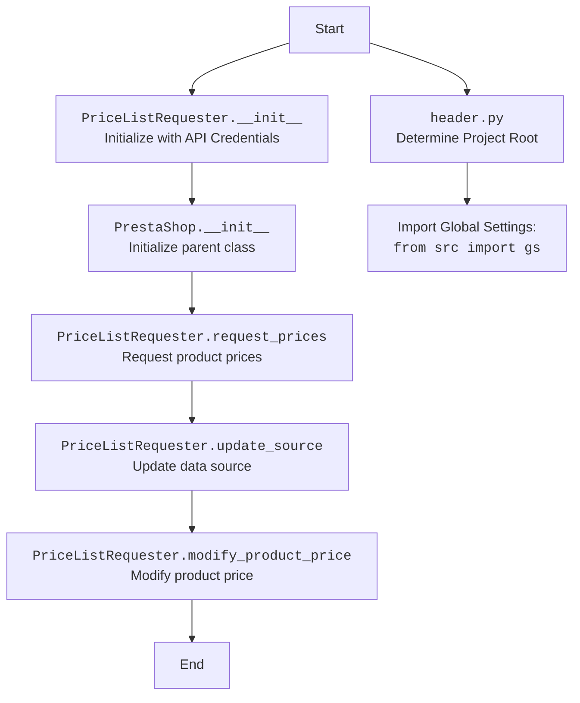

## ИНСТРУКЦИЯ:

Анализируй предоставленный код подробно и объясни его функциональность. Ответ должен включать три раздела:  

1. **<алгоритм>**: Опиши рабочий процесс в виде пошаговой блок-схемы, включая примеры для каждого логического блока, и проиллюстрируй поток данных между функциями, классами или методами.  
2. **<mermaid>**: Напиши код для диаграммы в формате `mermaid`, проанализируй и объясни все зависимости, 
    которые импортируются при создании диаграммы. 
    **ВАЖНО!** Убедитесь, что все имена переменных, используемые в диаграмме `mermaid`, 
    имеют осмысленные и описательные имена. Имена переменных вроде `A`, `B`, `C`, и т.д., не допускаются!  
    
    **Дополнительно**: Если в коде есть импорт `import header`, добавьте блок `mermaid` flowchart, объясняющий `header.py`:\
    ```mermaid
    flowchart TD
        Start --> Header[<code>header.py</code><br> Determine Project Root]
    
        Header --> import[Import Global Settings: <br><code>from src import gs</code>] 
    ```

3. **<объяснение>**: Предоставьте подробные объяснения:  
   - **Импорты**: Их назначение и взаимосвязь с другими пакетами `src.`.  
   - **Классы**: Их роль, атрибуты, методы и взаимодействие с другими компонентами проекта.  
   - **Функции**: Их аргументы, возвращаемые значения, назначение и примеры.  
   - **Переменные**: Их типы и использование.  
   - Выделите потенциальные ошибки или области для улучшения.  

Дополнительно, постройте цепочку взаимосвязей с другими частями проекта (если применимо).  

Это обеспечивает всесторонний и структурированный анализ кода.
## Формат ответа: `.md` (markdown)
**КОНЕЦ ИНСТРУКЦИИ**
```

## <алгоритм>

**1. Инициализация ( `__init__` )**
   - **Вход:** `api_credentials` (словарь с ключами 'api_domain' и 'api_key').
   - **Действие:** Вызывается конструктор родительского класса `PrestaShop` с переданными `api_domain` и `api_key`.
   - **Выход:** Созданный экземпляр `PriceListRequester`.
   - **Пример:**
     ```python
     api_creds = {'api_domain': 'example.com', 'api_key': 'secret_key'}
     requester = PriceListRequester(api_creds)
     ```

**2. Запрос цен ( `request_prices` )**
   - **Вход:** `products` (список товаров, для которых нужно получить цены).
   - **Действие:** В текущей реализации функция `request_prices` ничего не делает (`pass`), то есть  не отправляет запрос.
   - **Выход:** Функция не возвращает ничего. В реальной реализации, она вернула бы словарь с ценами. 
     Например: `{'product1': 10.99, 'product2': 5.99}`.
   - **Пример:**
     ```python
     products_list = ['product1', 'product2', 'product3']
     prices = requester.request_prices(products_list)
     # Предполагается, что 'prices' содержит словарь с ценами.
     ```

**3. Обновление источника данных (`update_source`)**
   - **Вход:** `new_source` (новый источник данных).
   - **Действие:** Присваивает `new_source` атрибуту `self.source` экземпляра класса.
   - **Выход:** Измененный источник данных `self.source`.
   - **Пример:**
     ```python
     new_data_source = 'new_data_source'
     requester.update_source(new_data_source)
     # Теперь requester.source равен 'new_data_source'
     ```

**4. Модификация цены продукта (`modify_product_price`)**
    - **Вход**: `product` (название товара) и `new_price` (новая цена товара).
    - **Действие**: В текущей реализации функция `modify_product_price` ничего не делает (`pass`), то есть не изменяет цену.
    - **Выход:** Функция ничего не возвращает. В реальной реализации, она изменила бы цену продукта в источнике данных.
    - **Пример:**
      ```python
      product_name = 'product1'
      new_price_value = 12.99
      requester.modify_product_price(product_name, new_price_value)
      # Предполагается, что цена продукта будет изменена.
      ```
## <mermaid>


**Анализ `mermaid` диаграммы:**

1. **`flowchart TD`**: Объявляет диаграмму потока сверху вниз.
2. **`Start`**: Начальная точка процесса.
3. **`PriceListRequesterInit`**: Представляет метод `__init__` класса `PriceListRequester`. Этот метод инициализирует объект класса с учетными данными API.
4. **`PrestaShopInit`**: Представляет вызов конструктора родительского класса `PrestaShop` из конструктора `PriceListRequester`.
5. **`RequestPrices`**: Представляет метод `request_prices`, который предназначен для запроса списка цен на продукты.
6. **`UpdateSource`**: Представляет метод `update_source`, который обновляет источник данных для запроса цен.
7. **`ModifyPrice`**: Представляет метод `modify_product_price`, который предназначен для изменения цены указанного продукта.
8.  **`End`**: Конечная точка процесса.
9.  **`header`**: Представляет  модуль `header.py` - определяет корневую директорию проекта.
10. **`import_gs`**:  Указывает на импорт глобальных настроек из `src`
    
**Зависимости:**

- Класс `PriceListRequester` наследует от класса `PrestaShop`.
- Методы `__init__`, `request_prices`, `update_source` и `modify_product_price` являются частью класса `PriceListRequester`.
- `header.py`  определяет корневую директорию и импортирует глобальные настройки.

## <объяснение>

**Импорты:**

-   `sys`: Предоставляет доступ к некоторым переменным и функциям, взаимодействующим с интерпретатором Python.
-   `os`: Предоставляет функции для работы с операционной системой.
-   `attr, attrs`: Из библиотеки `attrs`, используются для упрощения создания классов с атрибутами.
-   `pathlib.Path`: Предоставляет способ работать с путями файловой системы в объектно-ориентированном стиле.
-   `typing.Union`: Используется для указания, что переменная может иметь один из нескольких типов.
-   `header`:  Модуль для определения корневой директории проекта и импортирует глобальные настройки.
-   `src.gs`: Глобальные настройки проекта.
-   `src.logger.logger`:  Модуль для логирования событий в приложении.
-   `src.utils.jjson.j_loads, j_loads_ns`: Функции для работы с JSON, вероятно, с некоторыми специфичными обработками.
-   `.api.PrestaShop`: Класс для взаимодействия с PrestaShop API.
-   `types.SimpleNamespace`:  Простой класс, позволяющий создавать объекты с произвольными атрибутами.

**Классы:**

-   **`PriceListRequester(PrestaShop)`**:
    -   **Роль**: Класс для запроса и управления ценами товаров из PrestaShop. Наследует функциональность от `PrestaShop`.
    -   **Атрибуты**:
        -   `source`: (не определено в `__init__`) - Предполагается, что будет хранить источник данных для цен.
    -   **Методы**:
        -   `__init__(self, api_credentials)`: Конструктор класса, принимает учетные данные API и вызывает конструктор родительского класса `PrestaShop`.
        -   `request_prices(self, products)`: Метод для получения цен для списка товаров (в текущей реализации ничего не делает).
        -   `update_source(self, new_source)`: Метод для обновления источника данных.
        -   `modify_product_price(self, product, new_price)`: Метод для изменения цены товара (в текущей реализации ничего не делает).

**Функции:**

-   В данном коде нет отдельных функций, не являющихся методами класса.

**Переменные:**

-   `api_credentials`: Словарь, содержащий учетные данные для доступа к API PrestaShop (`api_domain` и `api_key`).
-   `products`: Список строк, представляющих товары.
-   `new_source`:  Новый источник данных (строка).
-    `product`: Название товара, тип string.
-    `new_price`: Новая цена товара, тип float.

**Потенциальные ошибки и области для улучшения:**

1.  **`request_prices` и `modify_product_price`**:  Методы  не имеют реализации. В реальном приложении необходимо реализовать логику запроса цен и изменения цены.
2.  **Отсутствие обработки ошибок**: В коде нет обработки исключений.
3.  **Не определен тип `source`**: Атрибут `source` не инициализирован в `__init__`,  также не указан его тип.
4.  **Нет документации по `PrestaShop`**:  Не хватает информации о том как именно работает класс `PrestaShop` (логика запросов и ответов).
5.  **Конкретизация типов:**  Использование `typing` для уточнения типов аргументов и возвращаемых значений может улучшить читаемость и надежность кода. Например, `products: List[str]` и `-> Dict[str, float]`.
6. **Отсутствие комментариев:**  В коде мало комментариев, особенно внутри функций. Стоит добавить комментарии, объясняющие сложную логику.

**Взаимосвязи с другими частями проекта:**
- Класс `PriceListRequester` использует класс `PrestaShop` из модуля `api.py` для взаимодействия с API.
- Использует глобальные настройки проекта через `from src import gs`.
- Использует `j_loads` и `j_loads_ns` из `src.utils.jjson` для работы с JSON.
-  Использует `header.py` для определения корневой директории проекта.
- Предполагается взаимодействие с модулем логирования `src.logger.logger`.