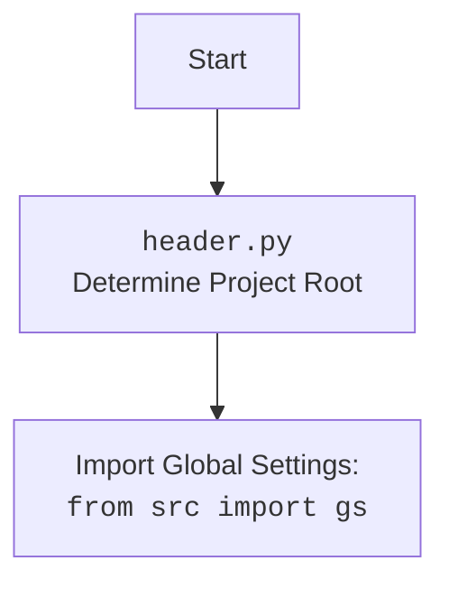

## АНАЛИЗ КОДА: `hypotez/src/endpoints/prestashop/product_async.py`

### 1. <алгоритм>

**Блок-схема:**

```mermaid
graph LR
    A[Начало] --> B(Инициализация ProductAsync);
    B --> C{Вызов add_new_product()};
    C -- Передача f: ProductFields --> D(Получение родительских категорий);
    D --> E(Конвертация f в словарь f_dict);
    E --> F(Сохранение f_dict в json файл);
    F --> G(Создание продукта через API PrestaShop);
    G -- new_f: ProductFields --> H{Проверка new_f на None};
    H -- Нет --> I(Логирование ошибки);
    I --> K(Завершение, возврат None);
    H -- Да --> L(Создание бинарного изображения);
     L -- True --> M(Завершение, возврат True);
    L -- False --> N(Логирование ошибки);
    N --> O(Завершение, возврат None);
   
    
    A --> P[main(): Запуск асинхронного main()];
    P --> Q[Создание экземпляра Product];
    Q --> R[Создание экземпляра ProductFields];
    R --> S[Вызов get_parent_categories()];
    S --> T[Вывод родительских категорий];
    T --> U[Вызов add_new_product()];
    U --> V{new_product != None};
    V -- Да --> W[Вывод id нового продукта];
    V -- Нет --> X[Вывод сообщение об ошибке];
    W --> Y[Вызов fetch_data_async()];
    X --> Y
     Y --> Z[Конец]
    K --> Z
    M --> Z
    O --> Z

    style A fill:#f9f,stroke:#333,stroke-width:2px
    style Z fill:#f9f,stroke:#333,stroke-width:2px
```

**Описание процесса:**

1.  **Начало:** Программа начинает выполнение с вызова асинхронной функции `main()`.
2.  **Инициализация:** Внутри `main()` создается экземпляр класса `ProductAsync`. Также создается экземпляр `ProductFields` с данными о продукте.
3.  **Получение родительских категорий:** Вызывается `Product.get_parent_categories` для получения списка родительских категорий, который затем выводится в консоль.
4.  **Добавление нового продукта:** Вызывается `add_new_product()` с данными о продукте.
5.  **Обработка данных:**
    *   Получаются родительские категории продукта на основе `id_category_default` через метод `presta_category_async.get_parent_categories_list()`.
    *   Объект `ProductFields` (f) конвертируется в словарь `f_dict`.
    *   Словарь `f_dict` сохраняется в JSON-файл для отладки.
6.  **Создание продукта в PrestaShop:** Метод `create()` класса `PrestaShopAsync` используется для создания нового продукта в PrestaShop API.
7.  **Проверка результата:** Если продукт не создан (возвращен `None`), логируется ошибка и функция завершается.
8.  **Создание изображения:** Если продукт создан, вызывается метод `create_binary()` для загрузки изображения продукта.
9.  **Результат создания изображения:** Если изображение успешно загружено, функция возвращает `True`, иначе логгируется ошибка и возвращает `None`.
10. **Завершение main():** После обработки результатов добавления продукта, вызывается метод `fetch_data_async()`. В зависимости от результата добавления товара выводится в консоль соответствующее сообщение.

### 2. <mermaid>

```mermaid
flowchart TD
    subgraph src.endpoints.prestashop.product_async.py
        A[ProductAsync]
        B[PrestaShopAsync]
        C[PrestaCategoryAsync]
        D[ProductFields]
        E[j_dumps]
        F[any2dict]
        G[logger]
        H[asyncio]
    end
    subgraph src.utils.jjson
         E
    end
    subgraph src.endpoints.prestashop.api
        B
    end
      subgraph src.endpoints.prestashop.category
       C
     end
    subgraph src.utils.convertors.any
        F
    end
      subgraph src.utils.printer
        G
    end
    
    A --> B : inherits
    A --> C : has a
    A --> D : uses
    A --> E : uses
    A --> F : uses
    A --> G : uses
    
    H --> A : uses
```

**Анализ зависимостей:**

*   **`ProductAsync`**: Класс `ProductAsync` зависит от `PrestaShopAsync` (наследует его), `PrestaCategoryAsync` (имеет экземпляр), `ProductFields` (использует его как тип данных), `j_dumps` (для сериализации в JSON), `any2dict` (для конвертации объекта в словарь), и `logger` (для логирования).
*   **`PrestaShopAsync`**: Используется для взаимодействия с PrestaShop API.
*    **`PrestaCategoryAsync`**: Используется для взаимодействия с PrestaShop API по категориям.
*   **`ProductFields`**: Класс данных для хранения информации о продукте.
*   **`j_dumps`**: Функция из `src.utils.jjson` для сериализации данных в JSON.
*   **`any2dict`**: Функция из `src.utils.convertors.any` для конвертации объекта в словарь.
*   **`logger`**: Используется для логирования ошибок и других сообщений.
*    **`asyncio`**: используется для асинхронного запуска `main()`



**Анализ `header.py`:**

*   `header.py` предназначен для определения корневой директории проекта и импорта глобальных настроек из `src/gs.py`
    *   `Start`: начало выполнения.
    *   `Header`:  выполняет определение корневой папки проекта.
    *   `import`: импортирует глобальные настройки из файла `gs.py`.

### 3. <объяснение>

#### Импорты:

*   `from __future__ import annotations`: Позволяет использовать аннотации типов в стиле Python 3.10+ для будущих ссылок.
*   `from src.utils.jjson import j_dumps`: Импортирует функцию `j_dumps` для преобразования данных в формат JSON.
*   `import asyncio`: Импортирует модуль для работы с асинхронным кодом.
*   `from dataclasses import dataclass, field`: Импортирует декоратор `dataclass` и функцию `field` для создания классов данных.
*   `from typing import List, Dict, Any, Optional`: Импортирует типы для аннотаций.
*   `import header`:  Импортирует модуль `header`, который устанавливает корень проекта и импортирует глобальные настройки.
*   `from src import gs`: Импортирует глобальные настройки проекта, определенные в файле `src/gs.py`.
*   `from src.endpoints.prestashop.api import PrestaShopAsync`: Импортирует класс `PrestaShopAsync` для взаимодействия с API PrestaShop.
*    `from src.endpoints.prestashop.category import PrestaCategoryAsync`: Импортирует класс `PrestaCategoryAsync` для взаимодействия с API PrestaShop по категориям.
*   `from src.endpoints.prestashop.product_fields import ProductFields`: Импортирует класс `ProductFields` для представления данных о продукте.
*   `from src.utils.convertors.any import any2dict`: Импортирует функцию `any2dict` для конвертации объектов в словари.
*   `from src.utils.printer import pprint as print`: Импортирует функцию `pprint` из `src.utils.printer` и переименовывает её в `print`.
*   `from src.logger import logger`: Импортирует объект `logger` для ведения логов.

#### Классы:

*   **`ProductAsync(PrestaShopAsync)`**:
    *   **Роль**: Класс для работы с продуктами в PrestaShop, наследует `PrestaShopAsync`.
    *   **Атрибуты**:
        *   `presta_category_async`: Экземпляр класса `PrestaCategoryAsync` для работы с категориями.
    *   **Методы**:
        *   `__init__(self, *args, **kwargs)`: Инициализирует объект, вызывает конструктор родительского класса и создает экземпляр `PrestaCategoryAsync`.
        *   `async add_new_product(self, f: ProductFields) -> ProductFields | None`: Асинхронный метод для добавления нового продукта в PrestaShop.
        *    `async main()`: пример использования класса `ProductAsync`

#### Функции:

*   **`async add_new_product(self, f: ProductFields) -> ProductFields | None`**:
    *   **Аргументы**: `f` - экземпляр класса `ProductFields` с данными о продукте.
    *   **Возвращаемое значение**: Возвращает экземпляр `ProductFields` с установленным `id_product` в случае успешного добавления продукта или `None` в случае ошибки.
    *   **Назначение**: Добавляет новый продукт в PrestaShop, включая создание изображения продукта.
    *   **Пример**: Принимает экземпляр `ProductFields`, преобразует его в словарь, вызывает API для создания продукта, затем создает изображение. Возвращает объект ProductFields с `id_product` или None.
*    **`async main()`**:
     *  **Аргументы**: нет.
     *  **Возвращаемое значение**: нет.
     *  **Назначение**: пример использования класса `ProductAsync`. Создает экземпляр `ProductAsync`, `ProductFields`, добавляет товар, выводит в консоль сообщения о результатах.
      *  **Пример**:  создается экземпляр `ProductAsync`, экземпляр `ProductFields` с данными товара, вызывается `add_new_product`. Выводится результат и вызывается `fetch_data_async()`

#### Переменные:

*   `f`: Объект класса `ProductFields` который содержит данные о продукте.
*   `f_dict`: Словарь, полученный из объекта `ProductFields`.
*   `new_f`: Объект `ProductFields` возвращенный после создания товара.

#### Потенциальные ошибки и улучшения:

*   **Обработка ошибок**: Код использует `logger.error` для записи ошибок, но не обрабатывает исключения, которые могут возникнуть при вызовах API. Можно добавить `try-except` блоки для более надежной обработки ошибок.
*   **Улучшение логики загрузки изображений**: Логика создания изображения выглядит неполной. Возвращает True если изображение добавилось, но не передает информацию о новом товаре. Нужно доработать логику.
*   **Типизация**: Не все переменные имеют явную аннотацию типов. Можно добавить аннотации, где они отсутствуют, для повышения читаемости и безопасности кода.
*   **Возврат значений**: Метод `add_new_product` возвращает `True` если изображение создалось, и `None` если нет. Нужна доработка в возвращаемых значениях.
*   **Зависимости**: Зависимость от `header` может быть неявной, стоит рассмотреть, как сделать ее более явной или, если это возможно, избежать ее.
*    **Обработка ответа `fetch_data_async()`**: в коде не обрабатывается результат выполнения `fetch_data_async()`, нужно добавить обработку результатов, если это необходимо

#### Взаимосвязь с другими частями проекта:

*   **`src.utils.jjson`**: Используется для сериализации данных в JSON для сохранения или отладки.
*   **`src.endpoints.prestashop.api`**: Используется для взаимодействия с API PrestaShop.
*   **`src.endpoints.prestashop.category`**: Используется для взаимодействия с API PrestaShop по категориям
*   **`src.endpoints.prestashop.product_fields`**: Используется для хранения и передачи данных о продукте.
*   **`src.utils.convertors.any`**: Используется для преобразования объектов в словари.
*   **`src.utils.printer`**: Используется для вывода отладочной информации.
*   **`src.logger`**: Используется для ведения журнала ошибок.
*   **`src.gs`**: Используется для доступа к глобальным настройкам проекта.

Этот код является частью системы взаимодействия с PrestaShop API, где класс `ProductAsync` выполняет функции по добавлению новых продуктов в базу данных PrestaShop, а также управляет загрузкой изображений. Он использует другие части проекта для работы с API, обработки данных, логирования и настройки проекта.