## АНАЛИЗ КОДА `product_fields.py`

### 1. <алгоритм>

1. **Инициализация `ProductFields`:**
   - При создании экземпляра `ProductFields` с указанным `lang_index`, автоматически вызывается метод `__post_init__`.
   - В `__post_init__` вызывается метод `_payload`, который загружает данные.
   - Если загрузка данных `_payload()` завершается с ошибкой, в лог записывается сообщение об ошибке загрузки полей, а выполнение прерывается.
   - **Пример:** `product_fields = ProductFields(lang_index=1)`

2. **Загрузка данных в `_payload`:**
   - Сначала из файла `fields_list.txt` загружается список полей `presta_fields_list`.
   - Если файл не найден или пуст, возвращается `False`.
   - На основе `presta_fields_list` создается объект `SimpleNamespace` с атрибутами, соответствующими полям, и значениями `None`.
   - Затем из `product_fields_default_values.json` загружаются дефолтные значения полей.
   - Если файл не найден или пуст, возвращается `False`.
   - Значения из `product_fields_default_values.json` присваиваются соответствующим атрибутам `presta_fields` через итерацию по `data_ns.__dict__`.
   - Если процесс проходит успешно, возвращается `True`, иначе `False`.

3. **Работа с ассоциациями:**
   - Свойство `associations` позволяет получить или установить словарь ассоциаций товара (категории, и т.д.)
   - **Пример:** `product_fields.associations = {'categories': {'category': [{'id': 1}, {'id': 2}]}}`

4. **Работа с полями товара:**
   - Для каждого поля товара (например, `id_product`, `id_supplier`, `name` и т.д.) определены:
     - **`property`**: Возвращает текущее значение поля из `self.presta_fields`. Если значение не установлено, то вернет `None` или `''`.
     - **`setter`**: Устанавливает значение поля в `self.presta_fields`. При установке производится проверка типов, и если возникает ошибка, то в лог записывается сообщение, а выполнение прерывается.
     - **Пример:**
       - `product_fields.id_product = 123` (установка значения ID продукта).
       - `product_id = product_fields.id_product` (получение значения ID продукта).

5. **Работа с мультиязычными полями:**
   - Для мультиязычных полей (например, `description`, `name`, `meta_title`) используется структура данных:
    ```
    {
        'language': [
            {'attrs': {'id': self.lang_index}, 'value': value}
        ]
    }
    ```
   -  Это позволяет хранить значения для разных языков, где `self.lang_index` представляет собой идентификатор текущего языка.

6. **Работа со служебными полями (assist_fields_dict):**
    - `assist_fields_dict` хранит дополнительные данные, такие как `page_lang`.
    - Для доступа к данным используются `property` и `setter`.
     - **Пример:**
        -`product_fields.page_lang = 'en'`

```mermaid
flowchart TD
    subgraph ProductFields Class
        Start[Start] --> Init[<code>__init__</code><br>Initialize ProductFields]
        Init --> PostInit[<code>__post_init__</code><br> Load Data]
        PostInit --> Payload[<code>_payload</code><br>Load Default Fields Values]
        Payload --> ReadFields[Read <code>fields_list.txt</code><br>Get List of Fields]
        ReadFields --> CreateNameSpace[Create <code>SimpleNameSpace</code><br>with Default Fields = None]
        CreateNameSpace --> LoadDefaults[Load Data from  <code>product_fields_default_values.json</code>]
        LoadDefaults --> SetDefaultValues[Set default values from <code>data_ns</code> to <code>self.presta_fields</code>]
        SetDefaultValues --> End[End]
        End --> Associations_property[<code>associations</code> Property <br>Get or Set Associations]
        Associations_property --> product_properties[<code>product_properties</code> Property <br>Access Individual Fields]
        
        product_properties --> setter_properties[setter methods  <br>Set Individual Fields]
        setter_properties --> Multilang_setter[Setter methods for <br> Multilingual Fields <br>Set values with language ID]
        Multilang_setter --> assist_properties[assist_properties methods for <br>Extra Fields  <br>Set/Get values like page_lang etc]

        
    end
    subgraph header.py
    HeaderStart[Start] --> Header[<code>header.py</code><br> Determine Project Root]

    Header --> import[Import Global Settings: <br><code>from src import gs</code>] 
    end
    
  
    style Start fill:#f9f,stroke:#333,stroke-width:2px
    style End fill:#ccf,stroke:#333,stroke-width:2px
```

### 2. <mermaid>



**Импорты, используемые в `mermaid`:**

1.  **`Start`:** Начало процесса инициализации и загрузки данных для полей товара.
2.  **`__init__`:** Метод инициализации класса `ProductFields`, который вызывается при создании экземпляра.
3.  **`__post_init__`:** Метод, вызываемый после инициализации, используется для загрузки данных.
4.  **`_payload`:** Метод, загружающий данные о полях из текстового и JSON файлов.
5.  **`fields_list.txt`:** Текстовый файл, содержащий список полей товара.
6.  **`product_fields_default_values.json`:** JSON файл, содержащий значения полей по умолчанию.
7.  **`SimpleNamespace`:**  Класс для создания объектов, к которым можно обращаться через атрибуты.
8.  **`presta_fields`:** Атрибут класса, хранящий значения полей товара.
9.  **`associations`**: Свойство для доступа и установки ассоциаций товара (категорий и т.д.).
10. **`product_properties`**: Cвойство для доступа к конкретным полям товара.
11. **`setter_properties`**: Методы для установки конкретных полей товара.
12. **`Multilang_setter`**: Методы установки мультиязычных значений.
13. **`assist_properties`**: Методы для установки дополнительных значений.
14. **`HeaderStart`**: Начало диаграммы `header.py`.
15. **`header.py`**: Файл, определяющий корень проекта.
16. **`import`**: Импорт глобальных настроек из файла `src/gs`.

### 3. <объяснение>

**Импорты:**

-   `asyncio`: Библиотека для асинхронного программирования (не используется напрямую в данном фрагменте, но может использоваться в других частях проекта).
-   `datetime`: Работа с датой и временем.
-   `enum.Enum`: Создание перечислений.
-   `dataclasses`: Использование декораторов `@dataclass` и `field` для создания классов данных.
-   `pathlib.Path`: Работа с путями к файлам и каталогам.
-   `typing.List, Dict, Optional`: Аннотации типов для повышения читаемости кода.
-   `types.SimpleNamespace`: Создание объектов, к которым можно обращаться через атрибуты (используется для хранения данных о полях).
-   `header`:  Модуль, определяющий корень проекта, импортируется для получения глобальных настроек проекта.
-   `src.gs`: Глобальные настройки проекта.
-   `src.utils.jjson`: Функции для работы с JSON (`j_loads`, `j_loads_ns`, `j_dumps`).
-   `src.utils.file`: Функции для работы с файлами (`read_text_file`).
-   `src.utils.convertors.dict`: Функции для преобразования словарей (`dict2ns`).
-   `src.logger`: Модуль для логирования (`logger`).
-   `src.logger.exceptions.ProductFieldException`: Класс исключений, специфичный для работы с полями товара.

**Классы:**

-   **`ProductFields`**:
    -   **Роль**: Представляет набор полей товара, соответствующих структуре базы данных PrestaShop. Используется для хранения и управления этими данными.
    -   **Атрибуты**:
        -   `lang_index`: Индекс языка, для которого предназначены значения полей.
        -   `product_fields_list`: Список полей товара. (Инициализируется автоматически при `dataclass` как пустой список).
        -   `presta_fields`: Объект `SimpleNamespace` для хранения значений полей товара. (Инициализируется автоматически при `dataclass` как пустой namespace).
        -   `assist_fields_dict`: Словарь для хранения дополнительных полей (например, URL-адреса изображений). (Инициализируется автоматически при `dataclass` как пустой словарь).
        -   `base_path`:  Путь к каталогу, где находятся файлы, используемые классом (`product_fields`, `fields_list.txt` и  `product_fields_default_values.json`).
    -   **Методы**:
        -   `__post_init__`: Загружает данные после инициализации экземпляра класса.
        -   `_payload()`: Загружает данные полей из файлов `fields_list.txt` и `product_fields_default_values.json`
        -   `associations` (property и setter): Позволяет получать и устанавливать ассоциации товара.
        -   Свойства и сеттеры для каждого поля товара (например, `id_product`, `id_supplier`, `name`, `description` и т.д.):
            -   `property` возвращает значение поля из `self.presta_fields`.
            -   `setter` устанавливает значение поля в `self.presta_fields`.

    -   **Взаимодействие**:
        -   Использует `header` и `src.gs` для получения глобальных настроек.
        -   Использует функции из `src.utils.jjson`, `src.utils.file` для загрузки данных.
        -   Использует `src.logger` для логирования ошибок.
        -   Выбрасывает `ProductFieldException` в случае ошибок при установке значений полей.

**Функции:**
- Все функции в коде являются методами класса `ProductFields`
-  `_payload()`: Загружает данные полей из файлов `fields_list.txt` и `product_fields_default_values.json`

**Переменные:**

-   `lang_index`: Целое число, представляющее индекс языка.
-   `presta_fields_list`: Список строк, представляющих поля товара (загружается из файла).
-   `data_ns`: Объект `SimpleNamespace`, хранящий данные по умолчанию (загружаются из JSON).
-  `value`: Значение, которое присваивается полю товара, или которое возвращается.
-  `self.presta_fields`:  Объект `SimpleNamespace` который хранит данные о полях товара

**Потенциальные ошибки и области для улучшения:**

1.  **Обработка ошибок:**
    -   В блоках `try...except` можно добавить более детальную обработку исключений (например, логировать tracebacks).
2.  **Валидация данных:**
    -   Некоторые поля (например, `id_category_default`) требуют валидации. Можно добавить проверки типов и диапазонов значений.
3.  **Совместимость с PrestaShop:**
    -   Необходимо отслеживать изменения в структуре базы данных PrestaShop, чтобы поддерживать актуальность кода.
4.  **Мультиязычные поля:**
    -   Структура для мультиязычных полей (словарь с ключом `language` и списком словарей с `attrs` и `value`) выглядит громоздкой. Можно рассмотреть возможность упрощения.
5.  **Отсутствие документации**
    -   `todo` комментарии в коде указывают на необходимость дальнейшего изучения и документирования кода.
6.  **Связь с другими частями проекта:**
    -   Данный класс является частью системы для работы с PrestaShop API. Его методы используются для задания значений полей товара, которые потом передаются в API.
    -   Класс зависит от модулей `src.gs`, `src.utils.jjson`, `src.utils.file`, `src.logger`, и `header`, которые предоставляют функциональность для доступа к файлам настроек, загрузки JSON, логирования и обработки исключений.
7. **Непоследовательность в значениях по умолчанию**
    -   Некоторые `property` возвращают `''`, другие - `None` и/или `0` , необходимо привести к одному типу возвращаемых данных
8. **Использование `ProductFieldException`**
    -   Исключение выбрасывается, но нигде не обрабатывается, что может привести к падению приложения, а не к информативному логированию ошибки.

Этот анализ представляет собой подробное описание функциональности кода, его структуры и возможных улучшений.