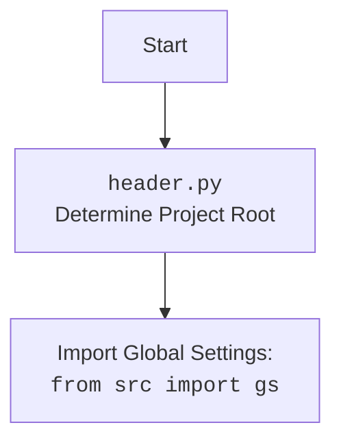

## <алгоритм>

1. **Инициализация `PrestaShopShop`**:
   -  При создании экземпляра `PrestaShopShop` вызывается метод `__init__`.
   -  Метод принимает аргументы `credentials`, `api_domain` и `api_key`. `credentials` может быть словарем или `SimpleNamespace`.
   -  **Пример 1:** Если `credentials` передается как словарь:
     ```python
     credentials = {'api_domain': 'example.com', 'api_key': 'test_key'}
     shop = PrestaShopShop(credentials=credentials)
     ```
     -   Значения `api_domain` и `api_key` извлекаются из словаря `credentials`, если они там есть.
   -  **Пример 2:** Если `credentials` передается как `SimpleNamespace`:
     ```python
     credentials = SimpleNamespace(api_domain='example.com', api_key='test_key')
     shop = PrestaShopShop(credentials=credentials)
     ```
     -   Значения `api_domain` и `api_key` извлекаются из объекта `credentials`, если они там есть.
   -  **Пример 3:** Если `api_domain` и `api_key` передаются явно:
     ```python
      shop = PrestaShopShop(api_domain='example.com', api_key='test_key')
     ```
     -   Используются значения `api_domain` и `api_key`, переданные напрямую.
   - **Проверка параметров:**
     -   Проверяется, что `api_domain` и `api_key` оба не `None` и не пустые. Если хотя бы один из них отсутствует, выбрасывается `ValueError`.
   -   **Инициализация родительского класса:**
      - Вызывается конструктор родительского класса `PrestaShop` с переданными `api_domain`, `api_key` и прочими аргументами.
   -  **Поток данных**:
      - Данные (словарь или `SimpleNamespace` `credentials`, `api_domain`, `api_key`) поступают на вход метода `__init__`.
      - Если `credentials` указан, данные извлекаются из него.
      - Данные используются для проверки наличия необходимых параметров.
      - Данные передаются в конструктор родительского класса.

## <mermaid>

```mermaid
flowchart TD
    Start[Start] --> InputParams{Input Parameters: <br>credentials, api_domain, api_key};
    InputParams -- credentials is not None --> ExtractCreds[Extract api_domain, api_key from credentials];
    InputParams -- credentials is None --> CheckParams[Check api_domain and api_key are not None/empty];
    ExtractCreds --> CheckParams;
    CheckParams -- api_domain or api_key is missing --> Error[Raise ValueError];
    CheckParams -- api_domain and api_key are valid --> InitParent[Call super().__init__(api_domain, api_key, *args, **kwards)];
    InitParent --> End[End];
    Error --> End
```



## <объяснение>

**Импорты:**

-   `from types import SimpleNamespace`: Импортирует класс `SimpleNamespace`, который используется для создания простых объектов с атрибутами, что позволяет передавать параметры конфигурации.
-   `from typing import Optional`: Импортирует `Optional`, который используется для аннотации типов переменных, которые могут быть `None`.
-   `import header`: Импортирует модуль `header` из текущей папки.  Обычно  `header.py` используется для определения корневой директории проекта и добавления ее в `sys.path`.
-   `from src import gs`: Импортирует модуль `gs` из пакета `src`. `gs`, вероятно, содержит глобальные настройки или константы проекта.
-   `from src.logger.logger import logger`: Импортирует объект `logger` из модуля `logger.py` в пакете `src.logger`.  Это используется для ведения журнала событий и ошибок.
-   `from src.utils.jjson import j_loads`: Импортирует функцию `j_loads` из модуля `jjson.py` в пакете `src.utils`. Вероятно, эта функция используется для загрузки данных из JSON.
-   `from .api import PrestaShop`: Импортирует класс `PrestaShop` из модуля `api.py`, находящегося в той же директории. `PrestaShop` является базовым классом для работы с API PrestaShop.
-   `from src.logger.exceptions import PrestaShopException`: Импортирует класс `PrestaShopException` из модуля `exceptions.py` в пакете `src.logger`, который используется для кастомных исключений, связанных с PrestaShop.
-   `from pathlib import Path`: Импортирует класс `Path` из модуля `pathlib`, который используется для работы с путями к файлам и директориям.
-   `from attr import attr, attrs`: Импортирует декораторы `attr` и `attrs` из библиотеки `attr`, используемой для автоматического добавления методов к классам.
-   `import sys`: Импортирует модуль `sys` для работы с системными переменными и функциями.
-   `import os`: Импортирует модуль `os` для работы с операционной системой, например, для получения переменных окружения.

**Классы:**

-   `class PrestaShopShop(PrestaShop)`:
    -   Это класс, который наследуется от `PrestaShop` (предположительно, базовый класс для работы с API PrestaShop).
    -   Он предназначен для работы с конкретным магазином PrestaShop.
    -   `__init__`: Метод-конструктор, вызываемый при создании объекта `PrestaShopShop`.
        -   Принимает аргументы:
            -   `credentials`:  Словарь или `SimpleNamespace`, содержащий `api_domain` и `api_key`.
            -   `api_domain`: Домен API PrestaShop.
            -   `api_key`: Ключ API PrestaShop.
            -   `*args`, `**kwards`: Дополнительные аргументы, передаваемые в конструктор родительского класса `PrestaShop`.
        -   Внутри конструктора:
            -   Если `credentials` передан, он пытается извлечь из него `api_domain` и `api_key`.
            -   Проверяет, что `api_domain` и `api_key` не равны `None`. Если какой-либо из них отсутствует, выбрасывается `ValueError`.
            -   Вызывает конструктор родительского класса `PrestaShop` с полученными параметрами.

**Функции:**

-   `__init__`: Конструктор класса `PrestaShopShop`.
    -   **Аргументы:**
        -   `credentials (Optional[dict | SimpleNamespace], optional)`: Словарь или объект `SimpleNamespace`, содержащий API credentials.
        -   `api_domain (Optional[str], optional)`: Домен API.
        -   `api_key (Optional[str], optional)`: Ключ API.
        -   `*args`, `**kwards`: Дополнительные аргументы.
    -   **Возвращаемое значение:** `None`.
    -   **Назначение:** Инициализирует объект класса, проверяет наличие необходимых параметров, вызывает конструктор родительского класса `PrestaShop`.

**Переменные:**

-   `credentials`: Словарь или объект `SimpleNamespace`, содержащий `api_domain` и `api_key`.
-   `api_domain`: Домен API PrestaShop (строка).
-   `api_key`: Ключ API PrestaShop (строка).

**Потенциальные ошибки и области для улучшения:**

-   **Отсутствие обработки ошибок:** Код не обрабатывает исключения, которые могут возникнуть при обращении к API PrestaShop.
-   **Отсутствие валидации**: Нет валидации типа данных, например, что `api_domain` и `api_key` действительно являются строками.
-   **Безопасность:**  Необходимо убедиться, что `api_key` не хранится в коде, а передается через безопасные механизмы (например, переменные окружения или конфигурационные файлы).
-   **Отсутствие логирования**: Отсутствует логирование  важных шагов, например, успешная инициализация магазина PrestaShop.

**Взаимосвязи с другими частями проекта:**

-   Использует `src.gs` для глобальных настроек.
-   Использует `src.logger.logger` для логирования событий.
-   Использует `src.utils.jjson` для работы с JSON данными.
-   Наследуется от `src.endpoints.prestashop.api.PrestaShop`, формируя иерархию классов для работы с API.
-  Использует `header.py` для определения корня проекта.